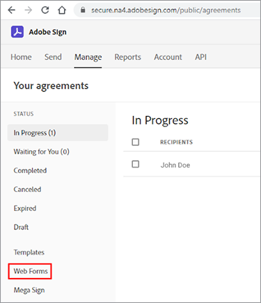
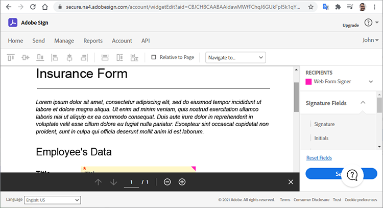

# 開始使用 Adobe Sign API


[Acrobat Sign API ](https://www.adobe.io/apis/documentcloud/sign.html) 是提升您管理已簽署合約方式的絕佳方式。 開發人員可以輕鬆地將其系統與 Sign API整合，其提供可靠、輕鬆的方式上傳檔、傳送檔以索取簽名、傳送提醒及收集電子簽名。

## 您可以學習哪些內容

此實作教學課程說明開發人員如何使用 Sign API來增強建立 [!DNL Adobe Acrobat Services] 的應用程式和工作流程 。 [!DNL Acrobat Services] 包含 [ 「Adobe PDF服務」API ](https://www.adobe.io/apis/documentcloud/dcsdk/pdf-tools.html) 、 [ 「內嵌API Adobe PDF ](https://www.adobe.io/apis/documentcloud/viesdk) 」（免費） 和 [ 「Adobe檔產生API」 ](https://www.adobe.io/apis/documentcloud/dcsdk/doc-generation.html) 。

更具體地說，瞭解如何將 Acrobat Sign API加入您的應用程式，以收集簽名和其他資訊，例如保險表單上的員工資訊。 使用包含簡化 HTTP 要求和回應的一般步驟。 您可以使用您最愛的語言實作這些要求。 您可以使用 API 組合 [[!DNL Acrobat Services]  建立 PDF、將 API ](https://www.adobe.io/apis/documentcloud/dcsdk/) 上傳至 Sign API做為 [ 暫時性 ](https://www.adobe.io/apis/documentcloud/sign/docs.html#!adobedocs/adobe-sign/master/overview/terminology.md) 檔，並使用合約或 [ Widget ](https://www.adobe.io/apis/documentcloud/sign/docs.html#!adobedocs/adobe-sign/master/overview/terminology.md) 工作流程請求使用者簽名。

## 建立 PDF 檔

首先建立 Microsoft Word 範本並儲存為 PDF。 或者，您可以使用「檔產生API自動執行管道，上傳在 Word 中建立的範本，然後產生 PDF 檔。 Document Generation API 為一部分 [!DNL Acrobat Services] ， [ 免費試用 6 個月，每份檔只需 ](https://www.adobe.io/apis/documentcloud/dcsdk/pdf-pricing.html) 支付或 $0.05 美元。

此範例中，範本只是一份簡單的檔，其中有幾個簽署者欄位可供填寫。 立即命名欄位，然後在此教學課程中插入實際欄位。


## 探索有效的API存取點

在使用 Sign API 之前， [ 請建立免費的開發人員帳戶 ](https://acrobat.adobe.com/ca/en/sign/developer-form.html) 以存取API、測試檔案交換和執行，並測試電子郵件功能。

Adobe在全球許多稱為「分區」的部署單位分發Acrobat Sign API。 每個分區都提供客戶的帳戶，例如 NA1、NA2、NA3、EU1、JP1、AU1、IN1 等等。 分區名稱對應至地理位置。 這些分區會構成 API 端點的基本 URI （存取點）。

若要存取 Sign API，您必須先找到您帳戶的正確存取點，該存取點可依您的位置 api.na1.adobesign.com、api.na4.adobesign.com、api.eu1.adobesign.com 或其他內容。

```
  GET /api/rest/v6/baseUris HTTP/1.1
  Host: https://api.adobesign.com
  Authorization: Bearer {YOUR-INTEGRATION-KEY-HERE}
  Accept: application/json

  Response Body (example):

  {
    "apiAccessPoint": "https://api.na4.adobesign.com/", 
    "webAccessPoint": "https://secure.na4.adobesign.com/" 
  }
```

在上述範例中，是以值作為存取點的回應。

>[!IMPORTANT]
>
>在這種情況下，您對 Sign 的後續要求API必須使用該存取點。 如果您使用的存取點不適用於您的區域，則會收到錯誤。

## 上傳暫時性檔

Adobe Sign可讓您建立不同的流程來準備檔以供簽署或收集資料。 無論應用程式的流程如何，您都必須先上傳檔，該檔只會保留 7 天。 接著的API呼叫必須參照此暫存檔。

使用POST要求將檔上傳至 `/transientDocuments` 端點。 多重部分要求包括檔案名、檔串流和檔檔案的 MIME （媒體） 類型。 端點回應包含識別檔的 ID。

此外，您的應用程式也可以指定Acrobat Sign 的回呼URL，在簽名程式完成時通知應用程式。


```
  POST /api/rest/v6/transientDocuments HTTP/1.1
  Host: {YOUR-API-ACCESS-POINT}
  Authorization: Bearer {YOUR-INTEGRATION-KEY-HERE}
  x-api-user: email:your-api-user@your-domain.com
  Content-Type: multipart/form-data
  File-Name: "Insurance Form.pdf"
  File: "[path]\Insurance Form.pdf"
  Accept: application/json

  Response Body (example):

  {
     "transientDocumentId": "3AAA...BRZuM"
  }
```

## 建立網頁表單

網頁表單 （先前稱為簽署 Widget） 是託管的檔，任何具有存取權的人都可以簽署這些檔。 網頁表單的範例包括許多人員在線上存取和簽署的註冊表、免責聲明書和其他檔。

若要使用 Sign API 建立新的網頁表單，您必須先上傳暫時性檔。 POST端 `/widgets` 點的要求會使用傳回 `transientDocumentId` 的 。

在這個範例中，網頁表單是 `ACTIVE` ，但您可以在下列三個不同的狀態之一建立網頁表單：

* 草稿 — 以增量建立網頁表單

* 編寫 — 在網頁表單中新增或編輯表單欄位

* 作用中 — 可立即代管網頁表單

表單參與者的資訊也必須定義。 此 `memberInfos` 屬性包含參與者的資料，例如電子郵件。 目前，此組合不支援多個成員。 但是，由於網頁表單簽署者的電子郵件在建立網頁表單時未知，因此電子郵件應該會保留空白，如下列範例所示。 此 `role` 屬性定義了成員 （ `memberInfos` 例如簽署者和核准者） 所承擔的角色。

```
  POST /api/rest/v6/widgets HTTP/1.1
  Host: {YOUR-API-ACCESS-POINT}
  Authorization: Bearer {YOUR-INTEGRATION-KEY-HERE}
  x-api-user: email:your-api-user@your-domain.com
  Content-Type: application/json

  Request Body:

  {
    "fileInfos": [
      {
      "transientDocumentId": "YOUR-TRANSIENT-DOCUMENT-ID"
      }
     ],
    "name": "Insurance Form",
      "widgetParticipantSetInfo": {
          "memberInfos": [{
              "email": ""
          }],
      "role": "SIGNER"
      },
      "state": "ACTIVE"
  }

  Response Body (example):

  {
     "id": "CBJ...PXoK2o"
  }
```

您可以建立網頁表單，其狀態如下 `DRAFT` ，或 `AUTHORING` 在表格經過您的應用程式管道時變更其狀態。 若要 [ 變更網頁表單的狀態，請參閱PUT /widgets/ {widgetId} /state ](https://secure.na4.adobesign.com/public/docs/restapi/v6#!/widgets/updateWidgetState) 端點。

## 閱讀網頁表單託管URL

下一個步驟是探索代管網頁表單URL。 /widgets 端點會擷取網頁表單資料清單，包括您轉寄給使用者的網頁表單託管URL以收集簽名和其他表單資料。

此端點會傳回清單，因此您可以在 `userWidgetList` 傳回代管網頁表單的URL之前，使用其 ID 找出特定表單：

```
  GET /api/rest/v6/widgets HTTP/1.1
  Host: {YOUR-API-ACCESS-POINT}
  Authorization: Bearer {YOUR-INTEGRATION-KEY-HERE}
  Accept: application/json

  Response Body:

  {
    "userWidgetList": [
      {
        "id": "CBJCHB...FGf",
        "name": "Insurance Form",
        "groupId": "CBJCHB...W86",
        "javascript": "<script type='text/javascript' ...
        "modifiedDate": "2021-03-13T15:52:41Z",
        "status": "ACTIVE",
        "Url":
        "https://secure.na4.adobesign.com/public/esignWidget?wid=CBFCIB...Rag*",
        "hidden": false
      },
      {
        "id": "CBJCHB...I8_",
        "name": "Insurance Form",
        "groupId": "CBJCHBCAABAAyhgaehdJ9GTzvNRchxQEGH_H1ya0xW86",
        "javascript": "<script type='text/javascript' language='JavaScript'
        src='https://sec
        "modifiedDate": "2021-03-13T02:47:32Z",
        "status": "ACTIVE",
        "Url":
        "https://secure.na4.adobesign.com/public/esignWidget?wid=CBFCIB...AAB",
        "hidden": false
      },
      {
        "id": "CBJCHB...Wmc",
```

## 管理網頁表單

此表單是供使用者填寫的 PDF 檔。 但是，您仍然需要告訴表單的編輯器使用者必須填寫哪些欄位以及這些欄位位於檔中的位置：


以上檔尚未顯示欄位。 新增這些欄位的同時，定義哪些欄位會收集簽署者的資訊，以及其大小和位置。

現在，前往 [ 「您的合約」頁面上的「網頁表單 ](https://secure.na4.adobesign.com/public/agreements/#agreement_type=webform) 」索引標籤，並找到您建立的表單。




按一下 **「編輯** 」以開啟檔編輯頁面。 可用的預先定義欄位位於右側面板。



編輯器可讓您拖放文字和簽名欄位。 新增所有必要欄位後，即可調整欄位大小及對齊以修飾表單。 最後，按一下「儲存 **** 」以建立表格。


## 傳送網頁表單以供簽署

完成網頁表單後，您必須提交才能讓使用者填寫和簽署。 儲存表格後，您可以檢視和複製URL和內嵌程式碼。

**複製網頁表單URL** ：使用本URL將使用者傳送到此合約的代管版本，以供審核和簽署。 例如：

[HTTPs://secure.na4.adobesign.com/public/esignWidget?wid=CBFCIBAA3...babw\*](https://secure.na4.adobesign.com/public/esignWidget?wid=CBFCIBAA3AAABLblqZhCndYscuKcDMPiVfQlpaGPb-5D7ebE9NUTQ6x6jK7PIs8HCtTzr3HOx8U6D5qqbabw*)

**複製網頁表單內嵌程式碼：複製此程式碼** 並貼到您的 HTML 中，將合約新增至您的網站。

例如：

```
<iframe
src="https://secure.na4.adobesign.com/public/esignWidget?wid=CBFC
...yx8*&hosted=false" width="100%" height="100%" frameborder="0"
style="border: 0;
overflow: hidden; min-height: 500px; min-width: 600px;"></iframe>
```


當您的使用者存取表單的代管版本時，他們將檢閱先上傳的暫時性檔，並設定為指定的欄位。


接著，使用者會填寫欄位並簽署表單。


接下來，您的使用者會使用先前儲存的簽名或新的簽名來簽署檔。


當使用者按一下「套 **** 用」時，Adobe指示他們開啟電子郵件並確認簽名。 在確認到達之前，簽名會持續等待。


這項驗證新增了多因素驗證，並強化了簽署程式的安全性。


## 閱讀已完成的網頁表單

現在是時候取得使用者填寫的表單資料了。 端 `/widgets/{widgetId}/formData` 點會在使用者簽署表格時擷取使用者在互動表格中輸入的資料。

```
GET /api/rest/v6/widgets/{widgetId}/formData HTTP/1.1
Host: {YOUR-API-ACCESS-POINT}
Authorization: Bearer {YOUR-INTEGRATION-KEY-HERE}
Accept: text/csv
```

產生的CSV檔案串流包含表格資料。

```
Response Body:
"Agreement
name","completed","email","role","first","last","title","company","agreementId",
"email verified","web form signed/approved"
"Insurance Form","","myemail@email.com","SIGNER","John","Doe","My Job Title","My
Company Name","","","2021-03-07 19:32:59"
```

## 建立合約

作為「網頁表單」的替代方案，您可以建立合約。 下列區段示範了一些使用 Sign API 管理合約的簡單步驟。

將檔傳送給指定的收件者進行簽署或核准會建立合約。 您可以使用 API 追蹤狀態和合約完成。

您可以使用 [ 暫時性檔、 [ 資料庫檔案 ](https://helpx.adobe.com/sign/kb/how-to-send-an-agreement-through-REST-API.html) ](https://www.adobe.io/apis/documentcloud/sign/docs.html#!adobedocs/adobe-sign/master/samples/send_using_library_doc.md) 或URL來建立合約。此範例中，合約是以合約為基礎 `transientDocumentId` ，就像先前建立的網頁表單一樣。

```
POST /api/rest/v6/agreements HTTP/1.1
Host: {YOUR-API-ACCESS-POINT}
Authorization: Bearer {YOUR-INTEGRATION-KEY-HERE}
x-api-user: email:your-api-user@your-domain.com
Content-Type: application/json
Accept: application/json
Request Body:
{
    "fileInfos": [
      {
      "transientDocumentId": "{transientDocumentId}"
      }
     ],
    "name": "{agreementName}",
    "participantSetsInfo": [
      {
      "memberInfos": [
          {
          "email": "{signerEmail}"
          }
        ],
        "order": 1,
        "role": "SIGNER"
      }
    ],
    "signatureType": "ESIGN",
    "state": "IN_PROCESS"
  }
```

此範例中，合約會建立為IN_PROCESS，但您可以在以下三種不同狀態中建立合約：

* 草稿 — 以遞增方式建立合約再傳送

* 編寫 — 在合約中新增或編輯表單欄位

* IN_PROCESS — 以立即傳送合約

若要變更合約狀態，請使用 `PUT /agreements/{agreementId}/state` 端點執行以下任一允許的狀態轉變：

* 草稿至編寫

* 編寫至IN_PROCESS

* 已取消IN_PROCESS

上述 `participantSetsInfo` 屬性提供預期參與合約之人員的電子郵件，以及他們執行的動作 （簽署、核准、認可等等）。 在上面的範例中，只有一個參與者：簽署者。 每份檔只能有四份書面簽名。

不同于網頁表單，當您建立合約時，Adobe會自動傳送合約以供簽署。 端點會傳回合約的獨特識別碼。


```
  Response Body:

  {
     id (string): The unique identifier of the agreement
  }
```

## 擷取合約成員的相關資訊

建立合約後，您可以使用 `/agreements/{agreementId}/members` 端點擷取合約成員的相關資訊。 例如，您可以檢查參與者是否已簽署合約。

```
GET /api/rest/v6/agreements/{agreementId}/members HTTP/1.1
Host: {YOUR-API-ACCESS-POINT}
Authorization: Bearer {YOUR-INTEGRATION-KEY-HERE}
Accept: application/json
```

產生的 JSON 回應內文包含參與者的相關資訊。

```
  Response Body:

  {
     "participantSets":[
        {
           "memberInfos":[
              {
                 "id":"CBJ...xvM",
                 "email":"participant@email.com",
                 "self":false,
                 "securityOption":{
                    "authenticationMethod":"NONE"
                 },
                 "name":"John Doe",
                 "status":"ACTIVE",
                 "createdDate":"2021-03-16T03:48:39Z",
                 "userId":"CBJ...vPv"
              }
           ],
           "id":"CBJ...81x",
           "role":"SIGNER",
           "status":"WAITING_FOR_MY_SIGNATURE",
           "order":1
        }
     ],
```

## 傳送合約提醒

視商務規則而定，截止日期可能會使參與者無法在特定日期之後簽署合約。 如果合約有過期日期，您可以提醒參與者日期接近。

您可以根據您在最後一節呼叫 `/agreements/{agreementId}/members` 端點後收到的合約成員資訊，向尚未簽署合約的所有參與者發出電子郵件提醒。

端點POST要求會 `/agreements/{agreementId}/reminders` 為參數所識別 `agreementId` 之合約的指定參與者建立提醒。

```
POST /agreements/{agreementId}/reminders HTTP/1.1
Host: {YOUR-API-ACCESS-POINT}
Authorization: Bearer {YOUR-INTEGRATION-KEY-HERE}
x-api-user: email:your-api-user@your-domain.com
Content-Type: application/json
Accept: application/json
  Request Body:

  {
    "recipientParticipantIds": [{agreementMemberIdList}],
    "agreementId": "{agreementId}",
    "note": "This is a reminder that you haven't signed the agreement yet.",
    "status": "ACTIVE"
  }

  Response Body:

  {
     id (string, optional): An identifier of the reminder resource created on the
     server. If provided in POST or PUT, it will be ignored
  }
```

在您發佈提醒後，使用者便會收到一封電子郵件，其中包含合約的詳細資料和合約的連結。


## 閱讀已完成的合約

就像網頁表單一樣，您可以閱讀收件者簽署的合約詳細資料。 端 `/agreements/{agreementId}/formData` 點會擷取使用者在簽署網頁表單時輸入的資料。

```
GET /api/rest/v6/agreements/{agreementId}/formData HTTP/1.1
Host: {YOUR-API-ACCESS-POINT}
Authorization: Bearer {YOUR-INTEGRATION-KEY-HERE}
Accept: text/csv
Response Body:
"completed","email","role","first","last","title","company","agreementId"
"2021-03-16 18:11:45","myemail@email.com","SIGNER","John","Doe","My Job Title","My
Company Name","CBJCHBCAABAA5Z84zy69q_Ilpuy5DzUAahVfcNZillDt"
```

## 後續步驟

Acrobat Sign API可讓您管理檔、網頁表單和合約。 使用網頁表單和合約所建立的簡化但完整的工作流程會以一般方式完成，供開發人員使用任何語言實作。

如需 Sign API運作方式的概覽，請參閱API使用開發人員指南 ](https://www.adobe.io/apis/documentcloud/sign/docs.html#!adobedocs/adobe-sign/master/api_usage.md) 中的 [ 範例。本檔內含有關整篇文章所遵循許多步驟的簡短文章，以及其他相關主題。

Acrobat Sign API可透過多個單一和多使用者電子簽名計畫 ](https://acrobat.adobe.com/tw/zh-Hant/sign/pricing/plans.html) 層級 [ 取得，因此您可以選擇最符合您需求的價格模型。既然您知道將 Sign API整合到應用程式中有多麼簡單，您可能對其他功能感興趣，例如 [ 推播式程式模型 Acrobat Sign Webhook ](https://www.adobe.io/apis/documentcloud/sign/docs.html#!adobedocs/adobe-sign/master/webhooks.md) 。 Webhook 可讓您註冊 HTTP Acrobat URL，讓 Sign API在發生事件時執行POST回呼要求，而不必要求您的應用程式經常執行檢查。 Webhook 透過即時和即時更新為您的應用程式提供支援，以支援強大的程式設計。

查看六個月免費Adobe PDF [ 服務API試用期結束後的按即付費價格 ](https://www.adobe.io/apis/documentcloud/dcsdk/pdf-pricing.html) ，以及免費的Adobe PDF內嵌API。

若要在應用程式中加入自動建立檔和簽署檔等令人興奮的功能，請開始使用 [[!DNL Adobe Acrobat Services] ](https://www.adobe.io/apis/documentcloud/dcsdk/gettingstarted.html) 。
