# 開始使用 Adobe Sign API

[Acrobat Sign API](https://developer.adobe.com/adobesign-api/) 是提升您管理簽署協議方式的絕佳方式。 開發者可以輕鬆將系統整合到 Sign API，API 提供可靠且簡便的方式來上傳文件、發送簽名、發送提醒及收集電子簽名。

## 你可以學到什麼

這個實作教學說明了開發者如何利用 Sign API 來強化使用 [!DNL Adobe Acrobat Services]Sign 所建立的應用程式與工作流程。 [!DNL Acrobat Services] 包含 [Adobe PDF 服務 API](https://developer.adobe.com/document-services/apis/pdf-services)、 [Adobe PDF 嵌入 API](https://developer.adobe.com/document-services/apis/pdf-embed/) （免費）及 [Adobe 文件產生 API](https://developer.adobe.com/document-services/apis/doc-generation)。

更具體來說，學習如何在申請中加入 Acrobat Sign API，以收集簽名及其他資訊，例如保險表格上的員工資訊。 使用簡化的 HTTP 請求與回應的通用步驟。 你可以用你喜歡的語言實作這些請求。 你可以使用多種 [[!DNL Acrobat Services] API](https://developer.adobe.com/document-services/homepage/) 組合製作 PDF，將它作為 [臨時](https://opensource.adobe.com/acrobat-sign/developer_guide/index.html#!adobedocs/adobe-sign/master/overview/terminology.md) 文件上傳到 Sign API，並透過協議或 [小工具](https://opensource.adobe.com/acrobat-sign/developer_guide/index.html#!adobedocs/adobe-sign/master/overview/terminology.md) 工作流程請求最終使用者簽名。

## 建立 PDF 文件

首先建立一個 Microsoft Word 範本並儲存為 PDF。 或者，你也可以利用文件生成 API 自動化流程，先上傳 Word 建立的範本，再產生 PDF 文件。 文件生成 API 是[!DNL Acrobat Services][免費六個月，之後按需付費，每筆文件](https://developer.adobe.com/document-services/pricing/main)交易只需 0.05 美元。

在這個例子中，範本只是一份簡單的文件，裡面有幾個簽署者欄位需要填寫。 先先把欄位命名，之後再把這個教學裡的欄位插入。

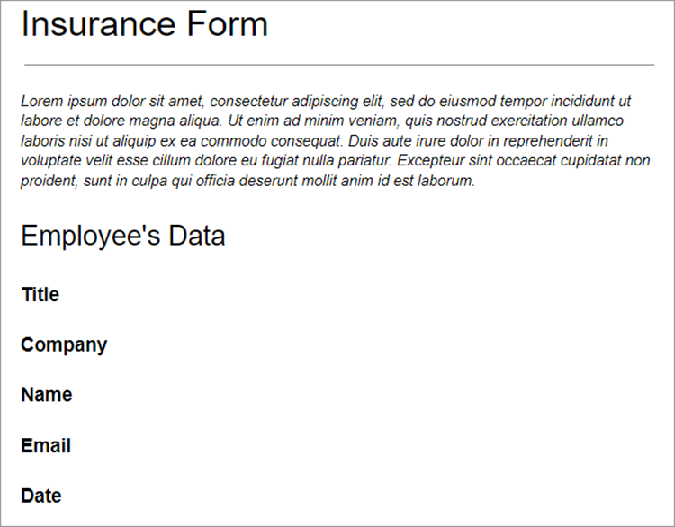

## 發現有效的 API 接取點

在使用 Sign API 之前，先建立 [一個免費的開發者帳號](https://acrobat.adobe.com/ca/en/sign/developer-form.html) 以存取 API，測試文件交換與執行，並測試電子郵件功能。

Adobe 在全球多個部署單元中分發 Acrobat Sign API，稱為「分片」。 每個分片服務於客戶帳號，例如 NA1、NA2、NA3、EU1、JP1、AU1、IN1 等。 分片名稱對應地理位置。 這些分片組成 API 端點的基礎 URI（存取點）。

要使用 Sign API，您必須先找到您帳戶的正確接取點，該接取點依地點不同可能是 api.na1.adobesign.com、api.na4.adobesign.com、api.eu1.adobesign.com 或其他。

```
  GET /api/rest/v6/baseUris HTTP/1.1
  Host: https://api.adobesign.com
  Authorization: Bearer {YOUR-INTEGRATION-KEY-HERE}
  Accept: application/json

  Response Body (example):

  {
    "apiAccessPoint": "https://api.na4.adobesign.com/", 
    "webAccessPoint": "https://secure.na4.adobesign.com/" 
  }
```

在上述例子中，是一個以存取點為值的回應。

>[!IMPORTANT]
>
>在這種情況下，你對 Sign API 的所有後續請求都必須使用該接取點。 如果你使用的基地台不服務你所在區域，就會收到錯誤。

## 上傳臨時文件

Adobe Sign 讓你能建立不同的流程，準備文件以進行簽名或資料收集。 無論您的申請流程如何，您必須先上傳一份文件，該文件僅保留七天。 後續的 API 呼叫必須參考此暫存文件。

文件會透過 POST 請求上傳到端點 `/transientDocuments` 。 多部分請求包含檔名、檔案串流及文件檔案的 MIME（媒體）類型。 端點回應包含一個識別文件的 ID。

此外，您的應用程式可以指定回調 URL，讓 Acrobat Sign 進行 ping，並在簽名完成時通知應用程式。


```
  POST /api/rest/v6/transientDocuments HTTP/1.1
  Host: {YOUR-API-ACCESS-POINT}
  Authorization: Bearer {YOUR-INTEGRATION-KEY-HERE}
  x-api-user: email:your-api-user@your-domain.com
  Content-Type: multipart/form-data
  File-Name: "Insurance Form.pdf"
  File: "[path]\Insurance Form.pdf"
  Accept: application/json

  Response Body (example):

  {
     "transientDocumentId": "3AAA...BRZuM"
  }
```

## 建立網頁表單

網頁表單（過去稱為簽署小工具）是託管文件，任何有權限的人都能簽署。 網路表單的例子包括報名表、免責聲明及其他許多人在線上存取並簽署的文件。

要使用 Sign API 建立新的網頁表單，您必須先上傳一份臨時文件。 對 `/widgets` 端點的 POST 請求使用 回傳 `transientDocumentId` 的 。

在這個例子中，網頁表單是 `ACTIVE`，但你可以在三種不同狀態中建立它：

* DRAFT — 逐步建置網頁表單

* 撰寫 — 在網頁表單中新增或編輯表單欄位

* ACTIVE — 立即託管網頁表單

表格參與者的資訊也必須被定義。 該 `memberInfos` 物業包含參與者的資料，例如電子郵件。 目前，此組合不支援多於一名成員。 但由於網頁表單簽署者的電子郵件在建立時未知，電子郵件應保持空白，如以下範例所示。 屬性 `role` 定義了成員 `memberInfos` 所扮演的角色（如簽署者與審核者）。

```
  POST /api/rest/v6/widgets HTTP/1.1
  Host: {YOUR-API-ACCESS-POINT}
  Authorization: Bearer {YOUR-INTEGRATION-KEY-HERE}
  x-api-user: email:your-api-user@your-domain.com
  Content-Type: application/json

  Request Body:

  {
    "fileInfos": [
      {
      "transientDocumentId": "YOUR-TRANSIENT-DOCUMENT-ID"
      }
     ],
    "name": "Insurance Form",
      "widgetParticipantSetInfo": {
          "memberInfos": [{
              "email": ""
          }],
      "role": "SIGNER"
      },
      "state": "ACTIVE"
  }

  Response Body (example):

  {
     "id": "CBJ...PXoK2o"
  }
```

你可以建立一個網頁表單，格式為`DRAFT``AUTHORING`或，然後在表單通過你的應用程式管線時改變其狀態。要更改網頁表單狀態，請參考 [PUT /widgets/{widgetId}/state](https://secure.na4.adobesign.com/public/docs/restapi/v6#!/widgets/updateWidgetState) 端點。

## 閱讀網頁表單主機網址

下一步是找出寄存該網頁表單的網址。 /widgets 端點會取得一份網頁表單資料清單，包括你轉發給使用者的網頁表單的託管網址，以收集簽名和其他表單資料。

此端點會回傳一個清單，因此您可以在取得寄存網頁表單的網址前，透過其 ID `userWidgetList` 定位特定表單：

```
  GET /api/rest/v6/widgets HTTP/1.1
  Host: {YOUR-API-ACCESS-POINT}
  Authorization: Bearer {YOUR-INTEGRATION-KEY-HERE}
  Accept: application/json

  Response Body:

  {
    "userWidgetList": [
      {
        "id": "CBJCHB...FGf",
        "name": "Insurance Form",
        "groupId": "CBJCHB...W86",
        "javascript": "<script type='text/javascript' ...
        "modifiedDate": "2021-03-13T15:52:41Z",
        "status": "ACTIVE",
        "Url":
        "https://secure.na4.adobesign.com/public/esignWidget?wid=CBFCIB...Rag*",
        "hidden": false
      },
      {
        "id": "CBJCHB...I8_",
        "name": "Insurance Form",
        "groupId": "CBJCHBCAABAAyhgaehdJ9GTzvNRchxQEGH_H1ya0xW86",
        "javascript": "<script type='text/javascript' language='JavaScript'
        src='https://sec
        "modifiedDate": "2021-03-13T02:47:32Z",
        "status": "ACTIVE",
        "Url":
        "https://secure.na4.adobesign.com/public/esignWidget?wid=CBFCIB...AAB",
        "hidden": false
      },
      {
        "id": "CBJCHB...Wmc",
```

## 管理您的網頁表單

此表單為 PDF 文件，供使用者填寫。 不過，你仍需告訴表單編輯器使用者必須填寫哪些欄位，以及它們在文件中的位置：


上方的文件還沒有顯示欄位。 這些欄位會在定義收集簽署者資訊的欄位、大小和位置時加入。

現在，請前往 [「您的協議」頁面的「網路表單](https://secure.na4.adobesign.com/public/agreements/#agreement_type=webform) 」標籤，找到您所建立的表單。

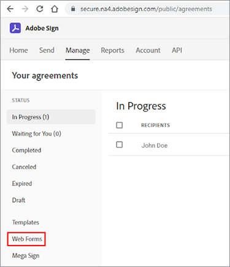

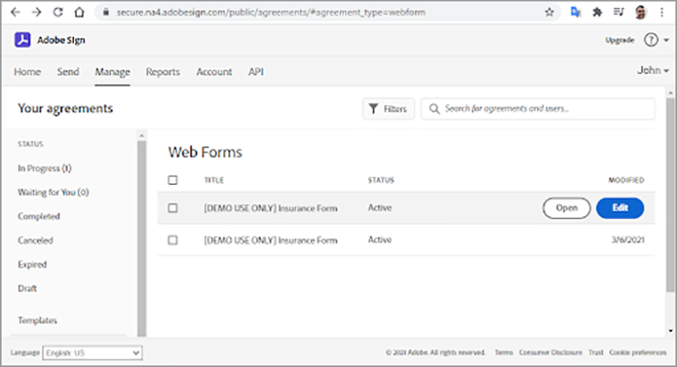

點擊 **編輯** 以開啟文件編輯頁面。 可用的預設欄位在右側面板上。

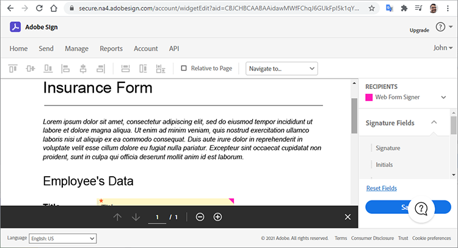

編輯器允許你拖放文字和簽名欄位。 加入所有必要的欄位後，你可以調整大小並對齊，讓造型更精緻。 最後，點擊 **儲存** 以建立表單。

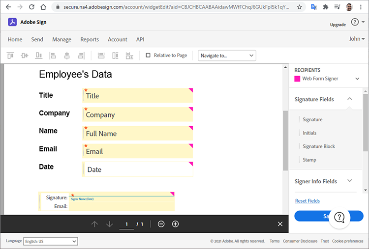

## 發送網路表單以供簽名

完成網路表單後，您必須提交表格，讓使用者填寫並簽名。 儲存表單後，你可以查看並複製網址及嵌入的程式碼。

**複製網頁表單網址**：使用此網址將用戶傳送至本協議的託管版本以便審查與簽署。 例如：

[https://secure.na4.adobesign.com/public/esignWidget?wid=CBFCIBAA3...babw\*](https://secure.na4.adobesign.com/public/esignWidget?wid=CBFCIBAA3AAABLblqZhCndYscuKcDMPiVfQlpaGPb-5D7ebE9NUTQ6x6jK7PIs8HCtTzr3HOx8U6D5qqbabw*)

**複製網頁表單嵌入程式碼**：將協議複製到你的網站，並貼上到你的 HTML 中。

例如：

```
<iframe
src="https://secure.na4.adobesign.com/public/esignWidget?wid=CBFC
...yx8*&hosted=false" width="100%" height="100%" frameborder="0"
style="border: 0;
overflow: hidden; min-height: 500px; min-width: 600px;"></iframe>
```

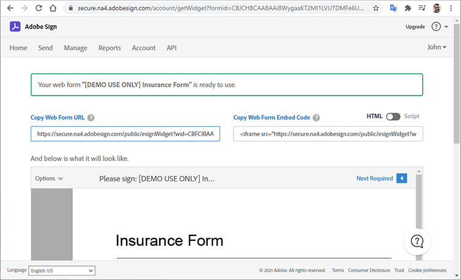

當使用者存取表單的託管版本時，他們會先查看已上傳的暫存文件，欄位依指定位置排列。

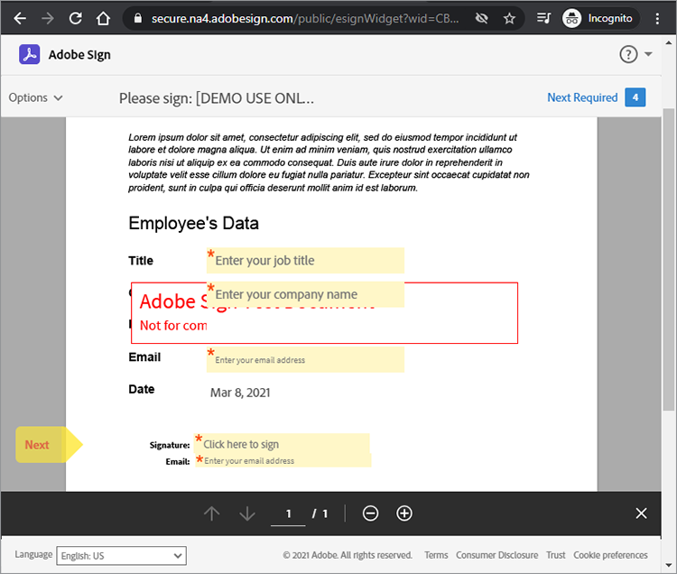

使用者接著填寫欄位並簽署表格。

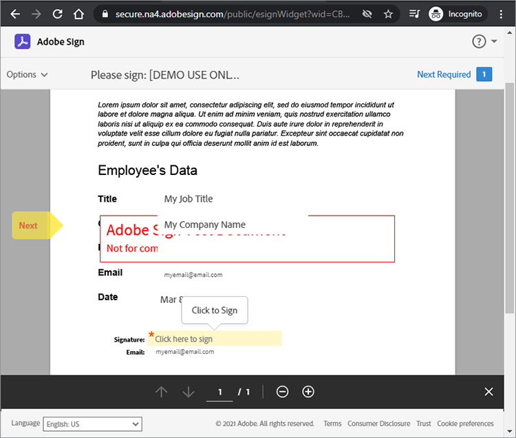

接著，使用者會用先前儲存的簽名或新的簽名簽署文件。

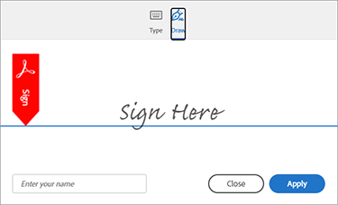

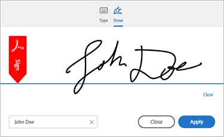

當使用者點擊 **「套用**」時，Adobe 會指示他們打開電子郵件並確認簽名。 簽名會一直待確認，直到確認通知到來。

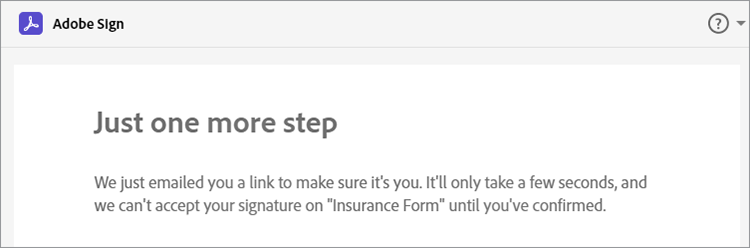

此認證增加了多重驗證並強化簽署流程的安全性。

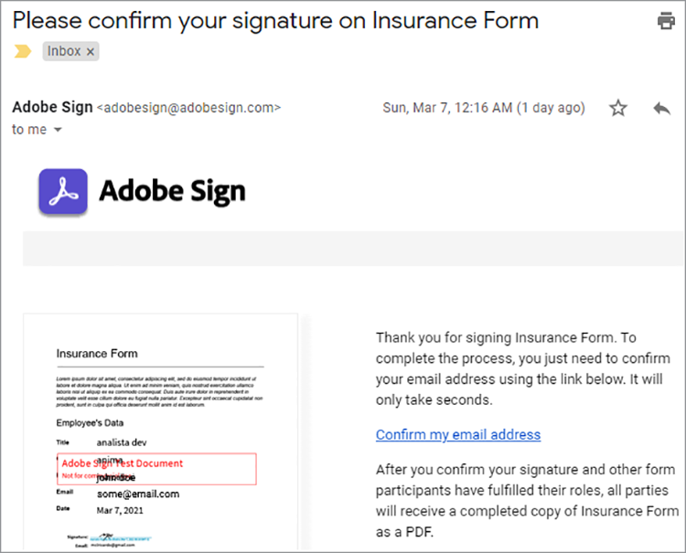

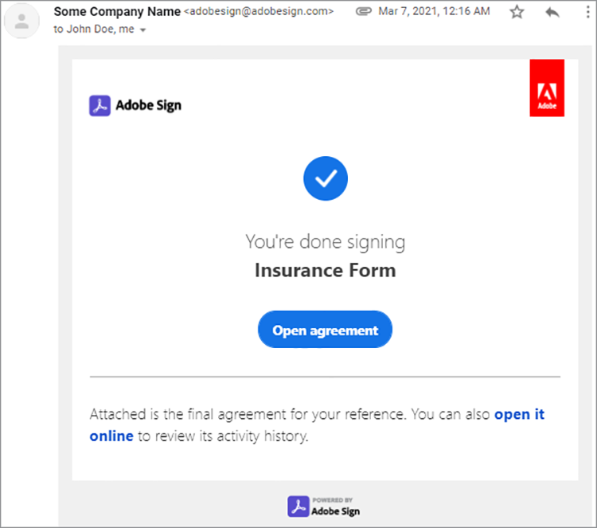

## 閱讀已完成的網頁表單

現在是時候取得用戶填寫的表單資料了。 端點會 `/widgets/{widgetId}/formData` 擷取使用者在簽署表單時輸入到互動表單的資料。

```
GET /api/rest/v6/widgets/{widgetId}/formData HTTP/1.1
Host: {YOUR-API-ACCESS-POINT}
Authorization: Bearer {YOUR-INTEGRATION-KEY-HERE}
Accept: text/csv
```

最終產生的 CSV 檔案串流包含表單資料。

```
Response Body:
"Agreement
name","completed","email","role","first","last","title","company","agreementId",
"email verified","web form signed/approved"
"Insurance Form","","myemail@email.com","SIGNER","John","Doe","My Job Title","My
Company Name","","","2021-03-07 19:32:59"
```

## 制定協議

作為網路表單的替代方案，你可以建立協議。 以下章節示範使用Sign API管理協議的一些簡單步驟。

將文件送給指定的收件人以供簽署或批准，即構成協議。 你可以利用 API 追蹤協議的狀態與完成狀況。

您可以使用臨時文件](https://helpx.adobe.com/sign/kb/how-to-send-an-agreement-through-REST-API.html)、[函式庫文件](https://opensource.adobe.com/acrobat-sign/developer_guide/index.html#!adobedocs/adobe-sign/master/samples/send_using_library_doc.md)或網址來建立協議[。在這個例子中，協議是基於 `transientDocumentId`，就像前面建立的網頁表單一樣。

```
POST /api/rest/v6/agreements HTTP/1.1
Host: {YOUR-API-ACCESS-POINT}
Authorization: Bearer {YOUR-INTEGRATION-KEY-HERE}
x-api-user: email:your-api-user@your-domain.com
Content-Type: application/json
Accept: application/json
Request Body:
{
    "fileInfos": [
      {
      "transientDocumentId": "{transientDocumentId}"
      }
     ],
    "name": "{agreementName}",
    "participantSetsInfo": [
      {
      "memberInfos": [
          {
          "email": "{signerEmail}"
          }
        ],
        "order": 1,
        "role": "SIGNER"
      }
    ],
    "signatureType": "ESIGN",
    "state": "IN_PROCESS"
  }
```

在這個例子中，協議是以IN_PROCESS方式建立，但你可以在三種不同狀態中建立：

* 草稿——在寄出前逐步建立協議

* 撰寫 — 新增或編輯協議中的表單欄位

* IN_PROCESS——立即寄出協議

要改變協議狀態，請使用 `PUT /agreements/{agreementId}/state` 端點執行以下允許的狀態轉換之一：

* 從草稿到著作

* 作者至IN_PROCESS

* IN_PROCESS到取消

`participantSetsInfo`上述物業提供預期參與協議者的電子郵件，以及他們執行的行動（簽署、批准、確認等）。在上述例子中，只有一位參與者：簽署者。 每份文件最多可簽署四人。

與網頁表單不同，當你建立協議時，Adobe 會自動寄出簽名。 端點會回傳協議的唯一識別碼。


```
  Response Body:

  {
     id (string): The unique identifier of the agreement
  }
```

## 取得協議成員的資訊

建立協議後，你可以利用端 `/agreements/{agreementId}/members` 點取得協議成員的資訊。 例如，你可以檢查參與者是否已簽署協議。

```
GET /api/rest/v6/agreements/{agreementId}/members HTTP/1.1
Host: {YOUR-API-ACCESS-POINT}
Authorization: Bearer {YOUR-INTEGRATION-KEY-HERE}
Accept: application/json
```

最終產生的 JSON 回應主體包含參與者的資訊。

```
  Response Body:

  {
     "participantSets":[
        {
           "memberInfos":[
              {
                 "id":"CBJ...xvM",
                 "email":"participant@email.com",
                 "self":false,
                 "securityOption":{
                    "authenticationMethod":"NONE"
                 },
                 "name":"John Doe",
                 "status":"ACTIVE",
                 "createdDate":"2021-03-16T03:48:39Z",
                 "userId":"CBJ...vPv"
              }
           ],
           "id":"CBJ...81x",
           "role":"SIGNER",
           "status":"WAITING_FOR_MY_SIGNATURE",
           "order":1
        }
     ],
```

## 發送協議提醒

根據商業規定，截止日期可能阻止參與者在特定日期後簽署協議。 如果協議有到期日，你可以在到期日臨近時提醒參與者。

根據你在最後一節端點通話 `/agreements/{agreementId}/members` 後收到的協議成員資訊，你可以向尚未簽署協議的所有參與者發送電子郵件提醒。

向 `/agreements/{agreementId}/reminders` 端點發送 POST 請求，會提醒指定的參與者，提醒該參數所識別 `agreementId` 的協議。

```
POST /agreements/{agreementId}/reminders HTTP/1.1
Host: {YOUR-API-ACCESS-POINT}
Authorization: Bearer {YOUR-INTEGRATION-KEY-HERE}
x-api-user: email:your-api-user@your-domain.com
Content-Type: application/json
Accept: application/json
  Request Body:

  {
    "recipientParticipantIds": [{agreementMemberIdList}],
    "agreementId": "{agreementId}",
    "note": "This is a reminder that you haven't signed the agreement yet.",
    "status": "ACTIVE"
  }

  Response Body:

  {
     id (string, optional): An identifier of the reminder resource created on the
     server. If provided in POST or PUT, it will be ignored
  }
```

一旦你發布提醒，使用者就會收到一封包含協議細節及連結的電子郵件。

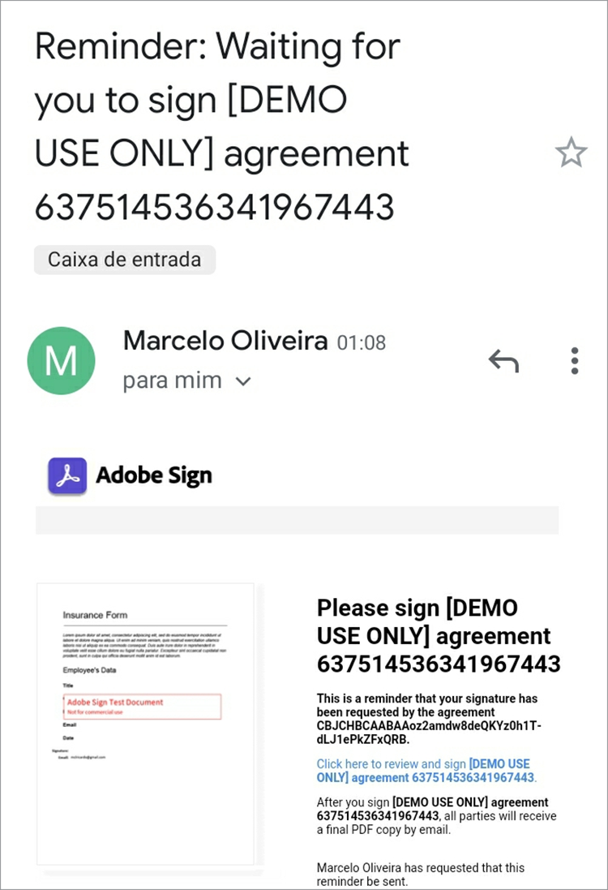

## 閱讀已完成的協議

像網路表單一樣，你可以閱讀收件人簽署的協議細節。 端點 `/agreements/{agreementId}/formData` 會取得使用者在簽署網頁表單時輸入的資料。

```
GET /api/rest/v6/agreements/{agreementId}/formData HTTP/1.1
Host: {YOUR-API-ACCESS-POINT}
Authorization: Bearer {YOUR-INTEGRATION-KEY-HERE}
Accept: text/csv
Response Body:
"completed","email","role","first","last","title","company","agreementId"
"2021-03-16 18:11:45","myemail@email.com","SIGNER","John","Doe","My Job Title","My
Company Name","CBJCHBCAABAA5Z84zy69q_Ilpuy5DzUAahVfcNZillDt"
```

## 後續步驟

Acrobat Sign API 讓您能管理文件、網頁表單及協議。 使用網頁表單與協議所建立的簡化但完整的工作流程，採用通用方式，使開發者能使用任何語言實作。

關於 Sign API 的運作概述，可以在 API 使用開發者指南](https://opensource.adobe.com/acrobat-sign/developer_guide/index.html#!adobedocs/adobe-sign/master/api_usage.md)中找到範例[。本文件包含關於文章中許多步驟的簡短文章，以及其他相關主題。

Acrobat Sign API 提供多種單 [人及多用戶電子簽名方案](https://acrobat.adobe.com/tw/zh-Hant/sign/pricing/plans.html)，您可以選擇最適合您需求的定價模式。 既然你已經知道將 Sign API 整合進應用程式有多簡單，你可能會對其他功能感興趣，例如 [Acrobat Sign Webhooks](https://opensource.adobe.com/acrobat-sign/developer_guide/index.html#!adobedocs/adobe-sign/master/webhooks.md)，一種推送式程式設計模型。 Webhook 讓你不必在 Acrobat Sign 事件中頻繁檢查應用程式，而是讓你註冊一個 HTTP URL，Sign API 會在事件發生時執行 POST 回撥請求。 Webhook 透過即時更新驅動應用程式，實現穩健的程式設計。

請 [查看預付費的費用](https://developer.adobe.com/document-services/pricing/main)，以及六個月免費 Adobe PDF 服務 API 試用結束後的免費 Adobe PDF 嵌入 API。

若想為您的應用程式新增自動文件建立與文件簽署等令人興奮的功能，請開始使用 [[!DNL Adobe Acrobat Services]](https://www.adobe.io/apis/documentcloud/dcsdk/gettingstarted.html)。
