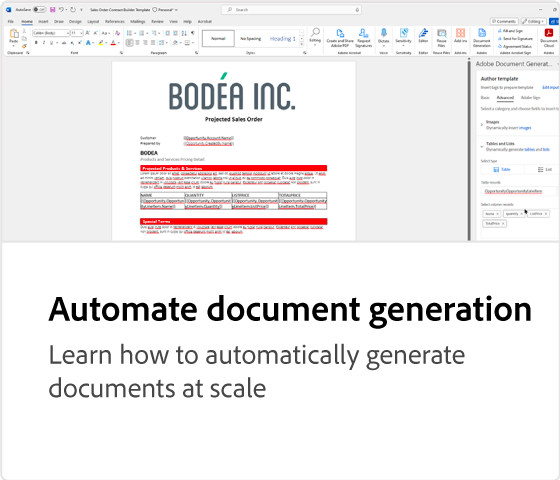
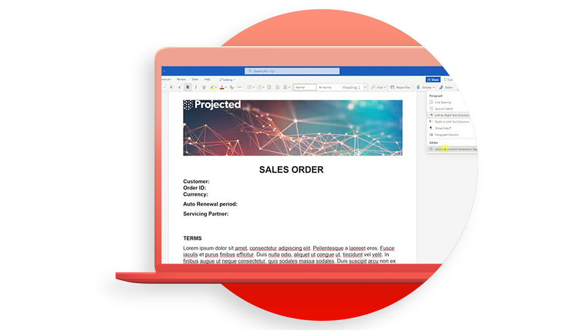
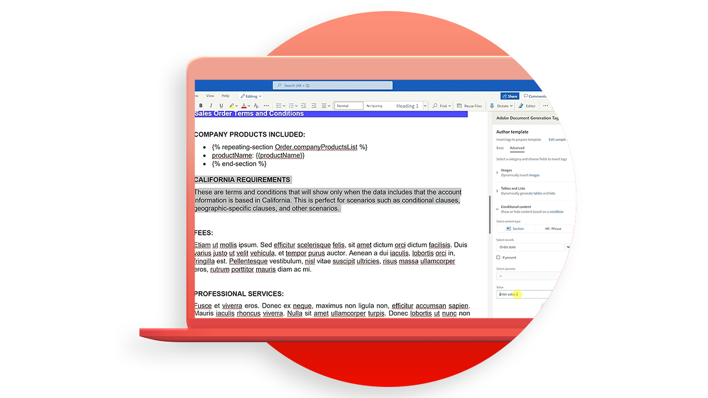

# 檔產生API教學課程

「檔案產生」API從 Word 範本和 JSON 資料建立 PDF 和 Word 檔。

>[!NOTE]
>
>PDF 服務API包含「檔案產生API」。

<table style="table-layout:fixed">
<tr>
 <td>
   
  </td>
    <td>
    
    

     
  </td>
   <td>
    
    

     
  </td>
  </td>
   <td>
    
    

     
  </td>
</tr>
</table>

## 建立範本

產生API檔會接受檔範本 （包含範本標籤） 以及輸入數據，以產生最終檔。 系統會根據對應至數據輸入的實際值，將文件範本中的所有範本標籤替換為動態內容，藉此產生最終檔。

<table style="table-layout:fixed">
<tr>
 <td>
   
    

   <a href="taggeroverview.md"><strong>Adobe檔產生索引標籤概覽</strong></a>
    

    <em>取得專為使用 Adobe 檔產生工具所設計的 Adobe Document Generation Tagger 概覽API</em>
     
  </td>
  <td>
   
    

   <a href="taggeraddtexttags.md"><strong>新增文字標籤</strong></a>
    

    <em>瞭解如何使用 Adobe Document Generation Tagger 將文字標籤新增至 Microsoft Word 範本，以搭配 Adobe 產生檔API</em>
     
  </td>
  <td>
   
    

   <a href="taggeraddimagetags.md"><strong>新增影像標籤</strong></a>
    

    <em>瞭解如何使用 Adobe Document Generation Tagger 將影像卷標新增至 Microsoft Word 範本，以使用「Adobe產生檔」將影像動態推送至檔API</em>
     
  </td>
  <td>
   
    

   <a href="taggertables.md"><strong>新增表格和清單標籤</strong></a>
    

    <em>瞭解如何使用 Adobe Document Generation Tagger 將表格和清單標籤新增至 Microsoft Word 範本，以使用「檔案產生Adobe」功能，根據數據動態新增表格或清單列API</em>
     
  </td>
</tr>
<tr>
  <td>
   
    

   <a href="taggercalculations.md"><strong>設定數值計算標籤</strong></a>
    

    <em>瞭解如何使用 Adobe Document Generation Tagger 在 Microsoft Word 範本中設定數位計算標籤，以使用「文件產生預設」Adobe計算匯整或整理數據值API</em>
     
  </td>
  <td>
   
    

   <a href="taggerconditional.md"><strong>設定條件式內容</strong></a>
    

    <em>瞭解如何使用 Adobe Document Generation Tagger 在 Microsoft Word 範本中設定區段，以使用「Adobe產生檔」功能，根據數據動態納入或排除檔區段API</em>
     
  </td>
  <td>
    
    

     
  </td>
   <td>
    
    

     
  </td>
</tr>
</table>
