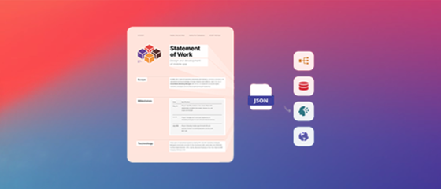
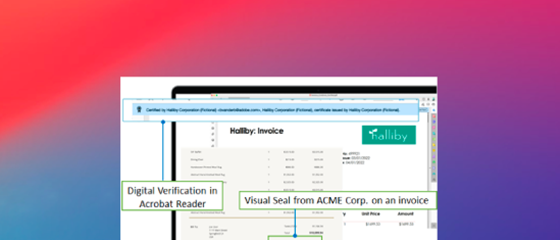

# [!DNL Adobe Acrobat Services] API教學課程

[!DNL Adobe Acrobat Services] 有六個主要 API：

* [!DNL Adobe PDF Services API]
* [!DNL Adobe PDF Embed API]
* [!DNL Adobe Document Generation API]
* [!DNL Adobe PDF Electronic Seal API]
* [!DNL Adobe PDF Extract API]
* [!DNL Adobe PDF Accessibility Auto-Tag API]

后兩個 API 及其 SDK 會合併 [!DNL Adobe PDF Services API] 為付費產品的一部分。 [!DNL PDF Embed API] 是免費方案。 這些 API 透過一套現代的雲端網路服務自動產生、處理和轉換文件內容。 這些體驗可協助您提供更簡單、更快速和品牌化的體驗，讓您控制檔的使用者互動、簡化 PDF 工作流程，並提升使用率和保留率。 這些教學課程可協助您透過 API 快速打造更簡單、更快速的品牌體驗 [!DNL Adobe Acrobat Services] 。

<table style="table-layout:fixed">
<tr>
 <td>
   
  </td>
  <td>
   
  </td>
  <td>
   
  </td>
  <td>
   
  </td>
</tr>
<tr>
  <td>
   
  </td>
 <td>
   
  </td>
 <td>
   
  </td>
 <td>
   
  </td>
</tr>
</table>
