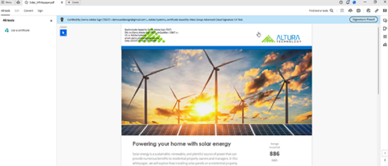

# Adobe PDF電子封印API教學課程

Adobe PDF「電子封印」API使用特定 TSP （信任服務提供者） 在 Adobe 認可信任清單 （AATL](https://helpx.adobe.com/tw/acrobat/kb/approved-trust-list1.html)） 上[核發的憑證，大規模地對檔套用電子封印。電子封印有助於驗證檔的身分和完整性。 這可用於大規模進行電子封印檔，並包含在 PDF Services API 中。

<table style="table-layout:fixed">
<tr>
 <td>
   <a href="automatically-apply-electronic-seal.md">
      
  </td>
  <td>
    
    

     
  </td>
  <td>
    
    

     
  </td>
  <td>
    
    

     
  </td>
</tr>
</table>
