# 控制PDF線上體驗並收集分析

您的組織是否在您的網站上發佈PDF? 瞭解如何使用Adobe PDF嵌入API控制外觀、啟用協作並收集有關用戶與PDF交互方式的分析，包括在頁面上花費的時間和搜索。 若要開始此4部分的操作教程，請選擇&#x200B;*使用PDF嵌入API入門*。

<table style="table-layout:fixed">
<tr>
  <td>
    <a href="controlpdfexperience.md#part1">
        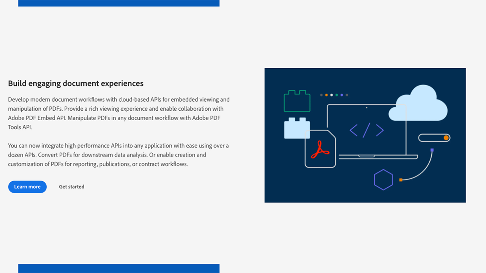
    </a>
    <div>
    <a href="controlpdfexperience.md#part1"><strong>第1部分：PDF嵌入API入門</strong></a>
    </div>
  </td>
  <td>
    <a href="controlpdfexperience.md#part2">
        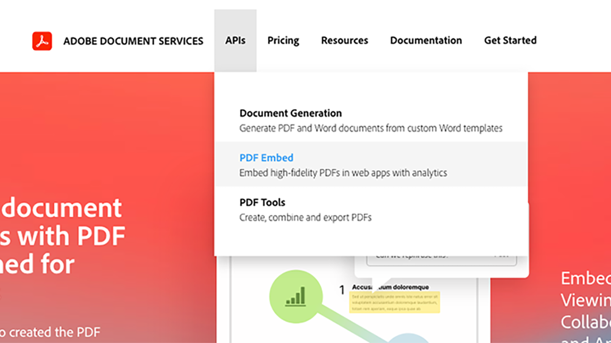
    </a>
    <div>
    <a href="controlpdfexperience.md#part2"><strong>第2部分：將PDF嵌入API添加到網頁</strong></a>
    </div>
  </td>
  <td>
   <a href="controlpdfexperience.md#part3">
      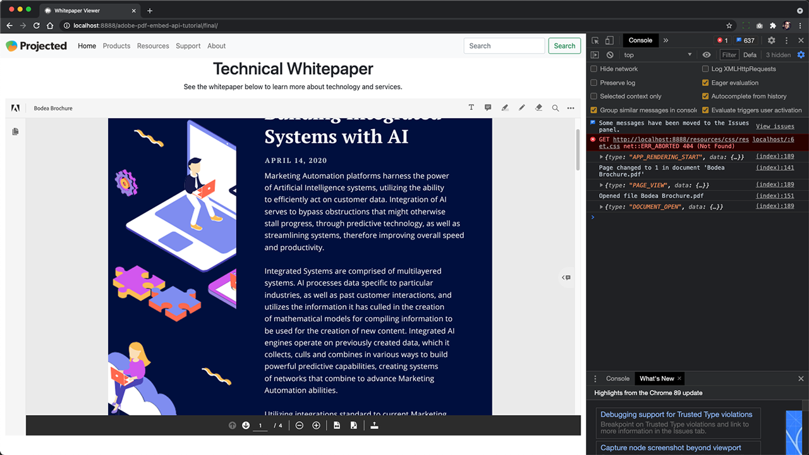
   </a>
    <div>
    <a href="controlpdfexperience.md#part3"><strong>第3部分：訪問分析API</strong></a>
    </div>
  </td>
  <td>
   <a href="controlpdfexperience.md#part4">
      
   </a>
    <div>
    <a href="controlpdfexperience.md#part4"><strong>第4部分：添加基於事件的交互性</strong></a>
    </div>
  </td>
</tr>
</table>

## 第1部分：PDF嵌入API入門 {#part1}

在第1部分，瞭解如何開始使用第1至3部分所需的一切。 您將從獲取API憑據開始。

**您需要的內容**

* 教程資源[下載](https://github.com/benvanderberg/adobe-pdf-embed-api-tutorial)
* Adobe ID[在此處獲取一個](https://account.adobe.com/)
* Web伺服器（節點JS、PHP等）
* HTML/JavaScript/CSS的工作知識

**我們使用的內容**

* 基本Web伺服器（節點）
* Visual Studio代碼
* GitHub

### 正在獲取憑據

1. 轉到[Adobe.io網站](https://developer.adobe.com/)。
1. 按一下「生成參與文檔體驗」下的「瞭解更多資訊」**[!UICONTROL 。]**

   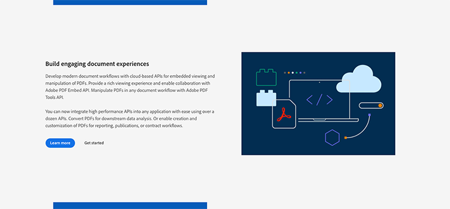

   這將帶您進入[!DNL Adobe Acrobat Services]首頁。

1. 在導航欄中按一下&#x200B;**[!UICONTROL 開始]**。

   在&#x200B;**使用[!DNL Acrobat Services]個API開始**&#x200B;到&#x200B;**建立新憑據**&#x200B;或&#x200B;**管理現有憑據**&#x200B;中，您將看到一個選項。

1. 按一下&#x200B;**[!UICONTROL 新建憑據]**&#x200B;下的&#x200B;**[!UICONTROL 開始]**&#x200B;按鈕。

   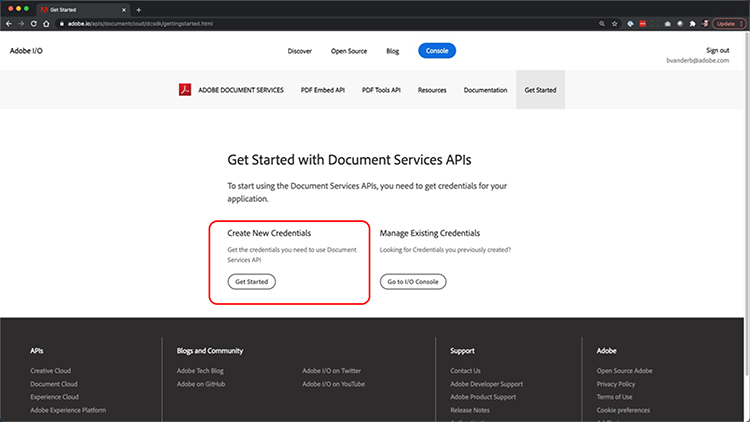

1. 選擇&#x200B;**[!UICONTROL PDF嵌入API]**&#x200B;單選按鈕，並在下一個窗口中添加您選擇的憑據名稱和應用程式域。

   >[!NOTE]
   >
   >這些憑據只能用於此處列出的應用程式域。 您可以使用您選擇的任何域。

   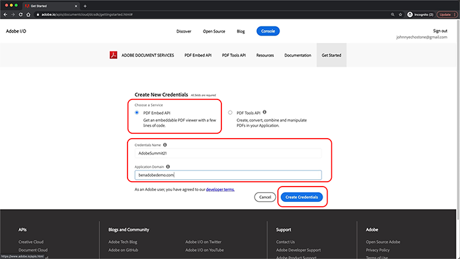

1. 按一下&#x200B;**[!UICONTROL 建立憑據]**。

   嚮導的最後一頁為您提供了客戶端憑據詳細資訊。 保持此窗口開啟，以便您可以返回到該窗口並複製客戶端ID（API密鑰）以供以後使用。

1. 按一下&#x200B;**[!UICONTROL 查看文檔]**&#x200B;以轉到文檔，其中包含有關如何使用此API的詳細資訊。

   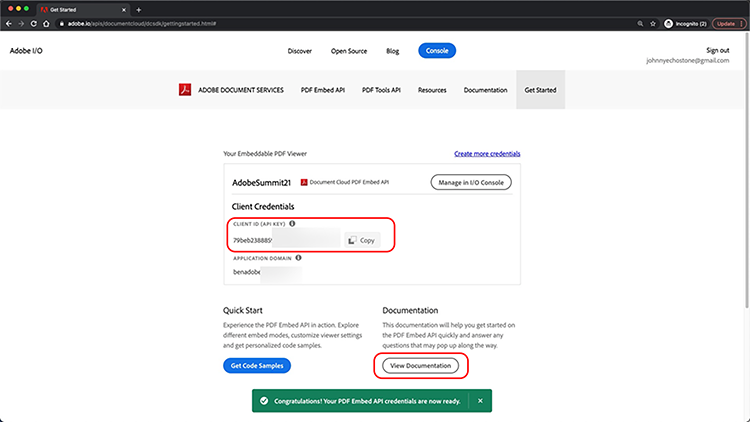

## 第2部分：將PDF嵌入API添加到網頁 {#part2}

在第2部分，您將學習如何輕鬆將PDF嵌入API嵌入到網頁中。 您將使用Adobe PDF嵌入API線上演示建立我們的代碼來執行此操作。

### 獲取練習代碼

我們為您建立了代碼。 雖然您可以使用自己的代碼，但演示將位於教程資源的上下文中。 在此處下載示例代碼[](https://github.com/benvanderberg/adobe-pdf-embed-api-tutorial)。

1. 轉到[[!DNL Adobe Acrobat Services] 網站](https://developer.adobe.com/document-services/homepage/)。

   ![[!DNL Adobe Acrobat Services]網站的螢幕截圖](assets/ControlPDF_6.png)

1. 在導航欄中按一下&#x200B;**[!UICONTROL API]**，然後轉到下拉連結中的&#x200B;**[!UICONTROL PDF嵌入API]**&#x200B;頁。

   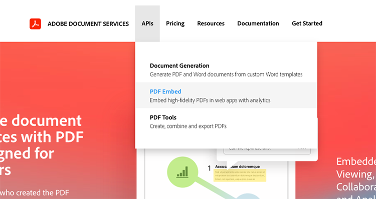

1. 按一下&#x200B;**[!UICONTROL 嘗試演示]**。

   隨PDF嵌入API的開發人員沙盒彈出一個新窗口。

   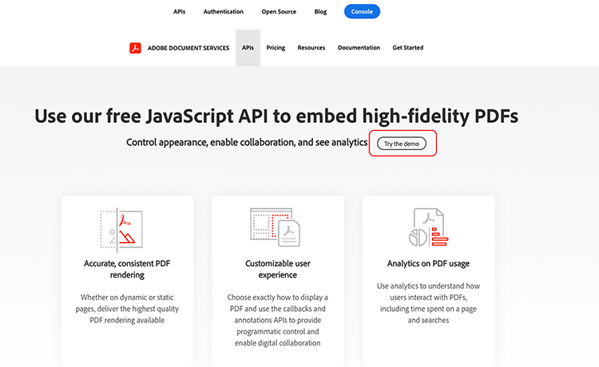

   在這裡，您可以看到不同查看模式的選項。

1. 按一下「全窗口」(Full Window)、「尺寸容器」(Signed Container)、「線上」(In-Line)和「燈箱」(Lightbox)的不同查看模式。

   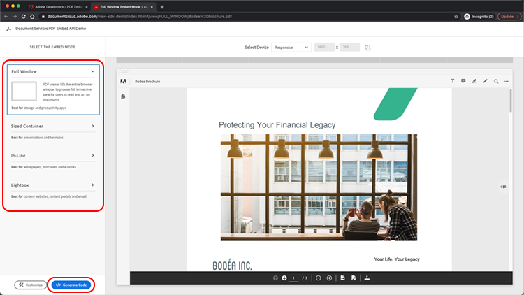

1. 按一下&#x200B;**[!UICONTROL 全窗口]**&#x200B;查看模式，然後按一下&#x200B;**[!UICONTROL 自定義]**&#x200B;按鈕以開啟和關閉選項。

   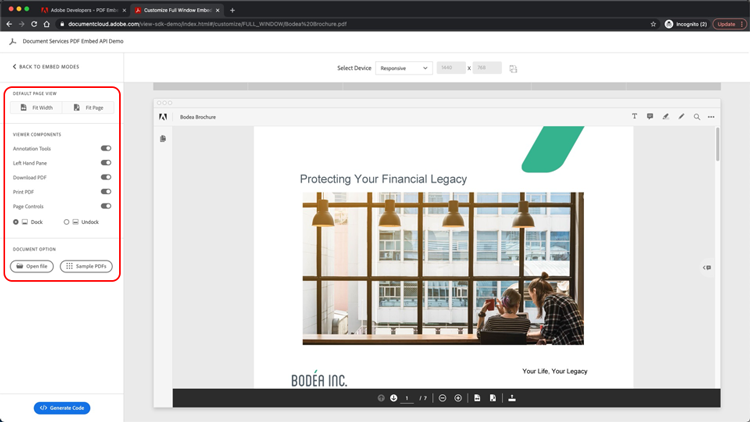

1. 禁用&#x200B;**[!UICONTROL 下載]** PDF選項。
1. 按一下&#x200B;**[!UICONTROL 生成代碼]**&#x200B;按鈕以查看代碼預覽。
1. 從第1部分的「客戶端憑據」窗口複製&#x200B;**[!UICONTROL 客戶端ID]**。

   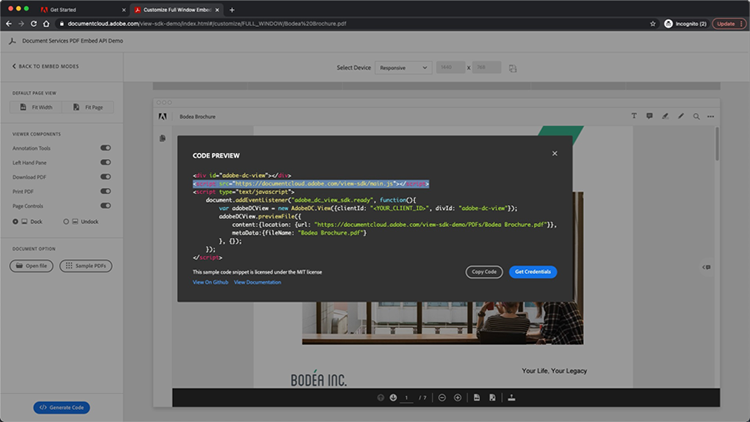

1. 在代碼編輯器中開啟&#x200B;**[!UICONTROL Web]** -> **[!UICONTROL 資源]** -> **[!UICONTROL js]** -> **[!UICONTROL dc-config.js]**&#x200B;檔案。

   您將看到clientID變數在其中。

1. 將客戶端憑據貼上到雙引號之間，以將clientID設定為憑據。

1. 返回到開發人員沙盒代碼預覽。

1. 複製具有Adobe指令碼的第二行：

   ```
   <script src=https://documentccloud.adobe.com/view-sdk/main.js></script>
   ```

   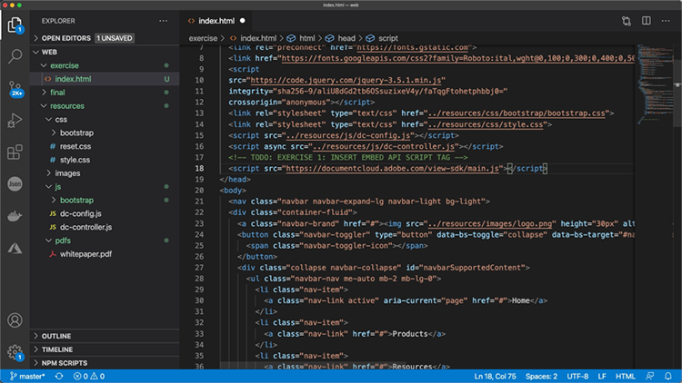

1. 轉到代碼編輯器並開啟&#x200B;**[!UICONTROL Web]** -> **[!UICONTROL 練習]** -> **[!UICONTROL index.html]**&#x200B;檔案。

1. 將指令碼代碼貼上到檔案的`<head>`中的注釋下，該注釋標籤為： **TODO: EXERCISE 1: INSERT EMBED API指令碼標籤**。

   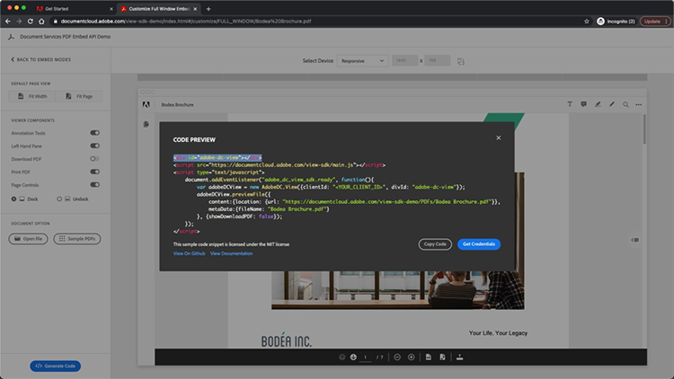

1. 返回到開發人員沙盒代碼預覽並複製第一行代碼，該代碼具有：

   ```
   <div id="adobe-dc-view"></div>
   ```

   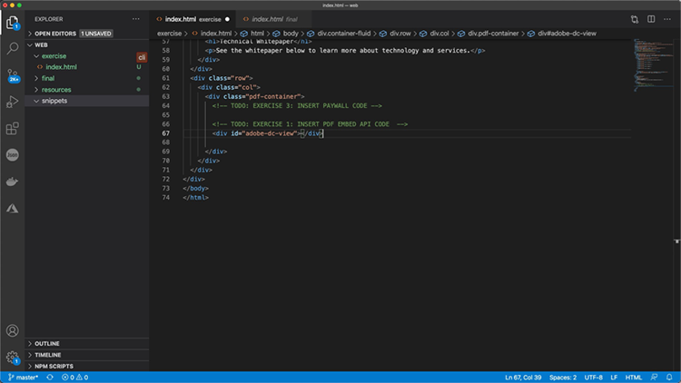

1. 轉到代碼編輯器，然後再次開啟&#x200B;**[!UICONTROL Web]** -> **[!UICONTROL 練習]** -> **[!UICONTROL index.html]**&#x200B;檔案。

1. 將`<div>`代碼貼上到檔案的`<body>`中，檔案的&#x200B;**TODO: EXERCISE 1: INSERTPDFEMBED API CODE**&#x200B;下面。

   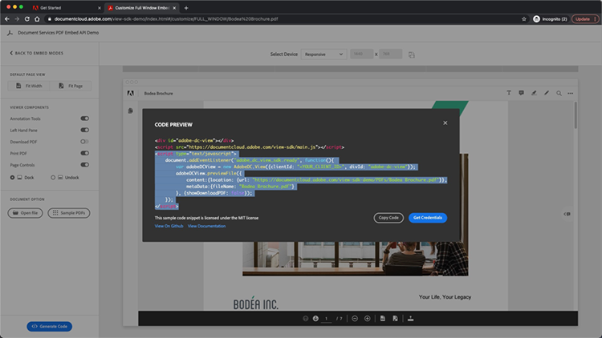

1. 返回到開發人員沙盒代碼預覽並複製下面`<script>`的代碼行：

   ```
   <script type="text/javascript">
       document.addEventListener("adobe_dc_view_sdk.ready",             function(){ 
           var adobeDCView = new AdobeDC.View({clientId:                     "<YOUR_CLIENT_ID>", divId: "adobe-dc-view"});
           adobeDCView.previewFile({
               content:{location: {url: "https://documentcloud.                adobe.com/view-sdk-demo/PDFs/Bodea Brochure.                    pdf"}},
               metaData:{fileName: "Bodea Brochure.pdf"}
           }, {showDownloadPDF: false});
       });
   </script>
   ```

1. 轉到代碼編輯器，然後再次開啟&#x200B;**[!UICONTROL Web]** -> **[!UICONTROL 練習]** -> **[!UICONTROL index.html]**&#x200B;檔案。

1. 將`<script>`代碼貼上到`<body>`標籤下第68行檔案的`<div>`中。

1. 修改相同&#x200B;**index.html**&#x200B;檔案的第70行，以包括以前建立的clientID變數。

   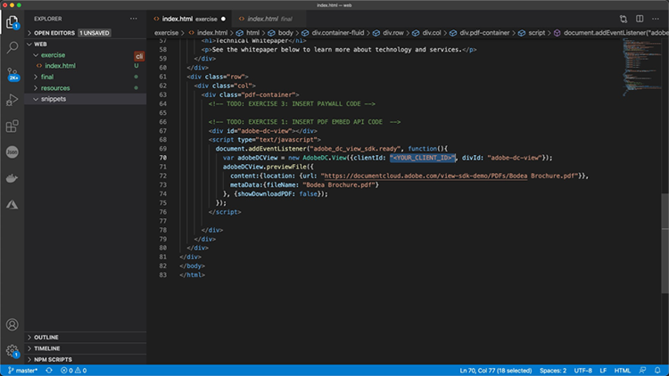

1. 修改相同&#x200B;**index.html**&#x200B;檔案的第72行，以更新PDF檔案的位置以使用本地檔案。

   **/resources/pdfs/whitepaper.pdf**&#x200B;中的教程檔案中提供了一個。

1. 通過瀏覽&#x200B;**`<your domain>`/summit21/web/exercise/**&#x200B;來保存已修改的檔案並預覽網站。

   您應在瀏覽器中以「全窗口」模式查看「技術白皮書」呈現。

## 第3部分：訪問分析API {#part3}

現在，您已成功建立了具有PDF嵌入API呈現PDF的網頁，在第3部分，您現在可以探討如何使用JavaScript事件度量分析，以瞭解用戶如何使用PDF。

### 查找文檔

作為PDF嵌入API的一部分，有許多不同的JavaScript事件可用。 您可以從[!DNL Adobe Acrobat Services]文檔訪問它們。

1. 導航到[文檔](https://developer.adobe.com/document-services/docs/overview)站點。
1. 查看作為API一部分可用的不同事件類型。 這些對於參考很有幫助，並且對您的未來項目也有幫助。

   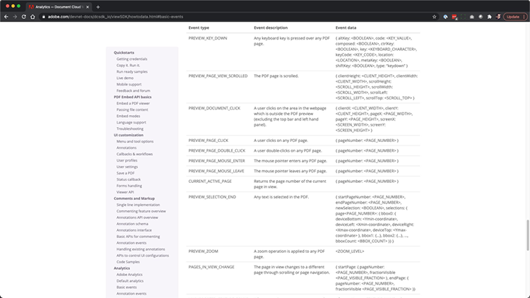

1. 複製網站上列出的示例代碼。

   將此作為代碼的基礎並對其進行修改。

   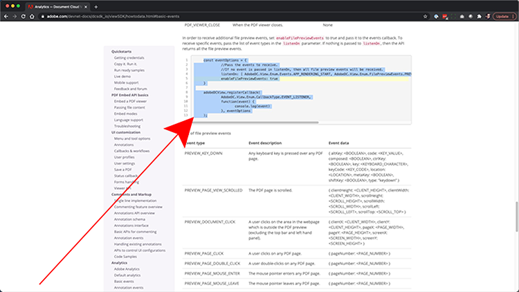

   ```
   const eventOptions = {
     //Pass the PDF analytics events to receive.
      //If no event is passed in listenOn, then all PDF         analytics events will be received.
   listenOn: [ AdobeDC.View.Enum.PDFAnalyticsEvents.    PAGE_VIEW, AdobeDC.View.Enum.PDFAnalyticsEvents.DOCUMENT_DOWNLOAD],
     enablePDFAnalytics: true
   }
   
   
   adobeDCView.registerCallback(
     AdobeDC.View.Enum.CallbackType.EVENT_LISTENER,
     function(event) {
       console.log("Type " + event.type);
       console.log("Data " + event.data);
     }, eventOptions
   );
   ```

1. 在&#x200B;**index.html**&#x200B;中，查找前面添加的類似於下面的代碼部分，並在此代碼之後添加上面的代碼：

   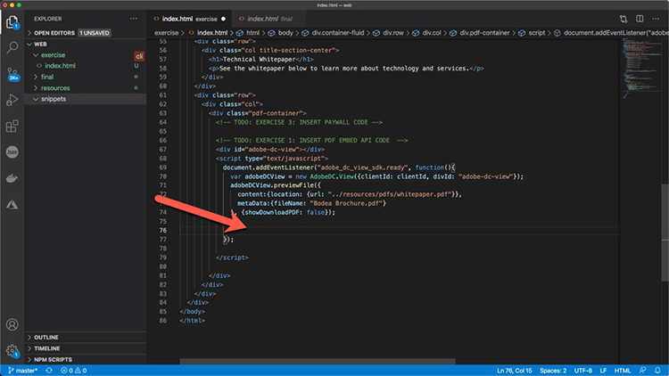

1. 在Web瀏覽器中載入該頁，並開啟控制台，以在您與PDF查看器交互時查看不同事件的控制台輸出。

   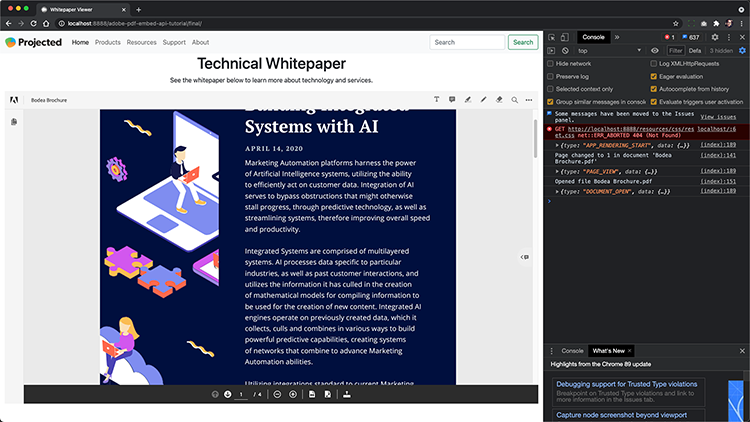

   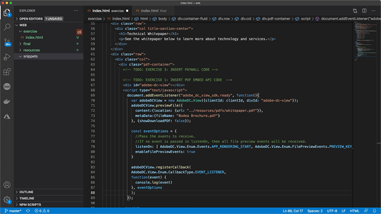

### 添加用於捕獲事件的交換機

現在已將事件輸出到console.log ，讓我們根據哪些事件更改行為。 為此，您將使用交換機示例。

1. 導航到&#x200B;**snippets/eventsSwitch.js**&#x200B;並複製教程代碼中檔案的內容。

   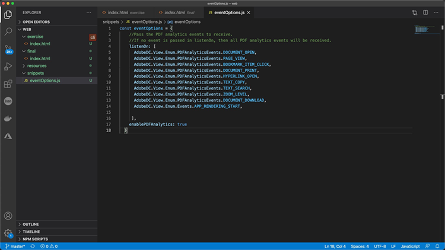

1. 將代碼貼上到事件偵聽器函式中。

   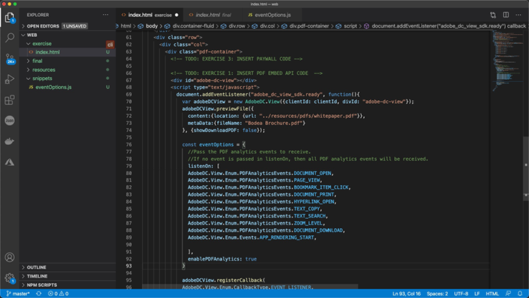

1. 確認載入頁面時控制台輸出正確，並且您與PDF查看器交互。

### Adobe Analytics

如果要向查看者添加Adobe Analytics支援，可以按照網站上記錄的說明進行操作。

>[!IMPORTANT]
>
>您的網頁需要已將Adobe Analytics載入到頁眉的頁面上。

導航到[Adobe Analytics文檔](https://www.adobe.com/devnet-docs/dcsdk_io/viewSDK/howtodata.html#adobe-analytics)並查看您的網頁上是否已啟用Adobe Analytics。 按照說明設定reportSuite。

### Google Analytics

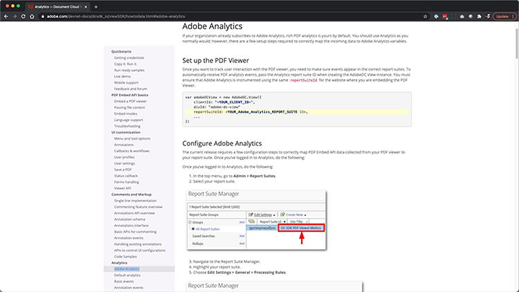

Adobe PDF嵌入式API提供與Adobe Analytics的現成整合。 但是，由於所有事件都可以作為JavaScript事件使用，因此可以通過捕獲Google Analytics事件並使用ga()函式將事件添加到Adobe Analytics來與PDF整合。

1. 導航至&#x200B;**snippets/eventsSwitchGA.js**，瞭解如何與Google Analytics整合。
1. 如果您的網頁是使用Adobe Analytics跟蹤的，並且已嵌入到網頁中，請查看並使用此代碼作為示例。

   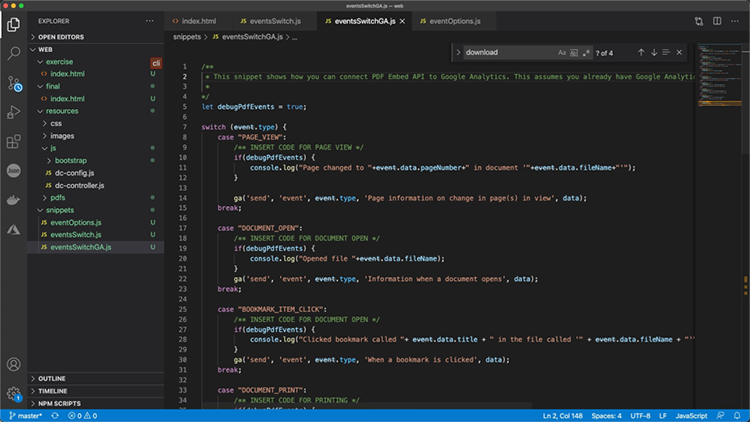

## 第4部分：根據事件添加交互性 {#part4}

在第4部分中，您將瞭解如何在PDF查看器的頂部鋪設付款牆，在滾動到第二頁後顯示該付款牆。

### Paywall示例

導航到此[付費牆後PDF示例](https://www3.technologyevaluation.com/research/white-paper/the-forrester-wave-digital-decisioning-platforms-q4-2020.html)。 在本示例中，您將學習在PDF查看體驗的基礎上添加交互性。

### 添加付款牆代碼

1. 請訪問snippets/paywallCode.html並複製內容。
1. 在exercise/index.html中搜索`<!-- TODO: EXERCISE 3: INSERT PAYWALL CODE -->`。

   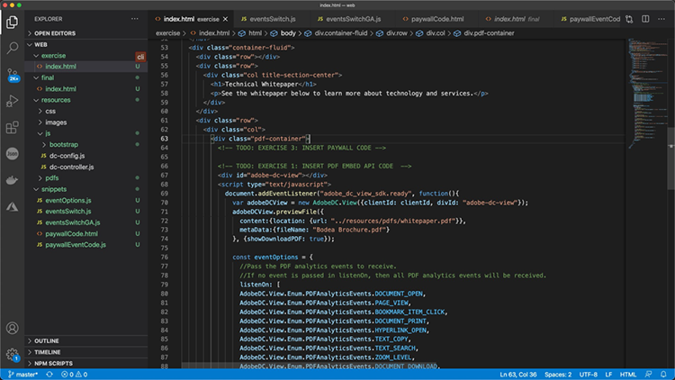

1. 在注釋後貼上複製的代碼。
1. 轉到&#x200B;**snippets/paywallCode.js**&#x200B;並複製內容。

   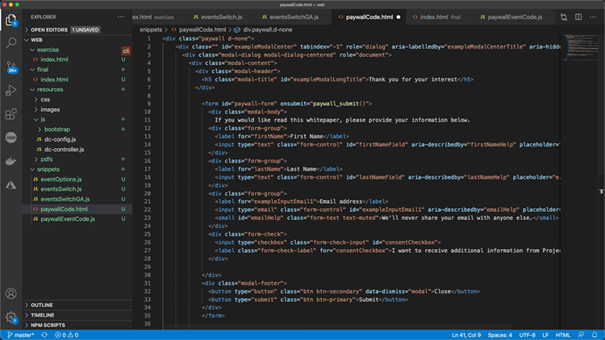

1. 將代碼貼上到該位置。

### 試用Paywall演示

現在您可以查看演示。

1. 在網站上重新載入&#x200B;**index.html**。
1. 向下滾動到> 2的頁面。
1. 顯示第二頁後的對話框，詢問用戶。

   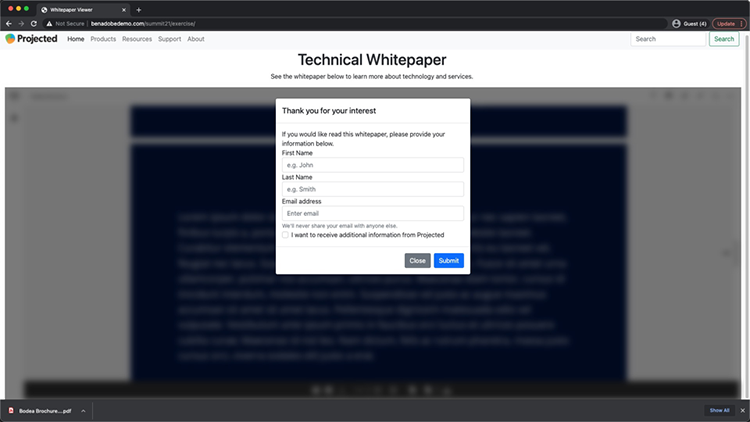

## 其他資源

在[此處](https://developer.adobe.com/document-services/docs/overview)可找到其他資源。
