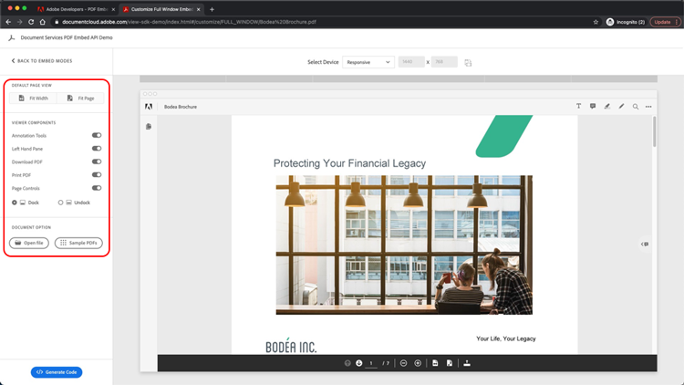

# 控制您的 PDF 線上體驗並收集分析結果

您的組織會在您的網站上發佈 PDF 嗎？ 瞭解如何使用Adobe PDF嵌入API來控制外觀、啟用共同作業，以及收集有關使用者如何與 PDF 互動的分析，包括花費在頁面和搜尋上的時間。 若要開始此 4 部分的實作教學課程，請選 *取「開始使用 PDF 嵌入」API* 。

<table style="table-layout:fixed">
<tr>
  <td>
    <a href="controlpdfexperience.md#part1">
        
    </a>
    <div>
    <a href="controlpdfexperience.md#part1"><strong>第 1 部分：PDF 內嵌API快速入門</strong></a>
    </div>
  </td>
  <td>
    <a href="controlpdfexperience.md#part2">
        
    </a>
    <div>
    <a href="controlpdfexperience.md#part2"><strong>第 2 部分：將 PDF 內嵌API新增至網頁</strong></a>
    </div>
  </td>
  <td>
   <a href="controlpdfexperience.md#part3">
      
   </a>
    <div>
    <a href="controlpdfexperience.md#part3"><strong>第 3 部分：存取 Analytics API</strong></a>
    </div>
  </td>
  <td>
   <a href="controlpdfexperience.md#part4">
      
   </a>
    <div>
    <a href="controlpdfexperience.md#part4"><strong>第 4 部分：根據事件增加互動</strong></a>
    </div>
  </td>
</tr>
</table>

## 第 1 部分：PDF 內嵌API快速入門 {#part1}

第 1 部分中，瞭解如何開始使用第 1 至 3 部分所需的一切。 您將首先取得API認證。

**您需要的**

* 教學課程資源 [ 下載](https://github.com/benvanderberg/adobe-pdf-embed-api-tutorial)
* [Adobe ID在這裡取得](https://accounts.adobe.com/tw/)
* 網頁伺服器 （Node JS、PHP 等）
* HTML/JavaScript/CSS 的工作知識

**我們正在使用的**

* 基本網頁伺服器 （節點）
* Visual Studio 程式碼
* GitHub

### 取得認證

1. 前往 Adobe.io [ 網站 ](https://www.adobe.io/) 。
1. 按一下「建立引人入勝的檔體驗」底下的「 **[!UICONTROL 進一步]** 瞭解」。

   

   這會帶您前往 [!DNL Adobe Acrobat Services] 首頁。

1. 按一下 **[!UICONTROL 導開始使用]** 列中的「開始使用」。

   您可以在具有 API 開始使用中 **看到一個選項，以** 建立新認證或 **管理現有認證** **。** [!DNL Acrobat Services]

1. 按一下 **[!UICONTROL 「建立新認證」下方**[!UICONTROL  的「 ]**開始使用」]** 按鈕。

   

1. 選擇「 **[!UICONTROL PDF 嵌入API]** 」選項按鈕，並在下一個視窗中新增您選擇的認證名稱和應用程式網域。

   >[!NOTE]
   >
   >這些認證只能用於此處所列的應用程式網域。 您可以使用您選擇的任何網域。

   

1. 按一下 **[!UICONTROL 「建立認證」]** 。

   精靈的最終頁面會提供您的用戶端認證詳細資訊。 將這個視窗保持開啟狀態，以便您可以返回並複製用戶端 ID （API 鍵），以供後續使用。

1. 按一下 **[!UICONTROL 「檢視檔」]** ，前往提供有關如何使用此API詳細資訊的檔。

   

## 第 2 部分：將 PDF 內嵌API新增至網頁 {#part2}

第 2 部分中，您將瞭解如何輕鬆地將 PDF 嵌入API入網頁。 您將透過使用 Adobe PDF Embed API 線上示範來建立我們的程式碼來完成此操作。

### 取得練習代碼

我們建立了可供您使用的程式碼。 雖然您可以使用自己的程式碼，但示範將會採用教學課程資源的情境。 在此 ](https://github.com/benvanderberg/adobe-pdf-embed-api-tutorial) 下載範例代碼 [ 。

1. 前往 [[!DNL Adobe Acrobat Services]  網站 ](https://www.adobe.io/apis/documentcloud/dcsdk/) 。

   ![網站螢幕 [!DNL Adobe Acrobat Services] 擷圖](assets/ControlPDF_6.png)

1. 按一下 **[!UICONTROL 導覽列中的 API]** ，然後移至 **[!UICONTROL 下拉式連結中的「PDF 嵌入API]** 」頁面。

   

1. 按一下 **[!UICONTROL 「試用示範」]** 。

   隨即出現新的視窗，其中包含開發人員的 PDF 內嵌API沙箱。

   

   您可以在此查看不同檢視模式的選項。

1. 針對「完整視窗」、「大小容器」、「內側」和「Lightbox」按一下不同的檢視模式。

   

1. 按一下 **[!UICONTROL 「全視窗」]** 檢視模式，然後按一下 **[!UICONTROL 「自訂」]** 按鈕以開啟或關閉選項。

   

1. 停用「 **[!UICONTROL 下載]** PDF」選項。
1. 按一下 **[!UICONTROL 「產生程式碼」]** 按鈕以查看程式碼預覽。
1. 從第 1 部分的「用戶端認證」視窗複製 **[!UICONTROL 用戶端 ID]** 。

   

1. 在 **[!UICONTROL 程式碼編輯器中開啟 Web]** -> **[!UICONTROL 資源]** -> **[!UICONTROL js]** -> **[!UICONTROL dc-config.js]** 檔案。

   您會看到用戶端 ID 變數存在。

1. 在雙引號之間貼上客戶認證，將用戶端 ID 設定為您的認證。

1. 返回開發人員沙箱程式碼預覽。

1. 複製含有 Adobe 腳本的第二行：

   ```
   <script src=https://documentccloud.adobe.com/view-sdk/main.js></script>
   ```

   

1. 前往程式碼編輯器，然後開啟 **[!UICONTROL Web]** -> **[!UICONTROL 練習]** -> **[!UICONTROL index.html]** 檔案。

1. 將腳本程式碼貼到 `<head>` 第 18 行的檔案中，並加上注釋：「 **TODO： 練習 1： 插入內嵌API SCRIPT 標籤」** 。

   

1. 返回開發人員沙箱程式碼預覽，並複製第一行具有：

   ```
   <div id="adobe-dc-view"></div>
   ```

   

1. 前往程式碼編輯器，然後再次開啟 **[!UICONTROL Web]** -> **[!UICONTROL 練習]** -> **[!UICONTROL index.html]** 檔案。

1. 在 `<div>` 行 67 行的注釋下方，將程式碼 `<body>` 貼到檔案中：「 **TODO：練習 1： 插入 PDF 內嵌API程式碼」** 。

   

1. 返回開發人員沙箱程式碼預覽，然後複製下列程式碼 `<script>` 行：

   ```
   <script type="text/javascript">
       document.addEventListener("adobe_dc_view_sdk.ready",             function(){ 
           var adobeDCView = new AdobeDC.View({clientId:                     "<YOUR_CLIENT_ID>", divId: "adobe-dc-view"});
           adobeDCView.previewFile({
               content:{location: {url: "https://documentcloud.                adobe.com/view-sdk-demo/PDFs/Bodea Brochure.                    pdf"}},
               metaData:{fileName: "Bodea Brochure.pdf"}
           }, {showDownloadPDF: false});
       });
   </script>
   ```

1. 前往程式碼編輯器，然後再次開啟 **[!UICONTROL Web]** -> **[!UICONTROL 練習]** -> **[!UICONTROL index.html]** 檔案。

1. 將 `<script>` 程式碼貼到 `<body>` 標籤下第 68 行的檔案中 `<div>` 。

1. 修改相同 **索引.html** 檔案第 70 行，以包含先前建立的用戶端 ID 變數。

   

1. 修改相同 **索引.html** 檔案第 72 行，更新 PDF 檔案位置，以使用本機檔案。

   /resources/pdfs/whitepaper.pdf 中的教學課程檔案中有 **一個可用的教學課程** 檔案。

1. 流覽至 **`<your domain>`/summit21/web/exercise/** ，儲存修改過的檔案並預覽網站。

   您應該會在瀏覽器中以全視窗模式顯示技術白皮書。

## 第 3 部分：存取 Analytics API {#part3}

現在，您已成功建立網頁，其中包含 PDF 內嵌API呈現 PDF，第 3 部分現在可以探索如何使用JavaScript事件來度量分析，以瞭解使用者如何使用 PDF。

### 尋找檔

PDF 內嵌API中有許多不同的JavaScript事件可供使用。 您可以從 [!DNL Adobe Acrobat Services] 檔存取這些檔。

1. 流覽至 [ 檔 ](https://www.adobe.io/apis/documentcloud/dcsdk/docs.html) 網站。
1. 檢閱API中提供的不同事件種類。 這些都有助於參考，而且對未來的專案也有益。

   

1. 複製網站上列出的範例程式碼。

   請以此作為本公司程式碼的基礎，並加以修改。

   

   ```
   const eventOptions = {
     //Pass the PDF analytics events to receive.
      //If no event is passed in listenOn, then all PDF         analytics events will be received.
   listenOn: [ AdobeDC.View.Enum.PDFAnalyticsEvents.    PAGE_VIEW, AdobeDC.View.Enum.PDFAnalyticsEvents.DOCUMENT_DOWNLOAD],
     enablePDFAnalytics: true
   }
   
   
   adobeDCView.registerCallback(
     AdobeDC.View.Enum.CallbackType.EVENT_LISTENER,
     function(event) {
       console.log("Type " + event.type);
       console.log("Data " + event.data);
     }, eventOptions
   );
   ```

1. 在 index.html **中尋找您先前新增的程式碼區段 ，其看起來如下所示，並在此程式碼** 之後附加至上方：

   

1. 在網頁瀏覽器中載入頁面，然後開啟「主控台」，檢視當您與 PDF 檢視器互動時，不同事件的控制台輸出。

   

   

### 新增切換開關以擷取事件

現在您已經有將事件輸出到 console.log，讓我們根據哪些事件變更行為。 若要執行此操作，您將使用切換範例。

1. 導覽至 **snippets/eventsSwitch.js** ，然後複製教學課程程式碼中的檔案內容。

   

1. 在事件聽眾功能中貼上程式碼。

   

1. 確認載入頁面後控制台輸出正確，並與 PDF 檢視器互動。

### Adobe Analytics

如果您想要將Adobe Analytics支援新增至檢視器，您可以依照網站上記載的指示進行。

>[!IMPORTANT]
>
>您的網頁必須已經有Adobe Analytics載入頁眉中的頁面。

如果您已在 [ 網頁上啟用Adobe Analytics，請流覽至Adobe Analytics檔 ](https://www.adobe.com/devnet-docs/dcsdk_io/viewSDK/howtodata.html#adobe-analytics) 並進行審核。 依照指示設定 reportSuite。

### Google Analytics


Adobe PDF內嵌API提供與 Adobe Analytics 的立即整合。 不過，由於所有事件都以JavaScript事件提供，因此透過擷取 PDF 事件並使用 ga（） 功能將事件新增至Adobe Analytics，可以與Google Analytics整合。

1. 流覽至 **snippets/eventsSwitchGA.js** ，瞭解如何與 Google Analytics 整合。
1. 如果您的網頁是使用Adobe Analytics追蹤，並且已嵌入網頁中，請檢閱並使用此程式碼做為範例。

   

## 第 4 部分：根據事件增加互動 {#part4}

在第 4 部分中，您將逐步瞭解如何在 PDF 檢視器上方建立一個付費牆，該付費牆會在您捲動經過第二頁後顯示。

### 付費牆範例

流覽至這個 [ 付費牆 ](https://www3.technologyevaluation.com/research/white-paper/the-forrester-wave-digital-decisioning-platforms-q4-2020.html) 後的 PDF 範例。 在這個範例中，您將學習如何在 PDF 檢視體驗上增加互動功能。

### 新增付費牆代碼

1. 前往 snippets/paywallCode.html 並複製內容。
1. `<!-- TODO: EXERCISE 3: INSERT PAYWALL CODE -->`exercise/index.html Search用。

   

1. 在注釋後貼上複製的程式碼。
1. 前往 **snippets/paywallCode.js** 並複製內容。

   

1. 將程式碼貼到該位置。

### 使用付費牆嘗試示範

現在您可以檢視示範了。

1. 在您的網站上重載 **index.html** 。
1. 向下捲動至頁面 > 2。
1. 在第二頁之後顯示對話方塊以挑戰使用者。

   

## 其他資源

如需其他資源，請參閱 [ 此處 ](https://www.adobe.io/apis/documentcloud/dcsdk/docs.html) 。
