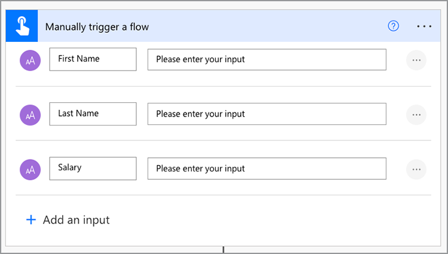
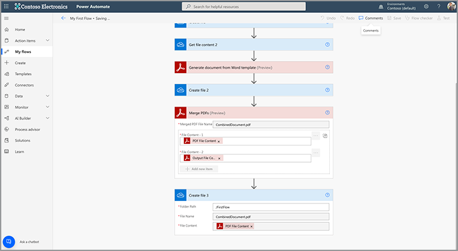

# 在 Microsoft Power Automate 中建立您的第一個流程

瞭解如何使用 [ Adobe PDF Services ](https://us.flow.microsoft.com/en-us/connectors/shared_adobepdftools/adobe-pdf-services/) 連接器，在 [ Microsoft Power Automate ](https://flow.microsoft.com/zh-tw/) 中建立第一個流程。

在此實作教學課程中，瞭解如何：

* 將 Word 檔轉換為 PDF
* 將 PDF 檔合併為一個 PDF
* 使用密碼保護 PDF 檔

## 製備

### 您需要的

* **Adobe PDF服務** 的試用或生產憑證
若要進一步瞭解如何在 Microsoft Power Automate [ 中取得及設定認證，請參閱這裡 ](https://experienceleague.adobe.com/docs/document-services/tutorials/pdfservices/getting-credentials-power-automate.html) 。
* **Microsoft Power Automate 含進階連接器**
若要瞭解如何查看 Power Automate [ 的授權等級，請參閱這裡 ](https://docs.microsoft.com/en-us/power-platform/admin/power-automate-licensing/types) 。
* **OneDrive**
本教學課程中會使用 OneDrive 儲存連接器，但可以替代任何儲存空間連接器。

### 範例檔案

您需要解壓縮並上傳到 OneDrive 的兩 [ 個範例檔案 ](assets/sample-assets.zip) ：

* WordDocument01.docx
* WordDocument02.docx

### 取得認證

若要完成此教學課程，您需要已在 Microsoft Power Automate for Adobe PDF Services 中設定的認證。 如果您尚未完成此步驟，請參閱 [ 這裡的 ](https://experienceleague.adobe.com/docs/document-services/tutorials/pdfservices/getting-credentials-power-automate.html) 指示。

## 第 1 部分：建立新流程並將 Word 轉換為 PDF

### 建立流程

在此部分中，您可以使用即時流程在 Microsoft Power Automate ](https://flow.microsoft.com/zh-tw/) 中 [ 建立新流程、新增參數、從 OneDrive 取得檔案，以及將檔案轉換為 PDF。

1. 流覽至 [ Microsoft Power Automate ](https://flow.microsoft.com/zh-tw/) ，並使用您的認證登入。
1. 在側邊欄中，選取「 **[!UICONTROL 建立」]** 。

   

1. 選取「 **[!UICONTROL 即時流程」]** 。
1. 為您的流程命名。
1. 在「選擇如何觸發此流程」下 *方，選&#x200B;**[!UICONTROL 取「手動觸發流程」]**。*
1. 選取「**[!UICONTROL 建立]**」。

### 取得檔案內容

接下來，取得範例檔案的檔案內容。

>[!PREREQUISITES]
>
>如果您尚未將範例檔案上傳 [ 至 OneDrive，請將範例檔案 ](assets/sample-assets.zip) 解壓縮並上傳。


1. 在 [ Power Automate ](https://flow.microsoft.com/zh-tw/) 中，選取 **[!UICONTROL + 新步驟]** 。
1. 在搜尋列中Search *用 OneDrive* 。
1. 選取「商務用 OneDrive」或「OneDrive ]****[!UICONTROL  」，選擇您的工作或個人 OneDrive ]**帳戶**[!UICONTROL  。
1. *Search在搜尋列中取得檔案內容* 。
1. 在「 **[!UICONTROL 檔案」]** 欄位中，選取「檔案夾」圖示，即可在 OneDrive 中導覽至 *WordDocument01.docx* 檔案。

   

### 將檔案轉換為 PDF

既然您有檔案內容，就可以將檔轉換為 PDF。

1. 在 [ Power Automate ](https://flow.microsoft.com/zh-tw/) 中，選取 **[!UICONTROL + 新步驟]** 。
1. *Search搜尋列中的「Adobe PDF服務* 」。
1. 選 **[!UICONTROL 取「Adobe PDF服務」]** 。
1. Search搜尋列中的「將 Word 轉換為 *PDF* 」。
1. 在 **[!UICONTROL 「檔案名」中]** ，視需要為檔案命名，但結尾必須為 *.docx* 。 將 Word 檔轉換為 PDF 時，必須使用此擴充功能。
1. 將游標放在 **[!UICONTROL 「檔案內容]** 」欄位中。
1. 使用「 **[!UICONTROL 動態內容]** 」面板，選取「 **[!UICONTROL 檔案內容」]** 。

   

### 將檔案儲存至 OneDrive

產生檔後，請將檔案儲存回 OneDrive。

1. 在 [ Microsoft Power Automate ](https://flow.microsoft.com/zh-tw/) 中，選取 **[!UICONTROL + 新步驟]** 。
1. 在搜尋列中Search *用 OneDrive* 。
1. 選取「商務用 OneDrive」或「OneDrive ]****[!UICONTROL  」，選擇您的工作或個人 OneDrive ]**帳戶**[!UICONTROL  。
1. *Search在搜尋列中取得檔案內容* 。
1. *Search搜尋列中的「建立檔案* 」。
1. 選取「 **[!UICONTROL 建立檔案」]** 。
1. 在「 **[!UICONTROL 檔案夾路徑]** 」欄位中，選取檔案夾圖示，以指定在 OneDrive 中儲存檔案的位置。
1. 在 **[!UICONTROL 「檔案名」中]** ，視需要為檔案命名，但結尾必須為 *.docx* 。 將 Word 檔轉換為 PDF 時，必須使用此擴充功能。
1. 在「 **[!UICONTROL 檔案內容」]** 欄位中，使用 **[!UICONTROL 「動態內容]** 」面板插入 PDF 檔案內容變數。

### 試用流程

1. 在左上角，選取 **[!UICONTROL 「未命名」]** 以重新命名流程。
1. 選取「**[!UICONTROL 儲存]**」。
1. 選取 **[!UICONTROL 「測試」]** 。
1. 請手動選 **[!UICONTROL 取]** ，然後「 **[!UICONTROL 儲存與測試」]** 。
1. 選取「**[!UICONTROL 繼續]**」。
1. 選取「 **[!UICONTROL 執行流程」]** 。

您現在應該會在 OneDrive 資料夾中看到轉換後的 PDF。


## 第 2 部分：從範本產生動態檔

下一個部分以第 1 部分為基礎，使用 *Word* 範本的「產生檔」，動態地將資料合併到檔中。

### 檢閱檔範本

*在 OneDrive 中從範例檔案開啟 WordDocument02_.docx* 。Word 檔包含數個不同的文字標籤，代表資料填入檔的位置。

### 新增參數以觸發

若要將動態資料推入檔，您需要為觸發程式建立幾個參數，以提示值。

1. 編輯流程時，選 **[!UICONTROL 取「手動觸發流程]** 」以展開動作。
1. 選取 **[!UICONTROL 「新增輸入」]** 。
1. 選取 **[!UICONTROL 「文字」]** 。
1. 為欄位 *命名名字* 。

重複步驟 2 到步驟 4 以新增下欄欄位：

* 姓氏
* 工資



### 取得範本的檔案內容

若要產生檔，您必須先取得 Word 範本的檔案內容。

1. 在 Power Automate 中，選取 + **[!UICONTROL 新步驟]** 。
1. 在搜尋列中Search *用 OneDrive* 。
1. 選取「商務用 OneDrive」或「OneDrive ]****[!UICONTROL  」，選擇您的工作或個人 OneDrive ]**帳戶**[!UICONTROL  。
1. *Search在搜尋列中取得檔案內容* 。
1. 在「 **[!UICONTROL 檔案」]** 欄位中，選取「檔案夾」圖示，即可在 OneDrive 中導覽至 *WordDocument02.docx* 檔案。


### 從範本產生檔

1. 在 Power Automate 中，選取 **[!UICONTROL + 新步驟]** 。
1. *Search搜尋列中的「Adobe PDF服務* 」。
1. 選 **[!UICONTROL 取「Adobe PDF服務」]** 。
1. **[!UICONTROL 從 Word 範本動作中選取「產生檔」]** 。
1. 在「 **[!UICONTROL 範本檔案名」]** 欄位中，視需要為檔案命名，但結尾必須為 *.docx* 。

#### 合併資料

使用「 *從 Word 範本產生檔」* 動作，您可以使用動態內容，將資料從之前流程中任何不同變數中將資料合併到檔中。

將下方的 JSON 資料複製到「 **合併資料」** 欄位：

```
{
    "FirstName": "",
    "LastName": "",
    "Salary": ""
}
```

1. 將游標放在 FirstName *值兩個引號* 之間的欄位中。
1. 使用「 **[!UICONTROL 動態內容」]** 面板，從手動觸發流程動作中插入 *「名字」* 值。

   

1. 重複「姓 **** 氏」和「薪資 ]**」欄位的**[!UICONTROL  步驟 7 至 8。
1. 在「 **[!UICONTROL 範本檔案內容]** 」欄位中，使用「 **[!UICONTROL 動態內容]** 」面板插入 **[!UICONTROL 「取得檔案內容」步驟中的 *「檔案內容]**」值* 。


>[!TIP]
>
>「 *從 Word 範本產生檔」* 動作使用Adobe產生檔API。 如果您想要進一步瞭解如何建立範本，以下提供以下資源：
>
>* [進一步瞭解Adobe檔產生](https://developer.adobe.com/document-services/apis/doc-generation/)
>* [適用于 Microsoft Word 的 Adobe Document Generation Tagger](https://appsource.microsoft.com/en-US/product/office/WA200002654)
>* [Adobe檔產生API檔](https://developer.adobe.com/document-services/docs/overview/document-generation-api/)

### 將檔案儲存至 OneDrive

產生檔後，您可以將檔案儲存回 OneDrive。

1. 在 Power Automate 中，選取 **+ [!UICONTROL  新步驟]** 。
1. 在搜尋列中Search *用 OneDrive* 。
1. 選取「商務用 OneDrive」或「OneDrive ]****[!UICONTROL  」，選擇您的工作或個人 OneDrive ]**帳戶**[!UICONTROL  。
1. *Search搜尋列中的「建立檔案* 」。
1. 選取「 **[!UICONTROL 建立檔案」]** 。
1. 在「 **[!UICONTROL 檔案夾路徑]** 」欄位中，選取檔案夾圖示，以指定在 OneDrive 中儲存檔案的位置。
1. 在「 **[!UICONTROL 檔案名」]** 欄位中，設定檔案名。 由於輸出為 PDF，您的檔案名必須以 .pdf 副檔名結尾。
1. 使用「 **[!UICONTROL 動態內容]** 」面板將 PDF 檔案內容變數 **[!UICONTROL 插入「檔案內容」]** 欄位。

### 試用流程


1. 選取「**[!UICONTROL 儲存]**」。
1. 選取 **[!UICONTROL 「測試」]** 。
1. 請手動選 **[!UICONTROL 取]** ，然後「 **[!UICONTROL 儲存與測試」]** 。
1. 選取「**[!UICONTROL 繼續]**」。
1. 輸入「名字」、「 *姓氏* 」 *和* 「薪資」的值 ** 。
1. 選取「 **[!UICONTROL 執行流程」]** 。

您現在會在 OneDrive 資料夾中看到從 Word 檔產生的 PDF。 當您在 OneDrive 中開啟 PDF 檔時，您會看到資料已合併到文字標籤位置。


## 第 3 部分：將 PDF 合併為單一 PDF

現在您已經產生 Word 檔並將其轉換為 PDF，接下來的部分就是將多份 PDF 檔合併在一起。

>[!NOTE]
>
>在先前的動作中，您將檔副本儲存為 OneDrive 中的檔案。 若要使用合併 PDF 等工具，您不需要將檔案儲存至 OneDrive。 相反地，您可以將輸出直接從一個動作傳遞到下一個動作，這比在每個動作之後儲存到 OneDrive 要好。 但為了進行示範，您將這些檔案儲存至 OneDrive。

### 新增「合併 PDF」步驟

1. 編輯流程時，選取 **[!UICONTROL + 下一個步驟]** ，在流程結束時新增動作。
1. *Search搜尋列中的「Adobe PDF服務* 」。
1. 選 **[!UICONTROL 取「Adobe PDF服務」]** 。
1. 選取「 **[!UICONTROL 合併 PDF」]** 動作。
1. 在「 **[!UICONTROL 合併 PDF 檔案名]** 」欄位中，輸入您要的檔案名 （即 *CombinedDocument.pdf* ）。
1. 在「 **[!UICONTROL 檔案內容 -1]** 」欄位中，使用 **[!UICONTROL 「動態內容]** 」面板，從 **[!UICONTROL 「將 Word 轉換為 PDF」步驟插入 *PDF]**檔案內容* 值。
1. 若要新增下一份檔，請選取 **+ [!UICONTROL  新增專案]** 。
1. 在「 **[!UICONTROL 檔案內容 - 2]** 」欄位中，使用 **[!UICONTROL 「動態內容]** 」面板，從 *Word 範本步驟「產生檔」中插入&#x200B;**[!UICONTROL 「輸出檔案內容]**」值* 。


### 將合併的 PDF 儲存至 OneDrive

檔合併後，您可以將檔儲存回 OneDrive。

1. 在 Power Automate 中，選取 **+ [!UICONTROL  新步驟]** 。
1. 在搜尋列中Search *用 OneDrive* 。
1. 選取「商務用 OneDrive」或「OneDrive ]****[!UICONTROL  」，選擇您的工作或個人 OneDrive ]**帳戶**[!UICONTROL  。
1. *Search搜尋列中的「建立檔案* 」。
1. 選取「 **[!UICONTROL 建立檔案」]** 。
1. 在「 **[!UICONTROL 檔案夾路徑]** 」欄位中，選取檔案夾圖示，以指定在 OneDrive 中儲存檔案的位置。
1. 在「 **[!UICONTROL 檔案名」]** 欄位中，設定檔案名。 由於輸出為 PDF，您的檔案名必須以 .pdf 結尾。
1. 在「 **[!UICONTROL 檔案內容」]** 欄位中，使用 **[!UICONTROL 「動態內容]** 」面板插入 *「**[!UICONTROL 合併 PDF」步驟中的]**PDF 檔案內容* 值。

   

### 試用流程

1. 選取「**[!UICONTROL 儲存]**」。
1. 選取 **[!UICONTROL 「測試」]** 。
1. 請手動選 **[!UICONTROL 取]** ，然後「 **[!UICONTROL 儲存與測試」]** 。
1. 選取「**[!UICONTROL 繼續]**」。
1. 輸入「名字」、「 *姓氏* 」 *和* 「薪資」的值 ** 。
1. 選取「 **[!UICONTROL 執行流程」]** 。

在 OneDrive 資料夾中，您會看到結合的 PDF 與第一個和第二個檔中的頁面。

## 第 4 部分：保護 PDF 檔

產生檔後，您可以在儲存至 OneDrive 之前，先包含額外的步驟來保護檔不受編輯。

### 保護 PDF

1. 在 Power Automate 中編輯流程時，在「合併 PDF」動作和 **[!UICONTROL 「建立檔案 3]** 」動作之間 **[!UICONTROL 選** 取 + **。]**

   

1. 選取 **[!UICONTROL 「新增動作」]** 。
1. *Search搜尋列中的「Adobe PDF服務* 」。
1. 選 **[!UICONTROL 取「Adobe PDF服務」]** 。
1. 選取「 **[!UICONTROL 保護 PDF 免于檢視]** 」動作。
1. 在「 **[!UICONTROL 檔案名」]** 欄位中，將名稱設定為您要的名稱，只要名稱結尾為 .pdf 副檔名即可。
1. 將「 **[!UICONTROL 密碼]** 」欄位設定為您指定的密碼以開啟檔。
1. 在「 **[!UICONTROL 檔案內容」]** 欄位中，使用「 **[!UICONTROL 動態內容]** 」面板插入 *「**[!UICONTROL 合併 PDF」步驟中的]**PDF 檔案內容* 值。

### 更新儲存至 OneDrive

檔受保護後，您可以將檔案儲存回 OneDrive。 此範例中，您要更新現有的 **「建立檔案 3** 」動作，並新增「 *檔案內容」* 值。

1. 在「建立檔案 3 ]**」動作的**[!UICONTROL  「檔案內容 ]**」欄位中**[!UICONTROL  選取游標。
1. 使用「 **[!UICONTROL 動態內容]** 」面板 *插入「保護 PDF 免于檢視&#x200B;**」步驟中的**PDF 檔案內容* 值。

### 試用流程

1. 選取「**[!UICONTROL 儲存]**」。
1. 選取 **[!UICONTROL 「測試」]** 。
1. 請手動選 **[!UICONTROL 取]** ，然後「 **[!UICONTROL 儲存與測試」]** 。
1. 選取「**[!UICONTROL 繼續]**」。
1. 輸入「名字」、「 *姓氏* 」 *和* 「薪資」的值 ** 。
1. 選取「 **[!UICONTROL 執行流程」]** 。

在 OneDrive 資料夾中，您會看到合併的 PDF，現在會提示您輸入密碼來檢視檔。

## 後續步驟

在此教學課程中，您將 Word 檔轉換為 PDF、根據資料產生檔、將檔合併在一起，並以密碼進行保護。 若要深入瞭解，請參閱 Microsoft Power Automate 中的「Adobe PDF Services 連接器」中的其他一些操作：

* 檢視 Microsoft Power Automate 中可用的預建立範本。
* 從 Adobe [ Tech Blog 上的文章 ](https://medium.com/adobetech/tagged/microsoft-power-automate) 中學習。
* 檢閱 [ Adobe檔產生API的檔 ](https://developer.adobe.com/document-services/docs/overview/document-generation-api/) 。
