# 在MicrosoftPower Automet中建立您的第一個流

瞭解如何使用[Microsoft服務](https://flow.microsoft.com/zh-tw/)連接器在[Adobe PDF電源自動化](https://us.flow.microsoft.com/en-us/connectors/shared_adobepdftools/adobe-pdf-services/)中建立第一個流。

在本實踐教程中，瞭解如何：

* 將Word文檔轉換為PDF
* 將PDF文檔合併為一個PDF
* Protect帶密碼的PDF文檔

## 準備

### 您需要的

* **Adobe PDF服務的試用或生產憑據**
瞭解有關如何在MicrosoftPower Automate中獲取和配置憑據的詳細資訊[此處](https://experienceleague.adobe.com/en/docs/acrobat-services-learn/tutorials/pdfservices/getting-credentials-power-automate)。
* **Microsoft電源自動化，帶高級連接器**
瞭解如何檢查Power Automate的許可級別[此處](https://docs.microsoft.com/en-us/power-platform/admin/power-automate-licensing/types)。
* **OneDrive**
本教程中使用OneDrive儲存連接器，但可以替換任何儲存連接器。

### 範例檔案

需要解壓縮兩個[示例檔案](assets/sample-assets.zip)並上載到OneDrive:

* WordDocument01.docx
* WordDocument02.docx

### 正在獲取憑據

要完成本教程，您需要已在MicrosoftPower Automate中為Adobe PDF服務配置的憑據。 如果尚未完成此步驟，請參閱[此處的說明](https://experienceleague.adobe.com/en/docs/acrobat-services-learn/tutorials/pdfservices/getting-credentials-power-automate)。

## 第1部分：建立新流並將Word轉換為PDF

### 建立流

在此部分，您使用即時流在[Microsoft電源自動化](https://flow.microsoft.com/zh-tw/)中建立新流，添加參數，從OneDrive獲取檔案，並將其轉換為PDF。

1. 導航到[Microsoft電源自動化](https://flow.microsoft.com/zh-tw/)，然後使用您的憑據登錄。
1. 在提要欄中，選擇&#x200B;**[!UICONTROL 建立]**。

   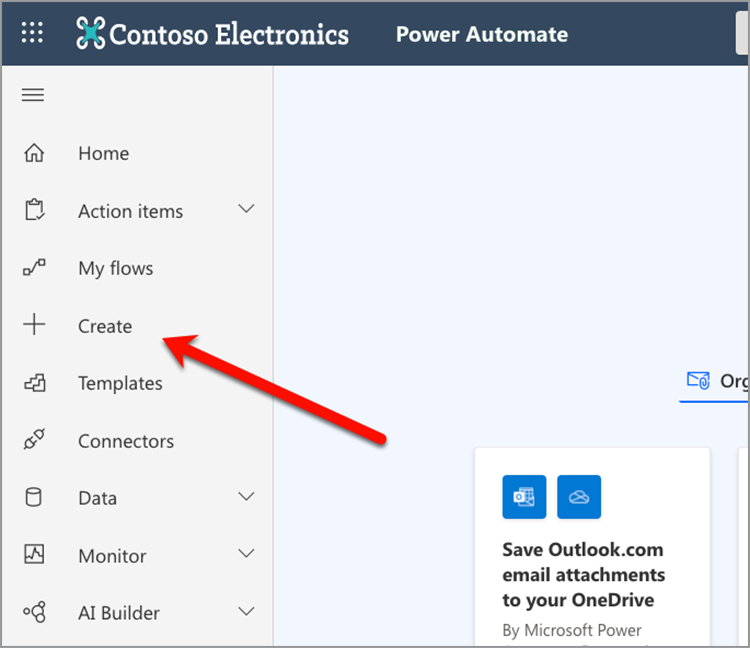

1. 選擇&#x200B;**[!UICONTROL 即時流]**。
1. 給你的流取個名字。
1. 在&#x200B;*選擇如何觸發此流*&#x200B;下，選擇&#x200B;**[!UICONTROL 手動觸發流]**。
1. 選取「**[!UICONTROL 建立]**」。

### 獲取檔案的檔案內容

接下來，獲取示例檔案的檔案內容。

>[!PREREQUISITES]
>
>如果尚未將[示例檔案](assets/sample-assets.zip)上載到OneDrive，請解壓並上載它們。


1. 在[電源自動化](https://flow.microsoft.com/zh-tw/)中，選擇&#x200B;**[!UICONTROL +新步驟]**。
1. 在搜索欄中搜索&#x200B;*OneDrive*。
1. 通過選擇&#x200B;**[!UICONTROL OneDrive for Business]**&#x200B;或&#x200B;**[!UICONTROL OneDrive]**，選擇您的工作帳戶或個人OneDrive帳戶。
1. 在搜索欄中搜索&#x200B;*獲取檔案內容*。
1. 在&#x200B;**[!UICONTROL 檔案]**&#x200B;欄位中，選擇資料夾表徵圖以導航到OneDrive中的&#x200B;*WordDocument01.docx*&#x200B;檔案。

   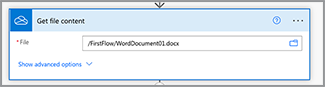

### 將檔案轉換為PDF

現在您擁有了檔案內容，可以將文檔轉換為PDF。

1. 在[電源自動化](https://flow.microsoft.com/zh-tw/)中，選擇&#x200B;**[!UICONTROL +新步驟]**。
1. 在搜索欄中搜索&#x200B;*Adobe PDF服務*。
1. 選擇&#x200B;**[!UICONTROL Adobe PDF服務]**。
1. 在搜索欄中搜索&#x200B;*將Word轉換為PDF*。
1. 在&#x200B;**[!UICONTROL 檔案名]**&#x200B;中，根據需要將檔案命名，但必須以&#x200B;*.docx*&#x200B;結束。 此擴展是將文檔從Word轉換為PDF所必需的。
1. 將游標置於&#x200B;**[!UICONTROL 檔案內容]**&#x200B;欄位中。
1. 使用&#x200B;**[!UICONTROL 動態內容]**&#x200B;面板，選擇&#x200B;**[!UICONTROL 檔案內容]**。

   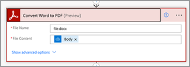

### 將檔案保存到OneDrive

文檔生成後，將檔案保存回OneDrive。

1. 在[Microsoft電源自動化](https://flow.microsoft.com/zh-tw/)中，選擇&#x200B;**[!UICONTROL +新步驟]**。
1. 在搜索欄中搜索&#x200B;*OneDrive*。
1. 通過選擇&#x200B;**[!UICONTROL OneDrive for Business]**&#x200B;或&#x200B;**[!UICONTROL OneDrive]**，選擇您的工作帳戶或個人OneDrive帳戶。
1. 在搜索欄中搜索&#x200B;*獲取檔案內容*。
1. 在搜索欄中搜索&#x200B;*建立檔案*。
1. 選擇&#x200B;**[!UICONTROL 建立檔案]**。
1. 在&#x200B;**[!UICONTROL 資料夾路徑]**&#x200B;欄位中，選擇資料夾表徵圖以指定將檔案保存到OneDrive中的位置。
1. 在&#x200B;**[!UICONTROL 檔案名]**&#x200B;中，根據需要將檔案命名，但必須以&#x200B;*.docx*&#x200B;結束。 此擴展是將文檔從Word轉換為PDF所必需的。
1. 在&#x200B;**[!UICONTROL 檔案內容]**&#x200B;欄位中，使用&#x200B;**[!UICONTROL 動態內容]**&#x200B;面板插入PDF檔案內容變數。

### 嘗試流

1. 在左上角，選擇&#x200B;**[!UICONTROL 未命名]**&#x200B;以更名流。
1. 選取「**[!UICONTROL 儲存]**」。
1. 選擇&#x200B;**[!UICONTROL 測試]**。
1. 選擇&#x200B;**[!UICONTROL 手動]**，然後選擇&#x200B;**[!UICONTROL 保存和測試]**。
1. 選取「**[!UICONTROL 繼續]**」。
1. 選擇&#x200B;**[!UICONTROL 運行流]**。

在OneDrive資料夾中，您現在應該看到已轉換的PDF。

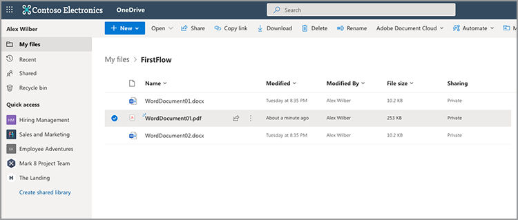

## 第2部分：根據模板生成動態文檔

此下一部分在第1部分上構建，並使用&#x200B;*從Word*&#x200B;模板生成文檔以動態地將資料合併到文檔中。

### 審閱文檔模板

從OneDrive中的示例檔案中開啟&#x200B;*WordDocument02_.docx*。 Word文檔包含多個不同的文本標籤，這些標籤表示資料填充到文檔中的位置。

### 添加要觸發的參數

要將動態資料推入文檔，需要為觸發器建立幾個參數以提示輸入值。

1. 編輯流時，選擇&#x200B;**[!UICONTROL 手動觸發流]**&#x200B;以展開操作。
1. 選擇&#x200B;**[!UICONTROL 添加輸入]**。
1. 選擇&#x200B;**[!UICONTROL 文本]**。
1. 將欄位命名為&#x200B;*名字*。

重複步驟2-4以添加以下欄位：

* 姓氏
* 薪金

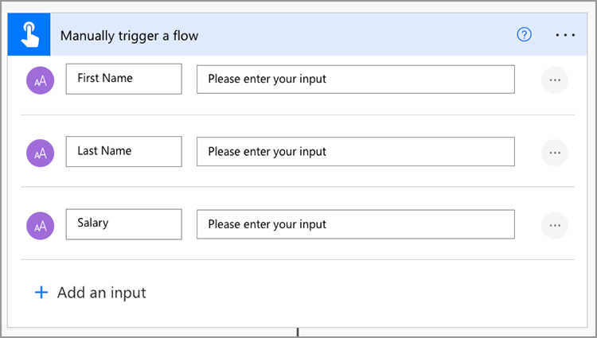

### 獲取模板的檔案內容

要生成文檔，首先需要獲取Word模板的檔案內容。

1. 在Power Automate中，選擇+ **[!UICONTROL 新步驟]**。
1. 在搜索欄中搜索&#x200B;*OneDrive*。
1. 通過選擇&#x200B;**[!UICONTROL OneDrive for Business]**&#x200B;或&#x200B;**[!UICONTROL OneDrive]**，選擇您的工作帳戶或個人OneDrive帳戶。
1. 在搜索欄中搜索&#x200B;*獲取檔案內容*。
1. 在&#x200B;**[!UICONTROL 檔案]**&#x200B;欄位中，選擇資料夾表徵圖以導航到OneDrive中的&#x200B;*WordDocument02.docx*&#x200B;檔案。

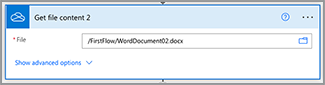

### 從模板生成文檔

1. 在Power Automate中，選擇&#x200B;**[!UICONTROL +新步驟]**。
1. 在搜索欄中搜索&#x200B;*Adobe PDF服務*。
1. 選擇&#x200B;**[!UICONTROL Adobe PDF服務]**。
1. 選擇&#x200B;**[!UICONTROL 從Word模板生成文檔]**&#x200B;操作。
1. 在&#x200B;**[!UICONTROL 模板檔案名]**&#x200B;欄位中，根據需要將檔案命名，但必須以&#x200B;*.docx*&#x200B;結束。

#### 合併資料

使用&#x200B;*從Word模板生成文檔*&#x200B;操作，您可以使用動態內容從流中先前的任何不同變數將資料合併到文檔中。

將下面的JSON資料複製到&#x200B;**合併資料**&#x200B;欄位：

```
{
    "FirstName": "",
    "LastName": "",
    "Salary": ""
}
```

1. 將游標置於&#x200B;*FirstName*&#x200B;值的兩個引號之間。
1. 使用&#x200B;**[!UICONTROL 動態內容]**&#x200B;面板，從「手動」觸發流操作中插入&#x200B;*名稱*&#x200B;值。

   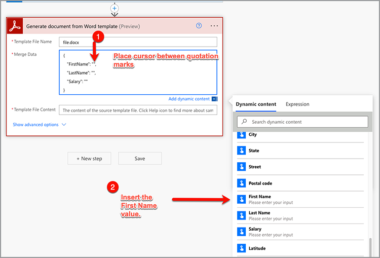中生成帶有資料標籤的文檔

1. 對&#x200B;**[!UICONTROL LastName]**&#x200B;和&#x200B;**[!UICONTROL 薪金]**&#x200B;欄位重複步驟7-8。
1. 在&#x200B;**[!UICONTROL 模板檔案內容]**&#x200B;欄位中，使用&#x200B;**[!UICONTROL 動態內容]**&#x200B;面板從&#x200B;**[!UICONTROL 獲取檔案內容]**&#x200B;步驟插入&#x200B;*檔案內容*&#x200B;值。

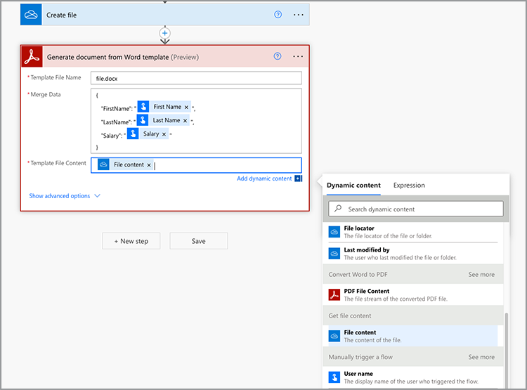

>[!TIP]
>
>*從Word模板生成文檔*&#x200B;操作使用Adobe文檔生成API。 如果要瞭解有關如何建立模板的更多資訊，請提供以下幾種資源：
>
>* [瞭解有關Adobe文檔生成的詳細資訊](https://developer.adobe.com/document-services/apis/doc-generation/)
>* [MicrosoftWord的Adobe文檔生成標誌符](https://appsource.microsoft.com/en-US/product/office/WA200002654)
>* [Adobe文檔生成API文檔](https://developer.adobe.com/document-services/docs/overview/document-generation-api/)

### 將檔案保存到OneDrive

生成文檔後，可以將檔案保存回OneDrive。

1. 在Power Automate中，選擇&#x200B;**+ [!UICONTROL 新步驟]**。
1. 在搜索欄中搜索&#x200B;*OneDrive*。
1. 通過選擇&#x200B;**[!UICONTROL OneDrive for Business]**&#x200B;或&#x200B;**[!UICONTROL OneDrive]**，選擇您的工作帳戶或個人OneDrive帳戶。
1. 在搜索欄中搜索&#x200B;*建立檔案*。
1. 選擇&#x200B;**[!UICONTROL 建立檔案]**。
1. 在&#x200B;**[!UICONTROL 資料夾路徑]**&#x200B;欄位中，選擇資料夾表徵圖以指定將檔案保存到OneDrive中的位置。
1. 在&#x200B;**[!UICONTROL 檔案名]**&#x200B;欄位中，設定檔案名。 由於輸出是PDF，因此您的檔案名必須以.pdf副檔名結尾。
1. 使用&#x200B;**[!UICONTROL 動態內容]**&#x200B;面板將PDF檔案內容變數插入&#x200B;**[!UICONTROL 檔案內容]**&#x200B;欄位。

### 嘗試流

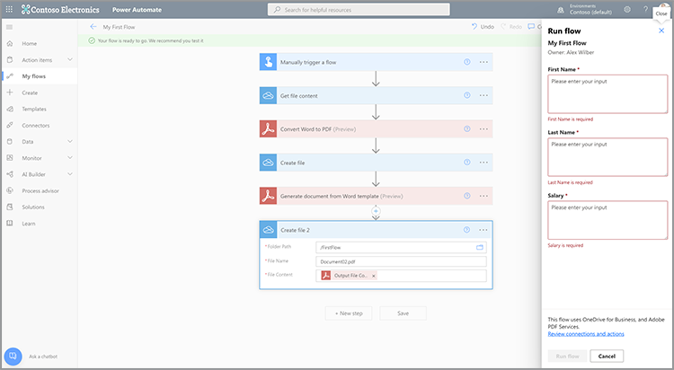

1. 選取「**[!UICONTROL 儲存]**」。
1. 選擇&#x200B;**[!UICONTROL 測試]**。
1. 選擇&#x200B;**[!UICONTROL 手動]**，然後選擇&#x200B;**[!UICONTROL 保存和測試]**。
1. 選取「**[!UICONTROL 繼續]**」。
1. 輸入&#x200B;*名字*、*姓氏*&#x200B;和&#x200B;*薪金*&#x200B;的值。
1. 選擇&#x200B;**[!UICONTROL 運行流]**。

在OneDrive資料夾中，您現在會看到從Word文檔生成的PDF。 在OneDrive中開啟PDF文檔時，您會看到資料被合併到文本標籤位置。


## 第三部分：將PDF合併為一

現在您已生成並將Word文檔轉換為PDF，接下來的部分是將多個PDF文檔組合在一起。

>[!NOTE]
>
>在以前的操作中，您將文檔的副本另存為OneDrive中的檔案。 為了使用合併PDF等工具，您不需要將檔案保存到OneDrive。 相反，您可以將輸出從一個操作直接傳遞到下一個操作，這比每次操作後保存到OneDrive要好。 但為了演示，您正將這些檔案保存到OneDrive。

### 添加合併PDF步驟

1. 編輯流時，選擇&#x200B;**[!UICONTROL +下一步]**&#x200B;以在流的末尾添加操作。
1. 在搜索欄中搜索&#x200B;*Adobe PDF服務*。
1. 選擇&#x200B;**[!UICONTROL Adobe PDF服務]**。
1. 選擇&#x200B;**[!UICONTROL 合併PDF]**&#x200B;操作。
1. 在&#x200B;**[!UICONTROL 合併PDF檔案名]**&#x200B;欄位中，輸入所需的檔案名（即&#x200B;*CombinedDocument.pdf*）。
1. 在&#x200B;**[!UICONTROL 檔案內容–1]**&#x200B;欄位中，使用&#x200B;**[!UICONTROL 動態內容]**&#x200B;面板將&#x200B;*PDF檔案內容*&#x200B;值從&#x200B;**[!UICONTROL 將Word轉換為PDF]**&#x200B;步驟插入。
1. 若要添加下一個文檔，請選擇&#x200B;**+ [!UICONTROL 添加新項]**。
1. 在&#x200B;**[!UICONTROL 檔案內容 — 2]**&#x200B;欄位中，使用&#x200B;**[!UICONTROL 動態內容]**&#x200B;面板從&#x200B;**[!UICONTROL 從Word模板生成文檔]**&#x200B;步驟插入&#x200B;*輸出檔案內容*&#x200B;值。

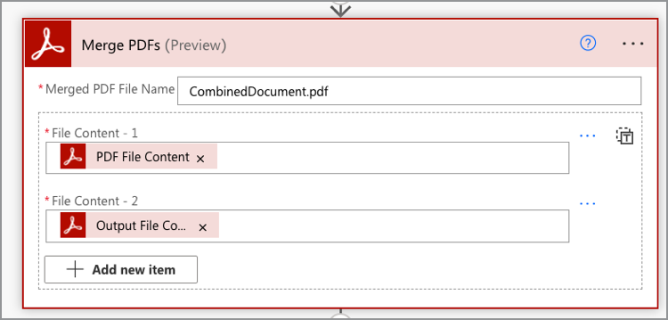

### 將合併的PDF保存到OneDrive

合併文檔後，您可以將文檔保存回OneDrive。

1. 在Power Automate中，選擇&#x200B;**+ [!UICONTROL 新步驟]**。
1. 在搜索欄中搜索&#x200B;*OneDrive*。
1. 通過選擇&#x200B;**[!UICONTROL OneDrive for Business]**&#x200B;或&#x200B;**[!UICONTROL OneDrive]**，選擇您的工作帳戶或個人OneDrive帳戶。
1. 在搜索欄中搜索&#x200B;*建立檔案*。
1. 選擇&#x200B;**[!UICONTROL 建立檔案]**。
1. 在&#x200B;**[!UICONTROL 資料夾路徑]**&#x200B;欄位中，選擇資料夾表徵圖以指定將檔案保存到OneDrive中的位置。
1. 在&#x200B;**[!UICONTROL 檔案名]**&#x200B;欄位中，設定檔案名。 由於輸出是PDF，因此您的檔案名必須以.pdf結尾。
1. 在&#x200B;**[!UICONTROL 檔案內容]**&#x200B;欄位中，使用&#x200B;**[!UICONTROL 動態內容]**&#x200B;面板從&#x200B;*合併PDF*&#x200B;步驟插入&#x200B;**[!UICONTROL PDF檔案內容]**&#x200B;值。

   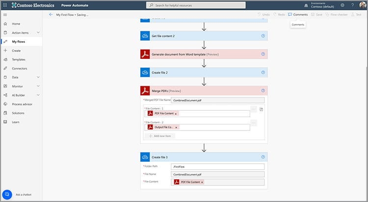

### 嘗試流

1. 選取「**[!UICONTROL 儲存]**」。
1. 選擇&#x200B;**[!UICONTROL 測試]**。
1. 選擇&#x200B;**[!UICONTROL 手動]**，然後選擇&#x200B;**[!UICONTROL 保存和測試]**。
1. 選取「**[!UICONTROL 繼續]**」。
1. 輸入&#x200B;*名字*、*姓氏*&#x200B;和&#x200B;*薪金*&#x200B;的值。
1. 選擇&#x200B;**[!UICONTROL 運行流]**。

在OneDrive資料夾中，您會看到包含第一和第二文檔頁面的組合PDF。

## 第4部分：ProtectPDF檔案

生成文檔後，您可以在保存到OneDrive之前包括額外的步驟，以保護文檔不被編輯。

### 保護 PDF

1. 在Power Automate中編輯流時，在&#x200B;**合併PDF**&#x200B;操作和&#x200B;**[!UICONTROL 建立檔案3]**&#x200B;操作之間選擇&#x200B;**[!UICONTROL +]**。

   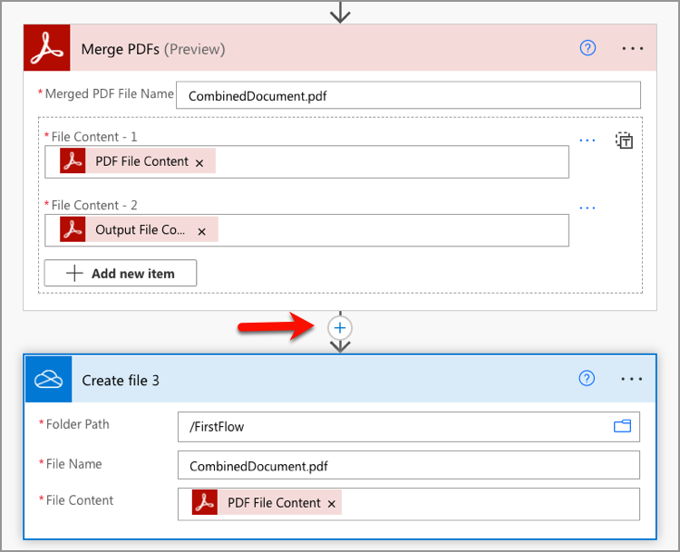

1. 選擇&#x200B;**[!UICONTROL 添加操作]**。
1. 在搜索欄中搜索&#x200B;*Adobe PDF服務*。
1. 選擇&#x200B;**[!UICONTROL Adobe PDF服務]**。
1. 從查看&#x200B;**[!UICONTROL 操作中選擇]** ProtectPDF。
1. 在&#x200B;**[!UICONTROL 檔案名]**&#x200B;欄位中，將名稱設定為所需名稱，只要該名稱以.pdf副檔名結尾。
1. 將&#x200B;**[!UICONTROL 密碼]**&#x200B;欄位設定為您指定的密碼以開啟文檔。
1. 在&#x200B;**[!UICONTROL 檔案內容]**&#x200B;欄位中，使用&#x200B;**[!UICONTROL 動態內容]**&#x200B;面板從&#x200B;*合併PDF*&#x200B;步驟插入&#x200B;**[!UICONTROL PDF檔案內容]**&#x200B;值。

### 將保存更新為OneDrive

文檔受保護後，可以將檔案保存回OneDrive。 在此示例中，您正在使用新的&#x200B;**檔案內容**&#x200B;值更新預先存在的&#x200B;*建立檔案3*&#x200B;操作。

1. 在&#x200B;**[!UICONTROL 建立檔案3]**&#x200B;操作的&#x200B;**[!UICONTROL 檔案內容]**&#x200B;欄位中選擇游標。
1. 使用&#x200B;**[!UICONTROL 動態內容]**&#x200B;面板從查看&#x200B;*步驟中插入* ProtectPDF中的&#x200B;**PDF檔案內容**&#x200B;值。

### 嘗試流

1. 選取「**[!UICONTROL 儲存]**」。
1. 選擇&#x200B;**[!UICONTROL 測試]**。
1. 選擇&#x200B;**[!UICONTROL 手動]**，然後選擇&#x200B;**[!UICONTROL 保存和測試]**。
1. 選取「**[!UICONTROL 繼續]**」。
1. 輸入&#x200B;*名字*、*姓氏*&#x200B;和&#x200B;*薪金*&#x200B;的值。
1. 選擇&#x200B;**[!UICONTROL 運行流]**。

在OneDrive資料夾中，您會看到組合PDF，它現在會提示您輸入密碼以查看文檔。

## 後續步驟

在本教程中，您將Word文檔轉換為PDF，根據資料生成文檔，合併文檔，並使用密碼進行保護。 要瞭解更多資訊，請瀏覽Adobe PDFPower Automet中的MicrosoftServices連接器中提供的其他一些操作：

* 查看MicrosoftPower Automet中提供的預建立模板。
* 從「Adobe技術部落格」上的[文章](https://medium.com/adobetech/tagged/microsoft-power-automate)中瞭解。
* 查看[文檔](https://developer.adobe.com/document-services/docs/overview/document-generation-api/)以獲取Adobe文檔生成API。
