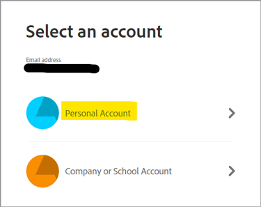

# 使用PDF服務API和Node.js在幾分鐘內從HTML或MS Office建立PDF


新的Adobe PDF服務API為開發人員提供了自由選擇範圍，可在多種功能強大的PDF處理服務中進行選擇，以滿足複雜業務工作流的需要，使文檔工作流數字化從未像現在這樣容易。 借助這些易於使用的基於雲的Web服務，可以簡化複雜的體系結構、實施策略和技術升級。

在PDF服務API中，有幾種可用的服務可建立和操作PDF，或從PDF導出到MS Office和其他格式。

* 從靜態或動態PDF、MS Word、PowerPoint、Excel等建立HTML檔案
* Export PDF到MS Word、PowerPoint、Excel等
* OCR識別PDF檔案中的文本並啟用文檔搜索
* ProtectPDF開啟文檔時使用密碼
* 將PDF頁或PDF文檔合併為單個PDF
* 壓縮PDF，以減少通過電子郵件或線上共用的大小
* 線性化以優化PDF以在Web上快速查看
* 使用插入、替換、重新排序、刪除和旋轉服務來組織PDF頁

開發人員只需幾分鐘就可以開始工作，隨時可以運行為訪問所有可用Web服務而提供的示例檔案。 這是如何開始的。

## 獲取憑據並下載示例檔案

第一步是獲取憑據（API密鑰）以解鎖使用。 [在此處註冊免費試用版](https://www.adobe.com/go/dcsdks_credentials)，然後按一下「開始」以建立新憑據。


選擇「個人帳戶」註冊免費試用非常重要：



在下一步中，您將選擇PDF服務API服務，然後為憑據添加名稱和說明。

此時會出現「建立個性化代碼示例」複選框。 選擇此選項可將新憑據自動添加到示例檔案中，跳過手動步驟。

接下來，選擇Node.js作為接收Node.js特定示例的語言，然後按一下「建立憑據」按鈕。


您將收到一個名為PDFToolsSDK-Node.jsSamples.zip的.zip檔案下載，該檔案可保存到您的本地檔案系統。

## 將憑據添加到代碼示例

如果選擇「建立個性化代碼示例」選項，則不必手動將客戶端ID添加到代碼示例檔案，並可以跳過下一步，直接轉到下面的「運行代碼示例」部分。

如果未選擇「建立個性化代碼示例」選項，則必須從Adobe.io控制台複製客戶端ID（API密鑰）:


解壓縮PDFToolsSDK-Node.jsSamples.zip的內容。

轉到adobe-dc-pdf-tools-sdk-node-samples資料夾下的根目錄。

使用任何文本編輯器或IDE開啟pdftools-api-credentials.json。

將憑據貼上到代碼中客戶端ID的欄位中：

```javascript
{
 "client_credentials": {
  "client_id": "abcdefghijklmnopqrstuvwxyz",
```

保存檔案，然後繼續執行下一步以運行代碼示例。

## 運行第一個代碼示例

使用命令提示符，轉到adobe-dc-pdf-tools-sdk-node-samples資料夾下的根目錄。

鍵入npm install:

C:\Temp\PDFToolsAPI\adobe-dc-pdf-tools-sdk-node-samples>npm安裝

現在，您已準備好運行示例檔案！

對於第一個示例，請建立PDF:

仍在命令提示符下，使用以下命令運行createPDF示例：

C:\Temp\PDFToolsAPI\adobe-dc-pdf-tools-sdk-node-samples>節點src/createpdf/create-pdf-from-docx.js

輸出示例：


您的PDF將在輸出中指定的位置建立，預設為pdfServicesSdkResult目錄。

## 資源和後續步驟

* 有關其他幫助和支援，請訪問Adobe[[!DNL Acrobat Services] APIs](https://community.adobe.com/t5/document-cloud-sdk/bd-p/Document-Cloud-SDK?page=1&sort=latest_replies&filter=all)社區論壇

PDF服務API [文檔](https://www.adobe.com/go/pdftoolsapi_doc)

* [FAQ](https://community.adobe.com/t5/contentarchivals/contentarchivedpage/message-uid/10726197)以瞭解PDF服務API問題

* [請與我們聯繫](https://www.adobe.com/go/pdftoolsapi_requestform)以瞭解有關許可和定價的問題

* 相關文章：
  [新PDF服務API為文檔工作流提供了更多功能](https://community.adobe.com/t5/acrobat-services-api-discussions/new-pdf-tools-api-brings-more-capabilities-for-document-services/m-p/11294170)

  [&#x200B; [!DNL Adobe Acrobat Services]的7月版：PDF嵌入和PDF服務](https://medium.com/adobetech/july-release-of-adobe-document-services-pdf-embed-and-pdf-tools-17211bf7776d)

