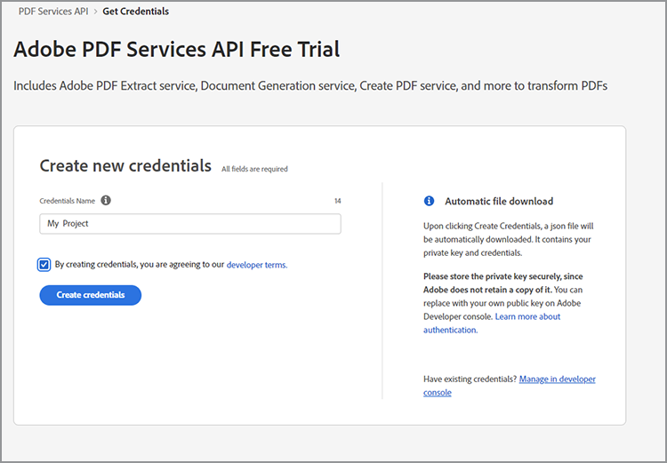
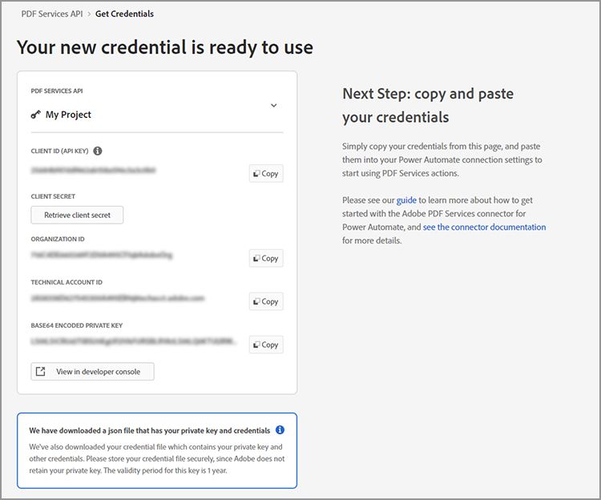
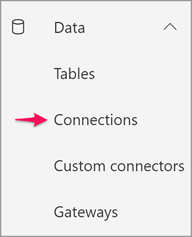
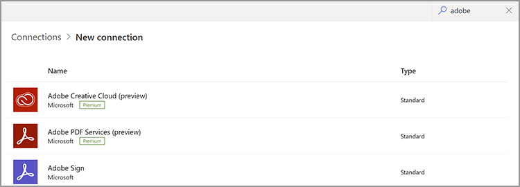
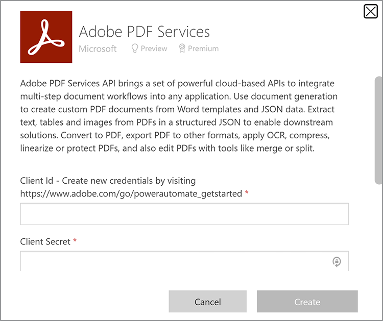
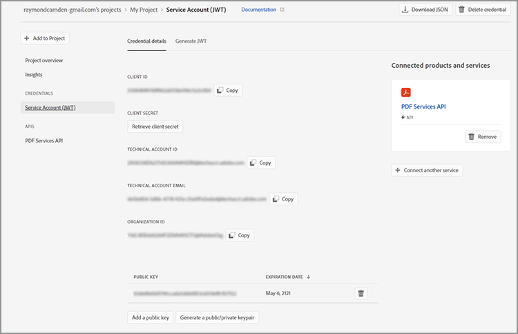
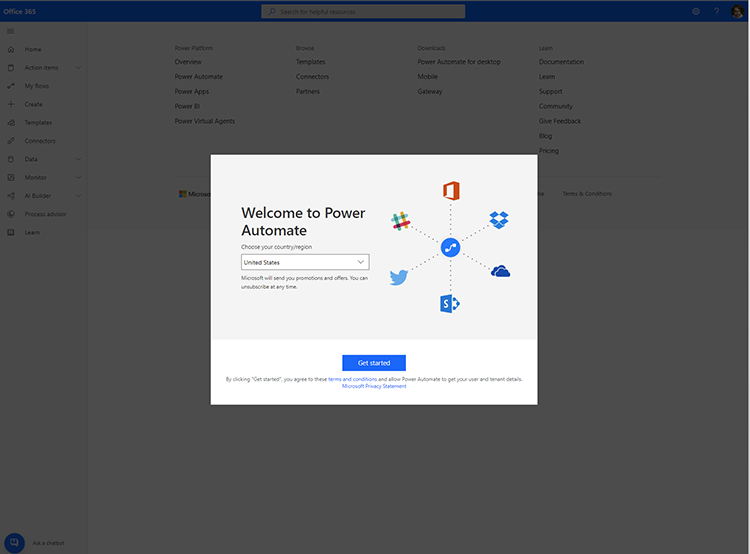
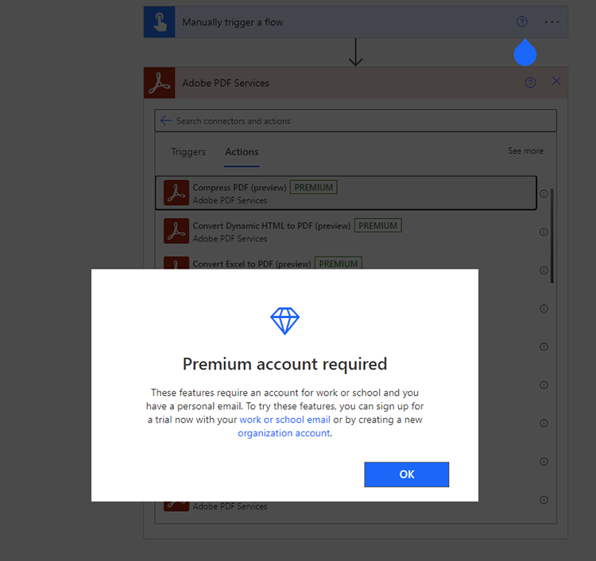

# 獲取MicrosoftPower Automate的憑據

[Microsoft電源自動化](https://powerautomate.microsoft.com/)為公民開發人員和開發人員提供了一種強大的方法，可建立功能強大的自動化流程，以改進其業務，而無需編寫代碼。 [Adobe PDF服務](https://us.flow.microsoft.com/en-us/connectors/shared_adobepdftools/adobe-pdf-services/)連接器作為[[!DNL Adobe Acrobat Services]](https://developer.adobe.com/document-services)的一部分，允許用戶執行MicrosoftPower Automate中Adobe PDF服務API中的任何可用操作。

在本教程中，瞭解如何獲取憑據以開始使用或試用Adobe PDF服務。 根據您是試用用戶還是現有客戶，本教程將介紹獲得憑據的正確步驟。

## MicrosoftPower Automate用戶如何開始使用Adobe PDF服務連接器？

現有的MicrosoftPower Automate用戶可以[獲取Adobe PDF服務的試用憑據](https://www.adobe.com/go/powerautomate_getstarted_tw)。 上述連結是一個特殊的註冊連結，專門為MicrosoftPower Automet用戶提供幫助。


>[!IMPORTANT]
> 如果您登錄進行試用，則必須使用Adobe ID，而不是Enterprise ID。 如果您不是Adobe PDF服務API的當前訂閱者，並嘗試使用您的Enterprise ID登錄，則可能會出現權限錯誤，因為您的企業沒有權利使用Adobe PDF服務API。 因此，建議您使用免費的個人Adobe ID。
>

1. 登錄後，系統將提示您選擇新憑據的名稱。 輸入&#x200B;*憑據名稱*。
1. 選中複選框以同意開發人員條款。
1. 選擇&#x200B;**[!UICONTROL 建立憑據]**。

   

這些憑據包含五個不同的值：

* 用戶端 ID (API 金鑰)
* 用戶端密碼
* 組織 ID
* 技術帳戶 ID
* Base64（編碼的私鑰）



包含所有這些值的JSON檔案也會自動下載到您的系統。 此檔案名為`pdfservices-api-pa-credentials.json`，如下所示：

```json
{
 "client_id": "client id value",
 "client_secret": "client secret value",
 "organization_id": "organized id value",
 "account_id": "account id value",
 "base64_encoded_private_key": "base64 version of the private key"
}
```

將此檔案儲存在安全位置，因為無法再次獲取私鑰的副本。

### 在MicrosoftPower Automet中添加連接

現在，您已擁有您的憑據，可以開始在MicrosoftPower Automate流中使用這些憑據。

1. 在提要欄菜單中，開啟&#x200B;**[!UICONTROL 資料]**&#x200B;菜單並選擇&#x200B;**連接**:

   

1. 選擇&#x200B;**+ [!UICONTROL 新連接]**。

1. 下一螢幕顯示可能的連接類型清單。 在右上角，輸入「adobe」以篩選選項：

   

1. 選擇&#x200B;**[!UICONTROL Adobe PDF服務（預覽）]**。
1. 在「模式」窗口中，輸入先前生成的所有五個值。 完成時選擇&#x200B;**[!UICONTROL 建立]**。

   

您現在已準備好在MicrosoftPower Automet中使用Adobe PDF服務。

### 建立憑據後訪問憑據

如果已建立憑據並放錯了下載的憑據，則可以在[Adobe Developer Console](https://developer.adobe.com/console)中再次檢索這些憑據。

1. 登錄到[Adobe Developer Console](https://developer.adobe.com/console)後，首先查找您的項目並選擇它。
1. 在&#x200B;*憑據*&#x200B;下的左側菜單中，選擇&#x200B;**服務帳戶(JWT)**:

   

1. 請注意此處顯示的五個值： *客戶端ID*、*客戶端密碼*、*技術帳戶ID*、*技術帳戶電子郵件*&#x200B;和&#x200B;*組織ID*。

很遺憾，您無法下載以前的私鑰，但可以使用「生成公共/私有密鑰對」按鈕建立新的私鑰。

## 使用現有Adobe PDF服務憑據

如果您有從[!DNL Adobe Acrobat Services]網站生成的現有Adobe PDF服務API憑據，則可以將其與MicrosoftPower Automate一起使用。 如果您在註冊時下載了SDK，則您的現有憑據以JSON檔案的形式出現，該檔案很可能名為`pdfservices-api-credentials.json`。 該JSON檔案包含建立連接憑據時所需的五個鍵。 將每個值從JSON檔案複製到相應的連接欄位中。

您的私鑰值來自名為`private.key`的第二個檔案。

也可以從Adobe Developer Console中獲取上述值。

## [!DNL Adobe Acrobat Services]個用戶如何開始與MicrosoftPower Automate協作？

要開始使用Power Automate，請首先轉到<https://powerautomate.microsoft.com>，然後使用「開始免費」按鈕。 如果你沒有Microsoft賬戶，你就得開一個。 登錄後，將顯示Power Automate儀表板。



如本教程開始部分所述，建立新流，添加步驟，並查找Adobe PDF服務。 選擇一個操作，您可能會收到要求提供高級帳戶的警告。



如上圖所示，您可以切換到工作帳戶或設定新的組織帳戶。 一旦有，您就可以添加「Adobe PDF服務」操作。

有關使用[!DNL Adobe Acrobat Services]建立第一個Microsoft電源自動化流的更深入瞭解，請參閱[在Microsoft電源自動化中建立第一個工作流](https://experienceleague.adobe.com/zh-hant/docs/acrobat-services-learn/tutorials/pdfservices/create-workflow-power-automate)。

## 其他資源

要幫助您獲得更多幫助，請列出其他資源：

* 首先是Adobe PDF服務Power Automate文檔： <https://docs.microsoft.com/en-us/connectors/adobepdftools/>。 這些資源補充了您在此所學到的知識。
* 需要例子嗎？ 您可以找到大量[Power Automate模板](https://powerautomate.microsoft.com/en-us/connectors/details/shared_adobepdftools/adobe-pdf-services/)演示PDF服務。
* 我們的即時視頻內容[紙片剪輯](https://www.youtube.com/playlist?list=PLcVEYUqU7VRe4sT-Bf8flvRz1XXUyGmtF)還包含演示Power Automet用法的視頻。
* [Adobe技術部落格](https://medium.com/adobetech/tagged/microsoft-power-automate)有許多有關使用Power Automate的文章。
* 最後，請務必查閱核心[PDF服務](https://developer.adobe.com/document-services/docs/overview/)文檔。
