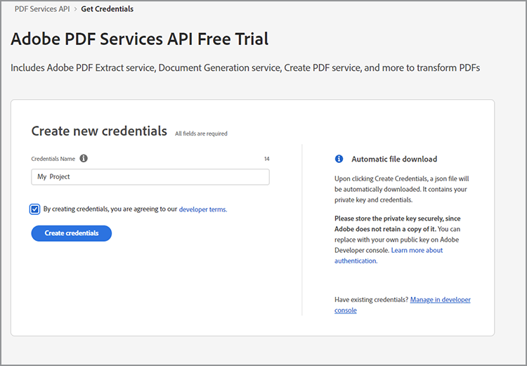
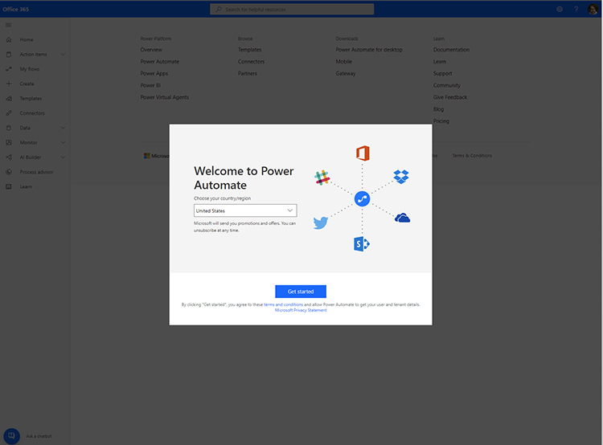

# 取得 Microsoft Power Automate 認證

[Microsoft Power Automate](https://powerautomate.microsoft.com/) 為民眾開發人員和開發人員提供了一種強大的方式，可以建立強大的自動化流程，無需編寫程式代碼即可改善業務。 [Adobe PDF Services](https://us.flow.microsoft.com/en-us/connectors/shared_adobepdftools/adobe-pdf-services/) 連接器 [[!DNL Adobe Acrobat Services]](https://developer.adobe.com/document-services)則允許使用者在 Microsoft Power Automate 內執行 Adobe PDF Services API 中可用的任何動作。

在此教學課程中，瞭解如何取得認證，以開始使用或試用 Adobe PDF Services。 視您是試用版使用者還是現有客戶而定，此教學課程會逐步完成取得認證的正確步驟。

## Microsoft Power Automate 使用者如何開始使用 Adobe PDF Services 連接器？

現有的 Microsoft Power Automate 使用者可以 [取得 Adobe PDF Services 的試用認證](https://www.adobe.com/go/powerautomate_getstarted_tw) 。 上方的連結是特殊的註冊連結，可協助進行此程式，特別為 Microsoft Power Automate 使用者提供協助。


>[!IMPORTANT]
> 如果您要登入試用版，則必須使用Adobe ID而非Enterprise ID。 如果您目前不是 Adobe PDF Services API的訂閱者，並嘗試使用您的Enterprise ID登入，您可能會收到許可權錯誤，因為您的企業沒有許可權在 API 使用 Adobe PDF Services。 因此，建議您使用免費的個人Adobe ID。
>

1. 登入后，系統會提示您選取新認證的名稱。 輸入您的 *認證名稱*。
1. 選取複選框以同意開發人員條款。
1. 選取「 **[!UICONTROL 建立認證」]**。

   

這些認證包含五個不同的值：

* 用戶端 ID (API 金鑰)
* 用戶端密碼
* 組織 ID
* 技術帳戶 ID
* Base64 （編碼的私鑰）


包含所有這些值的 JSON 檔案也會自動下載到您的系統。 此檔案名稱 `pdfservices-api-pa-credentials.json` 與外觀如下：

```json
{
 "client_id": "client id value",
 "client_secret": "client secret value",
 "organization_id": "organized id value",
 "account_id": "account id value",
 "base64_encoded_private_key": "base64 version of the private key"
}
```

將此檔案儲存在安全的位置，因為無法再次取得私鑰副本。

### 在 Microsoft Power Automate 中新增連線

現在您已經擁有憑證，就可以開始在 Microsoft Power Automate 流程中使用。

1. 在側邊欄選單中，開啟「 **[!UICONTROL 數據」]** 功能表並選取「 **連線」**：

   

1. 選取 **+ [!UICONTROL 新連線]**。

1. 下一個畫面會顯示可能的連線類型清單。 在右上角輸入「adobe」以篩選選項：

   

1. 選 **[!UICONTROL 取「Adobe PDF服務 （預覽）」]**。
1. 在模組視窗中，輸入您先前產生的所有五個值。 完成時，請選取「 **[!UICONTROL 建立]** 」。

   

您現在已準備好在 Microsoft Power Automate 中使用 Adobe PDF Services。

### 建立認證后即可存取

如果您已建立認證且錯置下載的認證，您可以在 Adobe Developer Console 中 [再次擷取憑證](https://developer.adobe.com/console)。

1. 登入 [Adobe Developer Console](https://developer.adobe.com/console) 後，先找到專案並選取專案。
1. 在「認證」下&#x200B;*方的左側選單中，選取「**服務帳戶 （JWT）」**：*

   

1. 請注意此處顯示的五個值： *用戶端 ID*、 *用戶端密碼*、 *技術帳戶 ID*、 *技術帳戶電子郵件*&#x200B;和 *組織 ID*。

很遺憾，您無法下載上一個私鑰，但您可以使用「產生公用/私人金鑰」按鈕來建立新的密鑰。

## 使用現有的「Adobe PDF服務」認證

如果您有從 [!DNL Adobe Acrobat Services] 網站產生的現有 Adobe PDF Services API憑證，則可以將其與 Microsoft Power Automate 一起使用。 如果您在註冊時下載了 SDK，現有的憑證會以最有可能命名的 JSON 檔案形式出現`pdfservices-api-credentials.json`。 該 JSON 檔案包含建立連線認證時所需的五個金鑰。 將 JSON 檔案的每個值複製到對應的連線欄位中。

您的私人金鑰值來自第二個命名的 `private.key`檔案。

您也可以如上所述，從 Adobe Developer Console 取得值。

## 使用者如何 [!DNL Adobe Acrobat Services] 開始使用 Microsoft Power Automate？

若要開始使用Power Automate，請先前往 <https://powerautomate.microsoft.com> 並使用「開始免費」按鈕。 如果您沒有Microsoft帳戶，則必須建立一個帳戶。 登入后，系統會顯示Power Automate儀錶板。



如本教學課程一開始所述，建立新流程、新增步驟，並尋找「Adobe PDF服務」。 選取動作，您可能會收到進階帳戶的警告。


如上方螢幕截圖所示，您可以切換到工作帳戶或設定新的組織帳戶。 擁有後，您就可以新增「Adobe PDF服務」動作。

如需深入瞭解如何建立第一個具備 Microsoft Power Automate 流程 [!DNL Adobe Acrobat Services]的功能，請參閱 [在 Microsoft Power Automate](https://experienceleague.adobe.com/en/docs/acrobat-services-learn/tutorials/pdfservices/create-workflow-power-automate) 中建立您的第一個工作流程。

## 其他資源

為了協助您更多，以下是其他資源的清單：

* 首先是 Adobe PDF Services Power Automate 檔： <https://docs.microsoft.com/en-us/connectors/adobepdftools/>。 這些資源與您在這裡學到的知識相輔相成。
* 需要範例嗎？ 您可以找到多個 [示範 PDF 服務的 Power Automate 範本](https://powerautomate.microsoft.com/en-us/connectors/details/shared_adobepdftools/adobe-pdf-services/) 。
* 我們的實時視訊內容 [「剪紙片段」也包含展示Power Automate使用方式的](https://www.youtube.com/playlist?list=PLcVEYUqU7VRe4sT-Bf8flvRz1XXUyGmtF)影片。
* Adobe [技術部落格](https://medium.com/adobetech/tagged/microsoft-power-automate) 有許多關於使用 Power Automate 的文章。
* 最後，也請務必查閱核心 [PDF 服務](https://developer.adobe.com/document-services/docs/overview/) 檔。
