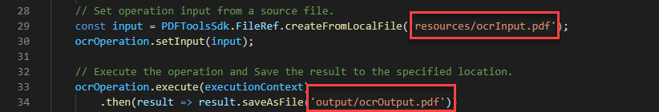

# 使用 Adobe PDF 服務 API 來進行 OCR PDF 檔案

利用 OCR（光學字元辨識），你可以解鎖掃描後的 PDF，提取文字並建立可搜尋的檔案。 利用我們強大的雲端 API，將 OCR 整合進任何文件工作流程，成為檔案歸檔、文字複製及建立可搜尋文件索引的完美解決方案。 從掃描的 PDF 資料庫建立可搜尋的檔案庫，解鎖重要資訊並節省時間，並以快速搜尋功能。 或者對上傳掃描的 PDF 套用 OCR，讓它們能編輯以便用於入職流程。

開發者只需幾分鐘即可開始使用提供的 OCR 範例檔案。

本教學將介紹如何使用Node.js、Java 和 .Net 語言的範例檔案，執行你的第一個 PDF Services API OCR 操作的基礎。

## 步驟一：建立你的憑證並設定環境

請使用以下入門教學建立您的 API 憑證、下載範例檔案並設定環境。

[開始使用 PDF Services API 與 Java](gettingstartedjava.md)

[開始使用 PDF Services API 與 .NET](gettingstartednet.md)

[如何開始使用 PDF 服務 API 與Node.js](createpdffromhtml.md)

## 請執行範例檔案中提供的 OCR 範例

我們的 OCR 服務預設支援英文地點，同時也支援德語、法語、丹麥語及 [其他語言](https://opensource.adobe.com/pdftools-sdk-docs/release/latest/howtos.html#ocr-with-explicit-language)。 預設是 en-us locale。

當你輸入包含特定地點的 OCR 選項時，方法也會接受「類型」參數，該參數有兩個選項：

* SEARCHABLE_IMAGE：在清理過程中修改原始影像（例如，deskew），然後在上方放置隱形文字圖層。 這種類型能去除不必要的雜訊，在某些情況下可能使文件更易閱讀。

* SEARCHABLE_IMAGE_EXACT：確保文字可搜尋且可選取。 這個選項會保留原始圖片，並在上面放置一個隱形的文字圖層。 建議用於需要最高原始影像真實度的機種。

**爪哇**

1. 開啟「命令提示字元」。

1. 將目錄改成你的範例程式碼目錄。

   例如，C：\Temp\PDFToolsAPI\adobe-dc-pdf-tools-sdk-java-samples>。

1. 執行以下指令：

   `mvn -f pom.xml exec:java -Dexec.mainClass=com.adobe.platform.operation.samples.ocrpdf.OcrPDF`

你的 PDF 會建立在 src/main/resources 目錄中。

**.Net**

1. 開啟「命令提示字元」。

1. 將目錄改成你的範例程式碼目錄。

   例如，C：\Temp\PDFToolsAPI\adobe-dc-pdf-tools-sdk-NetSamples

1. 再次將目錄切換到 OcrPDF 目錄。

1. 執行以下指令：

   `dotnet run OcrPDF.csproj`

你的 PDF 也會在同一個目錄中建立。

**Node.js**

1. 開啟「命令提示字元」。

1. 將目錄改成你的範例程式碼目錄。

   例如，C：\Temp\PDFToolsAPI\adobe-dc-pdf-tools-sdk-node-samples

1. 執行以下指令：

   `node src/ocr/ocr-pdf.js`

你的 PDF 會建立在輸出中指定的位置，預設是輸出目錄。

## 總結感想

透過這些簡單的範例檔案，你應該就有一個可以繼續發展的範例。 除了本教學中使用的 OCR 範例外，還有另一個使用先前討論的支援類型與區域選項進行 OCR 的範例。

接著你可以簡單地替換範例中的輸入和輸出檔案，使用自己的 PDF 來完成你自己的概念驗證。

## 資源與後續步驟

* 如需更多協助與支援，請造訪 Adobe [[!DNL Acrobat Services] API](https://community.adobe.com/t5/document-cloud-sdk/bd-p/Document-Cloud-SDK?page=1&sort=latest_replies&filter=all) 社群論壇

* PDF 服務 API [文件](https://www.adobe.com/go/pdftoolsapi_doc)

* [&#128279;](https://community.adobe.com/t5/contentarchivals/contentarchivedpage/message-uid/10726197) PDF 服務 API 常見問題

* [如有關於授權與價格的問題，歡迎聯絡我們](https://www.adobe.com/go/pdftoolsapi_requestform)
