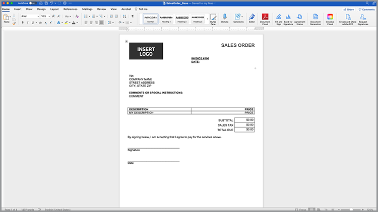
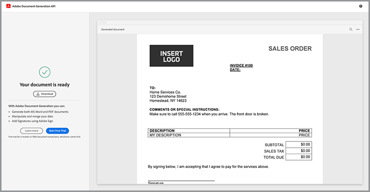
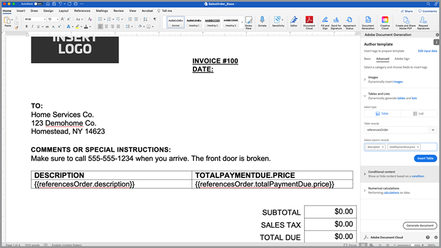
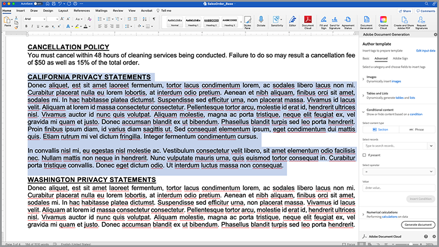

# 加速銷售流程


從白皮書到合約，整個購買旅程中需要大量檔。 在此教學課程中，瞭解如何 [[!DNL Adobe Acrobat Services] ](https://developer.adobe.com/document-services/) 整合整個旅程中的檔體驗，以協助加速銷售。

## 從資料產生合約和銷售訂單

根據特定標準，銷售合約、合約和其他檔差異很大。 例如，銷售合約可能僅包含以獨特範例為基礎的特定條款，例如位於特定國家/地區或狀態，或是合約中包含某些產品。 手動建立這些檔或維護許多不同的範本版本，可顯著提高與手動審核變更相關的法律費用。

[Adobe檔產生API ](https://developer.adobe.com/document-services/apis/doc-generation/) 可讓您從CRM或其他資料系統獲取資料，根據該資料動態產生銷售檔。

## 取得認證

首先，註冊免費Adobe PDF服務認證：

1. 流覽 [ 這裡 ](https://documentcloud.adobe.com/dc-integration-creation-app-cdn/main.html) 以註冊您的認證。
1. 使用您的Adobe ID登入。
1. 設定您的認證名稱 （例如「銷售合約示範」）。

   

1. 選擇下載範例程式碼的語言 （例如 Node.js）。
1. 核取「同意 **[!UICONTROL 開發人員條款」]** 。
1. 選取 **[!UICONTROL 「建立認證」]** 。檔案隨即下載至您的電腦，其中包含範例檔案、pdfservices-api-credentials.json 和 private.key 進行驗證。

   

1. 選 **[!UICONTROL 取「取得 Microsoft Word 增益集」]** ，或前往 [ AppSource ](https://appsource.microsoft.com/en-cy/product/office/WA200002654) 進行安裝。

   >[!NOTE]
   >
   >若要安裝 Word 增益集，您必須具備在 Microsoft 365 中安裝增益集的許可權。 如果您沒有許可權，請聯絡您的 Microsoft 365 管理員。

## 您的資料

如果您是從特定資料系統提取資料，則必須將該資料輸出為 JSON 資料，或者產生您自己的結構。 此案例會使用預先建立的範例資料集：

```
{
    "salesOrder": {
        "comment": "Make sure to call 555-555-1234 when you arrive. The front door is broken."
    },
    "company": {
        "name":"Home Services Co.",
        "address": {
            "city": "Homestead",
            "state": "NY",
            "zip": "14623",
            "streetAddress": "123 Demohome Street"
        }
    },
    "customer": {
        "address": {
            "city": "Seattle",
            "state": "WA",
            "zip": "98052",
            "streetAddress": "20341 Whitworth Institute 405 N. Whitworth"
        },
        "email": "mailto:jane-doe@xyz.edu",
        "jobTitle": "Professor",
        "name": "Jane Doe",
        "telephone": "(425) 123-4567",
        "url": "http://www.janedoe.com"
    },
    "tax": {
        "state":"WA",
        "rate": 0.08
    },
    "referencesOrder": [
        {
            "description": "Carpet Cleaning Service - 3BR 2BA",
            "totalPaymentDue": {
                "price": 359.54
            },
            "orderedItem": {
                "description": "Carpet Cleaning Service"
            }
        },
        {
            "description": "Home Cleaning Service - 3BR 2BA",
            "totalPaymentDue": {
                "price": 299.99
            },
            "orderedItem": {
                "description": "House Cleaning Service"
            }
        }
    ]
}
```

## 將基本磁碟區標新增至檔

本案例會使用可在此下載的 [ ](https://github.com/benvanderberg/adobe-document-generation-samples/blob/main/SalesOrder/Exercise/SalesOrder_Base.docx?raw=true) 「銷售訂單」檔。



1. 在 Microsoft Word 中開啟 *SalesOrder.docx* 範例檔。
1. 如果您已安裝「檔產生」外掛程式，請選 **[!UICONTROL 取功能區中的檔產生]** 。 如果您的功能區未顯示「檔產生」，請依照下列指示操作。
1. 選 **[!UICONTROL 取開始使用]** 。
1. 將上方寫入的 JSON 範例資料複製到 *JSON 資料* 欄位。

   

接著，導覽至「檔世代記錄器」面板，將標籤放入檔中。

1. 選取您要取代的文字 （例如 *「公司名稱」* ）。
1. 在「 *檔產生塔格」* 面板中，搜尋「名稱」。
1. 在標籤清單中，選取公司底下的名稱。
1. 選取「 **[!UICONTROL 插入文字」]** 。

   

   這個程式會放置一個叫做標籤的 {{company.name}} 標記，因為該標籤位於 JSON 中的路徑下方。

   ```
   {
   …
   "company": {
       "name":"Home Services Co.",
       …
   },
   …
   }
   ```

針對檔中的某些其他標籤重複這些動作，例如：「市集」、「城市」、「州立」、「ZIP」等。

## 預覽產生的檔

您可以直接在 Microsoft Word 中根據範例 JSON 資料預覽產生的檔。

1. 在「 *檔產生記錄器」* 面板中，選取「 **[!UICONTROL 產生檔」]** 。 第一次系統會提示您使用Adobe ID登入。 選 **[!UICONTROL 取「登入]** 」並填寫提示，以使用您的認證登入。

   

1. 選取「檢 **[!UICONTROL 視檔」]** 。

   

1. 瀏覽器視窗會隨即開啟，讓您預覽檔結果。

   

您可以在檔中看到已由原始範例資料資料取代的標籤。


## 將表格新增至範本

在下一個狀況中，將產品清單新增至檔中的表格。

1. 插入必須放置表格的游標。
1. 在「 *檔產生記錄器」* 面板中，選取「進 **[!UICONTROL 階」]** 。
1. 展開 **[!UICONTROL 表格和清單]** 。
1. 在「 *表格」記錄* 欄位中，選取 *參考排序* ，這是列出所有產品專案的陣列。
1. 在「選取欄記錄」欄位中，輸入以包含 *描述* 和 *totalPaymentDue.price* 欄位。
1. 選取 **[!UICONTROL 「插入」表格]** 。

   

編輯表格以如同您在 Microsoft Word 中的其他表格一樣，調整樣式、大小和其他參數。

## 新增數值計算

數位計算可讓您根據資料集合 （例如陣列） 計算總和和其他計算。 在此情況下，請新增欄位以計運算元資料。

1. 選取 *子檔案標題旁的 $0.00* 。
1. 在「 *[!UICONTROL 檔產生工具」面板中]* ，展開 **[!UICONTROL 數值計算]** 。
1. 在「選取計算類型」下 *[!UICONTROL 方，選擇&#x200B;**[!UICONTROL 「匯總」]**。]*
1. 在「選取類型」下 *[!UICONTROL 方，選擇「**[!UICONTROL 加總」]**。]*
1. 在「選取記錄」下 *[!UICONTROL 方，選擇&#x200B;**[!UICONTROL 「參考排序」]**。]*
1. 在「* [!UICONTROL  選取要執行匯總 ] 的專案」**下方，選擇 **[!UICONTROL totalPaymentsDue.price]** 。
1. 選取「 **[!UICONTROL 插入計算」]** 。

此程式會插入計算標籤，以提供值總和。 您可以使用 JSONata 計算進行更進階計算。 例如：

* 次 全 切除： `${{expr($sum(referencesOrder.totalPaymentDue.price))}}`
計算 referenceOrder.totalPaymentDue.price 的總和。

* 營業稅： `${{expr($sum(referencesOrder.totalPaymentDue.price)*0.08)}}`
計算價格，再乘以 8%計算稅金。

* 到期總計： `${{expr($sum(referencesOrder.totalPaymentDue.price)*1.08)}}`
將價格和倍數計算為 1.08，以計算分期 + 稅金。

## 新增條件條款

條件區段只允許您在符合特定條件時包含句子或段落。 在這種情況下，僅包含一個區段 （如果符合特定狀態）。

1. 在檔中找到名為 CALIFORNIA PRIVACY STATEMENTS 的 ** 區段。
1. 使用游標選取區段。

   

1. 在「 *[!UICONTROL 檔產生記錄器」]* 中，選取「進 **[!UICONTROL 階」]** 。
1. 擴充 **[!UICONTROL 條件式內容]** 。
1. 在「 *[!UICONTROL 選取記錄」]* 欄位中，搜尋並選取 **[!UICONTROL customer.address.state]** 。
1. 在「 *[!UICONTROL 選取運算子」]* 欄位中，選取 **=** 。
1. 在「 *[!UICONTROL 值」欄位中]* ，輸入 *CA* 。
1. 選取「 **[!UICONTROL 插入條件」]** 。

如果 customer.address.state = CA，「加州」區段只會顯示在產生的檔中。

接著，選取「WASHINGTON 隱私權聲明」區段，然後重複上述步驟，以 WA 取代 CA 值。

## 新增動態影像

檔產生API可讓您動態地從資料插入影像。 當您有不同的子品牌，並且想要變更標誌、肖像影像或影像，使其更符合特定產業的相關性時，這很有用。

影像可透過資料或 base64 內容中的URL傳遞。 本範例使用URL。

1. 將游標放在要包含影像的位置。
1. 在「 *[!UICONTROL 檔產生記錄器」]* 面板中，選取「進 **[!UICONTROL 階」]** 。
1. 展開 **[!UICONTROL 影像]** 。
1. 在「 *[!UICONTROL 選取標籤」]* 欄位中，選擇 **[!UICONTROL 標誌]** 。
1. 在 *[!UICONTROL 「選擇性替代文字]* 」欄位中，提供描述 （亦即標誌）。 此程式會插入如下所示的影像預留位置：

   

不過，您想要在已在版面中的影像上動態設定影像，您可以執行以下操作：

1. 在插入的預留位置影像上按一下滑鼠右鍵。

   

1. 選取 **[!UICONTROL 「編輯替代文字」]** 。
1. 在面板中，複製如下所示的文字：
   `{ "location-path": "logo", "image-props": { "alt-text": "Logo" }}`
1. 在您的檔中選擇要成為動態影像的影像。

   

1. 在影像上按一下滑鼠右鍵，然後選取「 **[!UICONTROL 編輯替代文字」]** 。
1. 將值貼入面板中。

此程式會將影像替換為數據中標誌變數中的影像。

## 新增 Acrobat Sign 標籤

Adobe Acrobat Sign 可讓您擷取檔上的電子簽名。 Acrobat Sign 可讓您輕鬆地在網頁介面中拖放欄位，但也可以使用「文字標籤」控制簽名和其他欄位位置。 您可以使用 Adobe 產生 Tagger 檔，輕鬆放置這些文字標籤欄位。

1. 導覽至範例檔中需要簽名的位置。
1. 在需要簽名的位置插入游標。
1. 在「Adobe *[!UICONTROL 世代記錄器]* 」面板中，選 **[!UICONTROL 取「Adobe Sign]** 」。
1. 在「 *[!UICONTROL 指定收件者數目]* 」欄位中，設定收件者數量 （此範例即為單一）。
1. 在「 *[!UICONTROL 收件者」欄位中]* ，選取 **[!UICONTROL 「簽署者-1」]** 。
1. 在「字 *[!UICONTROL 段]* 」類型中，選取「 **[!UICONTROL 簽名」]** 。
1. 選取 **[!UICONTROL 「插入Adobe Sign文字標籤」]** 。

標籤會插入檔中。


Acrobat Sign 提供您可放置的其他幾種欄位，例如日期欄位。
1. 在「字 *段* 」類型中，選取「 **[!UICONTROL 日期」]** 。
1. 將游標移至檔中「日期」位置的上方。
1. 選取 **[!UICONTROL 「插入Adobe Sign文字標籤」]** 。


## 產生您的合約

您現在已為檔加上標籤，準備就緒。 下一節會逐步說明如何使用「檔產生」API Node.js 範例來產生檔，但這些範例將適用于任何語言。

開啟註冊認證時下載的 pdfservices-node-sdk-samples-master。 pdfservices-api-credentials.json 和 private.key 檔案應包含在這些檔案中。

1. 開啟「終端機」，使用 npm install 安裝相依性。
1. 將範例 data.json 複製到資源資料夾中。
1. 將 Word 範本複製到資源資料夾。
1. 在名為 generate-salesOrder.js 的範例檔案夾的根目錄中建立一個新的檔案。

```
const PDFServicesSdk = require('@adobe/pdfservices-node-sdk');
const fs = require('fs');
const path = require('path');

var dataFileName = path.join('resources', '<INSERT JSON FILE');
var outputFileName = path.join('output', 'salesOrder_'+Date.now()+".pdf");
var inputFileName = path.join('resources', '<INSERT DOCX>');

//Loads credentials from the file that you created.
const credentials =  PDFServicesSdk.Credentials
    .serviceAccountCredentialsBuilder()
    .fromFile("pdfservices-api-credentials.json")
    .build();

// Setup input data for the document merge process
const jsonString = fs.readFileSync(dataFileName),
jsonDataForMerge = JSON.parse(jsonString);

// Create an ExecutionContext using credentials
const executionContext = PDFServicesSdk.ExecutionContext.create(credentials);

// Create a new DocumentMerge options instance
const documentMerge = PDFServicesSdk.DocumentMerge,
documentMergeOptions = documentMerge.options,
options = new documentMergeOptions.DocumentMergeOptions(jsonDataForMerge, documentMergeOptions.OutputFormat.PDF);

// Create a new operation instance using the options instance
const documentMergeOperation = documentMerge.Operation.createNew(options)

// Set operation input document template from a source file.
const input = PDFServicesSdk.FileRef.createFromLocalFile(inputFileName);
documentMergeOperation.setInput(input);

// Execute the operation and Save the result to the specified location.
documentMergeOperation.execute(executionContext)
.then(result => result.saveAsFile(outputFileName))
.catch(err => {
    if(err instanceof PDFServicesSdk.Error.ServiceApiError
        || err instanceof PDFServicesSdk.Error.ServiceUsageError) {
        console.log('Exception encountered while executing operation', err);
    } else {
        console.log('Exception encountered while executing operation', err);
    }
});
```

1. 以 /resources 中的 JSON 檔案名稱取代 `<INSERT JSON FILE>` 。
1. 以 DOCX 檔案的名稱取代 `<INSERT DOCX>` 。
1. 若要執行，請使用「終端機」執行節點 generate-salesOrder.js。

輸出檔案應位於 /output 檔案夾，並正確產生檔。

## 更多選項

在產生檔後，您可以採取其他動作，例如：

* 具密碼的安全檔
* 如果有大型影像，請壓縮 PDF
* 在檔上Capture電子簽名

若要深入瞭解其他可用的動作，請查看範例檔案中 /src 檔案夾中的腳本。 您也可以檢閱不同動作的檔，進一步瞭解。

## 其他使用案例

[!DNL Adobe Acrobat Services] 透過數位檔工作流程，有助於簡化銷售週期的許多部分：

* 使用Adobe PDF嵌入API在網站上內嵌白皮書和其他內容，同時衡量和收集關於檢視情形的分析
* 使用 Acrobat Sign 在產生的合約上擷取電子簽名
* 使用 Adobe PDF Extract 擷取 PDF 檔中的合約資料API

## 進一步學習

有興趣瞭解更多資訊嗎？ 請參閱其他使用 [!DNL Adobe Acrobat Services] 方式：

* 進一步 [ 瞭解檔](https://developer.adobe.com/document-services/docs/overview/)
* 觀看更多有關Adobe Experience League的教學課程
* 使用 /src 檔案夾中的範例腳本，瞭解如何運用 PDF
* 關注 [ Adobe Tech Blog ](https://medium.com/adobetech/tagged/adobe-document-cloud) 瞭解最新的提示和秘訣
* [訂閱「紙本剪輯片段」（每月直播串流）， ](https://www.youtube.com/playlist?list=PLcVEYUqU7VRe4sT-Bf8flvRz1XXUyGmtF) 以瞭解如何使用 [!DNL Adobe Acrobat Services] 。
=======
* 進一步 [ 瞭解檔](https://developer.adobe.com/document-services/docs/overview/)
* 觀看更多有關Adobe Experience League的教學課程
* 使用 /src 檔案夾中的範例腳本，瞭解如何運用 PDF
* 關注 [ Adobe Tech Blog ](https://medium.com/adobetech/tagged/adobe-document-cloud) 瞭解最新的提示和秘訣
* [訂閱「紙本剪輯片段」（每月直播串流）， ](https://www.youtube.com/playlist?list=PLcVEYUqU7VRe4sT-Bf8flvRz1XXUyGmtF) 以瞭解如何使用[!DNL Adobe Acrobat Services]
