# 加速您的銷售流程


從白皮書到合約和協議，購買過程中需要許多文件。 在這套教學中，學習如何在 [[!DNL Adobe Acrobat Services]](https://developer.adobe.com/document-services/) 整個過程中整合文件體驗，幫助加速銷售。

## 從資料中產生合約與銷售訂單

銷售協議、合約及其他文件會根據具體標準有很大差異。 例如，銷售協議可能只包含基於獨特標準的特定條款——例如位於特定國家或州，或將某些產品納入協議的一部分。 手動建立這些文件或維護多種不同範本變體，會大幅增加手動審查變更相關的法律成本。

[Adobe 文件生成 API](https://developer.adobe.com/document-services/apis/doc-generation/) 允許你從 CRM 或其他資料系統擷取資料，根據這些資料動態產生銷售文件。

## 取得證件

請先註冊免費的 Adobe PDF 服務憑證：

1. 請點此](https://documentcloud.adobe.com/dc-integration-creation-app-cdn/main.html)註冊[您的證件。
1. 用你的 Adobe ID 登入。
1. 設定你的憑證名稱（例如，銷售協議示範）。

   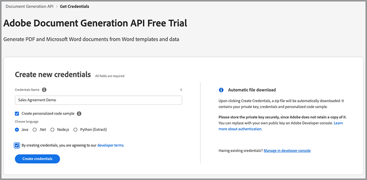

1. 選擇一種語言下載範例程式碼（例如 Node.js）。
1. 請確認是否同意 **[!UICONTROL 開發者條款]**。
1. 選擇 **[!UICONTROL 建立]**憑證。
檔案會下載到你的電腦，裡面包含樣本檔案、pdfservices-api-credentials.json和驗證private.key的 ZIP 檔。

   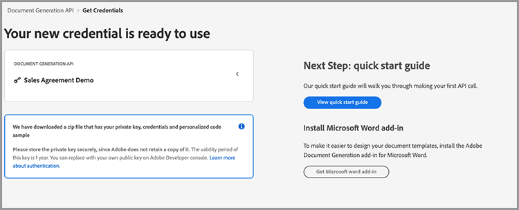

1. 選擇 **[!UICONTROL 取得 Microsoft Word 外掛]** ，或前往 [AppSource](https://appsource.microsoft.com/en-cy/product/office/WA200002654) 安裝。

   >[!NOTE]
   >
   >安裝 Word 外掛需要你擁有在 Microsoft 365 中安裝外掛的權限。 如果你沒有權限，請聯絡你的 Microsoft 365 管理員。

## 你的資料

如果你是從特定資料系統拉取資料，必須以 JSON 資料輸出，或自行產生結構。 此情境使用以下預先建立的樣本資料集：

```
{
    "salesOrder": {
        "comment": "Make sure to call 555-555-1234 when you arrive. The front door is broken."
    },
    "company": {
        "name":"Home Services Co.",
        "address": {
            "city": "Homestead",
            "state": "NY",
            "zip": "14623",
            "streetAddress": "123 Demohome Street"
        }
    },
    "customer": {
        "address": {
            "city": "Seattle",
            "state": "WA",
            "zip": "98052",
            "streetAddress": "20341 Whitworth Institute 405 N. Whitworth"
        },
        "email": "mailto:jane-doe@xyz.edu",
        "jobTitle": "Professor",
        "name": "Jane Doe",
        "telephone": "(425) 123-4567",
        "url": "http://www.janedoe.com"
    },
    "tax": {
        "state":"WA",
        "rate": 0.08
    },
    "referencesOrder": [
        {
            "description": "Carpet Cleaning Service - 3BR 2BA",
            "totalPaymentDue": {
                "price": 359.54
            },
            "orderedItem": {
                "description": "Carpet Cleaning Service"
            }
        },
        {
            "description": "Home Cleaning Service - 3BR 2BA",
            "totalPaymentDue": {
                "price": 299.99
            },
            "orderedItem": {
                "description": "House Cleaning Service"
            }
        }
    ]
}
```

## 在文件中新增基本標籤

此情境使用銷售訂單文件，可在此](https://github.com/benvanderberg/adobe-document-generation-samples/blob/main/SalesOrder/Exercise/SalesOrder_Base.docx?raw=true)下載[。

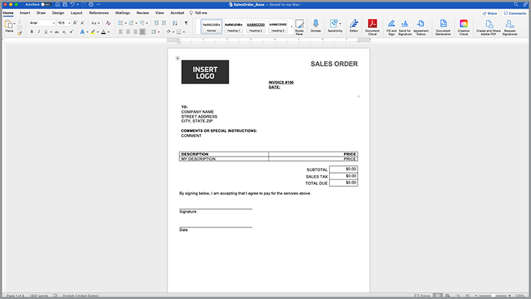

1. 在 Word 裡打開 *SalesOrder.docx* 範例文件Microsoft。
1. 如果你的 Document Generation 外掛已安裝，請在功能區選擇 **[!UICONTROL Document Generation]** 。 如果你在功能區中沒有看到文件產生，請依照以下指示操作。
1. 選擇 **[!UICONTROL 「開始使用]**」。
1. 將上述 JSON 範例資料複製到 *JSON Data* 欄位。

   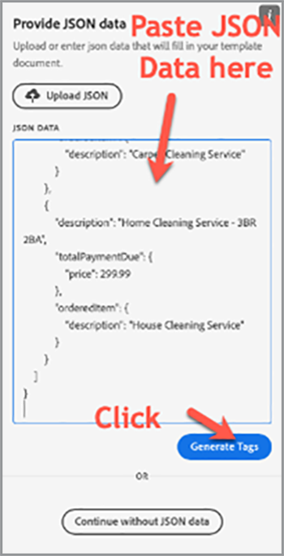

接著，前往文件產生標註器面板，將標籤放入文件中。

1. 選擇你想替換的文字（例如， *公司名稱*）。
1. 在 *文件產生標註* 器面板中，搜尋「name」。
1. 在標籤列表中，選擇公司名稱。
1. 選擇 **[!UICONTROL 插入文字]**。

   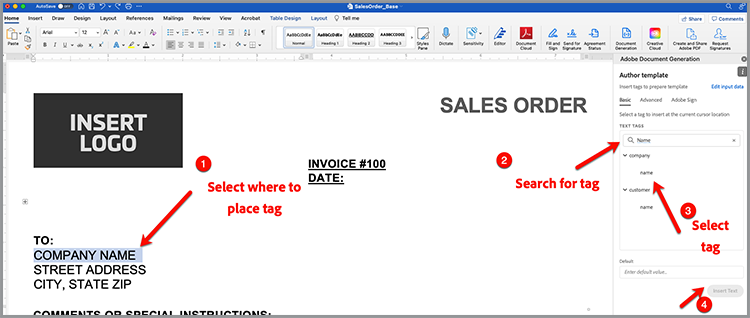

   這個程序會放置一個標籤 `{{company.name}}` ，因為該標籤位於 JSON 路徑下方。

   ```
   {
   …
   "company": {
       "name":"Home Services Co.",
       …
   },
   …
   }
   ```

對文件中其他標籤重複這些操作，例如街道地址、城市、州、郵遞區號等。

## 預覽您產生的文件

直接在 Microsoft Word 裡，你可以根據範例 JSON 資料預覽產生的文件。

1. 在 *文件產生標註器* 面板中，選擇 **[!UICONTROL 產生文件]**。 第一次可能會被要求用 Adobe ID 登入。 選擇 **[!UICONTROL 登入]** ，並完成提示以您的帳號登入。

   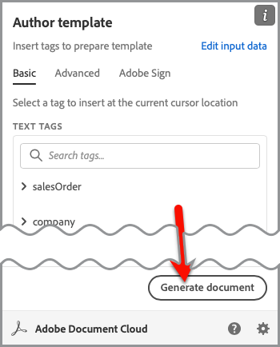

1. 選擇 **[!UICONTROL 檢視文件]**。

   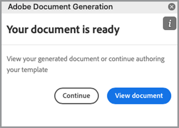

1. 會開啟一個瀏覽器視窗，讓你預覽文件結果。

   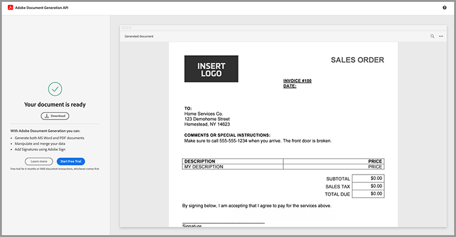

你可以在文件中看到被原始樣本資料取代的標籤。

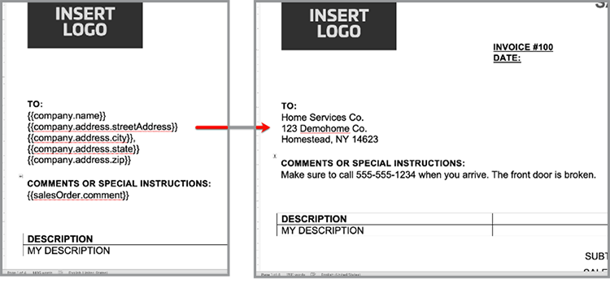

## 新增表格到範本

在下一個情境中，將產品清單加入文件中的表格。

1. 將游標插入必須放置桌子的位置。
1. 在 *文件產生標註* 器面板中，選擇 **[!UICONTROL 進階]**。
1. 展開 **[!UICONTROL 表格與清單]**。
1. 在 *Table records* 欄位中，選擇 *referencesOrder*，這是一個列出所有產品項目的陣列。
1. 在「選擇紀錄」欄位，輸入包含 *描述* 和 *totalPaymentDue.price* 欄位。
1. 選擇 **[!UICONTROL 插入表格]**。

   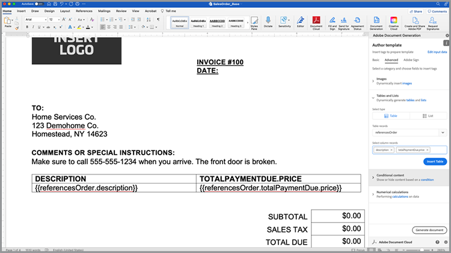

編輯表格以調整樣式、大小及其他參數，就像對待 Microsoft Word 中的其他表格一樣。

## 加入數值計算

數值計算讓你能根據資料集合（例如陣列）計算總和和其他計算。 在這種情況下，加入一個欄位來計算小計。

1. 請選擇子總標題旁的 *$0.00* 。
1. 在 *[!UICONTROL 文件產生標註]* 器面板中，展開 **[!UICONTROL 數]**&#x200B;值計算。
1. 在選擇計算類型中&#x200B;*[!UICONTROL ，選擇&#x200B;**[!UICONTROL 彙整]**。]*
1. 在選擇類型中&#x200B;*[!UICONTROL ，選擇&#x200B;**[!UICONTROL 「總和]**」。]*
1. 在選擇紀錄中&#x200B;*[!UICONTROL ，選擇&#x200B;**[!UICONTROL 參考順序]**。]*
1. 在*[!UICONTROL 選擇項目進行彙總]**中，選擇 **[!UICONTROL totalPaymentsDue.price]**。
1. 選擇 **[!UICONTROL 插入計算]**。

此過程插入計算標籤，提供數值總和。 更進階的計算則可使用 JSONata 計算。 例如：

* 小計： `${{expr($sum(referencesOrder.totalPaymentDue.price))}}`計算參考資料總和：訂單、總額、付款、應付、價格。

* 銷售稅： `${{expr($sum(referencesOrder.totalPaymentDue.price)*0.08)}}`計算價格後乘以8%計算稅負。

* 總繳納期限： `${{expr($sum(referencesOrder.totalPaymentDue.price)*1.08)}}`計算價格及乘以1.08的倍數，計算出小計+稅。

## 加入條件項

條件段落允許你只有在符合特定條件時才會加入句子或段落。 在這種情況下，只有符合特定州的區段才會被納入。

1. 在文件中，可以找到名為 *「加州隱私聲明」*&#x200B;的章節。
1. 用游標選擇該區塊。

   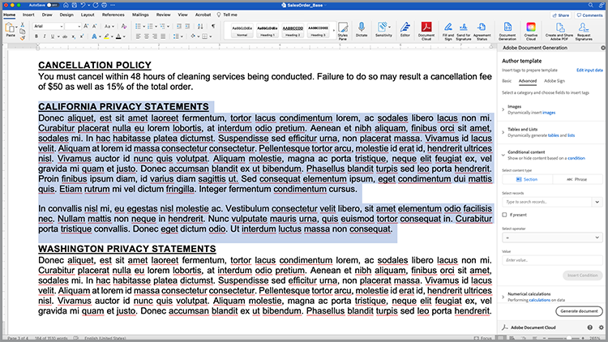

1. 在文件產生標註器中&#x200B;*[!UICONTROL ，選擇&#x200B;**[!UICONTROL 進階]**。]*
1. 展開 **[!UICONTROL 條件內容]**。
1. 在「 *[!UICONTROL 選擇紀錄]* 」欄位中，搜尋並選擇 **[!UICONTROL customer.address.state]**。
1. 在 *[!UICONTROL Select 運算子]* 欄位中，選擇 **=**。
1. 在&#x200B;*[!UICONTROL 價值欄位]*&#x200B;輸入 *CA。*
1. 選擇 **[!UICONTROL 插入條件]**。

加州區塊只有在 customer.address.state = CA 時才會出現在產生的文件中。

接著，選擇華盛頓隱私聲明區塊，重複上述步驟，將 CA 的值替換為 WA。

## 新增動態影像

文件生成 API 允許你從資料動態插入圖片。 當你有不同的子品牌，想更換標誌、肖像或圖片以使其更符合特定產業時，這非常有用。

圖片可以透過資料中的網址或 base64 內容傳遞。 這個例子使用了一個網址。

1. 將游標放在你想放圖片的位置。
1. 在 *[!UICONTROL 文件產生標註]* 器面板中，選擇 **[!UICONTROL 進階]**。
1. 展開 **[!UICONTROL 圖片]**。
1. 在「 *[!UICONTROL 選擇標籤」]* 欄位，選擇 **[!UICONTROL 標誌]**。
1. 在 *[!UICONTROL 可選的替代文字]* 欄位中，提供描述（例如標誌）。 此過程會插入一個圖片佔位符，外觀如下：

   

不過，你想在已經存在的版面中圖片上動態設定圖片，可以透過以下方式達成：

1. 右鍵點擊插入的佔位圖。

   

1. 選擇 **[!UICONTROL 編輯替代文字]**。
1. 在面板中複製看起來像這樣的文字：   `{ "location-path": "logo", "image-props": { "alt-text": "Logo" }}`
1. 在文件中選擇你想要動態的另一張圖片。

   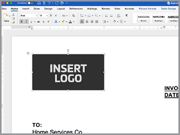

1. 右鍵點擊圖片，選擇 **[!UICONTROL 編輯替代文字]**。
1. 把數值貼到面板上。

此過程會將該影像替換為資料中標誌變數中的影像。

## 為雜技手牌新增標籤

Adobe Acrobat Sign 讓你能在文件上擷取電子簽名。 Acrobat Sign 提供在網頁介面中輕鬆拖放欄位的方式，但你也可以透過文字標籤來控制簽名和其他欄位的位置。 使用 Adobe 文件生成標註器，您可以輕鬆放置這些文字標籤欄位。

1. 在範例文件中，請前往需要簽名的地方。
1. 將游標插入需要簽名的位置。
1. 在 *[!UICONTROL Adobe 文件產生標註]* 器面板中，選擇 **[!UICONTROL Adobe Sign]**。
1. 在 *[!UICONTROL 「指定接收者]* 數量」欄位中，設定接收者數量（此例為一）。
1. 在 *[!UICONTROL 收件人]* 欄位中，選擇 **[!UICONTROL 簽署者-1]**。
1. 在欄位&#x200B;**&#x200B;類型中，選擇&#x200B;**[!UICONTROL 簽名]**。
1. 選擇 **[!UICONTROL 插入 Adobe 簽名文字標籤]**。

標籤會入文件中。

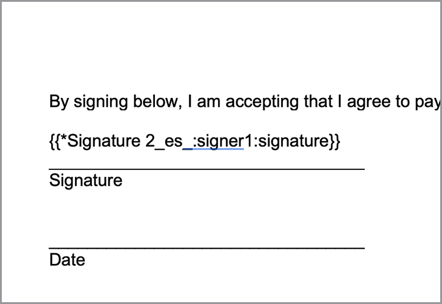

Acrobat Sign 提供多種其他欄位可供放置，例如日期欄位。

1. 在欄位&#x200B;**&#x200B;類型中，選擇&#x200B;**[!UICONTROL 日期]**。
1. 將游標移到文件中日期位置上方。
1. 選擇 **[!UICONTROL 插入 Adobe 簽名文字標籤]**。

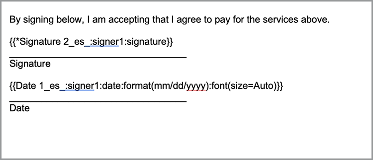

## 建立你的協議

你現在已經標記好文件，準備開始使用。 接下來的部分將介紹如何使用文件產生 API 範例來產生文件，Node.js這些範例在任何語言中都能使用。

打開你註冊憑證時下載的 pdfservices-node-sdk-samples-master。 pdfservices-api-credentials.json和private.key檔案應該包含在這些檔案中。

1. 開啟終端機來使用 npm 安裝相依。
1. 把範例 data.json 複製到 resources 資料夾。
1. 把 Word 範本複製到 resources 資料夾。
1. 在 sample 資料夾的根目錄建立一個名為 generate-salesOrder.js 的新檔案。

```
const PDFServicesSdk = require('@adobe/pdfservices-node-sdk');
const fs = require('fs');
const path = require('path');

var dataFileName = path.join('resources', '<INSERT JSON FILE');
var outputFileName = path.join('output', 'salesOrder_'+Date.now()+".pdf");
var inputFileName = path.join('resources', '<INSERT DOCX>');

//Loads credentials from the file that you created.
const credentials =  PDFServicesSdk.Credentials
    .serviceAccountCredentialsBuilder()
    .fromFile("pdfservices-api-credentials.json")
    .build();

// Setup input data for the document merge process
const jsonString = fs.readFileSync(dataFileName),
jsonDataForMerge = JSON.parse(jsonString);

// Create an ExecutionContext using credentials
const executionContext = PDFServicesSdk.ExecutionContext.create(credentials);

// Create a new DocumentMerge options instance
const documentMerge = PDFServicesSdk.DocumentMerge,
documentMergeOptions = documentMerge.options,
options = new documentMergeOptions.DocumentMergeOptions(jsonDataForMerge, documentMergeOptions.OutputFormat.PDF);

// Create a new operation instance using the options instance
const documentMergeOperation = documentMerge.Operation.createNew(options)

// Set operation input document template from a source file.
const input = PDFServicesSdk.FileRef.createFromLocalFile(inputFileName);
documentMergeOperation.setInput(input);

// Execute the operation and Save the result to the specified location.
documentMergeOperation.execute(executionContext)
.then(result => result.saveAsFile(outputFileName))
.catch(err => {
    if(err instanceof PDFServicesSdk.Error.ServiceApiError
        || err instanceof PDFServicesSdk.Error.ServiceUsageError) {
        console.log('Exception encountered while executing operation', err);
    } else {
        console.log('Exception encountered while executing operation', err);
    }
});
```

1. 請用 /resources 裡的 JSON 檔案名稱替換 `<INSERT JSON FILE>` 。
1. 請將 DOCX 檔案名稱替換 `<INSERT DOCX>` 。
1. 執行時，請使用 Terminal 執行節點 generate-salesOrder.js。

輸出檔應該在 /output 資料夾裡，文件是正確產生的。

## 更多選擇

文件產生後，您可以採取以下額外步驟：

* 有密碼的安全文件
* 如果有大圖片，請壓縮 PDF
* 擷取文件上的電子簽名

想了解更多其他可用的動作，可以參考範例檔案中 /src 資料夾裡的腳本。 你也可以透過檢視不同行動的文件來學習更多。

## 其他應用情境

[!DNL Adobe Acrobat Services] 透過數位文件工作流程，能協助簡化銷售流程的多個環節：

* 使用 Adobe PDF 嵌入 API，將白皮書及其他內容嵌入網站，同時測量並收集瀏覽量分析
* 使用 Acrobat Sign 在你產生的協議上擷取電子簽名
* 使用 Adobe PDF Extract API 從您的 PDF 文件中擷取協議資料

## 進一步學習

想了解更多嗎？ 看看其他一些使用 [!DNL Adobe Acrobat Services]方式：

* 從文件中 [了解更多](https://developer.adobe.com/document-services/docs/overview/)
* 在 Adobe Experience League 上查看更多教學
* 利用 /src 資料夾中的範例腳本，看看如何善用 PDF
* 追蹤 [Adobe 技術部落格](https://medium.com/adobetech/tagged/adobe-document-cloud) ，獲取最新技巧與秘訣
* 訂閱 [Paper Clips（每月直播），](https://www.youtube.com/playlist?list=PLcVEYUqU7VRe4sT-Bf8flvRz1XXUyGmtF) 了解如何使用 [!DNL Adobe Acrobat Services]自動化。

=======

* 從文件中 [了解更多](https://developer.adobe.com/document-services/docs/overview/)
* 在 Adobe Experience League 上查看更多教學
* 利用 /src 資料夾中的範例腳本，看看如何善用 PDF
* 追蹤 [Adobe 技術部落格](https://medium.com/adobetech/tagged/adobe-document-cloud) ，獲取最新技巧與秘訣
* 訂閱 [Paper Clips（每月直播），](https://www.youtube.com/playlist?list=PLcVEYUqU7VRe4sT-Bf8flvRz1XXUyGmtF) 了解如何自動化使用 [!DNL Adobe Acrobat Services]
