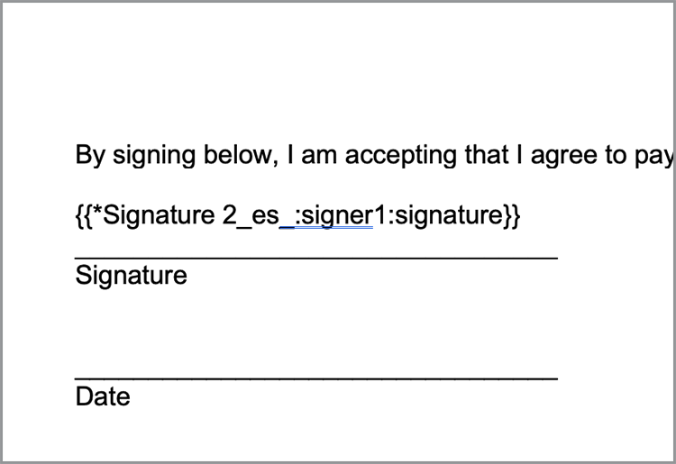

# 加快銷售流程


從白皮書到合同和協定，在整個購買過程中都需要大量文檔。 在本教程中，瞭解[[!DNL Adobe Acrobat Services]](https://developer.adobe.com/document-services/)如何在整個過程中整合文檔體驗，以幫助加快銷售。

## 根據資料生成協定和銷售訂單

銷售協定、合同和其他文檔可能會因特定標準而有很大差異。 例如，銷售協定可能只包括基於唯一標準的某些條款，例如位於特定國家或州，或包括某些產品作為協定的一部分。 手動建立這些文檔或維護許多不同的模板變體會顯著增加與手動複查更改相關的法律成本。

[Adobe文檔生成API](https://developer.adobe.com/document-services/apis/doc-generation/)允許您從CRM或其他資料系統獲取資料，以基於該資料動態生成銷售文檔。

## 獲取憑據

首先註冊免費Adobe PDF服務憑據：

1. 在[此處](https://documentcloud.adobe.com/dc-integration-creation-app-cdn/main.html)導航以註冊您的憑據。
1. 使用您的Adobe ID登錄。
1. 設定憑據名稱（例如，銷售協定演示）。

   

1. 選擇下載示例代碼的語言（例如Node.js）。
1. 檢查以同意&#x200B;**[!UICONTROL 開發人員條款]**。
1. 選擇&#x200B;**[!UICONTROL 建立憑據]**。
將檔案下載到您的電腦，其ZIP檔案包含用於驗證的示例檔案、pdfservices-api-credentials.json和private.key。

   

1. 選擇&#x200B;**[!UICONTROL 獲取MicrosoftWord載入項]**&#x200B;或轉到[AppSource](https://appsource.microsoft.com/en-cy/product/office/WA200002654)進行安裝。

   >[!NOTE]
   >
   >安裝Word載入項需要您有權在Microsoft365中安裝載入項。 如果您沒有權限，請與您的Microsoft365管理員聯繫。

## 您的資料

如果從特定資料系統提取資料，則必須將該資料輸出為JSON資料或生成您自己的架構。 此方案使用以下預先建立的示例資料集：

```
{
    "salesOrder": {
        "comment": "Make sure to call 555-555-1234 when you arrive. The front door is broken."
    },
    "company": {
        "name":"Home Services Co.",
        "address": {
            "city": "Homestead",
            "state": "NY",
            "zip": "14623",
            "streetAddress": "123 Demohome Street"
        }
    },
    "customer": {
        "address": {
            "city": "Seattle",
            "state": "WA",
            "zip": "98052",
            "streetAddress": "20341 Whitworth Institute 405 N. Whitworth"
        },
        "email": "mailto:jane-doe@xyz.edu",
        "jobTitle": "Professor",
        "name": "Jane Doe",
        "telephone": "(425) 123-4567",
        "url": "http://www.janedoe.com"
    },
    "tax": {
        "state":"WA",
        "rate": 0.08
    },
    "referencesOrder": [
        {
            "description": "Carpet Cleaning Service - 3BR 2BA",
            "totalPaymentDue": {
                "price": 359.54
            },
            "orderedItem": {
                "description": "Carpet Cleaning Service"
            }
        },
        {
            "description": "Home Cleaning Service - 3BR 2BA",
            "totalPaymentDue": {
                "price": 299.99
            },
            "orderedItem": {
                "description": "House Cleaning Service"
            }
        }
    ]
}
```

## 將基本標籤添加到文檔

此方案使用銷售訂單文檔，可以在[此處下載](https://github.com/benvanderberg/adobe-document-generation-samples/blob/main/SalesOrder/Exercise/SalesOrder_Base.docx?raw=true)。


1. 在MicrosoftWord中開啟&#x200B;*SalesOrder.docx*&#x200B;示例文檔。
1. 如果已安裝文檔生成插件，請在功能區中選擇&#x200B;**[!UICONTROL 文檔生成]**。 如果您在功能區中未看到「文檔生成」，請按照以下說明操作。
1. 選擇&#x200B;**[!UICONTROL 開始]**。
1. 將上面寫入的JSON示例資料複製到&#x200B;*JSON資料*&#x200B;欄位。

   

接下來，導航到「文檔生成標籤」面板，將標籤放入文檔。

1. 選擇要替換的文本（例如，*公司名稱*）。
1. 在&#x200B;*文檔生成標籤*&#x200B;面板中，搜索「名稱」。
1. 在標籤清單中，選擇「公司」下的名稱。
1. 選擇&#x200B;**[!UICONTROL 插入文本]**。

   

   此進程放置名為`{{company.name}}`的標籤，因為該標籤位於JSON中的路徑下。

   ```
   {
   …
   "company": {
       "name":"Home Services Co.",
       …
   },
   …
   }
   ```

對文檔中的某些附加標籤重複這些操作，如STREET ADDRESS、CITY、STATE、ZIP等。

## 預覽生成的文檔

直接在MicrosoftWord中，您可以基於示例JSON資料預覽生成的文檔。

1. 在&#x200B;*文檔生成標籤*&#x200B;面板中，選擇&#x200B;**[!UICONTROL 生成文檔]**。 第一次可能會提示您登錄您的Adobe ID。 選擇&#x200B;**[!UICONTROL 登錄]**，並完成提示以使用您的憑據登錄。

   

1. 選擇&#x200B;**[!UICONTROL 查看文檔]**。

   

1. 將開啟一個瀏覽器窗口，允許您預覽文檔結果。

   

您可以看到文檔中用原始示例資料中的資料替換的標籤。


## 將表添加到模板

在下一個方案中，將產品清單添加到文檔中的表中。

1. 將游標插入必須放置表的位置。
1. 在&#x200B;*文檔生成標籤*&#x200B;面板中，選擇&#x200B;**[!UICONTROL 高級]**。
1. 展開&#x200B;**[!UICONTROL 表和清單]**。
1. 在&#x200B;*表記錄*&#x200B;欄位中，選擇&#x200B;*referencesOrder*，該陣列列出所有產品項。
1. 在「選擇列記錄」欄位中，鍵入以包括&#x200B;*描述*&#x200B;和&#x200B;*totalPaymentDue.price*&#x200B;欄位。
1. 選擇&#x200B;**[!UICONTROL 插入表]**。

   

編輯表格以調整樣式、大小和其他參數，就像您在MicrosoftWord中調整其它任何表格一樣。

## 添加數值計算

數值計算允許您根據資料集合（如陣列）計算總和和其他計算。 在此方案中，添加一個欄位以計算小計。

1. 選擇小計標題旁的&#x200B;*$0.00*。
1. 在&#x200B;*[!UICONTROL 文檔生成標籤]*&#x200B;面板中，展開&#x200B;**[!UICONTROL 數值計算]**。
1. 在&#x200B;*[!UICONTROL 選擇計算類型]*&#x200B;下，選擇&#x200B;**[!UICONTROL 聚合]**。
1. 在&#x200B;*[!UICONTROL 選擇類型]*&#x200B;下，選擇&#x200B;**[!UICONTROL 總和]**。
1. 在&#x200B;*[!UICONTROL 選擇記錄]*&#x200B;下，選擇&#x200B;**[!UICONTROL ReferencesOrder]**。
1. 在&#x200B;*[!UICONTROL 選擇要執行聚合的項]&#x200B;**下，選擇&#x200B;**&#x200B;[!UICONTROL totalPaymentsDue.price]**。
1. 選擇&#x200B;**[!UICONTROL 插入計算]**。

此過程插入一個計算標籤，該標籤提供值之和。 可以使用JSONata計算進行更高級的計算。 例如：

* 小計： `${{expr($sum(referencesOrder.totalPaymentDue.price))}}`
計算referencesOrder.totalPaymentDue.price的總和。

* 銷售稅： `${{expr($sum(referencesOrder.totalPaymentDue.price)*0.08)}}`
計算價格並乘以8%計算稅。

* 到期總數： `${{expr($sum(referencesOrder.totalPaymentDue.price)*1.08)}}`
按1.08計算價格和倍數，以計算小計+稅。

## 添加條件術語

條件部分允許您僅在滿足特定條件時包含句子或段落。 在此方案中，只有某個節與某個狀態匹配時，才包括該節。

1. 在文檔中，查找名為&#x200B;*CALIFORNIA PRIVACY STATEMENTS*&#x200B;的部分。
1. 使用游標選擇節。

   

1. 在&#x200B;*[!UICONTROL 文檔生成標誌符]*&#x200B;中，選擇&#x200B;**[!UICONTROL 高級]**。
1. 展開&#x200B;**[!UICONTROL 條件內容]**。
1. 在&#x200B;*[!UICONTROL 選擇記錄]*&#x200B;欄位中，搜索並選擇&#x200B;**[!UICONTROL customer.address.state]**。
1. 在&#x200B;*[!UICONTROL 選擇運算子]*&#x200B;欄位中，選擇&#x200B;**=**。
1. 在&#x200B;*[!UICONTROL 值欄位]*&#x200B;中，鍵入&#x200B;*CA*。
1. 選擇&#x200B;**[!UICONTROL 插入條件]**。

如果customer.address.state = CA，則California節僅出現在生成的文檔中。

接下來，為WASHINGTON PRIVACY STATEMENTS選擇該部分，並重複上述步驟，將值CA替換為WA。

## 添加動態映像

文檔生成API允許您動態地從資料中插入影像。 如果您有不同的子品牌，並且您希望更改徽標、肖像影像或影像，以使它們與特定行業更相關，則此功能非常有用。

影像可以通過資料或base64內容中的URL傳遞。 此示例使用URL。

1. 將游標置於要包含影像的位置。
1. 在&#x200B;*[!UICONTROL 文檔生成標籤]*&#x200B;面板中，選擇&#x200B;**[!UICONTROL 高級]**。
1. 展開&#x200B;**[!UICONTROL 映像]**。
1. 在&#x200B;*[!UICONTROL 選擇標籤]*&#x200B;欄位中，選擇&#x200B;**[!UICONTROL 徽標]**。
1. 在&#x200B;*[!UICONTROL 可選替代文本]*&#x200B;欄位中，提供說明（即徽標）。 此過程將插入一個如下所示的影像佔位符：

   

但是，您希望動態地在佈局中已存在的映像上設定映像，您可以通過以下方式來執行此操作：

1. 按一下右鍵插入的佔位符影像。

   

1. 選擇&#x200B;**[!UICONTROL 編輯Alt文本]**。
1. 在面板中，複製如下所示的文本：
   `{ "location-path": "logo", "image-props": { "alt-text": "Logo" }}`
1. 在文檔中選擇要動態的其他影像。

   

1. 按一下右鍵該影像，然後選擇&#x200B;**[!UICONTROL 編輯替代文字]**。
1. 將值貼上到面板中。

此過程用資料中徽標變數中的影像替換影像。

## 為Acrobat Sign添加標籤

Adobe Acrobat Sign允許您在文檔上捕獲電子簽名。 Acrobat Sign提供了在web介面中拖放欄位的簡單方法，但您也可以使用文本標籤來控制簽名和其他欄位的放置。 使用Adobe文檔生成標籤符，可以輕鬆放置這些文本標籤欄位。

1. 導航到示例文檔中需要簽名的位置。
1. 在需要簽名的地方插入游標。
1. 在&#x200B;*[!UICONTROL Adobe文檔生成標籤]*&#x200B;面板中，選擇&#x200B;**[!UICONTROL Adobe Sign]**。
1. 在&#x200B;*[!UICONTROL 指定收件人數]*&#x200B;欄位中，設定收件人數（在此示例中為1）。
1. 在&#x200B;*[!UICONTROL 收件人]*&#x200B;欄位中，選擇&#x200B;**[!UICONTROL 簽名者–1]**。
1. 在&#x200B;*[!UICONTROL 欄位]*&#x200B;類型中，選擇&#x200B;**[!UICONTROL 簽名]**。
1. 選擇&#x200B;**[!UICONTROL 插入Adobe Sign文本標籤]**。

標籤被插入文檔。



Acrobat Sign提供了可以放置的其他幾種類型的欄位，如日期欄位。

1. 在&#x200B;*欄位*&#x200B;類型中，選擇&#x200B;**[!UICONTROL 日期]**。
1. 將游標移到文檔中的「日期」位置上方。
1. 選擇&#x200B;**[!UICONTROL 插入Adobe Sign文本標籤]**。


## 生成協定

您現在已標籤文檔，並準備開始使用。 下一節介紹如何使用Node.js的文檔生成API示例生成文檔，但這些示例將以任何語言使用。

開啟註冊憑據時下載的pdfservices-node-sdk-samples-master。 這些檔案中應包含pdfservices-api-credentials.json和private.key檔案。

1. 開啟終端以使用npm install安裝依賴項。
1. 將示例data.json複製到資源資料夾中。
1. 將Word模板複製到資源資料夾中。
1. 在示例資料夾的根目錄中建立名為generate-salesOrder.js的新檔案。

```
const PDFServicesSdk = require('@adobe/pdfservices-node-sdk');
const fs = require('fs');
const path = require('path');

var dataFileName = path.join('resources', '<INSERT JSON FILE');
var outputFileName = path.join('output', 'salesOrder_'+Date.now()+".pdf");
var inputFileName = path.join('resources', '<INSERT DOCX>');

//Loads credentials from the file that you created.
const credentials =  PDFServicesSdk.Credentials
    .serviceAccountCredentialsBuilder()
    .fromFile("pdfservices-api-credentials.json")
    .build();

// Setup input data for the document merge process
const jsonString = fs.readFileSync(dataFileName),
jsonDataForMerge = JSON.parse(jsonString);

// Create an ExecutionContext using credentials
const executionContext = PDFServicesSdk.ExecutionContext.create(credentials);

// Create a new DocumentMerge options instance
const documentMerge = PDFServicesSdk.DocumentMerge,
documentMergeOptions = documentMerge.options,
options = new documentMergeOptions.DocumentMergeOptions(jsonDataForMerge, documentMergeOptions.OutputFormat.PDF);

// Create a new operation instance using the options instance
const documentMergeOperation = documentMerge.Operation.createNew(options)

// Set operation input document template from a source file.
const input = PDFServicesSdk.FileRef.createFromLocalFile(inputFileName);
documentMergeOperation.setInput(input);

// Execute the operation and Save the result to the specified location.
documentMergeOperation.execute(executionContext)
.then(result => result.saveAsFile(outputFileName))
.catch(err => {
    if(err instanceof PDFServicesSdk.Error.ServiceApiError
        || err instanceof PDFServicesSdk.Error.ServiceUsageError) {
        console.log('Exception encountered while executing operation', err);
    } else {
        console.log('Exception encountered while executing operation', err);
    }
});
```

1. 將`<INSERT JSON FILE>`替換為/resources中JSON檔案的名稱。
1. 將`<INSERT DOCX>`替換為DOCX檔案的名稱。
1. 要運行，請使用終端執行節點generate-salesOrder.js。

輸出檔案應位於/output資料夾中，並且文檔生成正確。

## 更多選項

生成文檔後，您可以執行其他操作，如：

* 使用密碼保護文檔
* 如果有大影像，則壓縮PDF
* 捕獲文檔上的電子簽名

要瞭解有關其他可用操作的詳細資訊，請查看示例檔案/src資料夾中的指令碼。 您還可以通過查看不同操作的文檔來瞭解更多資訊。

## 其他使用案例

[!DNL Adobe Acrobat Services]可通過數字文檔工作流幫助簡化銷售週期的許多部分：

* 使用Adobe PDF嵌入API將白皮書和其他內容嵌入網站，同時測量並收集收視量上的分析
* 使用Acrobat Sign捕獲您生成的協定的電子簽名
* 使用Adobe PDF提取API從PDF文檔中提取協定資料

## 進一步學習

有興趣學習更多內容嗎？ 請查看其他使用[!DNL Adobe Acrobat Services]的方法：

* 從[文檔瞭解更多資訊](https://developer.adobe.com/document-services/docs/overview/)
* 查看有關Adobe Experience League的更多教程
* 使用/src資料夾中的示例指令碼查看如何利用PDF
* 有關最新提示和技巧，請關注[Adobe技術部落格](https://medium.com/adobetech/tagged/adobe-document-cloud)
* 訂閱[紙片剪輯（每月即時流）](https://www.youtube.com/playlist?list=PLcVEYUqU7VRe4sT-Bf8flvRz1XXUyGmtF)以瞭解使用[!DNL Adobe Acrobat Services]的自動化。
======
* 從[文檔瞭解更多資訊](https://developer.adobe.com/document-services/docs/overview/)
* 查看有關Adobe Experience League的更多教程
* 使用/src資料夾中的示例指令碼查看如何利用PDF
* 有關最新提示和技巧，請關注[Adobe技術部落格](https://medium.com/adobetech/tagged/adobe-document-cloud)
* 訂閱[紙片剪輯（每月即時流）](https://www.youtube.com/playlist?list=PLcVEYUqU7VRe4sT-Bf8flvRz1XXUyGmtF)以瞭解使用[!DNL Adobe Acrobat Services]的自動化
