# 自動化法律工作流程


理想情況下，協議條款會被接受且不作任何修改。 然而，協議往往需要客製化，進而需要法律審查。 法律審查會產生大量成本，並拖慢協議條款的交付流程。 使用根據核准語言調整的預設範本，有助於法律團隊管理並更安全地執行協議條款。

這個教學使用了各州不同的法律協議。 為了解決這些差異，會建立一個包含條件章節的協議範本，條件章節僅在符合特定條件時才會被納入。 產生的文件可以是 Word 或 PDF 文件。 你也可以學習使用 Adobe PDF Services API 或 Acrobat Sign 來保護文件的方法。

## 取得證件

請先註冊免費的 Adobe PDF 服務憑證：

1. 請點此](https://documentcloud.adobe.com/dc-integration-creation-app-cdn/main.html)註冊[您的證件。
1. 用你的 Adobe ID 登入。
1. 設定你的憑證名稱。

   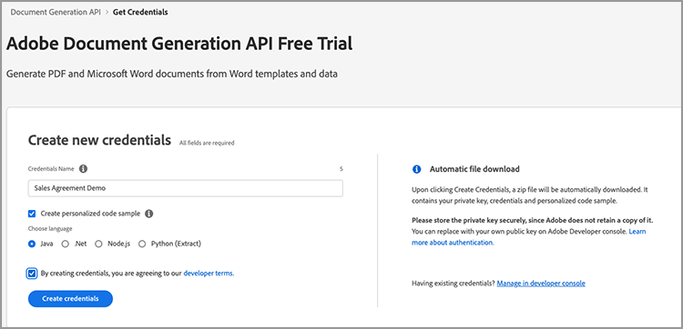

1. 選擇一種語言來下載範例程式碼（例如 Node.js）。
1. 請確認是否同意 **[!UICONTROL 開發者條款]**。
1. 選擇 **[!UICONTROL 建立]**憑證。
檔案會下載到你的電腦，裡面包含樣本檔案、pdfservices-api-credentials.json和驗證private.key的 ZIP 檔。

   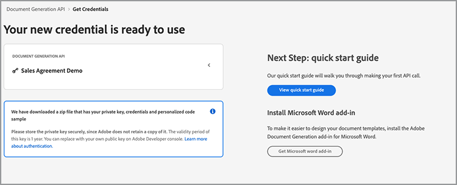

1. 選擇 **[!UICONTROL 取得 Microsoft Word 外掛]** ，或前往 [AppSource](https://appsource.microsoft.com/en-cy/product/office/WA200002654) 安裝。

   >[!NOTE]
   >
   >安裝 Word 外掛需要你擁有在 Microsoft 365 中安裝外掛的權限。 如果你沒有權限，請聯絡你的 Microsoft 365 管理員。

## 你的資料

在此情境中，會傳遞資訊以協助文件產生，並告知是否應包含某些章節：

```
{
    "customer": {
        "name": "Home Services Company",
        "street": "123 Any Street",
        "city": "Anywhere",
        "state": "CA",
        "zip": "12345",
        "country":"USA",
        "signer": {
            "email": "johnnyechostone@gmail.com",
            "firstName": "John",
            "lastName": "Echostone"
        }
    },
    "company": {
        "name": "Projected Consultants",
        "signer": {
            "email": "maryburostone@gmail.com",
            "firstName": "Mary",
            "lastName": "Burostone"
        }
    },
    "conditions": {
        "includeGeneralTerms": true,
        "includeConsumerDiscloure": true
    }
}
```

資料中包含客戶的資訊、姓名、簽約者、所在州等。 此外，還有關於產生協議的公司資訊的章節，以及條件旗標，這些標誌會包含協議的某些章節。

## 在文件中新增基本標籤

此情境使用條款與細則文件，可在此](https://github.com/benvanderberg/adobe-document-generation-samples/blob/main/Agreement/exercise/TermsAndConditions_Sample.docx?raw=true)下載[。

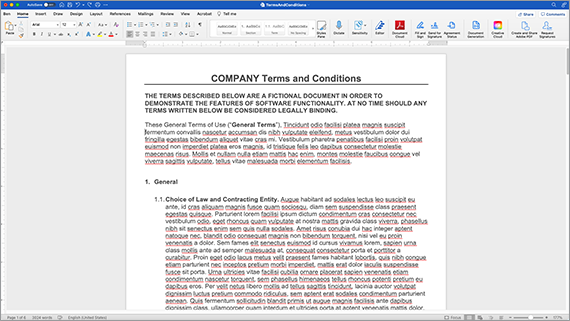

1. 在 Word 裡打開 *TermsAndConditions.docx* 範例文件Microsoft。
1. 如果 [安裝了文件產生](https://appsource.microsoft.com/en-cy/product/office/WA200002654) 外掛，請在功能區選擇 **[!UICONTROL 文件生成]** 。 如果你在功能區中沒有看到文件產生，請依照以下指示操作。
1. 選擇 **[!UICONTROL 「開始使用]**」。
1. 將上述 JSON 範例資料複製到 JSON Data 欄位。

   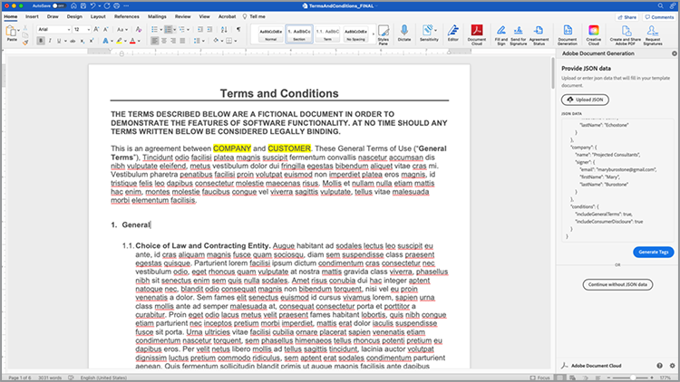

請前往 *文件產生標註* 器面板，在文件中放置標籤。

## 請輸入公司名稱

1. 選擇你想替換的文字。 在這種情況下，你是在文件開頭部分替換「公司」。
1. 在文件產生標註器&#x200B;*中*，搜尋「name」。
1. 在公司 *選名*。

   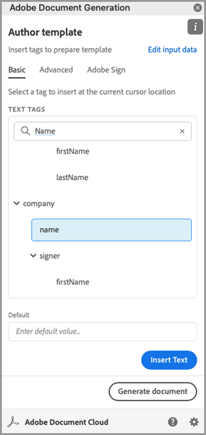

1. 選擇 **[!UICONTROL 插入文字]**。

這會因為該標籤位於 JSON 路徑下方而被呼叫 `{{company.name}}` 。

```
{
    "company": {
        "name": "Projected Consultants",
        ...
    }
    ...
}
```

接著，在開頭的客戶文字段落重複這個步驟。 重複 **步驟 1-4**，將 CUSTOMER 換成 customer，在 customer 下。 輸出應該是 `{{customer.name}}`，反映文字是從客戶物件下方發出的。

Adobe 文件產生 API 也允許你在頁頭和頁尾以及簽名標題的最後位置加入標籤。

重複這個過程，腳 **註中公司與客戶的文字分別執行步驟 1-4** 。

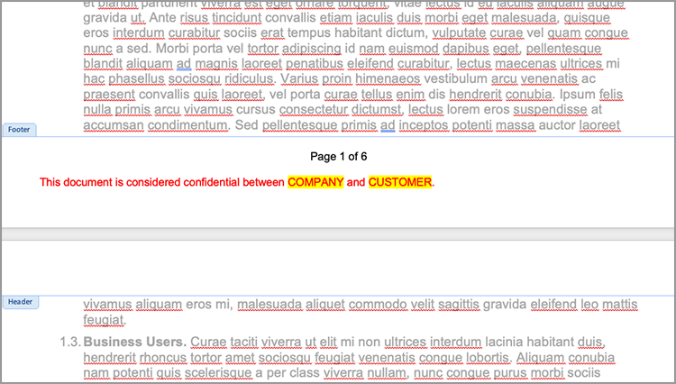

最後，你需要&#x200B;**重複步驟 1-4**，將簽名頁 Customer 區塊下的 FIRST Name 和 LAST NAME 分別替換成`{{customer.signer.firstName}}``{{customer.signer.lastName}}`標籤。不用擔心標籤太長且會重複到下一行，因為文件產生時標籤會被替換。

文件開頭和頁尾應該是這樣：

* 起點部分：

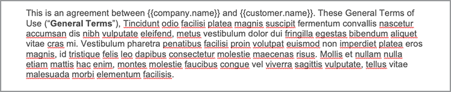

* 腳註：

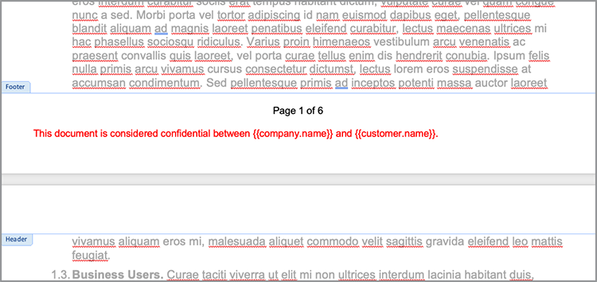

* 簽名頁：

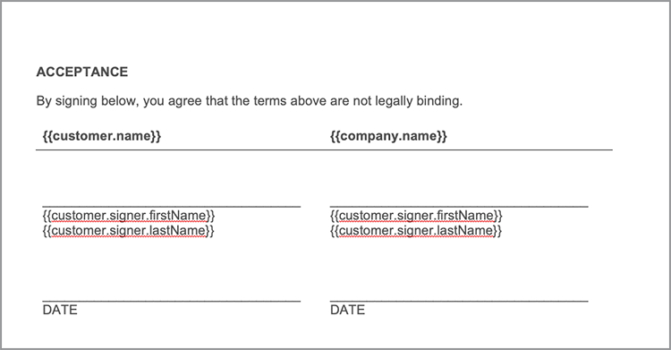

現在你的標籤已經放進文件中，你就可以預覽你產生的協議了。

## 預覽您產生的文件

直接在 Microsoft Word 裡，你可以根據範例 JSON 資料預覽產生的文件。

1. 在文件產生標註器中&#x200B;*，選擇&#x200B;**[!UICONTROL 產生文件]**。*
1. 第一次可能會被要求用 Adobe ID 登入。 選擇 **[!UICONTROL 登入]** ，並完成提示以您的帳號登入。

   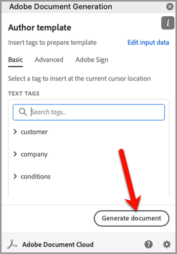

1. 選擇 **[!UICONTROL 檢視文件]**。

   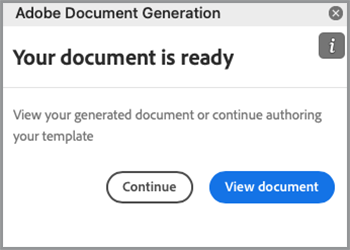

1. 會開啟瀏覽器視窗，讓你預覽文件結果。

   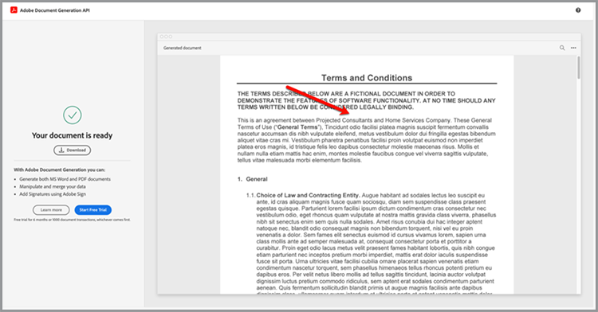

## 為每個狀態加入條件項

在接下來的這部分，你將根據特定的輸入資料標準，只設定特定區塊被納入。 在範例文件中，第4和第5節僅涉及特定州。 在這種情況下，客戶居住在該州時，應只包含該州的專屬條款。 另外，如果 Microsoft Word 的編號被移除，那個區段就不應該包含。 使用 Document Generation API 的條件內容功能來標記此項。

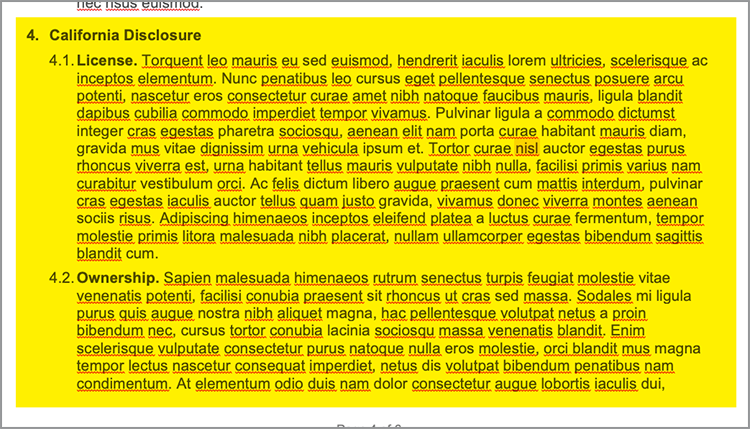

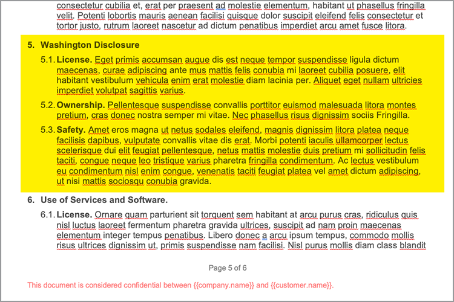

1. 在文件中，選擇加州揭露部分及所有子項目符號。

   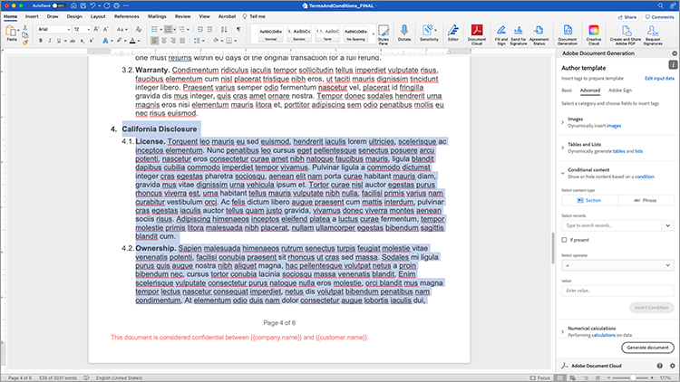

1. 在文件產生標註器中&#x200B;*[!UICONTROL ，選擇&#x200B;**[!UICONTROL 進階]**。]*
1. 展開 **[!UICONTROL 條件內容]**。
1. 在 *[!UICONTROL 選擇紀錄]* 欄位中，搜尋並選擇 **[!UICONTROL customer.state]**。
1. 在 *[!UICONTROL Select 運算子]* 欄位中，選擇 **=**。
1. 在&#x200B;*[!UICONTROL 價值]*&#x200B;欄位輸入 *CA。*
1. 選擇 **[!UICONTROL 插入條件]**。

該區段現在被一些稱為條件區段標籤的標籤包裹。 當你加上標籤時，它可能把條件段標籤加成了編號的行。 你可以在標籤前加回距來移除這個問題，否則它會把項目編號當作文件產生時標籤還沒出現過。 條件區段以 `` 標籤結尾。

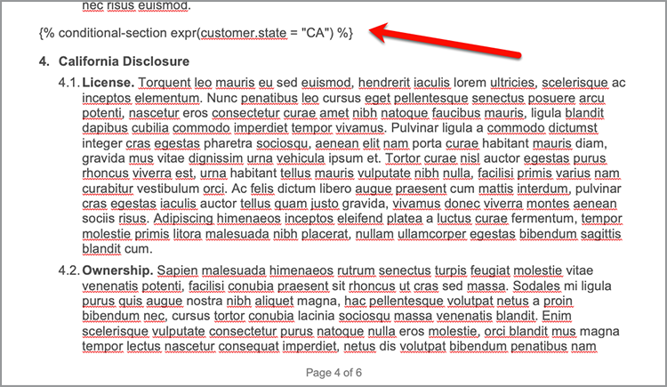

**重複步驟 1-7** 以&#x200B;*華盛頓揭露*&#x200B;區塊，將 CA *值替換*&#x200B;為 *WA*，表示該區塊僅在客戶所在州為華盛頓州時顯示。

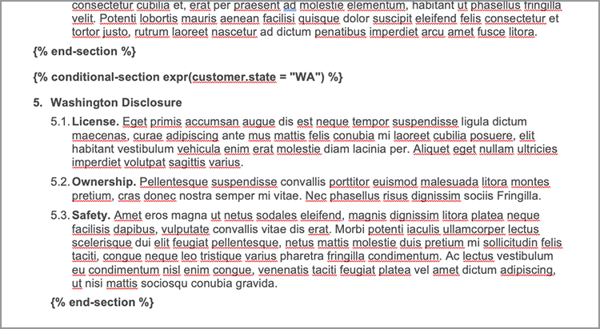

## 條件區段測試

條件區段設置好後，您可以選擇 **「產生文件**」來預覽您的文件。

當你產生文件時，請注意所包含的部分僅符合資料標準。 在下方的例子中，由於該州與加州相同，僅包含加州部分。

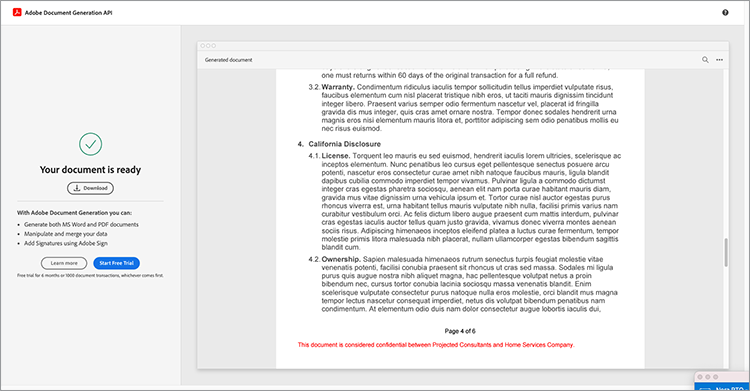

另一個顯著的變化是，接下來的「服務與軟體使用」章節的編號改為5。 這表示當華盛頓部分省略時，編號仍會繼續。

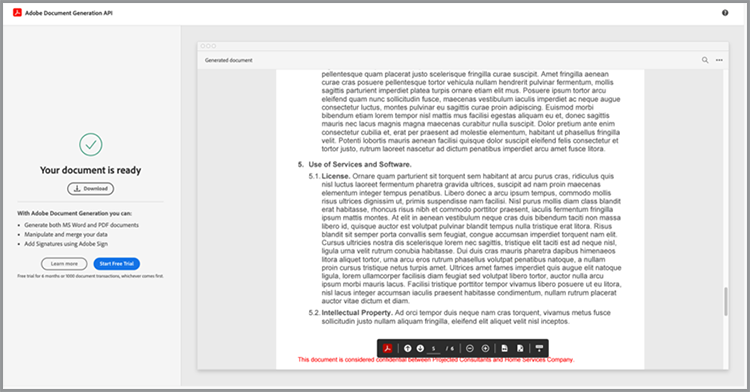

為了測試當客戶在華盛頓州而非加州時，範本是否正常，請更改範本的樣本資料：

1. 在文件產生標註器中&#x200B;*，選擇&#x200B;**[!UICONTROL 編輯輸入資料]**。*

   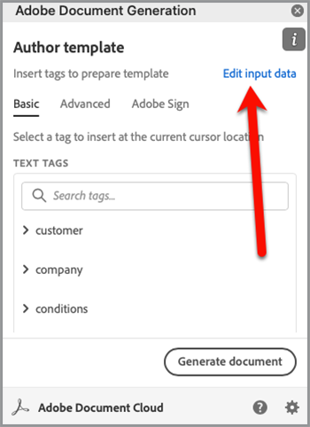

1. 選取「**[!UICONTROL 編輯]**」。

1. 在 JSON 資料中，將 CA *改*&#x200B;成 *WA。*

   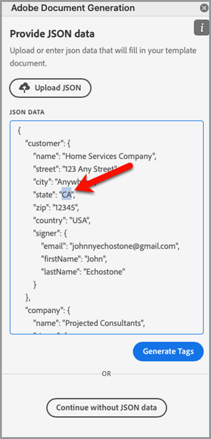

1. 選擇 **[!UICONTROL 產生標籤]**。
1. 選擇 **[!UICONTROL 產生文件]** 以重新產生該文件。

請注意，文件中僅包含華盛頓州的部分。

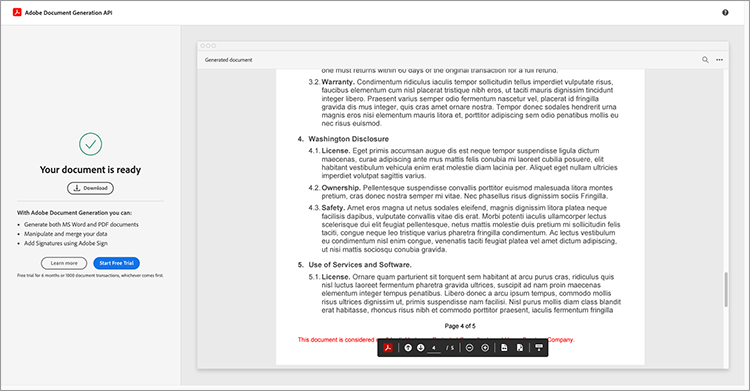

## 加入條件句

像條件句一樣，你也可以在符合特定條件時加入特定句子。 在這個例子中，加州和華盛頓州的退貨政策不同。

1. 在第3.1節，選擇第一句：「在華盛頓州購買時，必須在原始交易後30天內以郵寄方式退回，才能全額退款。」
1. 在文件產生標註器中&#x200B;*[!UICONTROL ，選擇&#x200B;**[!UICONTROL 進階]**。]*
1. 展開 **[!UICONTROL 條件內容]**。
1. 在內容類型中&#x200B;*[!UICONTROL ，選擇&#x200B;**[!UICONTROL 短語]**。]*
1. 在 *[!UICONTROL 選擇紀錄]* 欄位中，搜尋並選擇 **[!UICONTROL customer.state]**。
1. 在 *[!UICONTROL Select 運算子]* 欄位中，選擇 **=**。
1. 在&#x200B;*[!UICONTROL 價值]*&#x200B;欄位輸入 *CA。*
1. 選擇 **[!UICONTROL 插入條件]**。

雖然標籤名稱相同，但片語與章節的主要差異在於片語中該節不包含新行。 條件區段標籤與 -end-section 標籤必須在同一段落中。

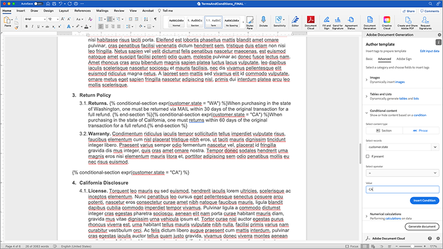

## 為雜技手牌新增標籤

Acrobat Sign 允許你將協議寄送簽名或嵌入網頁體驗，讓他人輕鬆查看並簽署。 Microsoft Word 中的 Adobe 文件產生標註器讓你能輕鬆在文件寄出前預先標記，並使用 Acrobat Sign，確保簽章放在正確位置。 在這種情況下，有兩位簽署人需要一個地方來簽署並註明日期。

1. 前往客戶必須簽名的地方。
1. 將游標放在簽名該放置的位置。

   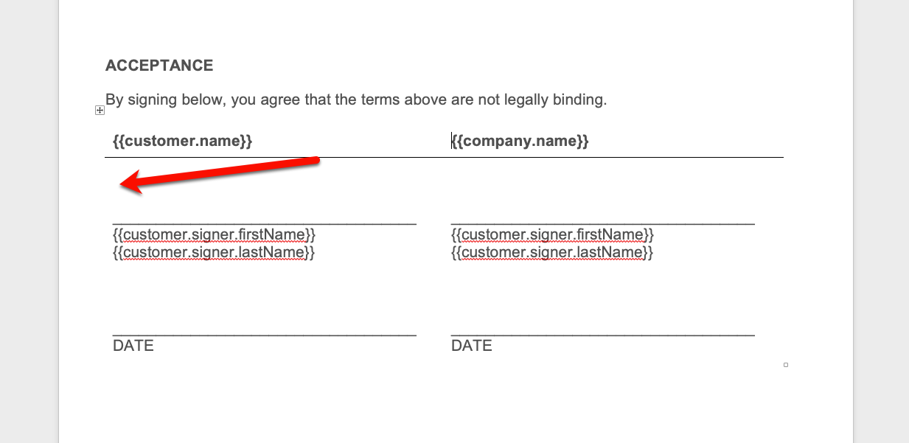

1. 在文件產生標註器中&#x200B;*[!UICONTROL ，選擇&#x200B;**[!UICONTROL Adobe Sign]**。]*
1. 在 *[!UICONTROL 「指定接收者]* 數量」欄位中，設定接收者數量（此範例使用 2）。
1. 在 *[!UICONTROL 收件人]* 欄位，選擇 **[!UICONTROL 簽署人-1]**。
1. 在欄位&#x200B;]*類型中*[!UICONTROL ，選擇&#x200B;**[!UICONTROL 簽名]**。
1. 選擇 **[!UICONTROL 插入 Adobe 簽名文字標籤]**。

   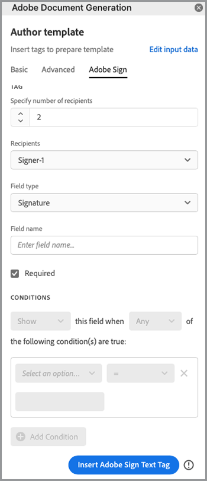

>[!NOTE]
>
>如果 **缺少「插入 Adobe 簽名文字標籤** 」按鈕，請往下滑。

這會放置一個簽名欄位，第一個簽署者需要簽名。

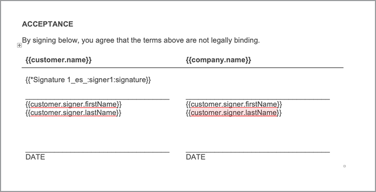

接著，為簽署者設置一個資料欄位，簽名時會自動填入。

1. 將游標移到日期應該放置的位置。

   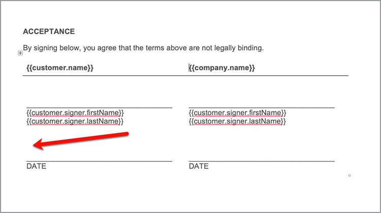

1. 將欄位類型設為日期。
1. 選擇 **[!UICONTROL 插入 Adobe 簽名文字標籤]**。

所放置的日期標籤相當長： `{{Date 3_es_:signer1:date:format(mm/dd/yyyy):font(size=Auto)}}`。 Acrobat Sign 文字標籤必須保持在同一行，這與文件產生標籤不同。 `:format()`和`font()`參數是可選的，因此在此情況下我們可以將標籤縮短為 `{{Date 3_es_:signer1:date}}`。

重複公司簽名&#x200B;*區上方的*&#x200B;步驟。此時，必須將收件人欄位改為 **簽署人-2**，否則所有簽名欄位都會分配給同一個人。

## 建立你的協議

你現在已經標記好文件，準備開始使用。 在接下來的這一節中，學習如何利用文件產生 API 範例來產生文件，Node.js。 這些範例適用於任何語言。

打開你註冊憑證時下載的 pdfservices-node-sdk-samples-master 檔案。 這些檔案包含pdfservices-api-credentials.json和private.key檔案。

1. 打開終端&#x200B;****&#x200B;機來安裝依賴，使用`npm install`。
1. 把你的範例 *data.json* 複製到 *資源* 資料夾。
1. 把你建立的 Word 範本複製到 *resources* 資料夾裡。
1. 在 sample 資料夾的根目錄建立一個名為 *generate-salesOrder.js* 的新檔案。

   ```
   const PDFServicesSdk = require('@adobe/pdfservices-node-sdk').
   const fs = require('fs');
   const path = require('path');
   
   var dataFileName = path.join('resources', '<INSERT JSON FILE');
   var outputFileName = path.join('output', 'salesOrder_'+Date.now()+".pdf");
   var inputFileName = path.join('resources', '<INSERT DOCX>');
   
   //Loads credentials from the file that you created.
   const credentials =  PDFServicesSdk.Credentials
      .serviceAccountCredentialsBuilder()
      .fromFile("pdfservices-api-credentials.json")
      .build();
   
   // Setup input data for the document merge process
   const jsonString = fs.readFileSync(dataFileName),
   jsonDataForMerge = JSON.parse(jsonString);
   
   // Create an ExecutionContext using credentials
   const executionContext = PDFServicesSdk.ExecutionContext.create(credentials);
   
   // Create a new DocumentMerge options instance
   const documentMerge = PDFServicesSdk.DocumentMerge,
   documentMergeOptions = documentMerge.options,
   options = new documentMergeOptions.DocumentMergeOptions(jsonDataForMerge, documentMergeOptions.OutputFormat.PDF);
   
   // Create a new operation instance using the options instance
   const documentMergeOperation = documentMerge.Operation.createNew(options)
   
   // Set operation input document template from a source file.
   const input = PDFServicesSdk.FileRef.createFromLocalFile(inputFileName);
   documentMergeOperation.setInput(input);
   
   // Execute the operation and Save the result to the specified location.
   documentMergeOperation.execute(executionContext)
   .then(result => result.saveAsFile(outputFileName))
   .catch(err => {
      if(err instanceof PDFServicesSdk.Error.ServiceApiError
         || err instanceof PDFServicesSdk.Error.ServiceUsageError) {
         console.log('Exception encountered while executing operation', err);
      } else {
         console.log('Exception encountered while executing operation', err);
      }
   });
   ```

1. 請用 /resources 裡的 JSON 檔案名稱替換 `<JSON FILE>` 。
1. 請將 DOCX 檔案名稱替換 `<INSERT DOCX>` 。
1. 執行時，請使用 **[!UICONTROL Terminal]** 執行節點 `generate-salesOrder.js`。

輸出檔在 /output 資料夾，文件已正確產生。

你可以透過更改下方的行來更改格式。 如果這份文件要送去 Word 編輯或合約審查，DOCX 格式很有幫助。

PDF：

```
options = new documentMergeOptions.DocumentMergeOptions(jsonDataForMerge,
documentMergeOptions.OutputFormat.PDF);
```

字：

```
options = new documentMergeOptions.DocumentMergeOptions(jsonDataForMerge, documentMergeOptions.OutputFormat.DOCX);
```

你也必須將輸出檔名稱改為 .pdf 或 .docx，分別是 PDF 或 DOCX 輸出格式：

```
var outputFileName = path.join('output', 'salesOrder_'+Date.now()+".docx");
```

## 寄出協議以供簽署

[Adobe Acrobat Sign](https://www.adobe.com/acrobat/business/sign.html) 允許你將協議寄送給一位或多位收件人，讓他們查看並簽署文件。 除了簡便的使用者體驗，方便你將文件送交簽名外，還有 REST API，讓你能將 Word、PDF、HTML 及其他格式送出簽名。

以下範例說明如何使用 REST API 文件頁面，將先前產生的文件送去簽名。 首先，學習如何透過 Acrobat Sign 網頁介面來操作，然後再學習如何使用 REST API。

## 註冊一個雜技招牌帳號

如果你沒有 Acrobat Sign 帳號，請註冊開發者帳號並查看此處的文件[，然後選擇&#x200B;**「開發者帳號註冊**」。](https://developer.adobe.com/adobesign-api/)系統會提示您填寫表單並收到驗證電子郵件。 完成後，系統會引導你進入一個網站設定密碼和帳號，然後登入 Acrobat Sign。

## 從網頁介面傳送協議

1. 從導航欄選擇 **[!UICONTROL 「發送]** 」。

   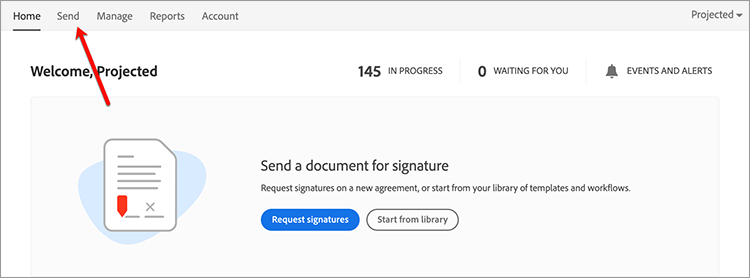

1. 在 *收件人* 欄位，請指定兩個電子郵件地址。 最佳做法是使用與 Acrobat Sign 帳號無關聯的電子郵件地址。

   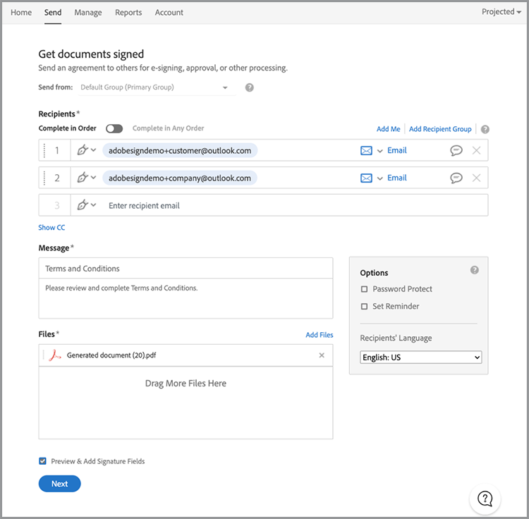

1. 設定 **[!UICONTROL 協議名稱]** 和 **[!UICONTROL 訊息]**。
1. 選擇 **[!UICONTROL 新增檔案]** ，並從你的電腦上傳產生的檔案。
1. 選取&#x200B;**[!UICONTROL 「預覽和新增簽名欄位」]**。
1. 選取「**[!UICONTROL 下一步]**」。
1. 往下滑到簽名頁時，你可以看到根據標籤放置的簽名欄位。

   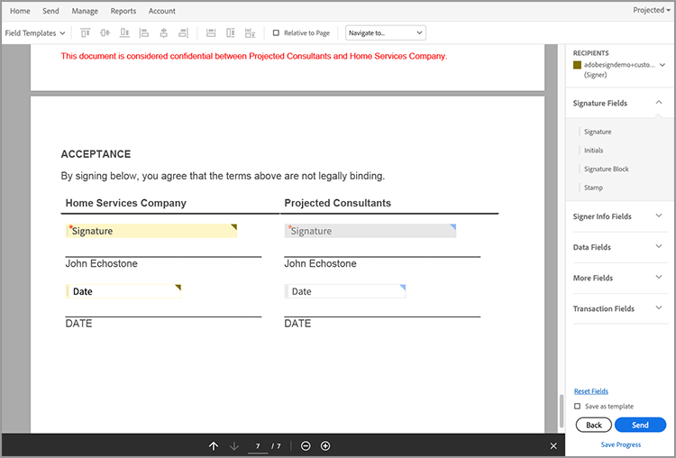

1. 選取「**[!UICONTROL 傳送]**」。
1. 在您的電子郵件中，會出現一則包含查看與簽名連結的訊息。

   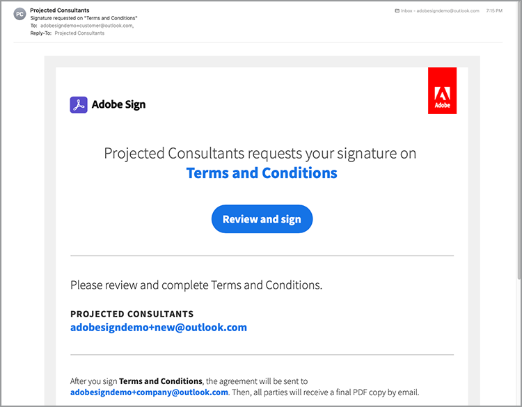

1. 選擇「審查」並簽署&#x200B;****。
1. 選擇 **[!UICONTROL 「繼續]** 接受使用條款」。
1. 選擇 **[!UICONTROL 開始]** ，跳到你需要簽名的位置。

   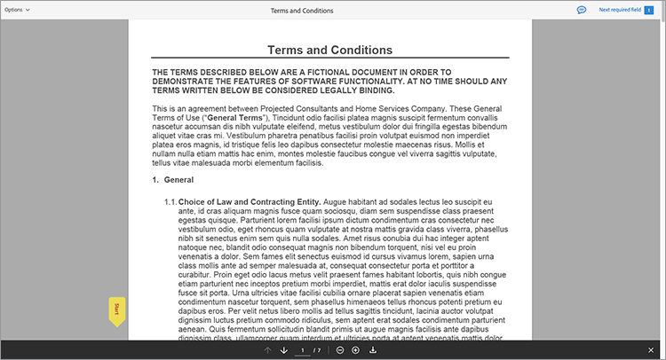

1. 選擇 **[!UICONTROL 點擊此處簽名]**。

   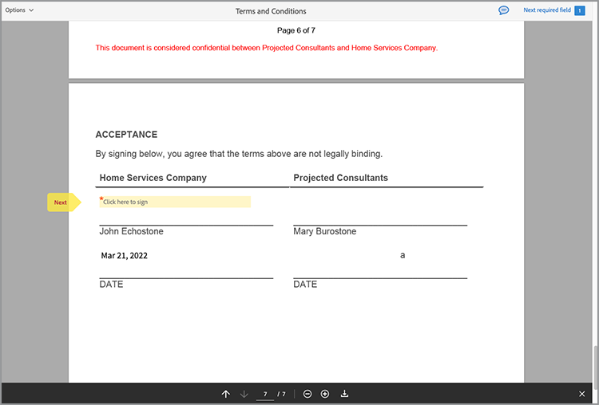

1. 請輸入你的簽名。

   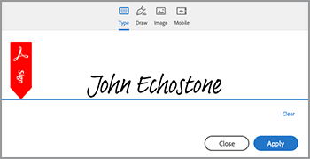

1. 選擇 **[!UICONTROL 「申請」]**。
1. 選取「**[!UICONTROL 按一下以簽署]**」。

下一封電子郵件會寄給下一位簽署人。 重複第9至16步，以查看並簽署第二位簽署者。

協議完成後，簽署的協議副本會透過電子郵件寄送給各方。 此外，簽署的協議可從 Acrobat Sign 網頁介面 **的管理** 頁面取得。

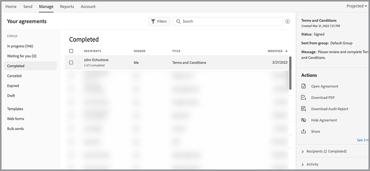

接著，透過 REST API 文件學習如何做同樣的情境。

## 取得證件

1. 前往 [Acrobat Sign REST 文件。](https://secure.na1.adobesign.com/public/docs/restapi/v6)
1. 展開 *transientDocuments* 及 [POST /transientDocuments](https://benprojecteddemo.na1.adobesign.com/public/docs/restapi/v6#!/transientDocuments/createTransientDocument)。
1. 選擇 **[!UICONTROL OAUTH 存取權杖]**。

   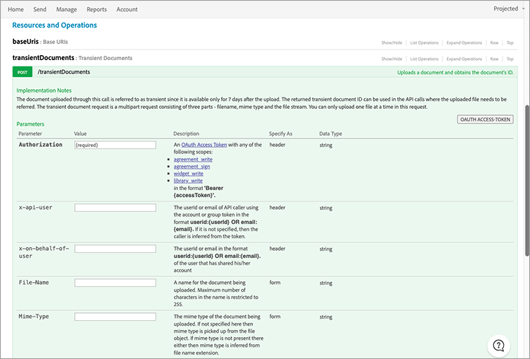

1. 請檢查 OAUTH 的 agreement_write *、* agreement_sign *、* widget_write *和* library_write *權限*。
1. 選擇 **[!UICONTROL 授權]**。
1. 你會透過彈出視窗，要求你用 Acrobat Sign 帳號登入。 登入，使用管理員的使用者名稱和密碼。
1. 系統會提示您允許存取 REST 文件。 選取「**[!UICONTROL 允許存取]**」。

接著會將持有人代幣加入授權&#x200B;****&#x200B;欄位。

想了解更多如何為 Acrobat Sign 建立授權令牌，你可以依照此](https://opensource.adobe.com/acrobat-sign/developer_guide/helloworld.html)處說明[的步驟操作。

## 上傳臨時文件

由於授權權杖是從前幾個步驟新增的，你需要上傳一份文件來進行 API 呼叫：

1. 在 *檔案* 欄位，上傳先前步驟產生的 PDF 文件。

   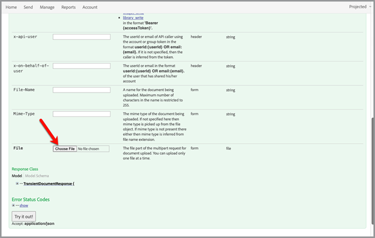

1. 選擇 **[!UICONTROL 「試用！]**」。
1. 在回應主體&#x200B;]**中**[!UICONTROL ，複製 *transientDocumentId* 值。

*transientDocumentID* 用於參考暫時儲存在 Acrobat Sign 的文件，以便在後續的 API 呼叫中被引用。

## 傳送以供簽署

文件上傳後，你需要將協議送去簽署。

1. 擴充協議章節和POST協議章節。
1. 在 *AgreementInfo* 欄位中，輸入以下 JSON：

   ```
   {
   "fileInfos": [
      {
         "transientDocumentId": "3AAABLblqZhAJeoswpyslef8_toTGT1WgBLk3TlhfJXy_uSLlKyre2hjF0-J1meBDn0PlShk0uQy6JghlqEoqXNnskq7YawteF6QWtHefP9wN2CW_Xbt0O9kq1tkpznG0a5-mEm4bYAV1FGOnD1mt_ooYdzKxm7KzTB11DLX2-81Zbe2Z1suy7oXiWNR3VSb-zMfIb5D4oIxF8BiNfN0q08RwT108FcB1bx4lekkATGld3nRbf8ApVPhB72VNrAIF0F1rAFBWTtfgvBKZaxrYSyZq73R_neMdvZEtxWTk5fii_bLVe7VdNZMcO55sofH61eQC_QIIsoYswZP4rw6dsTa68ZRgKUNs"
      }
   ],
   "name": "Terms and Conditions",
   "participantSetsInfo": [
      {
         "memberInfos": [
         {
            "email": "adobesigndemo+customer@outlook.com"
         }
         ],
         "order": 1,
         "role": "SIGNER"
      },
      {
         "memberInfos": [
            {
               "email": "adobesigndemo+company@outlook.com"
            }
         ],
         "order": 1,
         "role": "SIGNER"
         }
   ],
   "signatureType": "ESIGN",
   "state": "IN_PROCESS"
   }
   ```

1. 選擇 **[!UICONTROL 「試用！]**」。

**POST 協議 API** 會回傳協議的 ID。 要取得 JSON 模型架構的範本，請選擇 **最小模型架構**。 完整的參數清單可在完整模型架構&#x200B;**章節中取得**。

## 檢查協議狀態

一旦你有了協議 ID，就可以傳送協議狀態。

1. 擴展 **[!UICONTROL GET /agreements/{agreementId}]**。
1. 因為你可能需要額外的 OAUTH 範圍，請再次選擇 **[!UICONTROL OAUTH-ACCESS-TOKEN]** 。
1. 將先前 API 呼叫回應的 agreementId 複製到 agreementID 欄位。
1. 選擇 **[!UICONTROL 「試試看！]**」。

現在你已經掌握了該協議的資訊。

```
{
    "id": "CBJCHBCAABAAc6LyP4SVuKXP_pNstzIzyripanRdz4IB",
    "name": "Terms and Conditions",
    "groupId": "CBJCHBCAABAAoyMb1yIgczAGhBuJeHf99mglPtM7ElEu",
    "type": "AGREEMENT",
    "participantSetsInfo": [
      {
        "id": "CBJCHBCAABAAzZE-IcHHkt05-AVbxas4Jz7DUl3oEBO6",
        "memberInfos": [
          {
            "email": "adobesigndemo+customer@outlook.com",
            "id": "CBJCHBCAABAAyWgMMReqbxUFM7ctI5xz16c2kOmEy-IQ",
            "securityOption": {
              "authenticationMethod": "NONE"
            }
          }
        ],
        "role": "SIGNER",
        "order": 1
      },
      {
        "id": "CBJCHBCAABAAaRHz3gY2W0w5n_6pj1GMMuZAfhBihc1j",
        "memberInfos": [
          {
            "email": "adobesigndemo+company@outlook.com",
            "id": "CBJCHBCAABAAOZQwjPwJXFiX8YDKPYtzMpftsmxYrIo9",
            "securityOption": {
              "authenticationMethod": "NONE"
            }
          }
        ],
        "role": "SIGNER",
        "order": 1
      }
    ],
    "senderEmail": "adobesigndemo+new@outlook.com",
    "createdDate": "2022-03-22T02:59:36Z",
    "lastEventDate": "2022-03-22T02:59:41Z",
    "signatureType": "ESIGN",
    "locale": "en_US",
    "status": "OUT_FOR_SIGNATURE",
    "documentVisibilityEnabled": true,
    "hasFormFieldData": false,
    "hasSignerIdentityReport": false,
    "documentRetentionApplied": false
  }
```

更新變更時收到通知的更有效率方法是透過 Webhooks，你可以在這裡](https://opensource.adobe.com/acrobat-sign/developer_guide/webhookapis.html)了解更多。[

## 儲存簽署文件

文件簽署後，可以使用 GET /agreements/combinedDocument 檔案檢索。

1. 展開 **[!UICONTROL GET /agreements/{agreementId}/combinedDocument]**。
1. 將 agreementID ]**設**[!UICONTROL &#x200B;為&#x200B;*先前 API 呼叫提供的 agreementId*。
1. 選擇 **[!UICONTROL 「試試看！]**」。

附加稽核報告或支援文件的額外參數可透過 attachSupportingDocuments 與 attachAuditReport 參數設定。

在 **回應主體**&#x200B;中，這些資料可以下載到你的電腦並儲存在你喜歡的位置。

## 更多選擇

除了產生文件並送交簽名外，還有其他操作可用。

例如，若文件沒有簽名，Adobe PDF Services API 提供多種方式，讓您在協議產生後轉換文件，例如：

* 有密碼的安全文件
* 如果有大圖片，請壓縮 PDF
* 想了解更多其他可用的動作，請參考 Adobe PDF Services API 範例檔案中 /src 資料夾中的腳本。 你也可以透過查看各種可用行動的文件來學習更多。

此外，雜技手語還提供多項額外功能，例如：

* 將簽署經驗嵌入申請中
* 新增簽署人身份驗證方法
* 設定電子郵件通知設定
* 作為協議的一部分，下載個別獨立文件

## 進一步學習

想了解更多嗎？ 看看其他一些使用 [!DNL Adobe Acrobat Services]方式：

* 從文件中 [了解更多](https://developer.adobe.com/document-services/docs/overview/)
* 在 Adobe Experience League 上查看更多教學
* 你可以用 /src 資料夾裡的範例腳本來看看怎麼用 PDF
* 追蹤 [Adobe 技術部落格](https://medium.com/adobetech/tagged/adobe-document-cloud) ，獲取最新技巧與秘訣
* 訂閱 [Paper Clips（每月直播），](https://www.youtube.com/playlist?list=PLcVEYUqU7VRe4sT-Bf8flvRz1XXUyGmtF) 了解如何使用 [!DNL Adobe Acrobat Services]自動化。


