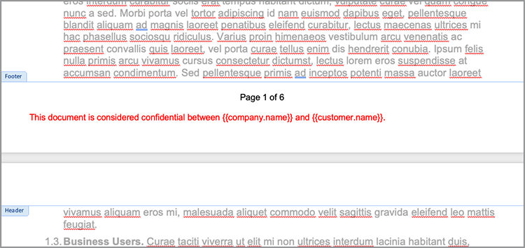
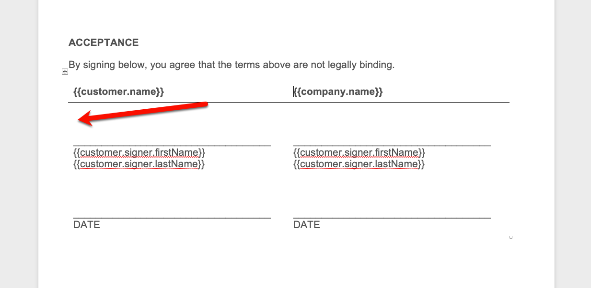

# 自動化法律工作流程


在理想情況下，您不需修改任何合約條款即可接受合約條款。 然而，通常情況下，合約需要自訂，然後需要法律審查。 法律審查會產生重大成本，並降低合約條款的提交流程。 使用根據核准語言變更的預先定義範本，可協助法律團隊管理並更安全地執行合約條款。

此教學課程使用從狀態到狀態不一定的法律合約。 為了解決這些變化，系統會建立具有條件式區段的合約範本，只有在符合特定條件時才包含該區段。 產生的檔可以是 Word 或 PDF 檔。 您也可以瞭解使用 Adobe PDF Services API 或 Acrobat Sign 保護檔的一些方法。

## 取得認證

首先，註冊免費Adobe PDF服務認證：

1. 流覽 [ 這裡 ](https://documentcloud.adobe.com/dc-integration-creation-app-cdn/main.html) 以註冊您的認證。
1. 使用您的Adobe ID登入。
1. 設定您的認證名稱。

   

1. 選擇下載範例程式碼的語言 （例如 Node.js）。
1. 核取「同意 **[!UICONTROL 開發人員條款」]** 。
1. 選取 **[!UICONTROL 「建立認證」]** 。檔案隨即下載至您的電腦，其中包含範例檔案、pdfservices-api-credentials.json 和 private.key 進行驗證。

   

1. 選 **[!UICONTROL 取「取得 Microsoft Word 增益集」]** ，或前往 [ AppSource ](https://appsource.microsoft.com/en-cy/product/office/WA200002654) 進行安裝。

   >[!NOTE]
   >
   >若要安裝 Word 增益集，您必須具備在 Microsoft 365 中安裝增益集的許可權。 如果您沒有許可權，請聯絡您的 Microsoft 365 管理員。

## 您的資料

在此情況下，系統會傳遞相關資訊以協助產生檔，並告知是否應包含特定區段：

```
{
    "customer": {
        "name": "Home Services Company",
        "street": "123 Any Street",
        "city": "Anywhere",
        "state": "CA",
        "zip": "12345",
        "country":"USA",
        "signer": {
            "email": "johnnyechostone@gmail.com",
            "firstName": "John",
            "lastName": "Echostone"
        }
    },
    "company": {
        "name": "Projected Consultants",
        "signer": {
            "email": "maryburostone@gmail.com",
            "firstName": "Mary",
            "lastName": "Burostone"
        }
    },
    "conditions": {
        "includeGeneralTerms": true,
        "includeConsumerDiscloure": true
    }
}
```

在資料中，會提供客戶、其名稱、簽署者、其狀態等相關資訊。 此外，有關公司正在產生合約的相關資訊區段和用於包含合約特定區段的條件旗標。

## 將基本磁碟區標新增至檔

此案例會使用可在此 ](https://github.com/benvanderberg/adobe-document-generation-samples/blob/main/Agreement/exercise/TermsAndConditions_Sample.docx?raw=true) 處下載 [ 的條款與條件檔。


1. 在 *Microsoft Word 中開啟 TermsAndConditions.docx* 範例檔。
1. 如果已安裝「 [ 檔產生」 ](https://appsource.microsoft.com/en-cy/product/office/WA200002654) 外掛程式，請在功能區中選取「 **[!UICONTROL 檔產生]** 」。 如果您的功能區未顯示「檔產生」，請依照下列指示操作。
1. 選 **[!UICONTROL 取開始使用]** 。
1. 將上方寫入的 JSON 範例資料複製到 JSON 資料欄位。

   

導覽至「 *檔產生標記」* 面板，在檔中放置標籤。

## 插入公司名稱

1. 選取您要取代的文字。 在此情況下，您會在檔的開啟區段中取代 COMPANY。
1. 在 *Document Generation Tagger* 中，搜尋「名稱」。
1. 在「公司」底下選擇 *名稱* 。

   

1. 選取「 **[!UICONTROL 插入文字」]** 。

這會放置 `{{company.name}}` 一個名為的標籤，因為該標籤位於 JSON 中的該路徑下。

```
{
    "company": {
        "name": "Projected Consultants",
        ...
    }
    ...
}
```

接下來，請在「CUSTOMER 文字」的開啟區段中重複此步驟。 重複 **步驟 1 到步驟 4** ，在客戶底下以「名稱」取代 CUSTOMER。 輸出內容應 `{{customer.name}}` 會顯示為來自客戶物件下方的文字。

Adobe檔產生API也可讓您在頁首和頁尾以及簽名標題需要前往的端點加入標籤。

針對公司和客戶文字在頁腳中執行步驟 1 至 4 **，再次** 重複此程式。


最後，您需要 **重複步驟 1 至 4** ，以分別標籤 `{{customer.signer.firstName}}` 取代簽名頁面「客戶」區段下的「名字」和 `{{customer.signer.lastName}}` 「姓氏」。 如果標籤很長，且會重排至下一行，請不用擔心，因為系統會在產生檔時取代標籤。

檔開頭和頁尾應類似以下內容：

* 開始區段：


* 頁腳：



* 簽名頁面：


現在，您的標籤已放置在檔中，您可以預覽產生的合約。

## 預覽產生的檔

您可以直接在 Microsoft Word 中根據範例 JSON 資料預覽產生的檔。

1. 在「 *檔產生記錄器」* 中，選取「 **[!UICONTROL 產生檔」]** 。
1. 第一次系統會提示您使用Adobe ID登入。 選 **[!UICONTROL 取「登入]** 」並填寫提示，以使用您的認證登入。

   

1. 選取「檢 **[!UICONTROL 視檔」]** 。

   

1. 瀏覽器視窗隨即開啟，讓您預覽檔結果。

   

## 為每個狀態新增條件條款

在下一個區段中，您僅根據輸入資料條件設定要包含的特定區段。 在範例檔中，第 4 和第 5 節僅與特定狀態相關。 如果是這種情況，只有在客戶處於該狀態時，才應包含特定狀態的條款。 此外，如果已移除 Microsoft Word 中的編號，則不應包含該區段。 使用「檔產生」API條件式內容功能標記此內容。


1. 在檔中，選取「加州揭露」區段和所有子檔。

   

1. 在「 *[!UICONTROL 檔產生記錄器」]* 中，選取「進 **[!UICONTROL 階」]** 。
1. 擴充 **[!UICONTROL 條件式內容]** 。
1. 在 *[!UICONTROL 「選取記錄」]* 欄位中，搜尋並選取 **[!UICONTROL customer.state]** 。
1. 在「 *[!UICONTROL 選取運算子」]* 欄位中，選取 **=** 。
1. 在「 *[!UICONTROL 值」]* 欄位中，輸入 *CA* 。
1. 選取「 **[!UICONTROL 插入條件」]** 。

此區段現在以一些稱為條件式區段標記的標籤包住。 當您新增標籤時，標記可能已新增條件區段標記為編號行。 您可以在標籤之前回溯移除此專案，否則會將專案編號，就像產生檔時標籤不存在一樣。 以條件為條件的區段結尾為 `` 標籤。


**重複「華盛頓揭露」 *區段的* 步驟 1 至 7** ，以 WA *取代* CA *值* ，表示只有在客戶的州是華盛頓時才會顯示此區段。


## 使用條件式區段進行測試

在設定條件式區段後，您可以選 **取「產生檔」來預覽檔** 。

產生檔時，請注意，所包含的區段僅符合資料標準。 在下列範例中，因為該州等於 CA，因此只包含加州區段。


另一個顯著的變更是後續區段「使用服務」和「軟體」的編號為 5。 這表示在省略「華盛頓」區段時，頁碼會繼續。


若要測試客戶在華盛頓特區 （而不是加州） 時範本是否正確運作，請變更範本的範例資料：

1. 在 Document *Generation Tagger 中* ，選取「 **[!UICONTROL 編輯輸入資料」]** 。

   

1. 選取「 **[!UICONTROL 編輯」]** 。

1. 在 JSON 資料中，將 CA *變更* 為 *WA* 。

   

1. 選取「 **[!UICONTROL 產生標籤」]** 。
1. 選 **[!UICONTROL 取「產生檔]** 」以重新產生檔。

請注意，檔只包含「華盛頓州」區段。


## 新增條件句子

如同條件式區段，您也可以在符合特定條件時包含特定句子。 舉例來說，美國加州和華盛頓的退貨政策不同。

1. 在第 3.1 節中，選取第一句：「在華盛頓特區購買時，必須在原始交易後的 30 天內透過郵件傳回客戶，以取得全額退款。」
1. 在「 *[!UICONTROL 檔產生記錄器」]* 中，選取「進 **[!UICONTROL 階」]** 。
1. 擴充 **[!UICONTROL 條件式內容]** 。
1. 在「內容」類型下 *[!UICONTROL 方，選取&#x200B;**[!UICONTROL 「片語」]**。]*
1. 在 *[!UICONTROL 「選取記錄」]* 欄位中，搜尋並選取 **[!UICONTROL customer.state]** 。
1. 在「 *[!UICONTROL 選取運算子」]* 欄位中，選取 **=** 。
1. 在「 *[!UICONTROL 值」]* 欄位中，輸入 *CA* 。
1. 選取「 **[!UICONTROL 插入條件」]** 。

雖然標籤的名稱相同，但「片語」和「區段」的主要不同之處在于，片語有不包含新行的區段。 條件區段標籤和 -end-section 標籤必須位在同一段落中。


## 新增 Acrobat Sign 標籤

Acrobat Sign 可讓您傳送合約以索取簽名，或嵌入網頁體驗，讓其他人輕鬆檢視及簽署。 Microsoft Word 中的 Adobe Document Generation Tagger 可讓您在使用 Acrobat Sign 傳送檔之前輕鬆預先標記檔，因此簽名一律會放置在正確的位置。 在這種情況下，有兩位簽署者需要一個簽署位置和檔日期。

1. 流覽至客戶必須簽署的地方。
1. 將游標放在簽名需要前往的位置。

   

1. 在 *[!UICONTROL 「檔產生記錄器」]* 中，選 **[!UICONTROL 取「Adobe Sign]** 」。
1. 在 *[!UICONTROL 「指定收件者數目]* 」欄位中，設定收件者人數 （此範例使用 2）。
1. 在「 *[!UICONTROL 收件者」]* 欄位中，選取 **[!UICONTROL 「簽署者-1」]** 。
1. 在「字 *[!UICONTROL 段]* 」類型中，選取「 **[!UICONTROL 簽名」]** 。
1. 選取 **[!UICONTROL 「插入Adobe Sign文字標籤」]** 。

   

>[!NOTE]
>
>**如果「插入Adobe Sign文字標籤** 」按鈕似乎遺失，請向下捲動。

這會放置第一個簽署者需要簽署的簽名欄位。


接下來，為簽署者放置資料欄位，該簽署者在簽署時會自動填入該欄位。

1. 移動游標以放置日期的位置。

   

1. 將欄位類型設為「日期」。
1. 選取 **[!UICONTROL 「插入Adobe Sign文字標籤」]** 。

放置的日期標籤較長： `{{Date 3_es_:signer1:date:format(mm/dd/yyyy):font(size=Auto)}}` 。 Acrobat Sign 文字標籤必須維持在同一行，這與「檔產生」標籤不同。 和 `:format()` `font()` 參數是選用的，所以對於這個情況，我們可以將標籤縮短到 `{{Date 3_es_:signer1:date}}` 。

重複「公司簽名 *」區段上方的* 步驟。執行此動作時，您必須將「收件者」欄位變更為 **「簽署者 2** 」，否則所有簽名欄位都會指派給同一人。

## 產生您的合約

您現在已為檔加上標籤，準備就緒。 在下一節中，瞭解如何使用「檔產生」API Node.js 範例來產生檔。 這些範例適用于任何語言。

在註冊認證時，開啟您下載的 pdfservices-node-sdk-samples-master 檔案。 這些檔案包括 pdfservices-api-credentials.json 和 private.key 檔案。

1. 開啟終端 **[!UICONTROL 機]** 以使用 `npm install` .
1. 將範例 *data.json* 複製到 *資源檔* 夾中。
1. 複製您在資源檔 *夾中建立的* Word 範本。
1. 在名為 *generate-salesOrder.js* 的範例檔案夾的根目錄中建立一個新的檔案。

   ```
   const PDFServicesSdk = require('@adobe/pdfservices-node-sdk').
   const fs = require('fs');
   const path = require('path');
   
   var dataFileName = path.join('resources', '<INSERT JSON FILE');
   var outputFileName = path.join('output', 'salesOrder_'+Date.now()+".pdf");
   var inputFileName = path.join('resources', '<INSERT DOCX>');
   
   //Loads credentials from the file that you created.
   const credentials =  PDFServicesSdk.Credentials
      .serviceAccountCredentialsBuilder()
      .fromFile("pdfservices-api-credentials.json")
      .build();
   
   // Setup input data for the document merge process
   const jsonString = fs.readFileSync(dataFileName),
   jsonDataForMerge = JSON.parse(jsonString);
   
   // Create an ExecutionContext using credentials
   const executionContext = PDFServicesSdk.ExecutionContext.create(credentials);
   
   // Create a new DocumentMerge options instance
   const documentMerge = PDFServicesSdk.DocumentMerge,
   documentMergeOptions = documentMerge.options,
   options = new documentMergeOptions.DocumentMergeOptions(jsonDataForMerge, documentMergeOptions.OutputFormat.PDF);
   
   // Create a new operation instance using the options instance
   const documentMergeOperation = documentMerge.Operation.createNew(options)
   
   // Set operation input document template from a source file.
   const input = PDFServicesSdk.FileRef.createFromLocalFile(inputFileName);
   documentMergeOperation.setInput(input);
   
   // Execute the operation and Save the result to the specified location.
   documentMergeOperation.execute(executionContext)
   .then(result => result.saveAsFile(outputFileName))
   .catch(err => {
      if(err instanceof PDFServicesSdk.Error.ServiceApiError
         || err instanceof PDFServicesSdk.Error.ServiceUsageError) {
         console.log('Exception encountered while executing operation', err);
      } else {
         console.log('Exception encountered while executing operation', err);
      }
   });
   ```

1. 以 /resources 中的 JSON 檔案名稱取代 `<JSON FILE>` 。
1. 以 DOCX 檔案的名稱取代 `<INSERT DOCX>` 。
1. 若要執行，請使用 **[!UICONTROL 「終端機]** 」執行節點 `generate-salesOrder.js` 。

輸出檔案位於 /output 檔案夾，並正確產生檔。

您可以變更下列文字行來變更格式。 如果要傳送此檔供他人在 Word 中編輯或合約審核，DOCX 格式會很有説明。

PDF:

```
options = new documentMergeOptions.DocumentMergeOptions(jsonDataForMerge,
documentMergeOptions.OutputFormat.PDF);
```

Word:

```
options = new documentMergeOptions.DocumentMergeOptions(jsonDataForMerge, documentMergeOptions.OutputFormat.DOCX);
```

您也必須分別為 PDF 或 DOCX 輸出格式，將輸出檔案的名稱變更為 .pdf 或 .docx：

```
var outputFileName = path.join('output', 'salesOrder_'+Date.now()+".docx");
```

## 傳送合約以供簽署

[Adobe Acrobat Sign ](https://www.adobe.com/tw/sign.html) 可讓您將合約傳送給一或多個收件者，讓收件者檢視和簽署檔。 除了可傳送檔以供簽署的簡單使用者體驗之外，您還可以使用 REST API 來取得 Word、PDF、HTML 和其他格式，並傳送以索取簽名。

以下範例逐步說明如何使用 REST API 檔頁面來取得先前產生的檔並傳送以供簽署。 首先，瞭解如何透過 Acrobat Sign 網頁介面執行此動作，然後使用 REST API 操作。

## 取得Acrobat Sign 帳戶

如果您沒有 Acrobat Sign 帳戶，請註冊開發人員帳戶並在這裡 ](https://developer.adobe.com/adobesign-api/) 檢閱檔 [ ，然後選取「 **開發人員帳戶註冊」** 。系統會提示您填寫表單並接收驗證電子郵件。 執行此操作後，系統會將您導向網站設定密碼和帳戶，然後在該網站上登入 Acrobat Sign。

## 從網頁介面傳送合約

1. 從導覽列選取「 **[!UICONTROL 傳送]** 」。

   

1. 在「 *收件者」* 欄位中，指定兩個電子郵件地址。 最好使用與您的 Acrobat Sign 帳戶無關的電子郵件地址。

   

1. 設定「合約名稱 ]**」和**[!UICONTROL  「 **[!UICONTROL 訊息」]** 。
1. 選取 **[!UICONTROL 「新增檔案]** 」，然後從您的電腦上傳產生的檔案。
1. 選取&#x200B;**[!UICONTROL 「預覽和新增簽名欄位」]**。
1. 選取「**[!UICONTROL 下一步]**」。
1. 向下捲動至簽名頁面時，您可以根據標籤查看已放置的簽名欄位。

   

1. 選取「**[!UICONTROL 傳送]**」。
1. 在電子郵件中，畫面會出現要檢視和簽署的連結訊息。

   

1. 選取 **[!UICONTROL 「檢閱並簽署」]** 。
1. 選取 **[!UICONTROL 「繼續]** 」以接受使用條款。
1. 選取 **[!UICONTROL 「開始]** 」，跳至您需要簽署的位置。

   

1. 選 **[!UICONTROL 取「按一下這裡」以簽署]** 。

   

1. 輸入您的簽名。

   

1. 選取「 **[!UICONTROL 套用」]** 。
1. 選取「 **[!UICONTROL 按一下以簽署」]** 。

系統會傳送電子郵件給下一位簽署者。 重複步驟 9 到步驟 16，即可檢視及簽署第二位簽署者。

合約完成後，系統會透過電子郵件將合約的已簽署副本傳送給各方。 此外，您也可以從「管理 **」頁面中的「Acrobat Sign 網頁介面」** 擷取已簽署的合約。


接下來，透過 REST API檔瞭解如何執行相同案例。

## 取得認證

1. 導覽至「 [ Acrobat簽署 REST 檔」 ](https://secure.na1.adobesign.com/public/docs/restapi/v6) 。
1. 展開 *transientDocuments* 和 [ POST /transientDocuments ](https://benprojecteddemo.na1.adobesign.com/public/docs/restapi/v6#!/transientDocuments/createTransientDocument) 。
1. 選取 **[!UICONTROL 「OAUTH ACCESS-TOKEN」]** 。

   

1. 檢查agreement_write、agreement_sign *、* widget_write ** *和* library_write的 OAUTH 權 *限。*
1. 選取 **[!UICONTROL 「授權」]** 。
1. 系統會透過快顯視窗提示您使用Acrobat Sign 帳戶登入。 登入管理員的使用者名稱和密碼。
1. 系統會提示您允許存取 REST 檔。 選取「 **[!UICONTROL 允許存取」]** 。

然後將持有人字元新增至「 **授權** 」欄位。

若要進一步瞭解如何為 Acrobat Sign 建立授權權杖，您可以依照此 ](https://opensource.adobe.com/acrobat-sign/developer_guide/helloworld.html) 處所述的 [ 步驟操作。

## 上傳暫時性檔

由於已從先前步驟新增授權權杖，您必須上傳檔才能進行API呼叫：

1. 在 *「檔案」* 欄位中，上傳先前步驟中產生的 PDF 檔。

   

1. 選 **[!UICONTROL 取「試用！」]** 。
1. 在 **[!UICONTROL 「回應內文」]** 中，複製 *transientDocumentId* 值。

transientDocumentId ** 用於參照暫時儲存在 Acrobat Sign 中的檔，以便在後續的API呼叫中參照該檔。

## 傳送供簽名

上傳檔後，您必須傳送合約以供簽署。

1. 展開合約區段並POST合約區段。
1. 在「AgreementInfo *」* 欄位中，以下列 JSON 填入該欄位：

   ```
   {
   "fileInfos": [
      {
         "transientDocumentId": "3AAABLblqZhAJeoswpyslef8_toTGT1WgBLk3TlhfJXy_uSLlKyre2hjF0-J1meBDn0PlShk0uQy6JghlqEoqXNnskq7YawteF6QWtHefP9wN2CW_Xbt0O9kq1tkpznG0a5-mEm4bYAV1FGOnD1mt_ooYdzKxm7KzTB11DLX2-81Zbe2Z1suy7oXiWNR3VSb-zMfIb5D4oIxF8BiNfN0q08RwT108FcB1bx4lekkATGld3nRbf8ApVPhB72VNrAIF0F1rAFBWTtfgvBKZaxrYSyZq73R_neMdvZEtxWTk5fii_bLVe7VdNZMcO55sofH61eQC_QIIsoYswZP4rw6dsTa68ZRgKUNs"
      }
   ],
   "name": "Terms and Conditions",
   "participantSetsInfo": [
      {
         "memberInfos": [
         {
            "email": "adobesigndemo+customer@outlook.com"
         }
         ],
         "order": 1,
         "role": "SIGNER"
      },
      {
         "memberInfos": [
            {
               "email": "adobesigndemo+company@outlook.com"
            }
         ],
         "order": 1,
         "role": "SIGNER"
         }
   ],
   "signatureType": "ESIGN",
   "state": "IN_PROCESS"
   }
   ```

1. 選 **[!UICONTROL 取「試用！」]** 。

**POST合約API** 傳回合約的 ID。 若要取得 JSON 模型結構的範本，請選取「 **最小模型結構」** 。 您可以在「完成模型結構 **」區段中** 找到完整的參數清單。

## 檢查合約的狀態

一旦您有合約 ID，就可以傳送合約狀態。

1. 展開 **[!UICONTROL GET /agreements/ {agreementId}]** 。
1. 由於您可能需要額外的 OAUTH 範圍，請再次選 **[!UICONTROL 取「OAUTH-ACCESS-TOKEN」]** 。
1. 將上一個API呼叫回應的 agreementId 複製到 agreementId 欄位。
1. 選取 **[!UICONTROL 「試用！」]** 。

現在您可以取得該合約的相關資訊。

```
{
    "id": "CBJCHBCAABAAc6LyP4SVuKXP_pNstzIzyripanRdz4IB",
    "name": "Terms and Conditions",
    "groupId": "CBJCHBCAABAAoyMb1yIgczAGhBuJeHf99mglPtM7ElEu",
    "type": "AGREEMENT",
    "participantSetsInfo": [
      {
        "id": "CBJCHBCAABAAzZE-IcHHkt05-AVbxas4Jz7DUl3oEBO6",
        "memberInfos": [
          {
            "email": "adobesigndemo+customer@outlook.com",
            "id": "CBJCHBCAABAAyWgMMReqbxUFM7ctI5xz16c2kOmEy-IQ",
            "securityOption": {
              "authenticationMethod": "NONE"
            }
          }
        ],
        "role": "SIGNER",
        "order": 1
      },
      {
        "id": "CBJCHBCAABAAaRHz3gY2W0w5n_6pj1GMMuZAfhBihc1j",
        "memberInfos": [
          {
            "email": "adobesigndemo+company@outlook.com",
            "id": "CBJCHBCAABAAOZQwjPwJXFiX8YDKPYtzMpftsmxYrIo9",
            "securityOption": {
              "authenticationMethod": "NONE"
            }
          }
        ],
        "role": "SIGNER",
        "order": 1
      }
    ],
    "senderEmail": "adobesigndemo+new@outlook.com",
    "createdDate": "2022-03-22T02:59:36Z",
    "lastEventDate": "2022-03-22T02:59:41Z",
    "signatureType": "ESIGN",
    "locale": "en_US",
    "status": "OUT_FOR_SIGNATURE",
    "documentVisibilityEnabled": true,
    "hasFormFieldData": false,
    "hasSignerIdentityReport": false,
    "documentRetentionApplied": false
  }
```

更新變更時，收到通知的效率更高的方法是透過 Webhook，您可以在這裡 ] 深入瞭解 [ （https://opensource.adobe.com/acrobat-sign/developer_guide/webhookapis.html。

## 儲存已簽署的檔

簽署檔後，可以使用 GET /agreements/combinedDocument 檔案擷取檔。

1. 展開 **[!UICONTROL GET /agreements/ {agreementId} combinedDocument]** 。
1. 將 agreementId ]**設定**[!UICONTROL  為 *上一個API呼叫所提供的 agreementId* 。
1. 選取 **[!UICONTROL 「試用！」]** 。

您可使用 attachSupportingDocuments 和 attachAuditReport 參數來設定附加稽核報告或支援檔的其他參數。

然後，您可以在「 **回應內** 文」中，將其下載到您的電腦，並儲存在您喜歡的位置。

## 更多選項

除了產生檔並傳送檔以供簽署外，您也可以執行其他動作。

例如，如果檔沒有簽名，Adobe PDF服務API提供許多在產生合約後轉換檔的方式，例如：

* 具密碼的安全檔
* 如果有大型影像，請壓縮 PDF
* 若要深入瞭解可用的其他操作，請查看 Adobe PDF Services API 範例檔案中 /src 檔案夾中的腳本。 您也可以檢視可使用之不同動作的檔，進一步瞭解。

此外，Acrobat Sign 還提供數種其他功能，例如：

* 將簽署體驗嵌入應用程式
* 為簽署者新增身分驗證方法
* 設定電子郵件通知設定
* 下載合約的個別個別檔

## 進一步學習

有興趣瞭解更多資訊嗎？ 請參閱其他使用 [!DNL Adobe Acrobat Services] 方式：

* 進一步 [ 瞭解檔](https://developer.adobe.com/document-services/docs/overview/)
* 觀看更多有關Adobe Experience League的教學課程
* 使用 /src 檔案夾中的範例腳本，查看如何使用 PDF
* 關注 [ Adobe Tech Blog ](https://medium.com/adobetech/tagged/adobe-document-cloud) 瞭解最新的提示和秘訣
* [訂閱「紙本剪輯片段」（每月直播串流）， ](https://www.youtube.com/playlist?list=PLcVEYUqU7VRe4sT-Bf8flvRz1XXUyGmtF) 以瞭解如何使用 [!DNL Adobe Acrobat Services] 。
