# 數字文檔發佈


電子文檔無處不在 — 事實上，全球可能有[萬億PDF](https://itextpdf.com/en/blog/technical-notes/do-you-know-how-many-pdf-documents-exist-world)，而且這個數字每天都在增加。 通過在網頁中嵌入PDF查看器，用戶可以查看文檔，而無需重新設計HTML和CSS或阻礙對網站的訪問。

讓我們來探討一下流行的場景。 公司在其網站上發佈[白皮書](https://developer.adobe.com/document-services/use-cases/content-publishing/digital-content-publishing)
為他們的應用和服務提供上下文。 該網站的營銷人員希望更好地理解用戶如何與基於PDF的內容進行互動，並將其與網頁和品牌相結合。 他們決定將白皮書作為[門控內容](https://whatis.techtarget.com/definition/gated-content-ungated-content#:~:text=Gated%20content%20is%20online%20materials,about%20their%20jobs%20and%20organizations.)發佈，以控制哪些人可以下載這些白皮書。

## 你能學到的

在本操作教程中，瞭解如何使用[Adobe PDF嵌入式API](https://developer.adobe.com/document-services/apis/pdf-embed)在網頁內顯示嵌入式PDF文檔，該API免費且易於使用。 這些示例使用一些JavaScript、Node.js、Express.js、HTML和CSS。 您可以在[GitHub](https://www.google.com/url?q=https://github.com/marcelooliveira/EmbedPDF/tree/main/pdf-app&sa=D&source=editors&ust=1617129543031000&usg=AOvVaw2rzSwYuJ_JI7biVIgbNMw1)上查看完整的項目代碼。

## 相關API和資源

* [PDF嵌入API](https://www.adobe.com/devnet-docs/dcsdk_io/viewSDK/index.html)

* [PDF服務API](https://opensource.adobe.com/pdftools-sdk-docs/release/latest/index.html)

* [項目代碼](https://www.google.com/url?q=https://github.com/marcelooliveira/EmbedPDF/tree/main/pdf-app&sa=D&source=editors&ust=1617129543031000&usg=AOvVaw2rzSwYuJ_JI7biVIgbNMw1)

## 建立節點Web應用

讓我們從使用Node.js和Express建立站點開始，該站點使用外觀美觀的模板，並提供多個PDF供下載。

首先，[下載並安裝Node.js](https://nodejs.org/en/download/)。

要以最小的Web應用程式結構輕鬆建立Node.js項目，請安裝應用程式生成器工具`` `express-generator` ``。

```
npm install express-generator -g
```

接下來，建立名為pdf-app的新Express應用，選擇作為視圖引擎。

```
express pdf-app --view=ejs
```

現在，移到\\pdf-app目錄並安裝所有項目依賴項。

```
cd pdf-app
npm install
```

然後，啟動本地Web伺服器並運行應用程式。

```
npm start
```

最後，在<http://localhost:3000>開啟網站。

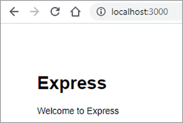

您現在有一個基本的網站。

## 呈現白皮書資料

要向網站發佈白皮書，將在網站上定義和準備白皮書資料以顯示這些文檔。 首先，在項目根目錄中新建\\data資料夾。 有關可用白皮書的資訊來自名為[data.json](https://github.com/marcelooliveira/EmbedPDF/blob/main/pdf-app/data/data.json)的新檔案，該檔案放在資料資料夾中。

要為Web應用提供漂亮、精美的外觀，請安裝[Bootstrap](https://getbootstrap.com/)和[Font Awesome](https://fontawesome.com/)前端庫。

```
npm install bootstrap
npm install font-awesome
```

開啟app.js檔案並將這些目錄作為靜態檔案的源，將其置於現有`` `express.static` ``行之後。

```
app.use(express.static(path.join(__dirname, '/node_modules/bootstrap/dist')));
app.use(express.static(path.join(__dirname, '/node_modules/font-awesome')));
```

要包括PDF文檔，請在項目的\\public資料夾下建立一個名為\\pdf的資料夾。 您不能自己建立PDF和縮略圖，而是可以將它們從此[GitHub儲存庫資料夾](https://github.com/marcelooliveira/EmbedPDF/tree/main/pdf-app/public)複製到\pdf和\\image資料夾。

\\public\\pdfs資料夾現在包含PDF文檔：

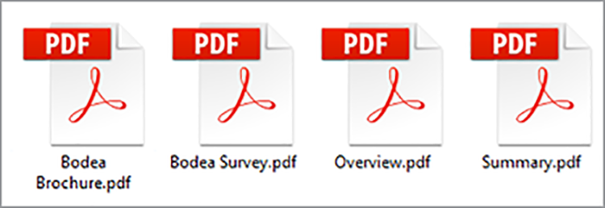

\\public\\images資料夾應包含每個PDF文檔的縮略圖：

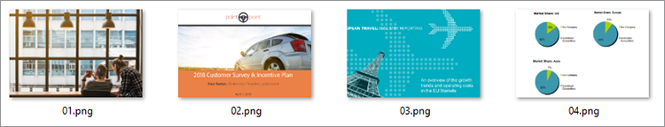

現在，開啟\\routes\\index.js檔案，該檔案包含用於路由首頁的邏輯。 要使用data.json檔案中的白皮書資料，必須載入負責訪問和與檔案系統交互的Node.js模組。 然後，在\\routes\\index.js檔案的第一行中聲明`fs`常數，如下所示：

```
const fs = require('fs');
```

然後，讀取並解析data.json檔案，並將其儲存在papers變數中：

```
let rawdata = fs.readFileSync('data/data.json');
let papers = JSON.parse(rawdata);
```

現在，修改行以調用索引視圖的呈現方法，將論文集作為索引視圖的模型傳遞。

```
res.render('index', { title: 'Embedding PDF', papers: papers });
```

若要在首頁上呈現白皮書集合，請開啟\\views\\index.ejs檔案，並用項目的[索引檔案](https://github.com/marcelooliveira/EmbedPDF/blob/main/pdf-app/views/index.ejs)中的代碼替換現有代碼。

現在，重新運行npm start並開啟<http://localhost:3000>以查看您的可用白皮書集合。

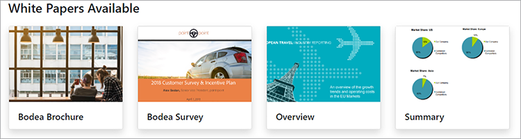

在下一節中，涉及增強網站並使用[PDF嵌入API](https://developer.adobe.com/document-services/apis/pdf-embed)來顯示網頁的PDF文檔。 PDF嵌入API是免費使用的 — 您只需要獲得API憑據。

## 獲取PDF嵌入API憑據

若要獲取免費PDF嵌入API憑據，請在註冊新帳戶或登錄到現有帳戶後訪問[開始](https://www.adobe.io/apis/documentcloud/dcsdk/gettingstarted.html)頁。

按一下&#x200B;**新建憑據**，然後&#x200B;**開始：**

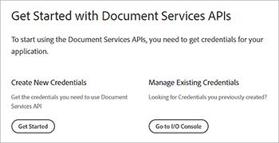

此時，如果您沒有免費帳戶，則要求您註冊免費帳戶。

選擇&#x200B;**PDF嵌入API**，然後鍵入您的憑據名稱和應用程式域。 使用&#x200B;**localhost**&#x200B;域，因為在本地測試Web應用。

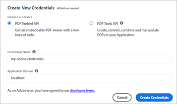

按一下&#x200B;**建立憑據**&#x200B;按鈕以訪問您的PDF憑據並獲取客戶端ID（API密鑰）。

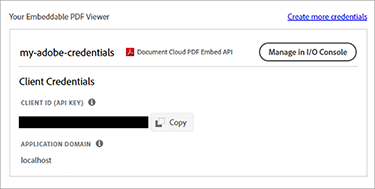

在Node.js項目中，在應用程式的根資料夾中建立一個名為.ENV的檔案，並使用上一步中的API KEY憑據值為PDF嵌入客戶端ID聲明環境變數。

```
PDF_EMBED_CLIENT_ID=**********************************************
```

稍後，您將使用此客戶端ID訪問PDF嵌入API。 安裝dotenv軟體包以使用Node.js代碼訪問此環境變數。

```
npm install dotenv
```

現在，開啟app.js檔案，並在檔案頂部添加以下行，以便Node.js可以載入dotenv模組：

```
require('dotenv').config();
```

## 在Web應用中顯示PDF

現在，使用PDF嵌入API在站點上顯示PDF。 開啟即時[PDF嵌入API演示](https://documentcloud.adobe.com/view-sdk-demo/index.html#/view/FULL_WINDOW/Bodea%20Brochure.pdf)。

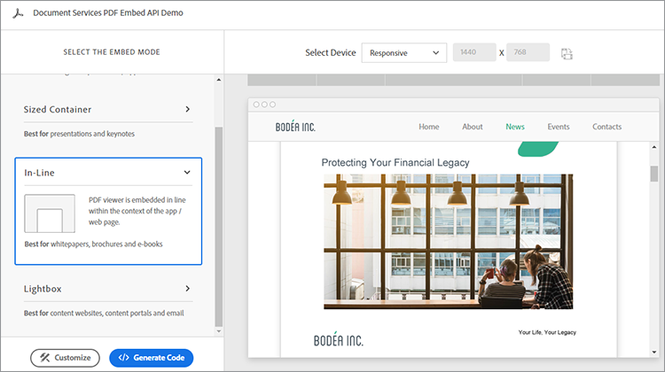

在左側面板上，您可以選擇最適合您網站需要的嵌入模式：

* **完整窗口**:PDF覆蓋所有網頁空間

* **大小容器**：該PDF在網頁內顯示，一次一頁，在大小有限的div中

* **行內**：整個PDF顯示在網頁內的div中

* **Lightbox**:PDF顯示為網頁頂部的圖層

建議稍後使用白皮書的串聯嵌入模式和代碼生成器在應用程式中嵌入PDF。

## 建立串聯嵌入模式頁

要在網頁中嵌入PDF查看器並同時顯示所有頁面，請使用串聯嵌入模式建立新頁面。

使用EJS視圖引擎在檔案\\views\\in-line.ejs中建立新視圖。

```
<! html DOCTYPE >
<html>
<head>
<title>
<%= title %>
</title>
<link rel='stylesheet' href='/stylesheets/style.css' />
<link rel='stylesheet' href='/css/bootstrap.min.css'/>
<link rel='stylesheet' href='/css/font-awesome.min.css' />
<style type="text/css">
p {
font-family: 'Gill Sans', 'Gill Sans MT', Calibri, 'Trebuchet MS', sans-serif
}
</style>
</head>
<body class="m-0">
<div>
<main>
<div class="row">
<div class="col-sm-3"></div>
<div class="col-sm-6">
<h3>
<p class="text-center">Grow your business, establish your brand,<br
/>
```

把顧客放在首位。

```
</p>
</h3>
<div>
<p class="text-center">Lorem ipsum dolor sit amet, consectetur adipiscing elit, sed do<br />
eiusmod tempor incididunt ut labore et dolore</p>
</div>
</div>
</main>
<footer>
<div class="row">
<div class="col-sm-3"></div>
<div class="col-sm-6">
<p class="text-center">Bodea Inc. Your trusted partner since 2008</p>
</div>
</div>
</footer>
</div>
</div>
</body>
</html>
```

然後，修改\\views\\index.ejs以建立按鈕以開啟聯機視圖。

```
<div class="card-body">
<h5 class="card-title">
<span>
<%= paper.title %>
</span>
</h5>
<p>
<a class="btn btn-sm btn btn-danger" href="/in-line/<%=
paper.id %>">
<span type="button"></span>
<span class="fa fa-file-pdf-o"></span>&nbsp;View Document</button>
</a>
</p>
</div>
```

開啟app.js檔案，並在indexRouter聲明後聲明新路由器：

```
var indexRouter = require('./routes/index');
var inLineRouter = require('./routes/in-line');
```

然後在app.use(&#39;/&#39;, indexRouter)後添加此代碼；將串聯嵌入模式視圖與其路由器相關聯：

```
app.use('/', indexRouter);
app.use('/in-line', inLineRouter);
```

現在，在\\routes下新建in-line.js檔案以建立新路由器邏輯。 包括Express，一個節點模組，用於啟用Web應用程式後端。

```
var express = require('express');
const fs = require('fs');
var router = express.Router();
```

接下來，建立一個端點，該端點處理特定白皮書ID的GET請求並呈現in-line.ejs視圖。

```
router.all('/:id', function(req, res, next) {
let rawdata = fs.readFileSync('data/data.json');
let papers = JSON.parse(rawdata);
let paper = papers.filter(p => p.id == parseInt(req.params.id))[0];
res.render('in-line', { title: paper.title, paper: paper });
});
module.exports = router;
```

再次查看[即時演示](https://documentcloud.adobe.com/view-sdk-demo/index.html#/view/FULL_WINDOW/Bodea%20Brochure.pdf)以自動生成PDF嵌入API代碼。 從左面板中按一下&#x200B;**行內**:


按一下&#x200B;**生成代碼**，查看顯示大小容器HTML查看器所需的PDF代碼。

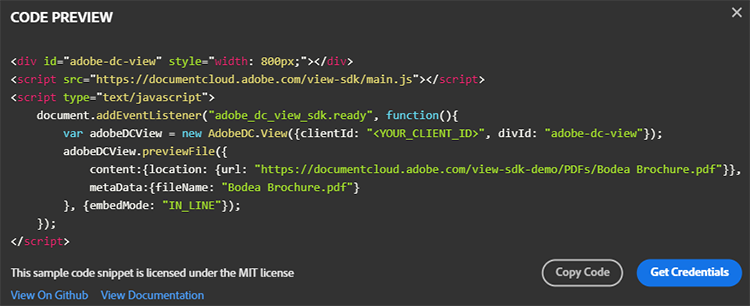

按一下&#x200B;**複製代碼**，然後將代碼貼上到in-line.ejs檔案中。

```
<div>
<p class="text-center">Lorem ipsum dolor sit amet, consectetur adipiscing elit, sed do<br />
eiusmod tempor incididunt ut labore et dolore</p>
</div>
<div class="row align-items-center border border-primary">
<div id="adobe-dc-view" style="width: 800px;"></div>
<script src="https://documentcloud.adobe.com/view-sdk/main.js"></script>
<script type="text/javascript">
document.addEventListener("adobe_dc_view_sdk.ready", function(){
var adobeDCView = new AdobeDC.View({clientId: "<YOUR_CLIENT_ID>", divId: "adobe-dc-view"});
adobeDCView.previewFile({
content:{location: {url: "https://documentcloud.adobe.com/view-sdk-demo/PDFs/Bodea Brochure.pdf"}},
metaData:{fileName: "Bodea Brochure.pdf"}
}, {embedMode: "IN_LINE"});
});
</script>
</div>
```

但是，文檔參數仍然是硬編碼的。 讓我們用EJS括弧語法(\&lt;%= someValue %\>)替換它們，以根據白皮書模型資料呈現頁面。

```
<div id="adobe-dc-view" style="width: 800px;"></div>
<script src="https://documentcloud.adobe.com/view-sdk/main.js"></script>
<script type="text/javascript">
document.addEventListener("adobe_dc_view_sdk.ready", function () {
var adobeDCView = new AdobeDC.View({ clientId: "<%=process.env.PDF_EMBED_CLIENT_ID %>", divId: "adobe-dc-view" });
adobeDCView.previewFile({
content: { location: { url: "<%= paper.pdf %>" } },
metaData: { fileName: "<%= paper.fileName %>" }
}, {
embedMode: "IN_LINE"
});
});
</script>
```

現在，使用npm start命令運行應用程式，並在<http://localhost:3000>處開啟網站。

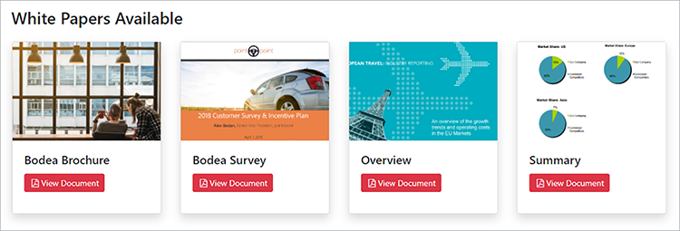

最後，選擇一份白皮書，然後按一下&#x200B;**查看文檔**&#x200B;以開啟具有內嵌PDF的新頁面：

的螢幕截圖

請注意「Download（下載）」PDF和「Print（打印）」PDF選項現在的顯示方式。

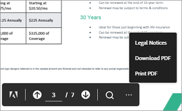

你想控制後端的這些標誌。 之後，您可以基於用戶身份實施授權控制，並根據業務規則限制訪問。 此處不需要這種複雜性，因此，我們只需修改\\routes\\in-line.js即可在模型對象中包含經過驗證的屬性和權限屬性。

```
let authenticated = false;
res.render('in-line', {
title: paper.title,
paper: paper,
authenticated: authenticated,
permissions: {
showDownloadPDF: true,
showPrintPDF: true,
showFullScreen: true
}
});
```

然後，修改\\views\\in-line.ejs，以便您的網頁可以呈現來自後端的標籤值。

```
embedMode: "IN_LINE",
showDownloadPDF: <%= permissions.showDownloadPDF %>,
showPrintPDF: <%= permissions.showPrintPDF %>,
showFullScreen: <%= permissions.showFullScreen %>
Now, open the in-line.js route file and modify it to disallow the printing, downloading, and full-screen controls.
permissions: {
showDownloadPDF: false,
showPrintPDF: false,
showFullScreen: false
}
```

然後，重新運行應用程式以查看此更改在PDF查看器中的反映情況。


## 建立封閉內容

根據最終用戶情景，該公司網站的營銷人員希望更好地瞭解用戶如何與基於PDF的內容進行交互，並將內容納入其網頁和品牌的其餘部分。

我們的重點是PDF嵌入，因此您不會建立用戶身份驗證功能。 相反，只需使用Web表單來實現一個簡單的、假的付費牆，該表單接受某些用戶資訊，然後在用戶提交表單後顯示PDF文檔。

將\\routes\\in-line.js檔案替換為以下內容，以向視圖模型提供用戶資訊：

```
var express = require('express');
const fs = require('fs');
var router = express.Router();
router.all('/:id', function(req, res, next) {
let rawdata = fs.readFileSync('data/data.json');
let papers = JSON.parse(rawdata);
let paper = papers.filter(p => p.id == parseInt(req.params.id))[0];
let authenticated = false;
let user = {};
if (req.body.firstName) {
user = {
firstName: req.body.firstName,
lastName: req.body.lastName,
jobTitle: req.body.jobTitle,
email: req.body.email,
};
authenticated = true;
}
res.render('in-line', {
title: paper.title,
paper: paper,
user: user,
authenticated: authenticated,
permissions: {
showDownloadPDF: false,
showPrintPDF: false,
showFullScreen: false
}
});
});
module.exports = router;
```

然後，將\\views\\in-line.ejs內容替換為下面的代碼。 它顯示用戶資料表單或PDF查看器，具體取決於它是否是經過驗證的用戶。

```
<!DOCTYPE html>
<html>
<head>
<title>
<%= title %>
</title>
<link rel='stylesheet' href='/css/bootstrap.min.css'/>
<link rel='stylesheet' href='/css/font-awesome.min.css' />
<style type="text/css">
p {
font-family: 'Gill Sans', 'Gill Sans MT', Calibri, 'Trebuchet MS', sans-serif
}
</style>
</head>
<body class="m-0">
<% if (authenticated) { %>
<header class="bg-dark text-white">
<div class="text-right mr-4">Hello, <%= user.firstName %> <%= user.lastName%></div>
</header>
<% } %>
<div>
<main>
<div class="row">
<div class="col-sm-3"></div>
<div class="col-sm-6">
<h3>
<p class="text-center">Grow your business, establish your brand,<br
/>
```

把顧客放在首位。

```
</p>
</h3>
<div>
<p class="text-center">Lorem ipsum dolor sit amet, consectetur adipiscing elit, sed do<br />
eiusmod tempor incididunt ut labore et dolore</p>
</div>
<% if (!authenticated) { %>
<div class="row">
<form method="POST" class="center-panel text offset-md-3 col-md-6 border">
<fieldset class="offset-md-1">
<legend>Submit your info to<br/>access the whitepaper</legend>
<p><input name="firstName" placeholder="first name"/></p>
<p><input name="lastName" placeholder="last name"/></p>
<p><input name="jobTitle" placeholder="job title"/></p>
<p><input name="email" placeholder="email"/></p>
<p><button type="submit" class="btn btn-sm btn btn-primary">Submit</button></p>
</fieldset>
</form>
</div>
<% } %>
<% if (authenticated) { %>
<div class="row align-items-center border border-primary">
<div id="adobe-dc-view" style="width: 800px;"></div>
<script src="https://documentcloud.adobe.com/view-sdk/main.js"></script>
<script type="text/javascript">
document.addEventListener("adobe_dc_view_sdk.ready", function () {
var adobeDCView = new AdobeDC.View({ clientId: "<%=process.env.PDF_EMBED_CLIENT_ID %>", divId: "adobe-dc-view" });
adobeDCView.previewFile({
content: { location: { url: "<%= paper.pdf %>" } },
metaData: { fileName: "<%= paper.fileName %>" }
}, {
embedMode: "IN_LINE",
showDownloadPDF: <%= permissions.showDownloadPDF %>,
showPrintPDF: <%= permissions.showPrintPDF %>,
showFullScreen: <%= permissions.showFullScreen %>
});
});
</script>
<% } %>
</div>
</div>
</main>
<footer>
<div class="row">
<div class="col-sm-3"></div>
<div class="col-sm-6">
<p class="text-center">Bodea Inc. Your trusted partner since 2008</p>
</div>
</div>
</footer>
</div>
</div>
</body>
</html>
```

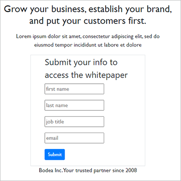

站點訪問者現在只能在提交以下資訊後訪問PDF:

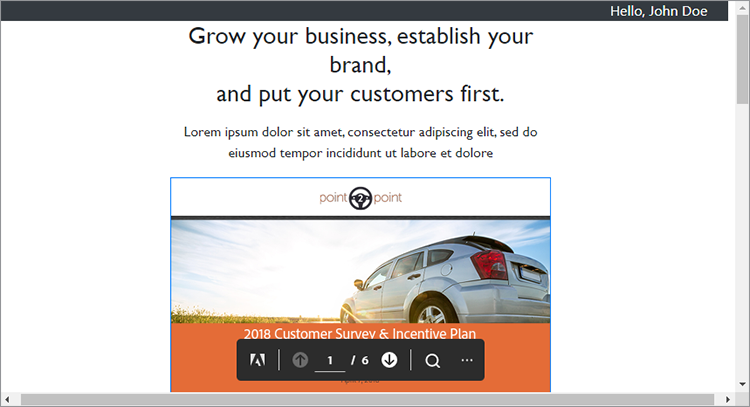

## 啟用事件

讓我們看看如何輕鬆地將PDF查看器事件與您的應用程式整合，以便為營銷人員收集分析資料。 要使用PDFEmbedAPI擴展查看器，請在聲明adobeDCView變數後和調用previewFile方法前添加以下代碼行：

```
var adobeDCView = new AdobeDC.View({ clientId: "<%=process.env.PDF_EMBED_CLIENT_ID %>", divId: "adobe-dc-view" });
adobeDCView.registerCallback(
AdobeDC.View.Enum.CallbackType.EVENT_LISTENER,
function(event) {
console.log(event);
},
{ enablePDFAnalytics: true }
);
```

現在，重新運行應用程式並開啟Web瀏覽器的開發人員工具以查看事件資料。

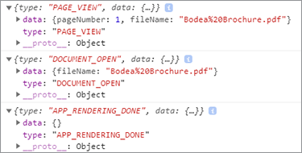

您可以將此資料發送到[Adobe Analytics](https://developer.adobe.com/document-services/docs/overview/pdf-embed-api)或其他分析工具。

## 後續步驟

[!DNL Acrobat Services]個API幫助開發人員使用以PDF為中心的工作流輕鬆解決數字發佈難題。 您已看到如何建立示例節點Web應用以顯示一組白皮書。 然後，獲取[免費API憑據](https://www.adobe.io/apis/documentcloud/dcsdk/gettingstarted.html)，並建立對白皮書的受限訪問權限，該權限可以以四個[嵌入模式](https://documentcloud.adobe.com/view-sdk-demo/index.html#/view/FULL_WINDOW/Bodea%20Brochure.pdf)之一顯示。

將此工作流組合在一起可幫助[假設的營銷者](https://developer.adobe.com/document-services/use-cases/content-publishing/digital-content-publishing)收集線索聯繫資訊，以交換白皮書下載並查看與PDF交互的統計資訊。 您可以將這些功能合併到您的網站中，以推動和監控用戶參與。

如果您是Angular或React開發人員，您可能喜歡嘗試[其他示例](https://github.com/adobe/pdf-embed-api-samples)，介紹如何將PDF嵌入API與React和Angular項目整合。

Adobe使您能夠利用創新的解決方案構建端到端的客戶體驗。 免費簽出[Adobe PDF嵌入API](https://developer.adobe.com/document-services/apis/pdf-embed/)。 若要瞭解您還能做什麼，請使用[按次付費](https://developer.adobe.com/document-services/pricing/main)[冰](https://developer.adobe.com/document-services/pricing/main)嘗試Adobe PDF服務API。

[立即使用](https://www.adobe.io/apis/documentcloud/dcsdk/gettingstarted.html)個API開始[!DNL Adobe Acrobat Services]。

