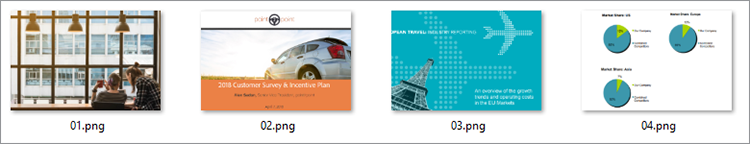

# 數位檔發佈


電子文件無處不在──實際上，全球可能 [有數萬億份 PDF](https://itextpdf.com/en/blog/technical-notes/do-you-know-how-many-pdf-documents-exist-world) ，而且這個數位每天都在增加。 透過在網頁中嵌入 PDF 查看器，您可以讓使用者檢視檔，而無需重新設計您的 HTML 和 CSS 或妨礙使用者存取您的網站。

讓我們探索熱門場景。 公司在其網站上[&#128279;](https://developer.adobe.com/document-services/use-cases/content-publishing/digital-content-publishing)張貼白皮書
以提供其應用程式和服務的情境。網站的營銷人員希望更好地了解使用者如何與基於 PDF 的內容互動，並將其與網頁和品牌整合。 他們決定將白皮書發佈為 [封閉式內容](https://whatis.techtarget.com/definition/gated-content-ungated-content#:~:text=Gated%20content%20is%20online%20materials,about%20their%20jobs%20and%20organizations.)，控制誰可以下載。

## 您可以學習哪些內容

在此實作教學課程中，瞭解如何使用 [免費且易於使用的Adobe PDF嵌入API](https://developer.adobe.com/document-services/apis/pdf-embed)，在網頁中顯示嵌入的 PDF 檔。 這些範例會使用一些JavaScript、Node.js、Express.js、HTML 和 CSS。 您可以在 GitHub[&#128279;](https://www.google.com/url?q=https://github.com/marcelooliveira/EmbedPDF/tree/main/pdf-app&amp;sa=D&amp;source=editors&amp;ust=1617129543031000&amp;usg=AOvVaw2rzSwYuJ_JI7biVIgbNMw1) 上檢視完整的項目代碼。

## 相關 API 和資源

* [PDF 嵌入API](https://www.adobe.com/devnet-docs/dcsdk_io/viewSDK/index.html)

* [PDF 服務API](https://opensource.adobe.com/pdftools-sdk-docs/release/latest/index.html)

* [項目代碼](https://www.google.com/url?q=https://github.com/marcelooliveira/EmbedPDF/tree/main/pdf-app&amp;sa=D&amp;source=editors&amp;ust=1617129543031000&amp;usg=AOvVaw2rzSwYuJ_JI7biVIgbNMw1)

## 建立節點網頁應用程式

讓我們先使用 Node.js 和 Express 建立網站，使用外觀美觀的範本並提供數個 PDF 供下載。

首先， [下載並安裝Node.js](https://nodejs.org/en/download/)。

若要以最低的網頁應用程式結構輕鬆建立Node.js專案，請安裝應用程式產生器工具 `` `express-generator` ``。

```
npm install express-generator -g
```

接下來，建立名為 pdf-app 的新 Express 應用程式，並選擇作為檢視引擎。

```
express pdf-app --view=ejs
```

現在，請移至 \\pdf-app 目錄並安裝所有專案相依性。

```
cd pdf-app
npm install
```

然後，啟動本機網頁伺服器並執行應用程式。

```
npm start
```

最後，開啟網站： <http://localhost:3000>。


您現在已經有一個基本網站。

## 演算白皮書數據

若要將白皮書張貼到網站，請在網站上定義並準備白皮書數據以顯示這些檔。 首先，在專案根目錄中建立一個新的 \\data 資料夾。 可用白皮書的資訊來自一個名為 [「data.json」](https://github.com/marcelooliveira/EmbedPDF/blob/main/pdf-app/data/data.json)的新檔案，該檔案位於數據資料夾中。

若要讓網頁應用程式有精美、精美的外觀，請安裝 [Bootstrap](https://getbootstrap.com/) 和 [Font Awesome](https://fontawesome.com/) 前端資料庫。

```
npm install bootstrap
npm install font-awesome
```

開啟app.js檔案，並將這些目錄當做靜態檔案的來源納入，並將其放置在現有 `` `express.static` `` 行之後。

```
app.use(express.static(path.join(__dirname, '/node_modules/bootstrap/dist')));
app.use(express.static(path.join(__dirname, '/node_modules/font-awesome')));
```

若要包含 PDF 檔，請在專案的 \\public 資料夾下方建立一個名為 \\pdfs 的資料夾。 您可以將 PDF 和縮圖從此 [GitHub 儲存庫資料夾](https://github.com/marcelooliveira/EmbedPDF/tree/main/pdf-app/public) 複製到 \\pdfs 和 \\image 資料夾，而不必自行建立 PDF 和縮圖。

\\public\\pdfs 資料夾現在包含 PDF 檔：


\\public\images 資料夾應包含每個 PDF 檔案的縮圖：



現在，開啟 \\rout\\index.js 檔案，其中包含路由首頁的邏輯。 若要使用data.json檔案的白皮書數據，您必須載入負責存取和與文件系統互動的Node.js模組。 然後，依照下列方式，在 \\路由\index.js檔案的第一行中宣告 `fs` 常數：

```
const fs = require('fs');
```

然後，閱讀並剖析data.json檔案，並將其儲存在檔變數中：

```
let rawdata = fs.readFileSync('data/data.json');
let papers = JSON.parse(rawdata);
```

現在修改一行以叫用索引檢視的演算方法，將紙張集合傳遞為索引檢視的模型。

```
res.render('index', { title: 'Embedding PDF', papers: papers });
```

若要在首頁顯示白皮書集合，請開啟 \\views\\index.ejs 檔案，並以專案的 [索引檔](https://github.com/marcelooliveira/EmbedPDF/blob/main/pdf-app/views/index.ejs)中的程序代碼取代現有的程序代碼。

現在，重新執行 npm 開始並開啟 <http://localhost:3000> ，以檢視您的可用白皮書集合。


在下一個區段中，請參閱增強網站，並使用 [PDF 內嵌API](https://developer.adobe.com/document-services/apis/pdf-embed) 來將 PDF 文件顯示至網頁。 PDF 內嵌API是免費的 — 您只需要取得API認證即可。

## 取得 PDF 內嵌API認證

若要取得免費的 PDF 內嵌API憑證，請在註冊新帳戶或登入現有帳戶後造訪 [開始使用](https://www.adobe.io/apis/documentcloud/dcsdk/gettingstarted.html) 頁面。

按兩下 **「建立新認證」** ，然後 **開始使用：**


此時，如果您沒有帳戶，系統會要求您註冊免費帳戶。

選取 **「PDF 嵌入API**」，然後輸入您的認證名稱和應用程式網域。 由於在 **本機測試網頁應用程式，請使用localhost** 網域。


按兩下「 **建立認證」** 按鈕，存取 PDF 認證並取得用戶端 ID （API 鍵）。


在您的Node.js專案中，建立一個名為 .ENV 在應用程式的根資料夾中，並宣告 PDF 嵌入用戶端 ID 的環境變數，並使用上一步API KEY 認證的值。

```
PDF_EMBED_CLIENT_ID=**********************************************
```

您稍後會使用此用戶端 ID 存取 PDF 內嵌API。 安裝 dotenv 套件，以使用 Node.js 程式代碼存取此環境變數。

```
npm install dotenv
```

現在，開啟 app.js 檔案，然後在檔案頂端加上下列行，讓Node.js可以載入 dotenv 模組：

```
require('dotenv').config();
```

## 在網頁應用程式中顯示 PDF

現在使用 PDF 內嵌API來在網站上顯示 PDF。 開啟即時 [PDF 內嵌API示範](https://documentcloud.adobe.com/view-sdk-demo/index.html#/view/FULL_WINDOW/Bodea%20Brochure.pdf)。


在左側面板中，您可以選擇最符合您網站需求的內嵌模式：

* **全視窗**:P DF涵蓋所有網頁空間

* **大小容器**:P DF 會在網頁內顯示，一次顯示一頁，大小有限的 div

* **內側**：整個 PDF 會以 div 格式顯示在網頁內

* **Lightbox**:P DF 會以圖層顯示在網頁頂端

建議使用白皮書的內嵌模式和日後的程式代碼產生器，將 PDF 嵌入應用程式中。

## 建立嵌入模式頁面

若要在網頁中嵌入 PDF 查看器並同時顯示所有頁面，請使用內嵌模式建立新頁面。

使用 EJS 檢視引擎在檔案 \\views\\in-in.ejs 中建立新檢視。

```
<! html DOCTYPE >
<html>
<head>
<title>
<%= title %>
</title>
<link rel='stylesheet' href='/stylesheets/style.css' />
<link rel='stylesheet' href='/css/bootstrap.min.css'/>
<link rel='stylesheet' href='/css/font-awesome.min.css' />
<style type="text/css">
p {
font-family: 'Gill Sans', 'Gill Sans MT', Calibri, 'Trebuchet MS', sans-serif
}
</style>
</head>
<body class="m-0">
<div>
<main>
<div class="row">
<div class="col-sm-3"></div>
<div class="col-sm-6">
<h3>
<p class="text-center">Grow your business, establish your brand,<br
/>
```

將客戶放在第一位。

```
</p>
</h3>
<div>
<p class="text-center">Lorem ipsum dolor sit amet, consectetur adipiscing elit, sed do<br />
eiusmod tempor incididunt ut labore et dolore</p>
</div>
</div>
</main>
<footer>
<div class="row">
<div class="col-sm-3"></div>
<div class="col-sm-6">
<p class="text-center">Bodea Inc. Your trusted partner since 2008</p>
</div>
</div>
</footer>
</div>
</div>
</body>
</html>
```

然後，修改 \\views\\index.ejs 以建立按鈕以開啟內側檢視。

```
<div class="card-body">
<h5 class="card-title">
<span>
<%= paper.title %>
</span>
</h5>
<p>
<a class="btn btn-sm btn btn-danger" href="/in-line/<%=
paper.id %>">
<span type="button"></span>
<span class="fa fa-file-pdf-o"></span>&nbsp;View Document</button>
</a>
</p>
</div>
```

開啟 app.js 檔案，並在 indexRouter 宣告後宣告新的路由器：

```
var indexRouter = require('./routes/index');
var inLineRouter = require('./routes/in-line');
```

然後在 app.use（&#39;/&#39;， indexRouter） 之後新增此程序代碼;將嵌入模式檢視與其路由器建立關聯：

```
app.use('/', indexRouter);
app.use('/in-line', inLineRouter);
```

現在，在 \\route 底下建立新的in-line.js檔案，以建立新的路由器邏輯。 包含 Express（可啟用網頁應用程式後端的節點模組）。

```
var express = require('express');
const fs = require('fs');
var router = express.Router();
```

接下來，建立一個端點，處理GET特定白皮書ID的要求，並演算內側的.ejs 檢視。

```
router.all('/:id', function(req, res, next) {
let rawdata = fs.readFileSync('data/data.json');
let papers = JSON.parse(rawdata);
let paper = papers.filter(p => p.id == parseInt(req.params.id))[0];
res.render('in-line', { title: paper.title, paper: paper });
});
module.exports = router;
```

在實時示範[&#128279;](https://documentcloud.adobe.com/view-sdk-demo/index.html#/view/FULL_WINDOW/Bodea%20Brochure.pdf)中再次Look，自動產生 PDF 內嵌API代碼。從左側面板按兩下 **「內行** 」：


按兩下 **「產生程式代碼」** ，查看顯示「大小容器 PDF」查看器所需的 HTML 程式代碼。


按兩下 **「複製代碼」** ，然後將程式代碼貼到內側的.ejs 檔案中。

```
<div>
<p class="text-center">Lorem ipsum dolor sit amet, consectetur adipiscing elit, sed do<br />
eiusmod tempor incididunt ut labore et dolore</p>
</div>
<div class="row align-items-center border border-primary">
<div id="adobe-dc-view" style="width: 800px;"></div>
<script src="https://documentcloud.adobe.com/view-sdk/main.js"></script>
<script type="text/javascript">
document.addEventListener("adobe_dc_view_sdk.ready", function(){
var adobeDCView = new AdobeDC.View({clientId: "<YOUR_CLIENT_ID>", divId: "adobe-dc-view"});
adobeDCView.previewFile({
content:{location: {url: "https://documentcloud.adobe.com/view-sdk-demo/PDFs/Bodea Brochure.pdf"}},
metaData:{fileName: "Bodea Brochure.pdf"}
}, {embedMode: "IN_LINE"});
});
</script>
</div>
```

不過，文件參數仍然硬式編碼。 讓我們用 EJS 括號語法 （\&lt;%= someValue %\>） 取代它們，以根據白皮書模型數據演算頁面。

```
<div id="adobe-dc-view" style="width: 800px;"></div>
<script src="https://documentcloud.adobe.com/view-sdk/main.js"></script>
<script type="text/javascript">
document.addEventListener("adobe_dc_view_sdk.ready", function () {
var adobeDCView = new AdobeDC.View({ clientId: "<%=process.env.PDF_EMBED_CLIENT_ID %>", divId: "adobe-dc-view" });
adobeDCView.previewFile({
content: { location: { url: "<%= paper.pdf %>" } },
metaData: { fileName: "<%= paper.fileName %>" }
}, {
embedMode: "IN_LINE"
});
});
</script>
```

現在，請使用 npm start 命令執行應用程式，然後開啟網站，網址為 <http://localhost:3000>。


最後，選擇一份白皮書，然後按兩下「 **檢視檔** 」，開啟內嵌 PDF 的新頁面：


請注意「下載 PDF」和「列印 PDF」選項現在是如何呈現的。


您想要在後端控制這些旗標。 之後您可以根據使用者身分實施授權控制，並根據業務規則限制存取。 此處不需要此複雜度，因此，只要修改 \\路由\in-line.js，即可將已驗證和許可權屬性包含在模型物件中。

```
let authenticated = false;
res.render('in-line', {
title: paper.title,
paper: paper,
authenticated: authenticated,
permissions: {
showDownloadPDF: true,
showPrintPDF: true,
showFullScreen: true
}
});
```

然後，修改 \\views\\in-in.ejs，這樣您的網頁就可以呈現來自後端的旗標值。

```
embedMode: "IN_LINE",
showDownloadPDF: <%= permissions.showDownloadPDF %>,
showPrintPDF: <%= permissions.showPrintPDF %>,
showFullScreen: <%= permissions.showFullScreen %>
Now, open the in-line.js route file and modify it to disallow the printing, downloading, and full-screen controls.
permissions: {
showDownloadPDF: false,
showPrintPDF: false,
showFullScreen: false
}
```

然後重新執行應用程式，在 PDF 查看器中查看此變更的反映方式。


## 建立封閉式內容

根據使用者案例，該公司網站的營銷人員希望更了解使用者如何與 PDF 型內容互動，並將內容與其他網頁和品牌整合。

我們關注的是 PDF 嵌入，因此您不會建立使用者驗證功能。 改為只使用網頁窗體來實施簡單的假付費牆，該網頁窗體可接受部分使用者資訊，然後在使用者提交窗體后顯示 PDF 檔。

將 \\路由\\in-line.js 檔案替換為以下內容，以提供使用者信息的檢視模型：

```
var express = require('express');
const fs = require('fs');
var router = express.Router();
router.all('/:id', function(req, res, next) {
let rawdata = fs.readFileSync('data/data.json');
let papers = JSON.parse(rawdata);
let paper = papers.filter(p => p.id == parseInt(req.params.id))[0];
let authenticated = false;
let user = {};
if (req.body.firstName) {
user = {
firstName: req.body.firstName,
lastName: req.body.lastName,
jobTitle: req.body.jobTitle,
email: req.body.email,
};
authenticated = true;
}
res.render('in-line', {
title: paper.title,
paper: paper,
user: user,
authenticated: authenticated,
permissions: {
showDownloadPDF: false,
showPrintPDF: false,
showFullScreen: false
}
});
});
module.exports = router;
```

接著，將\\views\\in-line.ejs 內容替換為下方的程序代碼。 系統會顯示使用者資料表單或 PDF 查看器，視身為已驗證的使用者而定。

```
<!DOCTYPE html>
<html>
<head>
<title>
<%= title %>
</title>
<link rel='stylesheet' href='/css/bootstrap.min.css'/>
<link rel='stylesheet' href='/css/font-awesome.min.css' />
<style type="text/css">
p {
font-family: 'Gill Sans', 'Gill Sans MT', Calibri, 'Trebuchet MS', sans-serif
}
</style>
</head>
<body class="m-0">
<% if (authenticated) { %>
<header class="bg-dark text-white">
<div class="text-right mr-4">Hello, <%= user.firstName %> <%= user.lastName%></div>
</header>
<% } %>
<div>
<main>
<div class="row">
<div class="col-sm-3"></div>
<div class="col-sm-6">
<h3>
<p class="text-center">Grow your business, establish your brand,<br
/>
```

將客戶放在第一位。

```
</p>
</h3>
<div>
<p class="text-center">Lorem ipsum dolor sit amet, consectetur adipiscing elit, sed do<br />
eiusmod tempor incididunt ut labore et dolore</p>
</div>
<% if (!authenticated) { %>
<div class="row">
<form method="POST" class="center-panel text offset-md-3 col-md-6 border">
<fieldset class="offset-md-1">
<legend>Submit your info to<br/>access the whitepaper</legend>
<p><input name="firstName" placeholder="first name"/></p>
<p><input name="lastName" placeholder="last name"/></p>
<p><input name="jobTitle" placeholder="job title"/></p>
<p><input name="email" placeholder="email"/></p>
<p><button type="submit" class="btn btn-sm btn btn-primary">Submit</button></p>
</fieldset>
</form>
</div>
<% } %>
<% if (authenticated) { %>
<div class="row align-items-center border border-primary">
<div id="adobe-dc-view" style="width: 800px;"></div>
<script src="https://documentcloud.adobe.com/view-sdk/main.js"></script>
<script type="text/javascript">
document.addEventListener("adobe_dc_view_sdk.ready", function () {
var adobeDCView = new AdobeDC.View({ clientId: "<%=process.env.PDF_EMBED_CLIENT_ID %>", divId: "adobe-dc-view" });
adobeDCView.previewFile({
content: { location: { url: "<%= paper.pdf %>" } },
metaData: { fileName: "<%= paper.fileName %>" }
}, {
embedMode: "IN_LINE",
showDownloadPDF: <%= permissions.showDownloadPDF %>,
showPrintPDF: <%= permissions.showPrintPDF %>,
showFullScreen: <%= permissions.showFullScreen %>
});
});
</script>
<% } %>
</div>
</div>
</main>
<footer>
<div class="row">
<div class="col-sm-3"></div>
<div class="col-sm-6">
<p class="text-center">Bodea Inc. Your trusted partner since 2008</p>
</div>
</div>
</footer>
</div>
</div>
</body>
</html>
```


網站訪客現在只能在提交其資訊後存取 PDF：


## 啟用事件

讓我們瞭解如何輕鬆整合 PDF 查看器事件與應用程式，為營銷人員收集分析數據。 若要使用 PDF EmbedAPI 擴充查看器，請在移轉 adobeDCView 變數後加上下列程式代碼行，然後再呼叫 previewFile 方法：

```
var adobeDCView = new AdobeDC.View({ clientId: "<%=process.env.PDF_EMBED_CLIENT_ID %>", divId: "adobe-dc-view" });
adobeDCView.registerCallback(
AdobeDC.View.Enum.CallbackType.EVENT_LISTENER,
function(event) {
console.log(event);
},
{ enablePDFAnalytics: true }
);
```

現在，重新執行應用程式並開啟網頁瀏覽器的開發人員工具，查看事件數據。


您可以將這些數據傳送至 [Adobe Analytics](https://developer.adobe.com/document-services/docs/overview/pdf-embed-api) 或其他分析工具。

## 後續步驟

[!DNL Acrobat Services] API 可透過以 PDF 為中心的工作流程，協助開發人員輕鬆解決數位出版難題。 您已看到如何建立節點網頁應用程式範例來顯示白皮書集合。 然後，取得 [免費API憑證](https://www.adobe.io/apis/documentcloud/dcsdk/gettingstarted.html) ，並建立對白皮書的有限存取權，白皮書可在四 [種內嵌模式](https://documentcloud.adobe.com/view-sdk-demo/index.html#/view/FULL_WINDOW/Bodea%20Brochure.pdf)中其中一種顯示。

整合此工作流程有助於假設的 [營銷人員](https://developer.adobe.com/document-services/use-cases/content-publishing/digital-content-publishing) 收集潛在客戶聯絡資訊，作為白皮書下載的交換，並檢視與 PDF 互動人員的統計數據。 您可以將這些功能整合到您的網站中，以推動和監控用戶參與度。

如果您是 Angular 或 React 開發人員，您可能喜歡嘗試 [其他範例](https://github.com/adobe/pdf-embed-api-samples) ，包括如何將 PDF 內嵌API與 React 和Angular專案整合。

Adobe可讓您以創新的解決方案建立端對端客戶體驗。 免費試Adobe PDF [嵌入API](https://developer.adobe.com/document-services/apis/pdf-embed/) 。 若要探索您還可以做什麼，請嘗試Adobe PDF服務API [按即](https://developer.adobe.com/document-services/pricing/main) [付費的試用](https://developer.adobe.com/document-services/pricing/main)。

[立即開始使用](https://www.adobe.io/apis/documentcloud/dcsdk/gettingstarted.html) [!DNL Adobe Acrobat Services] API。
