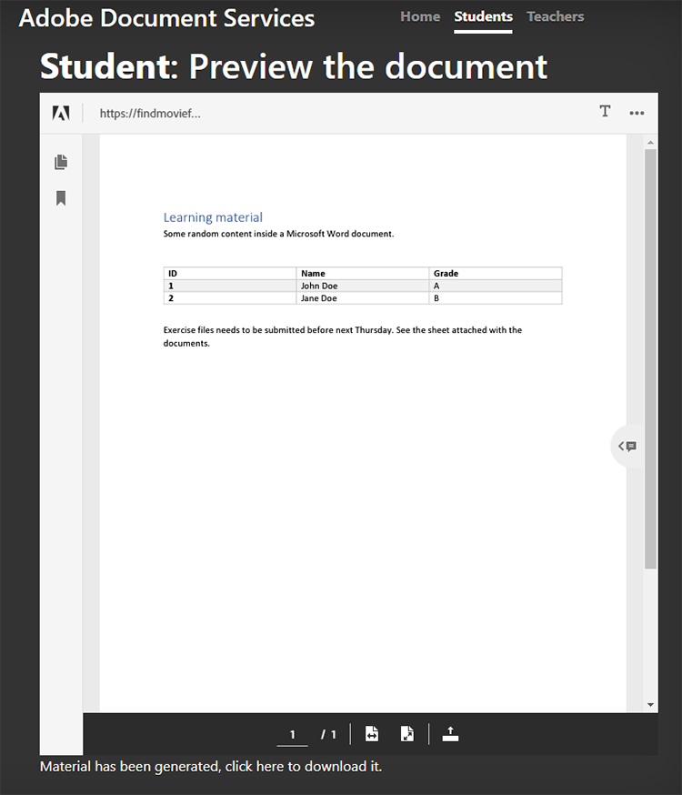

# 學生與教師共同作業


教育機構使用 PDF 檔與學生共用學習數據。 PDF 為教師提供可互換的檔格式。

將[Adobe PDF服務API和[內](https://www.adobe.io/apis/documentcloud/dcsdk/pdf-tools.html)嵌Adobe PDF內嵌API](https://www.adobe.io/apis/documentcloud/dcsdk/pdf-embed.html)整合到應用程式中，為師生提供了一個教學與學習的單一平臺。例如，您的應用程式可讓學生對其作業和報表提出問題，以及共同處理群組作業。

系統會正式提供 SDK，讓Node.js存取 PDF Services API。 這可讓您將 Microsoft Word 或 Microsoft Excel 等文件轉換為
PDF。 此外，您還可以執行更進階的作業，例如合併多個報告、重新排列頁面以及保護 PDF。 如需詳細資訊，請參閱 [產品檔](https://www.adobe.io/apis/documentcloud/dcsdk/)。

## 您可以學習哪些內容

在此實作教學課程中，學習建立一個在線學習平臺， [讓老師和學生能夠輕鬆地在 PDF 中共用資源](https://www.adobe.io/apis/documentcloud/dcsdk/student-teacher-collaboration.html) 。 本教學課程使用 [使用使用 Node.js JavaScript 執行時間 （Node.js） 和 PDF Services 建立的學習入口](https://github.com/afzaal-ahmad-zeeshan/adobe-pdf-tools-for-teachers) 網站。

學習入口網站具有以下功能：

* 讓教師能夠上傳資源

* 讓學生能夠選取要轉換為 PDF 的多份檔

* 啟用將檔案轉換為 PDF 的功能

* 在網頁瀏覽器中為學生提供 PDF 預覽，讓學生不必使用其他軟體即可為檔加上批注

* 讓學生留下評論並下載到計算機

瞭解如何 [!DNL Adobe Acrobat Services] 為您的學生提供豐富的 PDF 體驗。 [!DNL Acrobat Services] API 可無縫整合至您現有的應用程式，讓學生可以上傳、轉換和檢視檔案，然後製作和儲存註釋，這些全都可在您目前的設定中完成。

## 相關 API 和資源

* [PDF 嵌入API](https://www.adobe.com/devnet-docs/dcsdk_io/viewSDK/index.html)

* [PDF 服務API](https://opensource.adobe.com/pdftools-sdk-docs/release/latest/index.html)

* [項目代碼](https://github.com/afzaal-ahmad-zeeshan/adobe-pdf-tools-for-teachers)

## 上傳資源至學習入口網站

在學習入口網站的教師區段中，教師可以上傳作業和測試等檔。 檔可以使用任何格式，例如 Microsoft Word、Microsoft Excel、HTML、各種影像格式等等。


上傳的檔會在學生開啟其網頁時儲存並顯示。

若要瞭解應用程式如何上傳檔案，請參閱 [項目代碼](https://github.com/afzaal-ahmad-zeeshan/adobe-pdf-tools-for-teachers)。

## 將檔案轉換為 PDF

學生可以將任何類型的單一或多份文件轉換為 PDF，例如 Microsoft Word、Excel 和 PowerPoint，以及其他常用的文字和圖像文件類型。 學習入口網站會使用 PDF Services 來執行將檔案轉換為 PDF 的作業。

若要建立自己的學習入口網站，您必須先建立自己的認證。 [註冊](https://www.adobe.io/apis/documentcloud/dcsdk/gettingstarted.html) 至
免費使用 PDF Services API 6 個月及最多 1,000 筆檔交易。 之後，當班級開始作業時， [即用即付](https://www.adobe.io/apis/documentcloud/dcsdk/pdf-pricing.html) 每份檔交易只要 \$0.05。

當學生從儀錶板中選取檔時，他們會看到以下內容：


學生只需選取要轉換的檔，然後按下「 **取得報告」**。

學習入口網站會將文件轉換為 PDF，並顯示報告頁面以及 PDF 檔案的預覽。

以下是此步驟的範例程式代碼：

```
async function createPdf(rawFile, outputPdf) {
    try {
            // configurations
            const credentials =  adobe.Credentials
            .serviceAccountCredentialsBuilder()
            .fromFile("./src/pdftools-api-credentials.json")
            .build();
 
            // Capture the credential from app and show create the context
            const executionContext = adobe.ExecutionContext.create(credentials),
            operation = adobe.CreatePDF.Operation.createNew();
 
            // Pass the content as input (stream)
            const input = adobe.FileRef.createFromLocalFile(rawFile);
            operation.setInput(input);
 
            // Async create the PDF
            let result = await operation.execute(executionContext);
            await result.saveAsFile(outputPdf);
    } catch (err) {
            console.log('Exception encountered while executing operation', err);
    }
}
```

範例程式代碼會呼叫 `createPdf` Express 路由處理程式內產生 PDF 的方法。

若要瞭解此方法的叫用方式，請參閱 [項目代碼](https://github.com/afzaal-ahmad-zeeshan/adobe-pdf-tools-for-teachers/blob/master/src/helpers/pdf.js)。

## 預覽學習資源

使用者介面使用 PDF 內嵌API在網頁瀏覽器中演算 PDF。 此API可免費使用。

PDF 內嵌API使用的認證與 PDF Services API不同，因此您必須 [建立認證](https://www.adobe.io/apis/documentcloud/dcsdk/gettingstarted.html)
使用之前。 然後，您可以完全免費使用 PDF 內嵌。

請務必在記號中輸入正確的網站URL。 否則，您可能無法使用字元演算 PDF。

使用者介面使用 [「控制欄](https://handlebarsjs.com/) 」範本語言。 它會在網頁瀏覽器中顯示 PDF。

此步驟的程式代碼如下：

```
<div id="adobe-dc-view" style="height: 750px; width: 700px;"></div>
<script src="https://documentcloud.adobe.com/view-sdk/main.js"></script>
<script type="text/javascript">
    document.addEventListener("adobe_dc_view_sdk.ready", function () {
        var adobeDCView = new AdobeDC.View({ clientId: "<your-credentials-here>", divId: "adobe-dc-view" });
        adobeDCView.previewFile(
            {
                content: {
                    location: { url: "<file-url>" }
                },
                    metaData: { fileName: "<file-name>" }
            },
           );
    });
</script>
 
<p>Material has been generated, <a href="/students/download/{{filename}}" target="_blank">click here</a> to download it.
</p>
```

此程式代碼會顯示 PDF 輸出和下載 PDF 報告的連結，如下方螢幕擷取所示：



學生應該可以在這裡下載報告或處理材料。

## 為 PDF 檔加上批注

學習平臺應支援 PDF 中的基本批註、註釋和討論。 PDF 內嵌API提供這些功能。 它會使用 `showAnnotationTools`啟用批註支援，讓教師和學生能夠在檔上加上註釋，並且將註釋封存為 PDF 的一部分。

若要在 PDF 檔中啟用批注，您只需要傳遞自變數 `showAnnotationTools` ：true to method `previewFile` 。 這會在 PDF 預覽器中顯示批註工具。 從預覽右上角的三點選單存取此工具。


在教師上傳的檔中，學生可以螢游標示文字、新增註釋等等。


在上面的螢幕擷取中，使用者被標示為「訪客」，但您可以為使用者（例如學生和教師） 設定基本數據。

當學生套用批注時，PDF 內嵌API會沿著上方橫幅顯示「 **儲存** 」按鈕。 儲存會將批註新增至檔案。 嘗試單擊「儲存&#x200B;****」，查看檔案在報告中內嵌批注的儲存方式。

學生可以使用批注來提出問題或分享他們對學習材料的評論。

## 追蹤檔使用方式

教師和學校必須了解學生如何使用在線平臺。 這可協助教師為學生提供資源，協助學生在作業上表現更好。 PDF 嵌入API整合了可用於衡量所有事件的分析，例如使用者開啟、閱讀和關閉檔時。 透過 PDF 服務 API，教師還可以停用列印、下載和檔案修改作業，以維護學術完整性。

如果您擁有 [Adobe Analytics](https://www.adobe.io/apis/experiencecloud/analytics.html) 授權，則可以使用其 [開箱即用的整合](https://experienceleague.adobe.com/docs/document-services/tutorials/pdfembed/controlpdfexperience.html?lang=en#adobe-analytics)。 否則，請使用回呼將您的 PDF 服務與其他分析提供者 （例如 [Google](https://experienceleague.adobe.com/docs/document-services/tutorials/pdfembed/controlpdfexperience.html?lang=en#google-analytics)） 整合。

若要啟用檔事件的度量，請使用 `registerCallback` Adobe DC 檢視實例的方法附加事件處理器。 您可以在主控台顯示基本度量，例如開啟檔或閱讀頁面。 您也可以將指標儲存在記錄中，或在其他分析商店中發佈。

以下是附加事件處理程式的範例程式代碼：

```
adobeDCView.registerCallback(
    AdobeDC.View.Enum.CallbackType.EVENT_LISTENER,
    function(event) {
           console.log(event);
    },
    {
           enablePDFAnalytics: true
    }
);
```

教師可以看到有多少學生看過作業、有多少學生流覽過筆記的所有頁面，以及其他寶貴的細節。

以下是網頁瀏覽器主控台的螢幕擷取：


此螢幕擷取顯示學生開啟了作業檔案，並閱讀了第一頁 —他們不是捲動到其他頁面，或檔只有一頁 — 然後他們下載了檔案。 您可以收集這些度量，以執行分析和研究學生的行為。

此外， [Adobe Analytics與 PDF 內嵌API整合，因此如果您已訂閱 Adobe Analytics](https://business.adobe.com/products/analytics/adobe-analytics.html) 套件，則可以在訂閱中發佈指標。 若要在Adobe Analytics中發佈指標，您只需要將套件ID傳遞至 PDF 內嵌API建構器。 （請注意，您必須使用 PDF 內嵌API憑證，而非API憑證使用 PDF Services）。

以下範例程式代碼顯示如何將套件 ID 傳遞至 PDF 內嵌API建構器：

```
var adobeDCView = new AdobeDC.View({
    clientId: "<your-adobe-dc-credential>",
    divId: "<#element>"
    reportSuiteId: <your-id-here>,
}); 
```

## 後續步驟

此實作教學課程檢視了如何使用 PDF Services API 和 PDF 內嵌API建立學習入口網站，促進學生與教師](https://www.adobe.io/apis/documentcloud/dcsdk/student-teacher-collaboration.html)之間的有效[共同作業。透過這個入口網站，教師可以上傳任何格式的學習數據，並使用 PDF Services 將學習數據轉換為 PDF API。 然後，學生就可以使用 PDF 內嵌API來預覽這些 PDF。

現在您已經知道如何為 PDF 報告加上批注、封存批注並追蹤 PDF 報告的使用，您可以在自己的專案中開始實作這些解決方案。

您可以使用 [!DNL Adobe Acrobat Services] API 在您的網站上建立使用者友好型的互動式 PDF 體驗。 享受免費使用 Adobe PDF Services API 6 個月，然後只需[](https://www.adobe.io/apis/documentcloud/dcsdk/pdf-pricing.html)付費 （透過 AWS 或直接合約），每份檔交易只要 \$0.05。免費使用Adobe PDF嵌入」，且沒有時間限制。 建立免費帳戶以 [立即開始](https://www.adobe.com/go/dcsdks_credentials) 使用。
