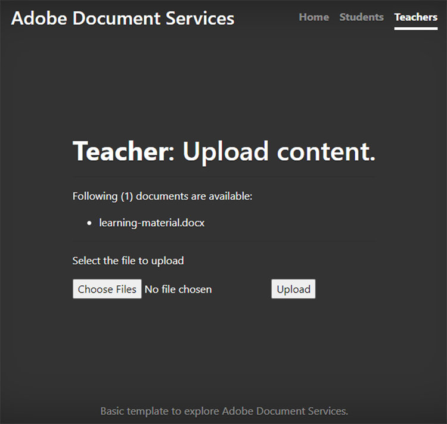
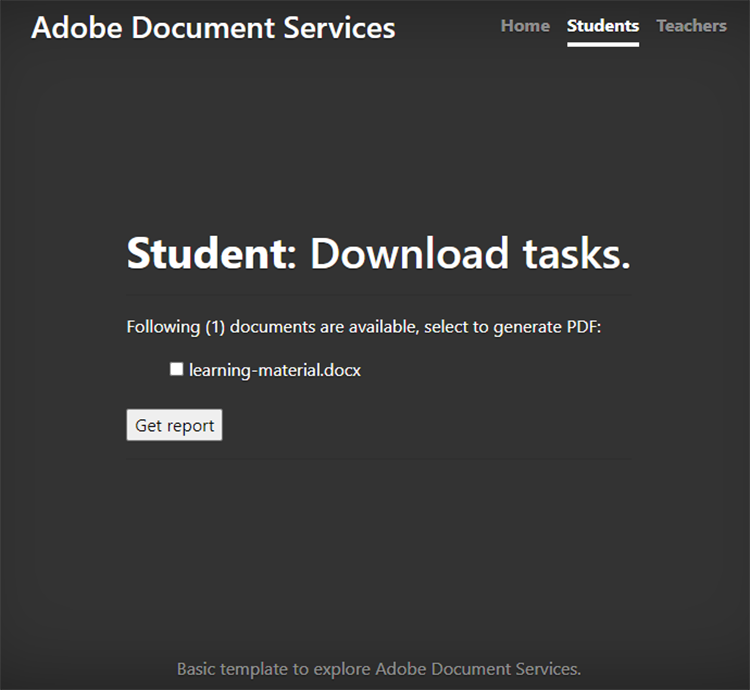
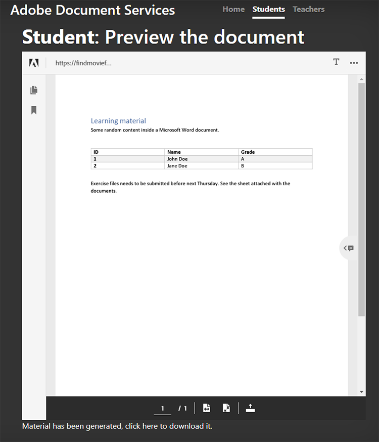
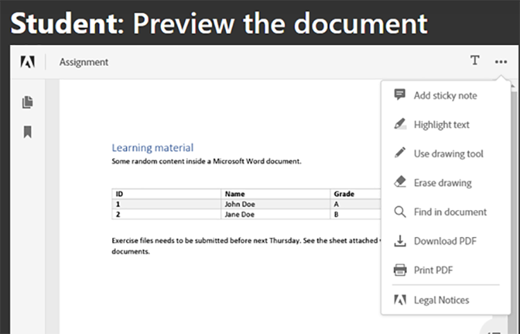
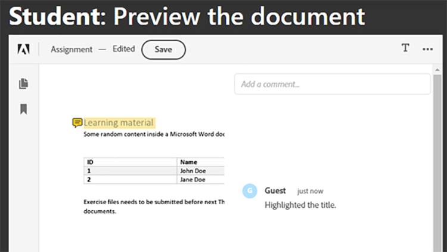
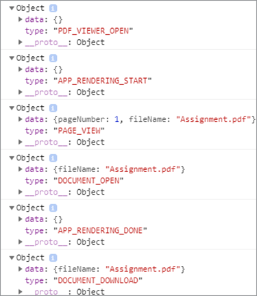

# 師生合作


教育機構使用 PDF 文件與學生分享學習資料。 PDF 為教師提供了可互換的文件格式。

將 Adobe PDF 服務 API](https://developer.adobe.com/document-services/apis/pdf-services) 與 [Adobe PDF 嵌入 API](https://developer.adobe.com/document-services/apis/pdf-embed) 整合[進應用程式，為教師與學生提供單一教學與學習平台。例如，你的應用程式可以讓學生對作業和成績表提問，並能在小組作業中協作。

有官方的 SDK 可供 Node.js 應用程式存取 PDF 服務 API。 這讓你能將像 Microsoft Word 或 Microsoft Excel 這類文件轉換成PDF。 此外，你還可以執行更進階的操作，例如合併多個報告、重新排列頁面以及保護 PDF 檔案。 欲了解更多細節，請參閱 [產品文件](https://developer.adobe.com/document-services/homepage/)。

## 你可以學到什麼

在這個實作教學中，學習如何建立一個線上學習平台，讓 [教師和學生能輕鬆分享PDF資源](https://developer.adobe.com/document-services/use-cases/collaboration/student-teacher-collaboration) 。 本教學使用 [Node.js JavaScript執行環境（Node.js）與 PDF 服務建立的學習入口](https://github.com/afzaal-ahmad-zeeshan/adobe-pdf-tools-for-teachers) 網站。

學習入口網站具備以下功能：

* 讓教師能夠上傳資源

* 讓學生能選擇多份文件轉為 PDF

* 支援文件轉換成 PDF

* 提供學生在網頁瀏覽器中的 PDF 預覽，並允許他們無需額外軟體即可為文件做註解

* 讓學生能夠留下評論並下載到電腦

學習如何 [!DNL Adobe Acrobat Services] 透過 PDF 為學生提供豐富的體驗。 [!DNL Acrobat Services] API 能無縫整合到你現有的應用程式中，讓學生能上傳、轉換、查看檔案，還能在你目前的環境中製作和儲存註解。

## 相關 API 與資源

* [PDF 嵌入 API](https://www.adobe.com/devnet-docs/dcsdk_io/viewSDK/index.html)

* [PDF 服務 API](https://opensource.adobe.com/pdftools-sdk-docs/release/latest/index.html)

* [專案程式碼](https://github.com/afzaal-ahmad-zeeshan/adobe-pdf-tools-for-teachers)

## 將資源上傳至學習入口網站

在學習入口網站的教師區，教師可上傳作業與考試等文件。 這些文件可以是任何格式，例如 Microsoft Word、Microsoft Excel、HTML、各種圖片格式等等。



上傳的文件會被儲存，並在學生開啟網頁時呈現。

欲了解應用程式如何上傳檔案，請參閱專案程式碼](https://github.com/afzaal-ahmad-zeeshan/adobe-pdf-tools-for-teachers)。[

## 文件轉換成 PDF

學生可以將單一或多份文件轉換成 PDF，如 Microsoft Word、Excel 和 PowerPoint，以及其他常見的文字和圖片檔案格式。 學習入口網站使用 PDF 服務來執行檔案轉換成 PDF 的作業。

要建立自己的學習入口網站，首先必須建立自己的憑證。 [註冊](https://www.adobe.io/apis/documentcloud/dcsdk/gettingstarted.html) 至可免費使用 PDF 服務 API，期限六個月，最多可交易 1,000 筆。 之後，隨著課堂作業增加，則以[](https://developer.adobe.com/document-services/pricing/main)每筆文件僅付0.05美元的價格隨用付費。

當學生從儀表板選擇文件時，會看到以下內容：



學生只需選擇文件進行轉換，並點擊「 **取得報告**」。

學習入口會將文件轉換成 PDF，並顯示報告頁面及 PDF 檔案預覽。

以下是此步驟的範例程式碼：

```
async function createPdf(rawFile, outputPdf) {
    try {
            // configurations
            const credentials =  adobe.Credentials
            .serviceAccountCredentialsBuilder()
            .fromFile("./src/pdftools-api-credentials.json")
            .build();
 
            // Capture the credential from app and show create the context
            const executionContext = adobe.ExecutionContext.create(credentials),
            operation = adobe.CreatePDF.Operation.createNew();
 
            // Pass the content as input (stream)
            const input = adobe.FileRef.createFromLocalFile(rawFile);
            operation.setInput(input);
 
            // Async create the PDF
            let result = await operation.execute(executionContext);
            await result.saveAsFile(outputPdf);
    } catch (err) {
            console.log('Exception encountered while executing operation', err);
    }
}
```

範例程式碼會呼叫 Express 路由處理器中的 該 `createPdf` 方法來產生 PDF。

想了解此方法的呼叫方式，請參閱 [專案程式碼](https://github.com/afzaal-ahmad-zeeshan/adobe-pdf-tools-for-teachers/blob/master/src/helpers/pdf.js)。

## 預覽學習資源

使用者介面使用 PDF 嵌入 API，在網頁瀏覽器中渲染 PDF。 此 API 可免費使用。

PDF 嵌入 API 使用的憑證與 PDF 服務 API 不同，因此您必須 [建立憑證](https://www.adobe.io/apis/documentcloud/dcsdk/gettingstarted.html)在你能使用之前。 接著，你可以完全免費使用 PDF 嵌入。

務必在令牌中輸入正確的網站網址。 否則，你可能無法用 token 來渲染 PDF。

使用者介面使用 [Handlebars](https://handlebarsjs.com/) 範本語言。 它會在網頁瀏覽器中顯示 PDF。

這是這一步的程式碼：

```
<div id="adobe-dc-view" style="height: 750px; width: 700px;"></div>
<script src="https://documentcloud.adobe.com/view-sdk/main.js"></script>
<script type="text/javascript">
    document.addEventListener("adobe_dc_view_sdk.ready", function () {
        var adobeDCView = new AdobeDC.View({ clientId: "<your-credentials-here>", divId: "adobe-dc-view" });
        adobeDCView.previewFile(
            {
                content: {
                    location: { url: "<file-url>" }
                },
                    metaData: { fileName: "<file-name>" }
            },
           );
    });
</script>
 
<p>Material has been generated, <a href="/students/download/{{filename}}" target="_blank">click here</a> to download it.
</p>
```

此程式碼顯示 PDF 輸出及下載該報告的連結，如下圖所示：



學生應該可以下載報告或在這裡進行相關資料的作業。

## 註解 PDF 文件

學習平台應支援基本的註解、評論與討論，並包含PDF格式。 PDF 嵌入 API 提供所有這些功能。 它啟動了使用註 `showAnnotationTools`解支援，使教師與學生能對文件發表評論，並將評論存檔為 PDF 的一部分。

要在 PDF 文件中啟用註解，你只需傳遞 `showAnnotationTools` ： true to the `previewFile` method。 這會在 PDF 預覽器中顯示註解工具。 可從預覽右上角的三點選單存取此工具。



在老師上傳的文件中，學生可以選取文字、添加註解等功能。



在上方的截圖中，使用者標示為「訪客」，但你可以為使用者設定個人檔案，例如學生和老師。

當學生套用註解時，PDF 嵌入 API 會在頂部橫幅顯示一個 **儲存** 按鈕。 儲存會將註解加入檔案。 試著點選 **儲存** ，看看檔案在報告中嵌入註解後的儲存情況。

學生可以使用註解來提問或分享對學習材料的意見。

## 追蹤文件使用

教師和學校了解學生如何使用線上平台非常重要。 這有助於教師提供資源，幫助學生在作業上表現更好。 PDF Embed API 整合了分析工具，你可以用來衡量所有發生的事件，例如使用者何時開啟、閱讀和關閉文件。 透過 PDF Services API，教師也能關閉列印、下載及檔案修改功能，以維持學術誠信。

如果你有 [Adobe Analytics](https://developer.adobe.com/analytics-apis/docs/2.0/) 授權，可以使用其 [開箱即用的整合](https://experienceleague.adobe.com/en/docs/acrobat-services-learn/tutorials/pdfembed/controlpdfexperience#adobe-analytics)功能。 否則，請利用回調功能將你的 PDF 服務與其他分析服務整合，例如 [Google](https://experienceleague.adobe.com/en/docs/acrobat-services-learn/tutorials/pdfembed/controlpdfexperience#google-analytics)。

要啟用文件事件的測量，你可以使用 `registerCallback` Adobe DC View 實例的方法附加事件處理程序。 你可以在主控台上顯示基本指標，例如開啟文件或閱讀頁面。 你也可以把指標存成日誌，或發佈到其他分析商店。

以下是附加事件處理器的範例程式碼：

```
adobeDCView.registerCallback(
    AdobeDC.View.Enum.CallbackType.EVENT_LISTENER,
    function(event) {
           console.log(event);
    },
    {
           enablePDFAnalytics: true
    }
);
```

老師可以看到有多少學生看過作業、有多少人看過所有筆記頁面，以及其他有價值的細節。

以下是網頁瀏覽器主控台的截圖：



這張截圖顯示學生打開作業檔案，閱讀第一頁——要麼沒有捲動到其他頁面，要麼文件只有一頁——然後下載了檔案。 你可以收集這些指標來進行分析並研究學生的行為。

此外， [Adobe Analytics](https://business.adobe.com/products/adobe-analytics.html) 整合了 PDF Embed API，如果你訂閱了 Adobe Analytics 套件，可以在訂閱中發布你的指標。 要將指標發佈到 Adobe Analytics，您只需將套房 ID 傳入 PDF 嵌入 API 建構器。 （請注意，您必須使用您的 PDF 嵌入 API 憑證，而非 PDF Services API 憑證。）

以下是示範如何將套件 ID 傳入 PDF 嵌入 API 建構器的範例程式碼：

```
var adobeDCView = new AdobeDC.View({
    clientId: "<your-adobe-dc-credential>",
    divId: "<#element>"
    reportSuiteId: <your-id-here>,
}); 
```

## 後續步驟

這份實作教學回顧了如何使用 PDF Services API 和 PDF 嵌入 API 建立學習入口網站，促進師生](https://developer.adobe.com/document-services/use-cases/collaboration/student-teacher-collaboration)間的有效[合作。透過此入口網站，教師可上傳任何格式的學習資料，並使用 PDF 服務 API 轉為 PDF。 學生可利用 PDF 嵌入 API 預覽這些 PDF。

現在你已經知道如何註解 PDF 報告、歸檔註解並追蹤 PDF 報告的使用情況，就可以開始在自己的專案中實作這些解決方案。

你可以使用 [!DNL Adobe Acrobat Services] API 在網站上建立使用者友善且互動式的 PDF 體驗。 享受免費使用 Adobe PDF Services API 六個月後 [，透過 AWS 或直接協議，按需](https://developer.adobe.com/document-services/pricing/main) 付費，每筆文件交易只需 \$0.05。 免費使用 Adobe PDF 嵌入，且無時間限制。 立即註冊免費帳號開始 [吧](https://www.adobe.com/go/dcsdks_credentials) 。
