# 現代化員工入職流程


在大型組織中，員工入職可能是一個龐大且緩慢的過程。 通常會包含客製化文件與標準文件，必須由新員工呈現並簽署。 這種客製化與模板材料的混合需要多個步驟——佔用了參與流程的人寶貴的時間。 [!DNL Adobe Acrobat Services] 而 Acrobat Sign 則能現代化並自動化此方法，讓您的人力資源人員專注於更重要的工作。 讓我們來看看這是如何達成的。

## 是什麼 [!DNL Adobe Acrobat Services]？

[[!DNL Adobe Acrobat Services]](https://developer.adobe.com/document-services/homepage) 是一組與文件處理相關的 API（而非僅僅 PDF）。 大致而言，這套服務可分為三大類：

* 首先是 [PDF 服務](https://developer.adobe.com/document-services/apis/pdf-services/) 的工具組。 這些是處理 PDF 和其他文件的「實用性」方法。 這些服務包括從 PDF 轉檔、OCR 與優化、PDF 合併與拆分等等。 它是文件處理功能的工具箱。
* [PDF Extract API](https://developer.adobe.com/document-services/apis/pdf-extract/) 利用強大的 AI/ML 技術分析 PDF，並回傳內容的驚人細節。 這包括文字、樣式與位置資訊，也能以 CSV/XLS 格式回傳表格資料，並擷取圖片。
* 最後， [文件生成 API](https://developer.adobe.com/document-services/apis/doc-generation/) 讓開發者能將 Microsoft Word 當作「範本」，與其資料來源混合，並產生動態個人化文件（PDF 與 Word）。

開發者可以 [註冊](https://documentcloud.adobe.com/dc-integration-creation-app-cdn/main.html) 並試用所有這些服務，並享有免費試用。 該平台 [!DNL Acrobat Services] 使用 REST 基礎 API，同時也支援 Node、Java、.NET 和 Python（目前僅支援 Extract）的 SDK。

雖然不是 API，開發者也可使用免費 [的 PDF 嵌入 API](https://developer.adobe.com/document-services/apis/pdf-embed/)，提供與網頁一致且靈活的文件檢視體驗。

## 什麼是雜技手語？

[Acrobat Sign](https://www.adobe.com/acrobat/business/sign.html) 是電子簽章服務的全球領導者。 你可以用各種不同的工作流程——包括多重簽名——將文件送去簽名。 Acrobat Sign 也支援需要簽名及額外資訊的工作流程。 所有這些功能都由強大的儀表板與靈活的創作系統所支援。

與 [!DNL Acrobat Services]，Acrobat Sign 有 [免費試用](https://www.adobe.com/acrobat/business/sign.html#sign_free_trial) ，讓開發者能透過儀表板及易於使用的 REST API 測試簽署流程。

## 入職情境

讓我們來看看一個真實世界的情境，說明 Adobe 的服務如何提供幫助。 當新員工加入公司時，他們需要針對其職務量身訂做的資訊。 此外，他們還需要全公司範圍的資料。 最後，他們必須透過簽署文件來證明接受公司政策。 讓我們把這件事拆解成具體步驟：

* 首先，需要一封客製化的求職信，並以名字向新員工致意。 信件應包含員工姓名、職務、薪資及所在地等資訊。
* 客製化信件必須搭配包含基本、全公司資訊的 PDF（例如各種人資政策、福利等）。
* 必須附上一份最終文件，要求員工簽名及日期。
* 以上所有事項都應該以一份文件形式呈現，並送交員工簽署。

讓我們詳細說明如何做到這點。

## 產生動態文件

Adobe [的文件生成](https://developer.adobe.com/document-services/apis/doc-generation/) API 讓開發者能利用 Microsoft Word 和簡單的模板語言來建立動態文件，作為產生 PDF 和 Word 文件的基礎。 這裡有一個運作方式的例子。

我們先從一個有硬編碼值的 Word 文件開始。 文件可以隨你喜歡樣式，包含圖形、表格等等。 這是初步文件。

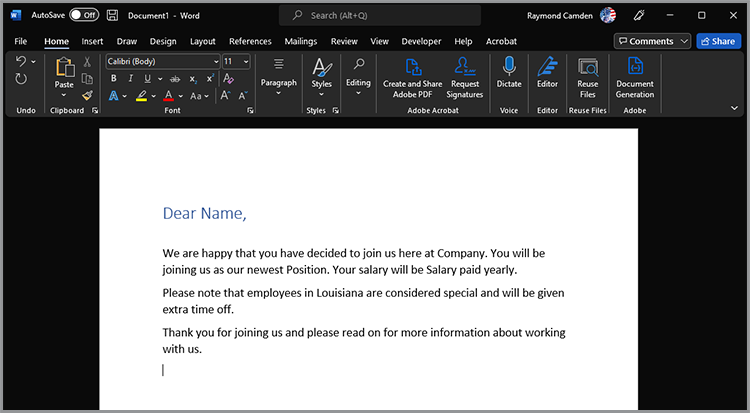

文件產生是透過在 Word 文件中加入「標記」，這些標記會被你的資料取代。 雖然這些代幣可以手動輸入，但有 [Microsoft Word 的外掛](https://developer.adobe.com/document-services/docs/overview/document-generation-api/wordaddin/) 可以讓操作更簡單。 打開它為作者提供了一個工具，可以定義標籤或資料集合，這些標籤可用於你的文件中。

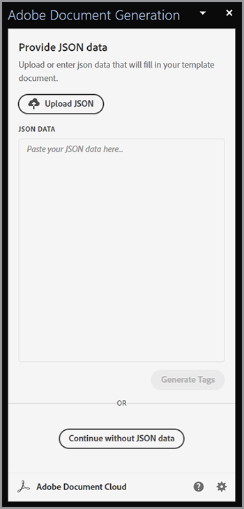

你可以從本地檔案上傳 JSON 資訊、複製 JSON 文字，或選擇繼續使用初始資料。 這樣你就能根據自己的需求，臨時定義標籤。 在此範例中，只需標註姓名、職務、薪資和地點。 這是透過使用 **「建立標籤** 」按鈕來完成的：

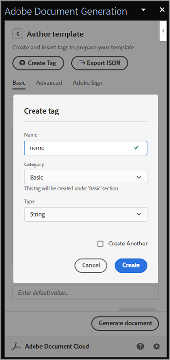

定義完第一個標籤後，你可以繼續定義任意數量：

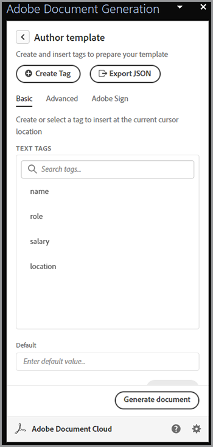

標籤定義好後，你選擇文件中的文字，並在適當時用標籤取代。 在此範例中，會新增姓名、職務和薪資標籤。

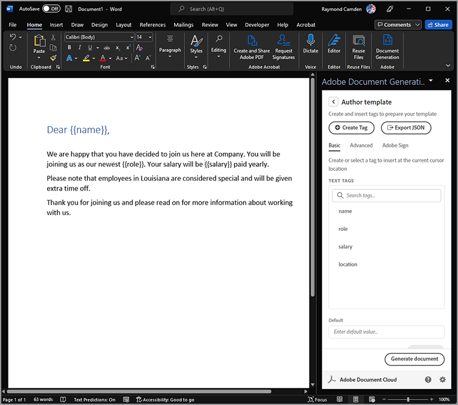

文件產生不僅支援簡單標籤，還支援邏輯表達式。 文件的第二段內容僅適用於路易斯安那州的居民。 你可以進入文件標籤器的進階標籤，並定義條件來新增條件表達式。 以下是你如何定義一個簡單的等號條件，但同時也支援數值比較及其他比較類型。

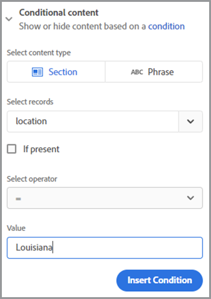

接著可以插入並包裹整個段落：

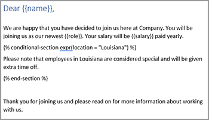

要測試這個功能，請選擇 **「產生文件**」。 第一次登入時，必須使用 Adobe ID 登入。 登入後會顯示預設的 JSON，可以手動編輯。

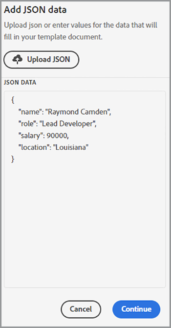

會產生一份 PDF，然後可以瀏覽或下載。

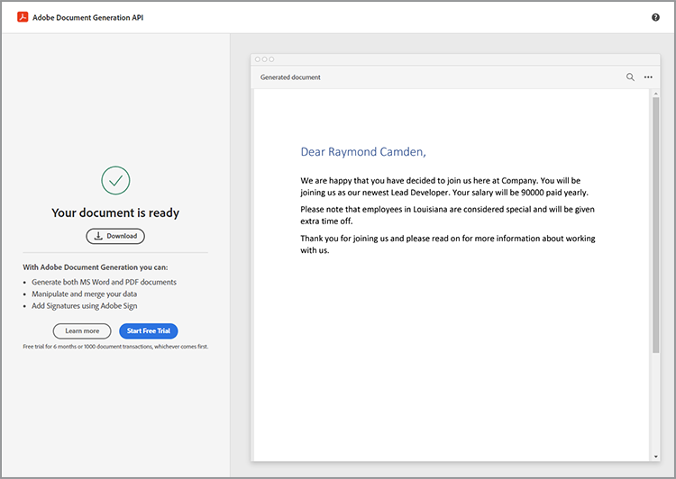

雖然文件標註器能讓你快速設計和測試，但一旦完成並進入生產環境，你可以使用其中一個 SDK 來自動化這個流程。 雖然實際程式碼會依據具體需求有所不同，以下是Node.js範例：

```js
 const PDFServicesSdk = require('@adobe/pdfservices-node-sdk');

const credentials =  PDFServicesSdk.Credentials
    .serviceAccountCredentialsBuilder()
    .fromFile("pdfservices-api-credentials.json")
    .build();

// Data would be dynamic...
let data = {
    "name":"Raymond Camden",
    "role":"Lead Developer",
    "salary":9000,
    "location":"Louisiana"
}

// Create an ExecutionContext using credentials.
const executionContext = PDFServicesSdk.ExecutionContext.create(credentials);

// Create a new DocumentMerge options instance.
const documentMerge = PDFServicesSdk.DocumentMerge,
    documentMergeOptions = documentMerge.options,
    options = new documentMergeOptions.DocumentMergeOptions(jsonDataForMerge, documentMergeOptions.OutputFormat.PDF);

// Create a new operation instance using the options instance.
const documentMergeOperation = documentMerge.Operation.createNew(options);

// Set operation input document template from a source file.
const input = PDFServicesSdk.FileRef.createFromLocalFile('documentMergeTemplate.docx');
documentMergeOperation.setInput(input);

// Execute the operation and Save the result to the specified location.
documentMergeOperation.execute(executionContext)
    .then(result => result.saveAsFile('documentOutput.pdf'))
    .catch(err => {
        if(err instanceof PDFServicesSdk.Error.ServiceApiError
            || err instanceof PDFServicesSdk.Error.ServiceUsageError) {
            console.log('Exception encountered while executing operation', err);
        } else {
            console.log('Exception encountered while executing operation', err);
        }
    });
```

簡而言之，程式碼會設定憑證、建立操作物件並設定輸入與選項，然後呼叫操作。 最後，它會將結果儲存為 PDF。 （結果也可以輸出成 Word。）

文件產生支援更複雜的使用情境，包括擁有完全動態的資料表與影像。 詳情請參閱[&#128279;](https://developer.adobe.com/document-services/docs/overview/document-generation-api/)文件。

## 執行PDF操作

[PDF 服務 API](https://developer.adobe.com/document-services/apis/pdf-services/) 提供大量用於處理 PDF 的「工具」操作。這些作業包括：

* 從 Office 文件建立 PDF
* 將 PDF 匯出到 Office 文件
* 合併與拆分 PDF
* 將 OCR 應用到 PDF 上
* 設定、移除及修改 PDF 的保護
* 刪除、插入、重新排序及旋轉頁面
* 透過壓縮或線性化優化 PDF
* 取得 PDF 屬性

在此情境下，文件產生呼叫的結果必須與標準 PDF 合併。 這個操作在 SDK 上相當簡單。 這裡有一個Node.js的例子：

```js
const PDFServicesSdk = require('@adobe/pdfservices-node-sdk');
 
// Initial setup, create credentials instance.
const credentials = PDFServicesSdk.Credentials
    .serviceAccountCredentialsBuilder()
    .fromFile("pdfservices-api-credentials.json")
    .build();
 
// Create an ExecutionContext using credentials and create a new operation instance.
const executionContext = PDFServicesSdk.ExecutionContext.create(credentials),
    combineFilesOperation = PDFServicesSdk.CombineFiles.Operation.createNew();
 
// Set operation input from a source file.
const combineSource1 = PDFServicesSdk.FileRef.createFromLocalFile('documentOutput.pdf'),
      combineSource2 = PDFServicesSdk.FileRef.createFromLocalFile('standardCorporate.pdf');

combineFilesOperation.addInput(combineSource1);
combineFilesOperation.addInput(combineSource2);
 
// Execute the operation and Save the result to the specified location.
combineFilesOperation.execute(executionContext)
    .then(result => result.saveAsFile('combineFilesOutput.pdf'))
    .catch(err => {
        if (err instanceof PDFServicesSdk.Error.ServiceApiError
            || err instanceof PDFServicesSdk.Error.ServiceUsageError) {
            console.log('Exception encountered while executing operation', err);
        } else {
            console.log('Exception encountered while executing operation', err);
        }
    });
```

這段程式碼會將兩個 PDF 合併，然後儲存成新的 PDF。 簡單又簡單！ 請[&#128279;](https://developer.adobe.com/document-services/docs/overview/pdf-services-api/)參考文件，了解可採取的做法範例。

## 簽署流程

在入職流程的最後階段，員工必須簽署一份協議，表示他們已閱讀並同意所有政策。 [Acrobat Sign](https://www.adobe.com/acrobat/business/sign.html) 支援多種工作流程與整合，包括透過 [API](https://opensource.adobe.com/acrobat-sign/developer_guide/index.html) 自動化的整合。 大致來說，劇本的最後部分可以如下完成：

首先，設計包含需要簽署表格的文件。 有多種方式可以做到這一點，包括在 Adobe Sign 使用者儀表板中設計的視覺化。 另一個選擇是使用 Document Generation Word 外掛替你插入標籤。 此範例要求簽名與日期。

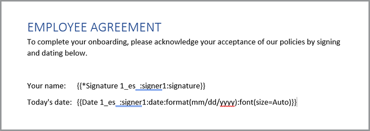

此文件可儲存為 PDF，並使用上述相同方法，將所有文件合併。 這個過程會形成一個完整的包裝，包含個人化的問候語、標準的公司文件，以及適合簽名的最終頁面。

範本可上傳至 Acrobat Sign 儀表板，並用於新合約。 透過使用 REST API，該文件可傳送給潛在員工，請求其簽名。

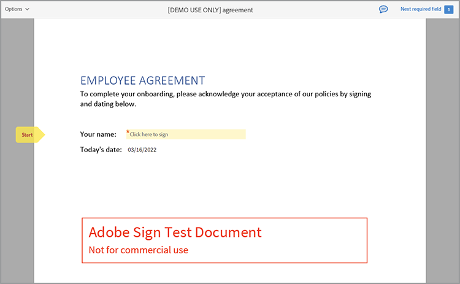

## 自己去體驗

本文所述的所有內容現在都可以進行測試。 [!DNL Adobe Acrobat Services] [API 免費試用](https://documentcloud.adobe.com/dc-integration-creation-app-cdn/main.html)目前在六個月內提供 1,000 筆免費請求。Acrobat Sign 的 [免費試用](https://www.adobe.com/acrobat/business/sign.html#sign_free_trial) 讓你可以傳送帶有浮水印的協議作為測試用途。

有問題嗎？ [支援論壇](https://community.adobe.com/t5/acrobat-services-api/ct-p/ct-Document-Cloud-SDK)每天都由 Adobe 開發者和支援人員監控。最後，想要更多靈感，記得去看下一 [集《迴紋針](https://www.youtube.com/playlist?list=PLcVEYUqU7VRe4sT-Bf8flvRz1XXUyGmtF) 》。 定期舉辦現場會議，包含新聞、示範與與客戶的對談。
