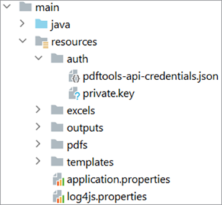
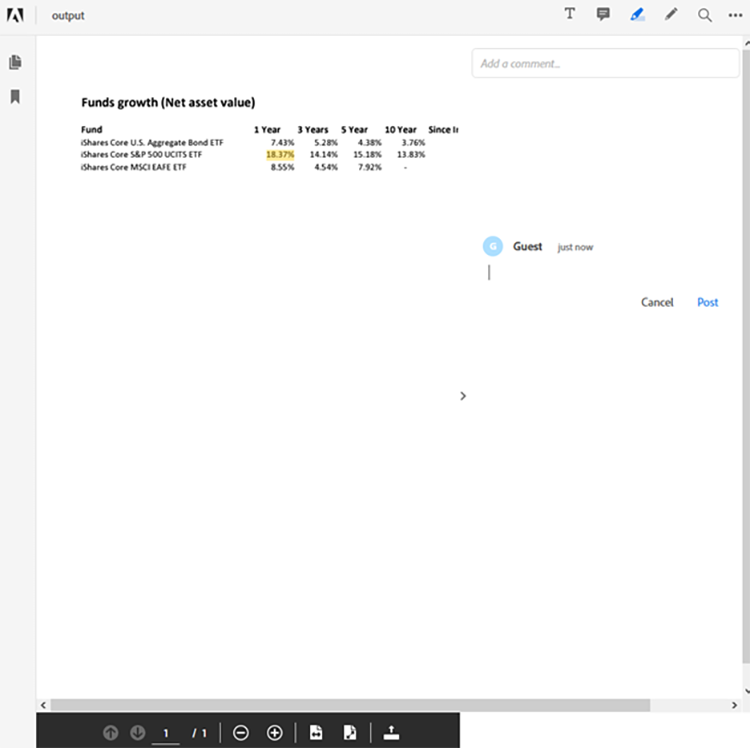

# 在 Java 中管理財務文件工作流程


金融業廣泛使用 PDF 檔案來交換資料，因為它有助於維持文件格式、設計與結構。 這種健全的格式讓財務分析師與顧問能協助客戶做出明智的決策。

然而，PDF 格式在處理與自動化上可能具有挑戰性，尤其是在合併多個資料來源時——這是金融業常見的使用情境。 建立客製化解決方案來處理 PDF 文件也是一種選擇，但不需要在軟體和基礎架構上投入太多時間和金錢。 [!DNL Adobe Acrobat Services] 提供所有必要的工具、服務與功能，以處理與擷取 PDF 文件中的資料。

## 你可以學到什麼

在這個實作教學中，學習如何使用 [!DNL Adobe Acrobat Services] 應用程式中的 [!DNL Java Spring Boot] API。 你建立一個模型視圖控制器（MVC）應用程式，從 PDF 文件中擷取內容，轉換成 Excel 等其他資料格式，合併多個 PDF，並對資源設密碼保護。 本教學說明如何處理 PDF 文件，並使用 Adobe [PDF 嵌入 API](https://developer.adobe.com/document-services/apis/pdf-embed) 在網站上展示。

## 相關 API 與資源

* [PDF 服務 API](https://opensource.adobe.com/pdftools-sdk-docs/release/latest/index.html)

* [PDF 嵌入 API](https://www.adobe.com/devnet-docs/dcsdk_io/viewSDK/index.html)

* [專案樣本](https://github.com/adobe/pdftools-java-sdk-samples)

## 設定

[!DNL Adobe Acrobat Services] 使用認證系統來控制資源存取。 要存取這些服務，您必須向 Adobe 申請您組織或應用程式的 API 金鑰。 如果你有 API 金鑰，請繼續閱讀下一節。 要建立新的 API 金鑰，請造訪[網站的「入門](https://www.adobe.io/apis/documentcloud/dcsdk/gettingstarted.html) [!DNL Acrobat Services]」頁面。你可以使用他們的免費試用來建立金鑰，該試用版提供 1,000 筆文件交易，且可使用長達六個月。

要跟著這個教學操作，你需要兩組 API 金鑰：

* Adobe PDF 服務 — 用於處理 PDF 文件

* Adobe PDF 嵌入 API

建立憑證後，將 PDF Services API 的憑證與私鑰複製到 [!DNL Spring Boot] 應用程式的資源區塊。 想了解更多關於 [Maven 和 Gradle 函式庫及其相依關係](https://developer.adobe.com/document-services/docs/overview/pdf-services-api) ，請造訪官 [!DNL Adobe Acrobat Services] 網。 在繼續之前，務必先設定好所有必要的套件和函式庫。



要設定日誌服務，請造訪 [Adobe 文件](https://developer.adobe.com/document-services/docs/overview/pdf-services-api) 並捲動至日誌區塊。

>[!NOTE]
>
> 在你的生產環境中，不要將私鑰儲存在版本控制中。 務必使用秘密保險庫或金鑰注入服務，以防止未經授權的憑證使用。

現在你的 [!DNL Spring Boot] 應用程式已設定好，就可以開始處理 PDF 並為客戶產生報告。

## 提交報告資料

要使用 Adobe PDF Services API，首先設定一個 `ExecutionContext` 會消耗你提供的憑證的 API。 既然你已經在應用程式裡有憑證，你可以從檔案讀取並建立上下文，如下：

```
Credentials credentials = Credentials.serviceAccountCredentialsBuilder()
    .fromFile(AUTH_FILE_PATH)
    .build();

ExecutionContext executionContext = ExecutionContext.create(credentials);
```

接著，取得處理 PDF 文件的上下文。 以下是你可以執行的行動：

* 將 PDF 文件轉換成 Excel、Word 或圖形格式

* 建立 PDF 文件（來自 HTML、Excel、Word 等）

* 合併多個 PDF 文件

* 保護與解除保護 PDF 文件（你必須有密碼）

* 優化 PDF 文件以在網路上傳送

所有這些範例都可以在 [GitHub](https://github.com/adobe/pdfservices-java-sdk-samples/tree/master/src/main/java/com/adobe/pdfservices/operation/samples) 範例倉庫中找到。

接著，在 [!DNL Spring Boot]中，你可以透過 String 路徑或上傳檔案的串流取得檔案。 你執行的每個操作都必須初始化，並且必須設定輸入檔案路徑。 在這個教學中，你會使用Blackrock[&#128279;](https://www.blackrock.com/us/individual/products/investment-funds)公開提供的PDF報告。你可以使用任何其他來源，包括你自己的報告。

首先從檔案中擷取 FileRef 物件。 為了簡化，請以字串路徑的檔案為主。 以下，你建立一個操作，將路徑中的檔案從 PDF 轉換成 Excel：

```
ExecutionContext executionContext = ExecutionContext.create(credentials);
ExportPDFOperation exportOperation = ExportPDFOperation.createNew(ExportPDFTargetFormat.XLSX);

// Create the input source
FileRef inputPdf = FileRef.createFromLocalFile(INPUT_PDF);
exportOperation.setInput(inputPdf);
```

完成此步驟後，程式即可對 PDF 執行第一個操作。 接著，執行操作，並在 Excel 表格中取得結果：

```
try {
    FileRef output = exportOperation.execute(executionContext);
    output.saveAs(OUTPUT_EXCEL);
} catch (ServiceApiException e) {
    e.printStackTrace();
}
```

此情境僅處理一個 PDF 檔案。 你也可以先用多個 PDF 檔案，然後把它們合併成一個檔案。 在財務資料報告中，使用多檔檔案很常見，因為您必須處理來自多個來源的資金，才能提供完整的報告。

## 生成報告

[!DNL Adobe Acrobat Services] 不支援直接處理 Excel 文件，但你仍可使用社群框架和函式庫來處理內容。

例如，你可以使用 [Apache POI](https://poi.apache.org/) 在應用程式 [!DNL Java Spring Boot] 中處理 Excel（或其他 Microsoft 文件），或是對 Excel 檔案執行其他手動或自動化任務。

在這個例子中，從你的 PDF 文件開始，你要提取三筆基金的淨資產價值，並以表格呈現。 你也可以根據需求和可用資料，提取其他資訊，例如圖表和表格。 你甚至可以從其他來源帶入資料。

報告產生後——在此範例中為 Excel 格式——你可以使用 Adobe PDF Services 操作將報告轉回 PDF 文件並加以保護。

要將報告從 Excel 格式轉換成 PDF 文件，請使用以下操作：

```
ExecutionContext executionContext = ExecutionContext.create(credentials);
CreatePDFOperation exportOperation = CreatePDFOperation.createNew();

// Create the input source
FileRef inputPdf = FileRef.createFromLocalFile(INPUT_EXCEL);
exportOperation.setInput(inputPdf);

try {
    FileRef output = exportOperation.execute(executionContext);
    output.saveAs(OUTPUT_PDF);
} catch (ServiceApiException e) {
    e.printStackTrace();
}
```

>[!TIP]
>
> 為了避免每次有請求都必須重新建立物件，可以使用 Spring 的相依注入來注入該 `ExecutionContext` 物件。

此程式碼會從報告產生 Excel 格式的 PDF 文件。

在將這份 PDF 交給客戶之前，你可以用密碼來保護它。 建立另一個處理此保護的操作，ProtectPDFOperation，然後使用 ProtectPDFOptions 將密碼加入文件。

```
ProtectPDFOptions options = ProtectPDFOptions.passwordProtectOptionsBuilder()
                    .setUserPassword("p@55w0rd")
                    .setEncryptionAlgorithm(EncryptionAlgorithm.AES_256)
                    .build();
ProtectPDFOperation operation = ProtectPDFOperation.createNew(options);
```

接著，指定輸入並執行操作。 產生的檔案應該會設定密碼，以防止未經授權的存取。

## 展示報告

現在你的 PDF 報告已經產生，你可以使用 Adobe PDF 嵌入 API 在網站上顯示報告。 此 JavaScript API 讓網頁開發者能在網頁瀏覽器中原生載入並渲染 PDF 文件。

>[!NOTE]
>
> 此時你需要第二個憑證憑證，也就是客戶端 ID。

在你的 [!DNL Spring Boot] 應用程式中，請加入以下 HTML 摘要，作為你想要渲染 PDF 報告的地方：

```
<div id="pdf-viewer"></div>
<script src="https://documentcloud.adobe.com/view-sdk/main.js"></script>
<script type="text/javascript">
    document.addEventListener("adobe_dc_view_sdk.ready", function()
    {
        var adobeDCView = new AdobeDC.View({ clientId: "<your-client-id-here>", divId: "pdf-viewer" });
        adobeDCView.previewFile(
        {
            content: {
                location: {
                    url: "<your-document.pdf>"
                }
            },
            metaData: {
                fileName: "<document-name.pdf>"
            }
        });
    });
</script>
```

此腳本載入 PDF 文件，並允許檢視者對文件進行註解與評論。 以下是 Firefox 中此嵌入 API 的視圖：



PDF 嵌入 API 提供所有必要的工具，讓您可以預覽 PDF 並註解報告。

## 後續步驟

這段實作教學探討了 [[!DNL Adobe Acrobat Services]](https://developer.adobe.com/document-services/homepage/) API，並討論如何利用這些服務處理 PDF 資料及產生財務決策報告。 它示範了如何將 API 整合進系統，並以 [!DNL Java Spring Boot] 範例框架為例，展示快速處理 PDF 文件的簡單性。

探索 [[!DNL Adobe Acrobat Services]](https://developer.adobe.com/document-services/homepage/) 並了解 Adobe PDF 服務能為您的企業帶來什麼。 想了解更多 SDK 的功能，請參考 [GitHub 倉庫](https://github.com/adobe/pdftools-java-sdk-samples)取得範例，並探索 PDF 嵌入 API[&#128279;](https://developer.adobe.com/document-services/apis/pdf-embed) 如何幫助你快速在應用程式中顯示 PDF。

想要輕鬆合併與操作文件，為你的財務客戶製作有用的 PDF 報告，請從今天就註冊免費 [的 Adobe 開發者帳號](https://developer.adobe.com/document-services/homepage/) 開始。
