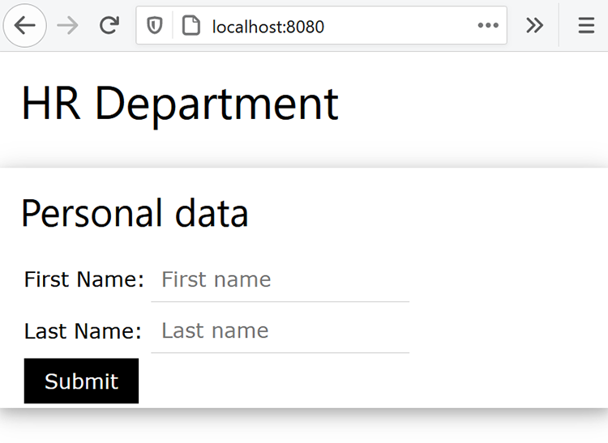
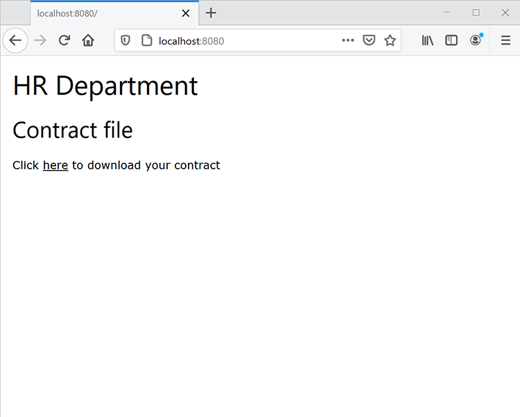

# Java 中的人力資源檔工作流程


許多企業需要有關新員工的檔，例如在家工作的員工的工作場所合約。 傳統上，企業以難以管理和儲存的形式來管理這些檔。 切換至電子檔時，PDF 檔案較其他文件類型更安全且不可修改，是理想選擇。 此外，還支援數字簽名。

## 您可以學習哪些內容

在此實作教學課程中，瞭解如何在簡單的 Java Spring MVC 應用程式中，透過註銷功能，實作網頁型 HR 表單，將工作場所合約儲存為 PDF。

## 相關 API 和資源

* [PDF 服務API](https://opensource.adobe.com/pdftools-sdk-docs/release/latest/index.html)

* [Adobe Sign API](https://developer.adobe.com/adobesign-api/)

* [項目代碼](https://github.com/dawidborycki/adobe-sign)

## 產生API認證

先註冊「Adobe PDF服務」API免費試用版。 前往 Adobe](https://www.adobe.io/apis/documentcloud/dcsdk/gettingstarted.html?ref=getStartedWithServicesSDK) 網站，然後按兩下&#x200B;*「建立新認證」下方*&#x200B;的「*開始使用」*&#x200B;按鈕。[](https://www.adobe.io/apis/documentcloud/dcsdk/gettingstarted.html?ref=getStartedWithServicesSDK) [免費試用版提供 1,000 筆檔交易，可在 6 個月內使用。 在下一頁 （請參閱下方） 中選擇服務 （PDF Services API），設定認證名稱 （例如 HRDocumentWFCredentials），然後輸入說明。

選取語言 （此範例為 Java），然後勾選 *「建立個人化程式代碼範例」*。 最後一個步驟可確保程式碼範例已包含您所使用的預先填入pdftools-api-credentials.json檔案，以及要在API中驗證應用程式的私鑰。

最後，按兩下「 *建立認證」* 按鈕。 這會產生認證，範例會自動開始下載。


若要確保憑證正常運作，請開啟下載的範例。 在這裡，您正在使用 IntelliJ IDEA。 當您開啟原始碼時，整合開發環境 （IDE） 會要求您使用建置引擎。 此範例會使用 Maven，但您也可以根據您的偏好設定使用 Gradle。

接下來，執行 `mvn clean install` Maven 目標以建立 jar 檔案。

最後，執行 CombinePDF 範例，如下所示。 此程式代碼會在輸出檔案夾內產生 PDF。


## 建立 Spring MVC 應用程式

授與您建立應用程式的憑證。 本範例使用 Spring Initializr。

首先，設定項目設定以使用 Java 8 語言和 Jar 封裝 （請參閱下方螢幕截圖）。


第二，新增「春季網頁」（從 Web） 和 Thymeleaf （從範本引擎）：


建立專案后，前往pom.xml檔案，然後使用 pdftools-sdk 和 log4j-slf4j-impl 來補充相依性區段：

```
<dependencies>
    <dependency>
        <groupId>org.springframework.boot</groupId>
        <artifactId>spring-boot-starter-thymeleaf</artifactId>
    </dependency>
    <dependency>
        <groupId>org.springframework.boot</groupId>
        <artifactId>spring-boot-starter-web</artifactId>
    </dependency>

    <dependency>
        <groupId>org.springframework.boot</groupId>
        <artifactId>spring-boot-starter-test</artifactId>
        <scope>test</scope>
    </dependency>

</dependencies>
```

然後，將專案的根檔案夾與您下載的範例程式代碼一起下載的兩個檔案補充：

* pdftools-api-credentials.json

* private.key

## 演算網頁表單

若要渲染網頁表單，請使用顯示個人資料表單的控制器修改應用程式，並處理張貼表單的作業。 因此，請先使用「PersonForm」模型類別修改應用程式：

```
package com.hr.docsigning;
import javax.validation.constraints.NotNull;
import javax.validation.constraints.Size;

public class PersonForm {
    @NotNull
    @Size(min=2, max=30)
    private String firstName;

    @NotNull
    @Size(min=2, max=30)
    private String lastName;

    public String getFirstName() {
            return this.firstName;
    }


    public void setFirstName(String firstName) {
            this.firstName = firstName;
    }

    public String getLastName() {
           return this.lastName;
    }

    public void setLastName(String lastName) {
            this.lastName = lastName;
    }

    public String GetFullName() {
           return this.firstName + " " + this.lastName;
    }
}
```

這個類別包含兩個屬性： `firstName` 和 `lastName`。 此外，使用此簡單的驗證來檢查兩個字元和 30 個字元之間的驗證。

在模型類別中，您可以建立控制器 （請參閱隨附程序代碼中的PersonController.java）：

```
package com.hr.docsigning;
import org.springframework.stereotype.Controller;
import org.springframework.validation.BindingResult;
import org.springframework.web.bind.annotation.GetMapping;
import org.springframework.web.bind.annotation.PostMapping;
import javax.validation.Valid;


@Controller
public class PersonController {
    @GetMapping("/")
    public String showForm(PersonForm personForm) {
        return "form";
    }
}
```

控制器只有一個方法：showForm。 其負責使用位於 resources/templates/form.html 中的 HTML 範本演算表單：

```
<html>
<head>
    <link rel="stylesheet" href="https://www.w3schools.com/w3css/4/w3.css">
</head>
 
<body>
<div class="w3-container">
    <h1>HR Department</h1>
</div>
 
<form class="w3-panel w3-card-4" action="#" th:action="@{/}"
        th:object="${personForm}" method="post">
    <h2>Personal data</h2>
    <table>
        <tr>
            <td>First Name:</td>
            <td><input type="text" class="w3-input"
                placeholder="First name" th:field="*{firstName}" /></td>
            <td class="w3-text-red" th:if="${#fields.hasErrors('firstName')}"
                th:errors="*{firstName}"></td>
        </tr>
        <tr>
            <td>Last Name:</td>
            <td><input type="text" class="w3-input"
                placeholder="Last name" th:field="*{lastName}" /></td>
            <td class="w3-text-red" th:if="${#fields.hasErrors('lastName')}"
                th:errors="*{lastName}"></td>
        </tr>
        <tr>
            <td><button class="w3-button w3-black" type="submit">Submit</button></td>
        </tr>
    </table>
</form>
</body>
</html>
```

若要演算動態內容，可使用 Thymeleaf 範本演算引擎。 因此，執行應用程式後，您應該會看到以下內容：



## 使用動態內容產生 PDF

現在，在呈現個人資料表格后，動態填入選取的字段，產生包含虛擬合約的 PDF 檔。 具體而言，您必須將人員數據填入預先建立的合約中。

這裏簡單來說，您只有一個頁首、一個子標題和一個字符串常數，如下所示：「這份合約準備就緒了 \&lt;full name=&quot;&quot; of=&quot;&quot; the=&quot;&quot; person\=&quot;&quot;>」。&lt;/full>

若要實現此目標，請先從 Adobe [的 Dynamic HTML](https://opensource.adobe.com/pdftools-sdk-docs/release/latest/howtos.html#create-a-pdf-from-dynamic-html) 範例建立 PDF 開始。 透過分析該範例程式代碼，您會看到動態 HTML 欄位的人口程式可以依照以下方式運作。

首先，您必須準備具有靜態和動態內容的 HTML 頁面。 動態元件會使用 JavaScript 進行更新。 亦即 PDF 服務 API 將 JSON 物件插入您的 HTML。

接著，您可以使用 HTML 檔載入時叫用的JavaScript功能取得 JSON 屬性。 此JavaScript功能會更新選取的 DOM 元素。 以下範例會填入跨範圍元素，並按住人員的數據 （請參閱 src\main\resources\\contract\\index.html隨附程式代碼）：

```
<html>
<head>
    <link rel="stylesheet" href="https://www.w3schools.com/w3css/4/w3.css">
</head>
 
<body onload="updateFullName()">
    <script src="./json.js"></script>
    <script type="text/javascript">
        function updateFullName()
        {
            var document = window.document;
            document.getElementById("personFullName").innerHTML = String(
                window.json.personFullName);
        }
    </script>
 
    <div class="w3-container ">
        <h1>HR Department</h1>
 
        <h2>Contract details</h2>
 
        <p>This contract was prepared for:
            <strong><span id="personFullName"></span></strong>
        </p>
    </div>
</body>
</html>
```

然後，您必須將 HTML 壓縮成所有相依JavaScript和 CSS 檔案。 PDF 服務API不接受 HTML 檔案。 反之，它會需要一個 zip 檔案做為輸入。 在此情況下，您會將壓縮檔儲存在 src\main\resources\\contract\\index.zip 中。

之後，您可以使用其他處理POST要求的方法來補充 `PersonController` 此方法：

```
@PostMapping("/")
public String checkPersonInfo(@Valid PersonForm personForm,
    BindingResult bindingResult) {
    if (bindingResult.hasErrors()) {
        return "form";
    }
 
    CreateContract(personForm);
 
    return "contract-actions";
}
```

上述方法會使用提供的個人身分建立 PDF 合約，並呈現合約動作檢視畫面。 後者提供所產生 PDF 的連結和 PDF 的簽署。

現在，讓我們來看看方法的 `CreateContract` 運作方式 （以下列出完整清單）。 此方法主要有兩個字段：

* `LOGGER`，從log4j到偵錯任何例外狀況的相關信息

* `contractFilePath`，其中包含產生的 PDF 的檔案路徑

此 `CreateContract` 方法會設定認證並從 HTML 建立 PDF。 若要傳遞和填入合約中人員的數據，請使用 `setCustomOptionsAndPersonData` 輔助程式。 此方法會從表單擷取人員的數據，然後透過上述的 JSON 物件將數據傳送至產生的 PDF。

同時， `setCustomOptionsAndPersonData` 說明如何透過停用頁首和頁尾來控制 PDF 外觀。 完成這些步驟后，您將 PDF 檔案儲存為輸出/contract.pdf，最後刪除先前產生的檔案。

```
private static final Logger LOGGER = LoggerFactory.getLogger(PersonController.class);
private String contractFilePath = "output/contract.pdf"; 
private void CreateContract(PersonForm personForm) {
    try {
        // Initial setup, create credentials instance.
        Credentials credentials = Credentials.serviceAccountCredentialsBuilder()
                .fromFile("pdftools-api-credentials.json")
                .build();

        //Create an ExecutionContext using credentials 
       //and create a new operation instance.
        ExecutionContext executionContext = ExecutionContext.create(credentials);
        CreatePDFOperation htmlToPDFOperation = CreatePDFOperation.createNew();

        // Set operation input from a source file.
        FileRef source = FileRef.createFromLocalFile(
           "src/main/resources/contract/index.zip");
       htmlToPDFOperation.setInput(source);

        // Provide any custom configuration options for the operation
        // You pass person data here to dynamically fill out the HTML
        setCustomOptionsAndPersonData(htmlToPDFOperation, personForm);

        // Execute the operation.
        FileRef result = htmlToPDFOperation.execute(executionContext);

        // Save the result to the specified location. Delete previous file if exists
        File file = new File(contractFilePath);
        Files.deleteIfExists(file.toPath());

        result.saveAs(file.getPath());

    } catch (ServiceApiException | IOException | 
             SdkException | ServiceUsageException ex) {
        LOGGER.error("Exception encountered while executing operation", ex);
    }
}
 
private static void setCustomOptionsAndPersonData(
    CreatePDFOperation htmlToPDFOperation, PersonForm personForm) {
    //Set the dataToMerge field that needs to be populated 
    //in the HTML before its conversion
    JSONObject dataToMerge = new JSONObject();
    dataToMerge.put("personFullName", personForm.GetFullName());
 
    // Set the desired HTML-to-PDF conversion options.
    CreatePDFOptions htmlToPdfOptions = CreatePDFOptions.htmlOptionsBuilder()
        .includeHeaderFooter(false)
        .withDataToMerge(dataToMerge)
        .build();
    htmlToPDFOperation.setOptions(htmlToPdfOptions);
}
```

產生合約時，您還可以使用固定的合約條款合併動態的人員特定數據。 若要這麼做，請依照 [「從靜態 HTML 建立 PDF」](https://opensource.adobe.com/pdftools-sdk-docs/release/latest/howtos.html#create-a-pdf-from-dynamic-html) 範例進行。 或者，您也可以 [合併兩個 PDF](https://opensource.adobe.com/pdftools-sdk-docs/release/latest/howtos.html#create-a-pdf-from-static-html)。

## 呈現要下載的 PDF 檔案

您現在可以顯示所產生 PDF 的連結，供用戶下載。 若要這麼做，請先建立contract-actions.html檔案 （請參閱隨附程式碼contract-actions.html資源/範本）：

```
<html>
<head>
    <link rel="stylesheet" href="https://www.w3schools.com/w3css/4/w3.css">
</head>
 
<div class="w3-container ">
    <h1>HR Department</h1>
 
    <h2>Contract file</h2>
 
    <p>Click <a href="/pdf">here</a> to download your contract</p>
</div>
</body>
</html>
```

然後，您在類別中`PersonController`實作`downloadContract`方法，如下所示：

```
@RequestMapping("/pdf")
public void downloadContract(HttpServletResponse response)
{
    Path file = Paths.get(contractFilePath);
 
    response.setContentType("application/pdf");
    response.addHeader(
        "Content-Disposition", "attachment; filename=contract.pdf");

    try
    {
        Files.copy(file, response.getOutputStream());
        response.getOutputStream().flush();
    }
    catch (IOException ex) 
    {
        ex.printStackTrace();
    }
}
```

執行應用程式後，您會獲得下列流程。 第一個畫面會顯示個人資料表格。 若要進行測試，請使用 2 到 30 個字元之間的任何值來填滿：


按兩下「 *送出」* 按鈕後，窗體會驗證並根據 HTML （resources/contract/index.html） 產生 PDF。 應用程式會顯示另一個檢視 （合約詳細數據），您可以在其中下載 PDF：



在網頁瀏覽器中渲染后，PDF 會如下所示。 也就是說，您輸入的個人資料會傳播至 PDF：


## 啟用簽名和安全性

合約準備就緒后，Adobe Sign可以新增代表核准的數字簽名。 Adobe Sign驗證的運作方式與 OAuth 稍有不同。 現在讓我們瞭解如何將應用程式與 Adobe Sign 整合。 若要這麼做，您必須為應用程式準備存取令牌。 然後，使用 Adobe Sign Java SDK 寫入客戶端代碼。

若要取得授權令牌，您必須執行下列幾個步驟：

首先，註冊開發 [人員帳戶](https://acrobat.adobe.com/tw/zh-Hant/acrobat/contact.html)。

在 Adobe Sign 入口網站中 [建立 CLIENT 應用程式](https://opensource.adobe.com/acrobat-sign/developer_guide/index.html#!adobedocs/adobe-sign/master/gstarted/create_app.md)。

依照此處](https://opensource.adobe.com/acrobat-sign/developer_guide/index.html#!adobedocs/adobe-sign/master/gstarted/configure_oauth.md)和[這裡](https://secure.eu1.adobesign.com/public/static/oauthDoc.jsp)所述[，為應用程式設定 OAuth。記下您的用戶端識別碼和客戶端密碼。 然後，您可以作為 `https://www.google.com` 重新導向 URI 和下列範圍：

* user_login：self

* agreement_read：帳戶

* agreement_write：帳戶

* agreement_send：帳戶

請依照下列方式準備URL，取代 \&lt;CLIENT_ID\>：&lt;/CLIENT_ID\>

```
https://secure.eu1.adobesign.com/public/oauth?redirect_uri=https://www.google.com
&response_type=code
&client_id=<CLIENT_ID>
&scope=user_login:self+agreement_read:account+agreement_write:account+agreement_send:account
```

在網頁瀏覽器中輸入上述URL。 系統會將您重新導向至 google.com，且程式代碼會以code&lt;YOUR_CODE\>=\、
例：&lt;/YOUR_CODE\>

```
https://www.google.com/?code=<YOUR_CODE>&api_access_point=https://api.eu1.adobesign.com/&web_access_point=https://secure.eu1.adobesign.com%2F
```

記下 \&lt;YOUR_CODE\> 和 api_access_point&lt;/YOUR_CODE\> 的值。

若要傳送提供存取令牌的HTTP POST 要求，請使用用戶端 ID、\&lt;YOUR_CODE\>和api_access_point值。 &lt;/YOUR_CODE\>您可以使用 [Postman](https://helpx.adobe.com/sign/kb/how-to-create-access-token-using-postman-adobe-sign.html) 或 cURL：

```
curl --location --request POST "https://**api.eu1.adobesign.com**/oauth/token"
\\

\--data-urlencode "client_secret=**\<CLIENT_SECRET\>**" \\

\--data-urlencode "client_id=**\<CLIENT_ID\>**" \\

\--data-urlencode "code=**\<YOUR_CODE\>**" \\

\--data-urlencode "redirect_uri=**https://www.google.com**" \\

\--data-urlencode "grant_type=authorization_code"
```

範例回應如下所示：

```
{
    "access_token":"3AAABLblqZhByhLuqlb-…",
    "refresh_token":"3AAABLblqZhC_nJCT7n…",
    "token_type":"Bearer",
    "expires_in":3600
}
```

記下您的access_token。 您需要授權客戶端代碼。

## 使用 Adobe Sign Java SDK

擁有存取令牌後，您可以將 REST API呼叫傳送給Adobe Sign。 若要簡化此程式，請使用 Adobe Sign Java SDK。 來源程式代碼可在 [Adobe GitHub 儲存庫取得](https://github.com/adobe-sign/AdobeSignJavaSdk)。

若要將此套件與您的應用程式整合，您必須仿製程序代碼。 然後建立 Maven 套件 （mvn 套件），然後將下列檔案安裝到專案中 （您可以在 adobe-sign-sdk 資料夾中的隨附程式碼中找到）：

* target/swagger-java-client-1.0.0.jar

* target/lib/gson-2.8.1.jar

* target/lib/gson-fire-1.8.0.jar

* target/lib/hamcrest-core-1.3.jar

* target/lib/junit-4.12.jar

* target/lib/logging-interceptor-2.7.5.jar

* target/lib/okhttp-2.7.5.jar

* target/lib/okio-1.6.0.jar

* target/lib/swagger-annotations-1.5.15.jar

在 IntelliJ IDEA 中，您可以使用 *專案結構 （檔案/項目結構* ） 將這些檔案新增為相依性。

## 傳送 PDF 以供簽署

您現在已準備好傳送合約以供簽署。 若要這麼做，請先為contract-details.html加上另一個與傳送要求的超連結：

```
<html>
<head>
    <link rel="stylesheet" href="https://www.w3schools.com/w3css/4/w3.css">
</head>
 
<div class="w3-container ">
    <h1>HR Department</h1>
 
    <h2>Contract file</h2>
 
    <p>Click <a href="/pdf"> here</a> to download your contract</p>
 
    
</div>
</body>
</html>
```

然後，您新增另一個控制器， `AdobeSignController`並在其中實作 `sendContractMethod` （請參閱隨附程序代碼）。 此方法的運作方式如下：

首先，它會用來 `ApiClient` 取得API端點。

```
ApiClient apiClient = new ApiClient();

//Default baseUrl to make GET /baseUris API call.
String baseUrl = "https://api.echosign.com/";
String endpointUrl = "/api/rest/v6";
apiClient.setBasePath(baseUrl + endpointUrl);

// Provide an OAuth Access Token as "Bearer access token" in authorization
String authorization = "Bearer ";

// Get the baseUris for the user and set it in apiClient.
BaseUrisApi baseUrisApi = new BaseUrisApi(apiClient);
BaseUriInfo baseUriInfo = baseUrisApi.getBaseUris(authorization);
apiClient.setBasePath(baseUriInfo.getApiAccessPoint() + endpointUrl);
```

然後，該方法會使用 contract.pdf 檔案來建立暫時性檔：

```
// Get PDF file
String filePath = "output/";
String fileName = "contract.pdf";
File file = new File(filePath + fileName);
String mimeType = "application/pdf";
 
//Get the id of the transient document.
TransientDocumentsApi transientDocumentsApi =
    new TransientDocumentsApi(apiClient);
TransientDocumentResponse response = transientDocumentsApi.createTransientDocument(authorization,
    file, null, null, fileName, mimeType);
String transientDocumentId = response.getTransientDocumentId();
```

接下來，您必須建立合約。 若要這麼做，請使用 contract.pdf 檔案，並將合約狀態設為IN_PROCESS，以便立即傳送檔案。 此外，您也可以選擇電子簽名：

```
// Create AgreementCreationInfo
AgreementCreationInfo agreementCreationInfo = new AgreementCreationInfo();
 
// Add file
FileInfo fileInfo = new FileInfo();
fileInfo.setTransientDocumentId(transientDocumentId);
agreementCreationInfo.addFileInfosItem(fileInfo);
 
// Set state to IN_PROCESS, so the agreement is be sent immediately
agreementCreationInfo.setState(AgreementCreationInfo.StateEnum.IN_PROCESS);
agreementCreationInfo.setName("Contract");
agreementCreationInfo.setSignatureType(AgreementCreationInfo.SignatureTypeEnum.ESIGN);
```

接下來，您將依照下列步驟新增合約收件者。 您要新增兩個收件者 （請參閱「員工和管理員」區段）：

```
// Provide emails of recipients to whom agreement is be sent
// Employee
ParticipantSetInfo participantSetInfo = new ParticipantSetInfo();
ParticipantSetMemberInfo participantSetMemberInfo = new ParticipantSetMemberInfo();
participantSetMemberInfo.setEmail("");
participantSetInfo.addMemberInfosItem(participantSetMemberInfo);
participantSetInfo.setOrder(1);
participantSetInfo.setRole(ParticipantSetInfo.RoleEnum.SIGNER);
agreementCreationInfo.addParticipantSetsInfoItem(participantSetInfo);
 
// Manager
participantSetInfo = new ParticipantSetInfo();
participantSetMemberInfo = new ParticipantSetMemberInfo();
participantSetMemberInfo.setEmail("");
participantSetInfo.addMemberInfosItem(participantSetMemberInfo);
participantSetInfo.setOrder(2);
participantSetInfo.setRole(ParticipantSetInfo.RoleEnum.SIGNER);
agreementCreationInfo.addParticipantSetsInfoItem(participantSetInfo);
```

最後，使用 `createAgreement` 方法從 Adobe Sign Java SDK 傳送合約：

```
// Create agreement using the transient document.
AgreementsApi agreementsApi = new AgreementsApi(apiClient);
AgreementCreationResponse agreementCreationResponse = agreementsApi.createAgreement(
    authorization, agreementCreationInfo, null, null);
 
System.out.println("Agreement sent, ID: " + agreementCreationResponse.getId());
```

執行此代碼後，您會收到一封電子郵件 （傳送至程式代碼中指定的位址，與合約簽名要求一樣 `<email_address>)` 。 電子郵件內含超連結，會引導收件者到Adobe Sign入口網站執行簽署。 您會在 Adobe Sign Developer 入口網站中看到檔 （請參閱下圖），也可以使用 [getAgreementInfo](https://github.com/adobe-sign/AdobeSignJavaSdk/blob/master/docs/AgreementsApi.md#getAgreementInfo) 方法以程式設計方式追蹤簽名程式。

最後，您也可以使用 PDF Services 以密碼保護 PDF，API如這些 [範例](https://github.com/adobe/pdfservices-java-sdk-samples/tree/master/src/main/java/com/adobe/pdfservices/operation/samples/protectpdf)所示。


## 後續步驟

如同所見，透過運用快速星號，您可以實作簡單的網頁窗體，在 Java 中使用 Adobe PDF Services API 建立核准的 PDF。 Adobe PDF API 可順暢整合至您現有的用戶端應用程式。

更進一步地，您可以建立窗體收件者可以遠端安全地簽署表格。 當您需要多個簽名時，您甚至可以自動將表格傳送給工作流程中的一系列人員。 您的員工入職流程已改善，人力資源部門會愛您。

請參閱 [[!DNL Adobe Acrobat Services]](https://developer.adobe.com/document-services/homepage/) 現今在您的應用程式中新增各種 PDF 功能。
