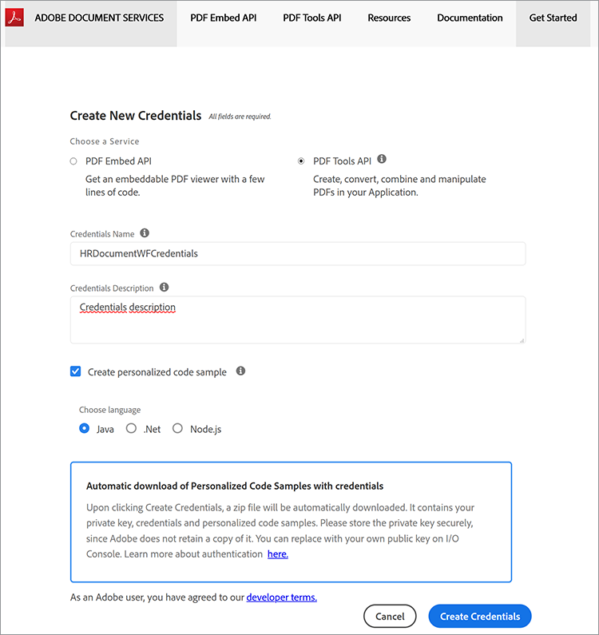
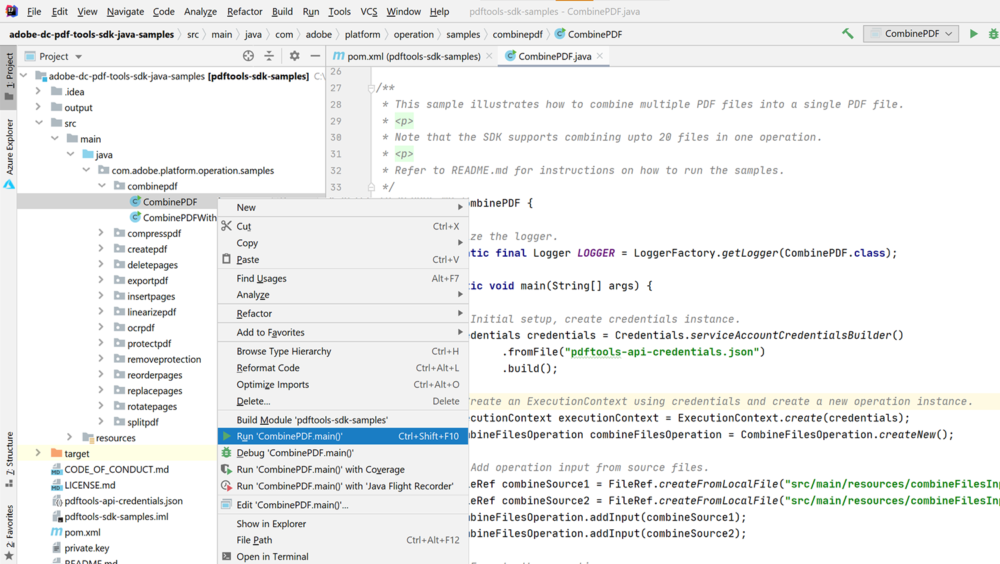
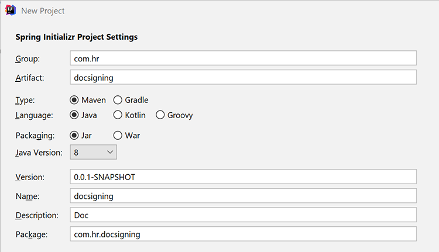
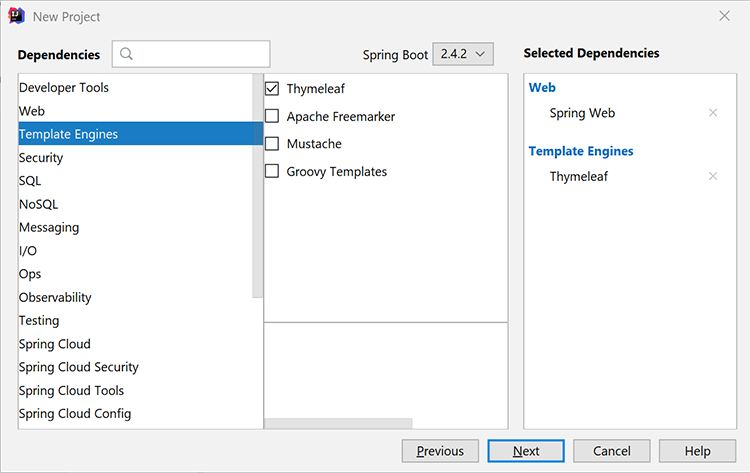
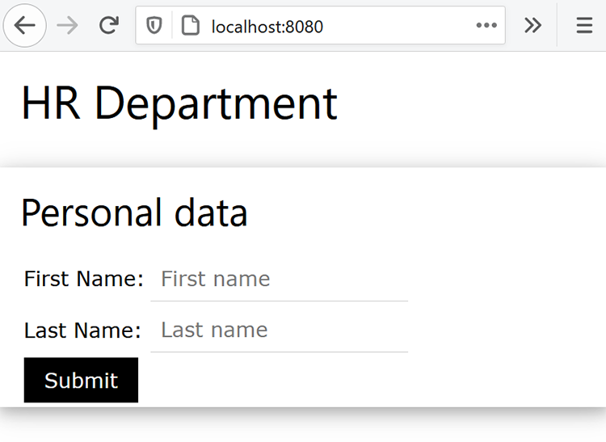
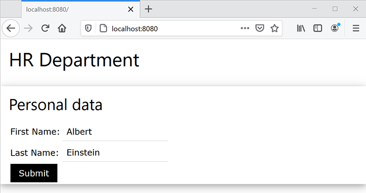
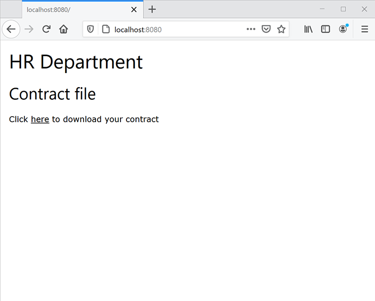
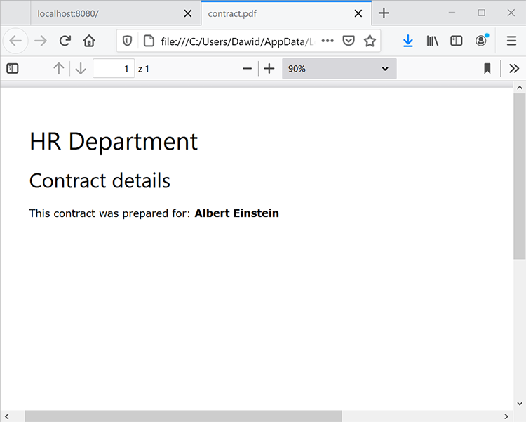
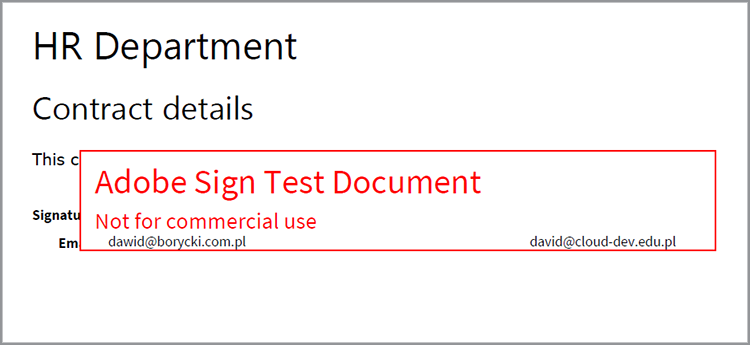

# Java 中的人力資源文件工作流程


許多企業要求新進員工相關文件，例如為在家工作員工簽訂的工作協議。 傳統上，企業以難以管理與儲存的形式實體管理這些文件。 轉換到電子文件時，PDF 檔案是理想選擇，因為它們比其他檔案類型更安全且更不易被修改。 此外，它們支援數位簽章。

## 你可以學到什麼

在這個實作教學中，學習如何實作一個基於網頁的人資表單，將職場協議存為 PDF 並簽署，並用簡單的 Java Spring MVC 應用程式完成。

## 相關 API 與資源

* [PDF 服務 API](https://opensource.adobe.com/pdftools-sdk-docs/release/latest/index.html)

* [Adobe Sign API](https://developer.adobe.com/adobesign-api/)

* [專案程式碼](https://github.com/dawidborycki/adobe-sign)

## 產生 API 憑證

請先註冊 Adobe PDF 服務 API 免費試用版。 前往 [Adobe](https://www.adobe.io/apis/documentcloud/dcsdk/gettingstarted.html?ref=getStartedWithServicesSDK) [網站](https://www.adobe.io/apis/documentcloud/dcsdk/gettingstarted.html?ref=getStartedWithServicesSDK)，點擊&#x200B;*「建立新憑證*」下的&#x200B;*「開始*」按鈕。免費試用版提供 1,000 筆文件交易，可於六個月內使用。 在下一頁（見下文），選擇服務（PDF Services API），設定憑證名稱（例如 HRDocumentWFCredentials），並輸入描述。

選擇語言（此例為 Java），並勾選 *「*&#x200B;建立個人化程式碼範例」。 最後一步確保程式碼範例中已包含你使用的預先填充的 pdftools-api-credentials.json 檔案，以及用於在 API 內驗證應用程式的私鑰。

最後，點擊 *建立憑證* 按鈕。 這樣會產生憑證，樣本會自動開始下載。



為了確保憑證有效，請打開已下載的樣本。 這裡你使用的是 IntelliJ IDEA。 當你打開原始碼時，整合開發環境（IDE）會要求建置引擎。 這個範例用的是 Maven，但你也可以依照喜好使用 Gradle。

接著，執行 `mvn clean install` Maven 目標來建立 jar 檔案。

最後，執行 CombinePDF 範例，如下所示。 程式碼會在輸出資料夾中產生 PDF。



## 建立 Spring MVC 應用程式

根據憑證，你再建立應用程式。 這個範例使用 Spring Initializr。

首先，設定專案設定為使用 Java 8 語言和 Jar 封裝（見下方截圖）。



第二，加入 Spring Web（來自 Web 的）和 Thymleaf（來自 Template Engines）：



建立專案後，前往 pom.xml 檔案，並補充依賴部分的 pdftools-sdk 和 log4j-slf4j-impl：

```
<dependencies>
    <dependency>
        <groupId>org.springframework.boot</groupId>
        <artifactId>spring-boot-starter-thymeleaf</artifactId>
    </dependency>
    <dependency>
        <groupId>org.springframework.boot</groupId>
        <artifactId>spring-boot-starter-web</artifactId>
    </dependency>

    <dependency>
        <groupId>org.springframework.boot</groupId>
        <artifactId>spring-boot-starter-test</artifactId>
        <scope>test</scope>
    </dependency>

</dependencies>
```

接著，用你下載的兩個範例程式碼檔案來補充專案根目錄：

* pdftools-api-credentials.json

* private.key

## 繪製網頁表單

要渲染網頁表單，請修改應用程式，並使用負責渲染個人資料表單並處理表單發布的控制器。 首先，請用 PersonForm 模型類別修改應用程式：

```
package com.hr.docsigning;
import javax.validation.constraints.NotNull;
import javax.validation.constraints.Size;

public class PersonForm {
    @NotNull
    @Size(min=2, max=30)
    private String firstName;

    @NotNull
    @Size(min=2, max=30)
    private String lastName;

    public String getFirstName() {
            return this.firstName;
    }


    public void setFirstName(String firstName) {
            this.firstName = firstName;
    }

    public String getLastName() {
           return this.lastName;
    }

    public void setLastName(String lastName) {
            this.lastName = lastName;
    }

    public String GetFullName() {
           return this.firstName + " " + this.lastName;
    }
}
```

此類別包含兩個性質： `firstName` 和 `lastName`。 另外，利用這個簡單的驗證功能檢查字元大小介於兩到三十字元之間。

根據模型類別，你可以建立控制器（詳見配套程式碼中的 PersonController.java）：

```
package com.hr.docsigning;
import org.springframework.stereotype.Controller;
import org.springframework.validation.BindingResult;
import org.springframework.web.bind.annotation.GetMapping;
import org.springframework.web.bind.annotation.PostMapping;
import javax.validation.Valid;


@Controller
public class PersonController {
    @GetMapping("/")
    public String showForm(PersonForm personForm) {
        return "form";
    }
}
```

控制器只有一種方法：showForm。 它負責使用位於 resources/templates/form.html 的 HTML 模板來渲染表單：

```
<html>
<head>
    <link rel="stylesheet" href="https://www.w3schools.com/w3css/4/w3.css">
</head>
 
<body>
<div class="w3-container">
    <h1>HR Department</h1>
</div>
 
<form class="w3-panel w3-card-4" action="#" th:action="@{/}"
        th:object="${personForm}" method="post">
    <h2>Personal data</h2>
    <table>
        <tr>
            <td>First Name:</td>
            <td><input type="text" class="w3-input"
                placeholder="First name" th:field="*{firstName}" /></td>
            <td class="w3-text-red" th:if="${#fields.hasErrors('firstName')}"
                th:errors="*{firstName}"></td>
        </tr>
        <tr>
            <td>Last Name:</td>
            <td><input type="text" class="w3-input"
                placeholder="Last name" th:field="*{lastName}" /></td>
            <td class="w3-text-red" th:if="${#fields.hasErrors('lastName')}"
                th:errors="*{lastName}"></td>
        </tr>
        <tr>
            <td><button class="w3-button w3-black" type="submit">Submit</button></td>
        </tr>
    </table>
</form>
</body>
</html>
```

為了渲染動態內容，會使用 Thymeleaf 模板渲染引擎。 所以，執行應用程式後，你應該會看到以下情況：



## 產生動態內容的 PDF

接著，在渲染個人資料表單後，動態填入選定欄位，產生包含虛擬合約的 PDF 文件。 具體來說，你必須將個人資料填入預先建立的合約中。

這裡為了簡化，你只有一個標頭、一個子標頭，以及一個字串常數讀法：「此合約為 \ 準備&lt;full name=&quot;&quot; of=&quot;&quot; the=&quot;&quot; person\=&quot;&quot;>了」。&lt;/full>

要達成這個目標，可以從 Adobe 的「 [從動態 HTML](https://opensource.adobe.com/pdftools-sdk-docs/release/latest/howtos.html#create-a-pdf-from-dynamic-html) 建立 PDF」範例開始。 透過分析這些範例程式碼，你會發現動態 HTML 欄位人口的運作方式如下。

首先，你必須準備包含靜態和動態內容的 HTML 頁面。 動態部分是透過 JavaScript 更新的。 也就是說，PDF Services API 會將 JSON 物件注入你的 HTML。

接著你會透過 HTML 文件載入時呼叫的 JavaScript 函式取得 JSON 屬性。 此 JavaScript 函式會更新所選的 DOM 元素。 以下是填充跨度元素的範例，該元素包含個人資料（參見伴隨程式碼的 src\\main\resources\\contract\\index.html）：

```
<html>
<head>
    <link rel="stylesheet" href="https://www.w3schools.com/w3css/4/w3.css">
</head>
 
<body onload="updateFullName()">
    <script src="./json.js"></script>
    <script type="text/javascript">
        function updateFullName()
        {
            var document = window.document;
            document.getElementById("personFullName").innerHTML = String(
                window.json.personFullName);
        }
    </script>
 
    <div class="w3-container ">
        <h1>HR Department</h1>
 
        <h2>Contract details</h2>
 
        <p>This contract was prepared for:
            <strong><span id="personFullName"></span></strong>
        </p>
    </div>
</body>
</html>
```

接著，你必須將所有相依的 JavaScript 和 CSS 檔案壓縮成 HTML。 PDF 服務 API 不接受 HTML 檔案。 相反地，它需要一個壓縮檔作為輸入。 在這種情況下，你會把壓縮檔存放在 src\main\\resources\\contract\\index.zip。

之後，你可以用另一種處理 POST 請求的方法來補充 `PersonController` ：

```
@PostMapping("/")
public String checkPersonInfo(@Valid PersonForm personForm,
    BindingResult bindingResult) {
    if (bindingResult.hasErrors()) {
        return "form";
    }
 
    CreateContract(personForm);
 
    return "contract-actions";
}
```

上述方法利用提供的個人資料建立 PDF 合約，並呈現合約-行動視圖。 後者提供產生的 PDF 連結及簽署 PDF 的連結。

現在，讓我們來看看這個 `CreateContract` 方法的運作方式（完整列表如下）。 此方法依賴兩個欄位：

* `LOGGER`，來自 log4j，除錯任何異常的資訊

* `contractFilePath`，包含產生的 PDF 檔案路徑

這個 `CreateContract` 方法會設定憑證，並從 HTML 建立 PDF。 要將個人資料傳入合約，請使用 `setCustomOptionsAndPersonData` 助手。 此方法從表單中取得該人的資料，然後透過上述 JSON 物件傳送至產生的 PDF。

同時也 `setCustomOptionsAndPersonData` 展示了如何透過關閉頁首和頁尾來控制 PDF 外觀。 完成這些步驟後，你會將 PDF 檔案儲存為輸出/contract.pdf，並最終刪除先前產生的檔案。

```
private static final Logger LOGGER = LoggerFactory.getLogger(PersonController.class);
private String contractFilePath = "output/contract.pdf"; 
private void CreateContract(PersonForm personForm) {
    try {
        // Initial setup, create credentials instance.
        Credentials credentials = Credentials.serviceAccountCredentialsBuilder()
                .fromFile("pdftools-api-credentials.json")
                .build();

        //Create an ExecutionContext using credentials 
       //and create a new operation instance.
        ExecutionContext executionContext = ExecutionContext.create(credentials);
        CreatePDFOperation htmlToPDFOperation = CreatePDFOperation.createNew();

        // Set operation input from a source file.
        FileRef source = FileRef.createFromLocalFile(
           "src/main/resources/contract/index.zip");
       htmlToPDFOperation.setInput(source);

        // Provide any custom configuration options for the operation
        // You pass person data here to dynamically fill out the HTML
        setCustomOptionsAndPersonData(htmlToPDFOperation, personForm);

        // Execute the operation.
        FileRef result = htmlToPDFOperation.execute(executionContext);

        // Save the result to the specified location. Delete previous file if exists
        File file = new File(contractFilePath);
        Files.deleteIfExists(file.toPath());

        result.saveAs(file.getPath());

    } catch (ServiceApiException | IOException | 
             SdkException | ServiceUsageException ex) {
        LOGGER.error("Exception encountered while executing operation", ex);
    }
}
 
private static void setCustomOptionsAndPersonData(
    CreatePDFOperation htmlToPDFOperation, PersonForm personForm) {
    //Set the dataToMerge field that needs to be populated 
    //in the HTML before its conversion
    JSONObject dataToMerge = new JSONObject();
    dataToMerge.put("personFullName", personForm.GetFullName());
 
    // Set the desired HTML-to-PDF conversion options.
    CreatePDFOptions htmlToPdfOptions = CreatePDFOptions.htmlOptionsBuilder()
        .includeHeaderFooter(false)
        .withDataToMerge(dataToMerge)
        .build();
    htmlToPDFOperation.setOptions(htmlToPdfOptions);
}
```

在產生合約時，你也可以將動態且個人專屬的資料與固定合約條款合併。 要做到這點，請依照「 [從靜態 HTML](https://opensource.adobe.com/pdftools-sdk-docs/release/latest/howtos.html#create-a-pdf-from-dynamic-html) 建立 PDF 的範例」來操作。 或者，你也可以 [合併兩個 PDF](https://opensource.adobe.com/pdftools-sdk-docs/release/latest/howtos.html#create-a-pdf-from-static-html)。

## 提供PDF檔案下載。

您現在可以將產生的 PDF 連結提供給使用者下載。 要做到這點，首先建立 contract-actions.html 檔案（參見配套程式碼的資源/範本contract-actions.html）：

```
<html>
<head>
    <link rel="stylesheet" href="https://www.w3schools.com/w3css/4/w3.css">
</head>
 
<div class="w3-container ">
    <h1>HR Department</h1>
 
    <h2>Contract file</h2>
 
    <p>Click <a href="/pdf">here</a> to download your contract</p>
</div>
</body>
</html>
```

接著，你在類別中`PersonController`實作`downloadContract`該方法如下：

```
@RequestMapping("/pdf")
public void downloadContract(HttpServletResponse response)
{
    Path file = Paths.get(contractFilePath);
 
    response.setContentType("application/pdf");
    response.addHeader(
        "Content-Disposition", "attachment; filename=contract.pdf");

    try
    {
        Files.copy(file, response.getOutputStream());
        response.getOutputStream().flush();
    }
    catch (IOException ex) 
    {
        ex.printStackTrace();
    }
}
```

執行應用程式後，你會看到以下流程。 第一個畫面顯示個人資料表單。 測試時，請填入介於 2 到 30 字元之間的任何值：



點擊 *提交* 按鈕後，表單會驗證，PDF 會根據 HTML 產生（resources/contract/index.html）。 應用程式會顯示另一個檢視（合約細節），您可以下載PDF：



PDF 在網頁瀏覽器中渲染後，呈現如下樣貌。 也就是說，您輸入的個人資料會被傳播到PDF中：



## 啟用簽名與安全性

當協議準備好後，Adobe Sign 可以新增代表核准的數位簽名。 Adobe Sign 的認證運作方式和 OAuth 有點不同。 現在讓我們看看如何將應用程式與 Adobe Sign 整合。 為此，您必須準備申請所需的存取權杖。 接著，你用 Adobe Sign Java SDK 撰寫客戶端程式碼。

要取得授權憑證，您必須完成幾個步驟：

首先，註冊一個 [開發者帳號](https://acrobat.adobe.com/tw/zh-Hant/acrobat/contact.html)。

在 Adobe Sign 入口網站[&#128279;](https://opensource.adobe.com/acrobat-sign/developer_guide/index.html#!adobedocs/adobe-sign/master/gstarted/create_app.md)建立 CLIENT 應用程式。

請依照這裡[&#128279;](https://opensource.adobe.com/acrobat-sign/developer_guide/index.html#!adobedocs/adobe-sign/master/gstarted/configure_oauth.md)和[這裡](https://secure.eu1.adobesign.com/public/static/oauthDoc.jsp)描述的配置 OAuth 來設定應用程式。請註明您的客戶識別碼與客戶機密。 接著，你可以使用 `https://www.google.com` 重定向 URI 及以下範圍：

* user_login：自我

* agreement_read：帳號

* agreement_write：帳號

* agreement_send：帳號

請用你的客戶端 ID 代替 \，準備以下網址&lt;CLIENT_ID\>：&lt;/CLIENT_ID\>

```
https://secure.eu1.adobesign.com/public/oauth?redirect_uri=https://www.google.com
&response_type=code
&client_id=<CLIENT_ID>
&scope=user_login:self+agreement_read:account+agreement_write:account+agreement_send:account
```

在你的瀏覽器中輸入上述網址。 你會被導向到 google.com，代碼會顯示在地址列中，代碼=\&lt;YOUR_CODE\>，為&lt;/YOUR_CODE\>
如：

```
https://www.google.com/?code=<YOUR_CODE>&api_access_point=https://api.eu1.adobesign.com/&web_access_point=https://secure.eu1.adobesign.com%2F
```

請注意 \ 和 api_access_point 的給出&lt;YOUR_CODE\> 值。&lt;/YOUR_CODE\>

要發送提供存取權杖的 HTTP POST 請求，請使用 client ID、\ &lt;YOUR_CODE\>和 api_access_point 值。 &lt;/YOUR_CODE\>你可以使用 [Postman](https://helpx.adobe.com/sign/kb/how-to-create-access-token-using-postman-adobe-sign.html) 或 cURL：

```
curl --location --request POST "https://**api.eu1.adobesign.com**/oauth/token"
\\

\--data-urlencode "client_secret=**\<CLIENT_SECRET\>**" \\

\--data-urlencode "client_id=**\<CLIENT_ID\>**" \\

\--data-urlencode "code=**\<YOUR_CODE\>**" \\

\--data-urlencode "redirect_uri=**https://www.google.com**" \\

\--data-urlencode "grant_type=authorization_code"
```

樣本響應如下：

```
{
    "access_token":"3AAABLblqZhByhLuqlb-…",
    "refresh_token":"3AAABLblqZhC_nJCT7n…",
    "token_type":"Bearer",
    "expires_in":3600
}
```

請注意你的access_token。 你需要它來授權你的客戶端程式碼。

## 使用 Adobe Sign Java SDK

一旦你拿到存取權杖，就可以向 Adobe Sign 發送 REST API 呼叫。 為了簡化這個流程，可以使用 Adobe Sign Java SDK。 原始碼可在 Adobe GitHub 倉庫[&#128279;](https://github.com/adobe-sign/AdobeSignJavaSdk)取得。

要將此套件整合到你的應用程式中，你必須複製該程式碼。 接著，建立 Maven 套件（mvn 套件），並將以下檔案安裝到專案中（你可以在 adobe-sign-sdk 資料夾的伴隨程式碼中找到）：

* 目標/swagger-java-client-1.0.0.jar

* 目標/自由/gson-2.8.1.jar

* 目標/自由/gson-fire-1.8.0.jar

* 目標/自由/hamcrest-core-1.3.jar

* 目標/圖書館/junit-4.12.jar

* 目標/自由/logging-interceptor-2.7.5.jar

* 目標/圖書館/okhttp-2.7.5.jar

* 目標/圖書館/okio-1.6.0.jar

* 目標/圖書館/swagger-annotations-1.5.15.jar

在 IntelliJ IDEA 中，你可以用 *專案結構* （File/Project Structure）將這些檔案加入相依關係。

## 寄送PDF以求簽名

你現在準備將協議送交簽署。 首先，請在contract-details.html中補充另一個指向傳送請求的超連結：

```
<html>
<head>
    <link rel="stylesheet" href="https://www.w3schools.com/w3css/4/w3.css">
</head>
 
<div class="w3-container ">
    <h1>HR Department</h1>
 
    <h2>Contract file</h2>
 
    <p>Click <a href="/pdf"> here</a> to download your contract</p>
 
    
</div>
</body>
</html>
```

接著，你加入另一個控制器， `AdobeSignController`在裡面實作 `sendContractMethod` （參見伴隨程式碼）。 該方法的運作方式如下：

首先，它用來 `ApiClient` 取得 API 端點。

```
ApiClient apiClient = new ApiClient();

//Default baseUrl to make GET /baseUris API call.
String baseUrl = "https://api.echosign.com/";
String endpointUrl = "/api/rest/v6";
apiClient.setBasePath(baseUrl + endpointUrl);

// Provide an OAuth Access Token as "Bearer access token" in authorization
String authorization = "Bearer ";

// Get the baseUris for the user and set it in apiClient.
BaseUrisApi baseUrisApi = new BaseUrisApi(apiClient);
BaseUriInfo baseUriInfo = baseUrisApi.getBaseUris(authorization);
apiClient.setBasePath(baseUriInfo.getApiAccessPoint() + endpointUrl);
```

接著，該方法利用 contract.pdf 檔案建立暫時性文件：

```
// Get PDF file
String filePath = "output/";
String fileName = "contract.pdf";
File file = new File(filePath + fileName);
String mimeType = "application/pdf";
 
//Get the id of the transient document.
TransientDocumentsApi transientDocumentsApi =
    new TransientDocumentsApi(apiClient);
TransientDocumentResponse response = transientDocumentsApi.createTransientDocument(authorization,
    file, null, null, fileName, mimeType);
String transientDocumentId = response.getTransientDocumentId();
```

接著，你必須制定一份協議。 要做到這點，請使用 contract.pdf 檔案，並將協議狀態設為 IN_PROCESS 立即傳送檔案。 此外，您也可以選擇電子簽名：

```
// Create AgreementCreationInfo
AgreementCreationInfo agreementCreationInfo = new AgreementCreationInfo();
 
// Add file
FileInfo fileInfo = new FileInfo();
fileInfo.setTransientDocumentId(transientDocumentId);
agreementCreationInfo.addFileInfosItem(fileInfo);
 
// Set state to IN_PROCESS, so the agreement is be sent immediately
agreementCreationInfo.setState(AgreementCreationInfo.StateEnum.IN_PROCESS);
agreementCreationInfo.setName("Contract");
agreementCreationInfo.setSignatureType(AgreementCreationInfo.SignatureTypeEnum.ESIGN);
```

接著，你要按以下方式新增協議接收者。 這裡你新增了兩位收件人（見員工與經理章節）：

```
// Provide emails of recipients to whom agreement is be sent
// Employee
ParticipantSetInfo participantSetInfo = new ParticipantSetInfo();
ParticipantSetMemberInfo participantSetMemberInfo = new ParticipantSetMemberInfo();
participantSetMemberInfo.setEmail("");
participantSetInfo.addMemberInfosItem(participantSetMemberInfo);
participantSetInfo.setOrder(1);
participantSetInfo.setRole(ParticipantSetInfo.RoleEnum.SIGNER);
agreementCreationInfo.addParticipantSetsInfoItem(participantSetInfo);
 
// Manager
participantSetInfo = new ParticipantSetInfo();
participantSetMemberInfo = new ParticipantSetMemberInfo();
participantSetMemberInfo.setEmail("");
participantSetInfo.addMemberInfosItem(participantSetMemberInfo);
participantSetInfo.setOrder(2);
participantSetInfo.setRole(ParticipantSetInfo.RoleEnum.SIGNER);
agreementCreationInfo.addParticipantSetsInfoItem(participantSetInfo);
```

最後，請使用 `createAgreement` Adobe Sign Java SDK 的方法發送協議：

```
// Create agreement using the transient document.
AgreementsApi agreementsApi = new AgreementsApi(apiClient);
AgreementCreationResponse agreementCreationResponse = agreementsApi.createAgreement(
    authorization, agreementCreationInfo, null, null);
 
System.out.println("Agreement sent, ID: " + agreementCreationResponse.getId());
```

執行此代碼後，您會收到一封電子郵件（地址為代碼中指定的地址，與簽署請求相同 `<email_address>)` ）。 郵件中包含超連結，引導收件人前往 Adobe Sign 入口網站進行簽名。 你可以在 Adobe Sign 開發者入口網站看到該文件（見下方圖），也可以使用 [getAgreementInfo](https://github.com/adobe-sign/AdobeSignJavaSdk/blob/master/docs/AgreementsApi.md#getAgreementInfo) 方法以程式化方式追蹤簽名流程。

最後，您也可以如以下 [範例](https://github.com/adobe/pdfservices-java-sdk-samples/tree/master/src/main/java/com/adobe/pdfservices/operation/samples/protectpdf)所示，使用 PDF 服務 API 對 PDF 設密碼保護。



## 後續步驟

如你所見，透過利用快速入門功能，你可以實作一個簡單的網頁表單，用 Adobe PDF Services API 建立經批准的 Java PDF。 Adobe PDF API 能無縫整合到您現有的客戶應用程式中。

舉個例子，你可以建立收件人可以遠端且安全地簽署的表格。 當你需要多個簽名時，甚至可以自動將表單路由給工作流程中的一連串人員。 你的員工入職流程會更好，人資部門也會很喜歡你。

立即 [[!DNL Adobe Acrobat Services]](https://developer.adobe.com/document-services/homepage/) 查看，為您的應用程式新增多種 PDF 功能。
