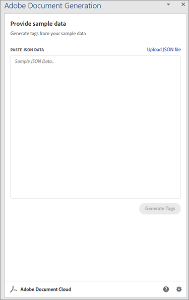
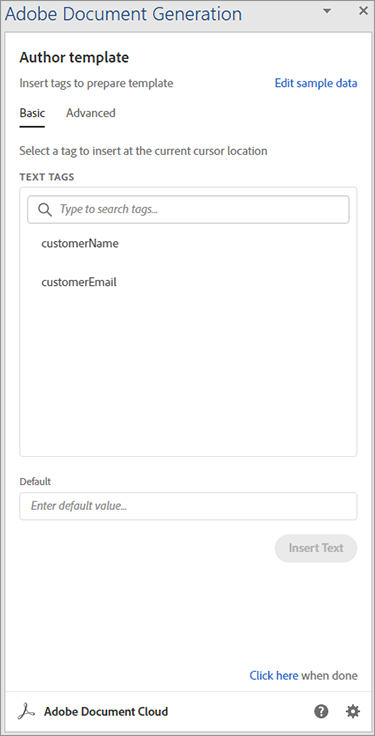
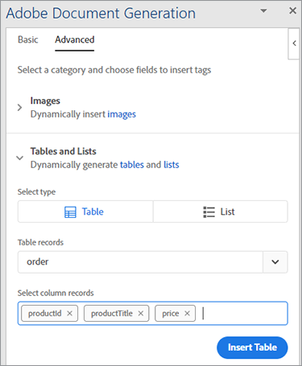
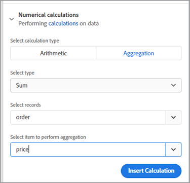
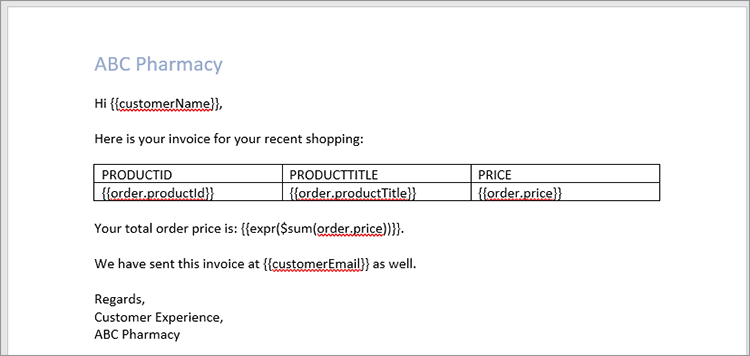
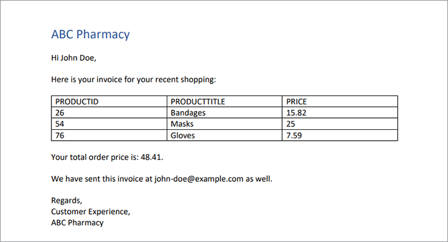

# 處理發票


當生意興隆時這很好，但當準備大量發票時，生產力就會下降。 手動產生發票耗時，且有犯錯風險，可能損失金錢或因錯誤金額而惹怒客戶。

舉例來說，丹妮爾在一家醫療用品公司的](https://developer.adobe.com/document-services/use-cases/financial/invoices)會計部門[](https://developer.adobe.com/document-services/use-cases/financial/invoices)工作[。月底了，她正在從多個系統調取資料，反覆確認準確性，並格式化發票。 經過這麼多努力，她終於準備好將文件轉換成 PDF（讓任何人不用購買特定軟體即可查看），並將個人化發票寄給每位客戶。

即使每月開具都完成了，Danielle 也無法擺脫那些發票。 有些客戶的帳單週期不是每月，所以她總是在幫某人開發票。 偶爾，客戶會編輯發票並少付錢。 Danielle 隨後花時間排除發票不符的問題。 照這樣下去，她得請助理來應付所有工作！

Danielle 需要的是快速且準確地產生發票的方法，無論是月底批次產生，或是臨時製作。 理想狀況是，如果她能保護這些發票不被修改，就不用擔心金額不匹配的問題。

## 你可以學到什麼

在這個實作教學中，學習如何使用 Adobe 文件生成 API 自動產生發票、為 PDF 設密碼保護，並將發票送達給每位客戶。 只要有一點Node.js、JavaScript、Express.js、HTML 和 CSS 的知識就行了。

此專案的完整程式碼可在 [GitHub](https://github.com/afzaal-ahmad-zeeshan/adobe-pdf-invoice-generation) 上取得。 你必須在公開目錄中建立範本和原始資料資料夾。 在生產環境中，你必須從外部 API 取得資料。 你也可以探索這個包含範本資源的應用程式存檔版本。

## 相關 API 與資源

* [PDF 服務 API](https://opensource.adobe.com/pdftools-sdk-docs/release/latest/index.html)

* [Adobe 文件產生 API](https://developer.adobe.com/document-services/apis/doc-generation)

* [Adobe Sign API](https://developer.adobe.com/adobesign-api/)

* [專案程式碼](https://github.com/afzaal-ahmad-zeeshan/adobe-pdf-invoice-generation)

## 資料準備

這個教學並沒有說明資料如何從你的資料倉儲匯入。 您的客戶訂單可能存在於資料庫、外部 API 或自訂軟體中。 Adobe 文件生成 API 期望一份包含發票資料的 JSON 文件——例如來自客戶關係管理（CRM）或電子商務平台的資訊。 這個教學假設資料已經是 JSON 格式。

為簡化起見，請使用以下 JSON 結構開立發票：

```
{ 
    "customerName": "John Doe", 
    "customerEmail": "john-doe@example.com", 
    "order": [ 
        { 
            "productId": 26, 
            "productTitle": "Bandages", 
            "price": 15.82 
        }, 
        { 
            "productId": 54, 
            "productTitle": "Masks", 
            "price": 25 
        }, 
        { 
            "productId": 76, 
            "productTitle": "Gloves", 
            "price": 7.59 
        } 
    ] 
} 
```

JSON 文件包含客戶資料以及訂單資訊。 使用這份結構化文件來建立您的發票，並以 PDF 格式展示各項內容。

## 建立發票範本

Adobe 文件產生 API 期望基於 Microsoft Word 的範本與 JSON 文件來建立動態 PDF 或 Word 文件。 為你的發票應用程式建立 Microsoft Word 範本，並使用 [免費的文件產生標籤外掛](https://opensource.adobe.com/pdftools-sdk-docs/docgen/latest/wordaddin.html#add-in-demo) 來產生範本標籤。 安裝外掛後，在 Microsoft Word 開啟分頁。



當你將 JSON 內容貼上到外掛後（如上所示），點擊產生標籤。 這個外掛會顯示你物件的格式。 你的基本範本可以使用顧客的名字和電子郵件，但不會顯示訂單資訊。 順序資訊會在本教學稍後討論。



在你的 Microsoft Word 文件中，開始撰寫發票範本。 將游標留在必須插入動態資料的地方，然後從 Adobe 外掛視窗中選擇標籤。 點擊 **「插入文字** 」，讓 Adobe 文件生成標註外掛能產生並插入標籤。 為了個人化，我們輸入客戶的名字和電子郵件。

接著，談談每張新發票會改變的數據。 選擇 **外掛的進階** 標籤。 若要查看根據客戶訂購的產品產生動態表格的選項，請點擊 **「表格與清單** 」。

從第一個下拉選單選擇 **「訂單** 」。 在第二個下拉選單中，選擇此表格的欄位。 在這個教學中，選取物件渲染表格的三欄。



文件產生 API 也能執行複雜操作，例如在陣列內彙整元素。 在 **進階** 分頁，選擇 **數值計算，**&#x200B;然後在 **彙總** 分頁選擇你想應用計算的欄位。



點擊 **「插入計算** 」按鈕，在文件中需要的位置插入此標籤。 以下文字現在會出現在您的 Microsoft Word 檔案中：



此發票範例包含顧客資訊、訂購商品及應付總金額。

## 使用 Adobe 文件產生 API 產生發票

使用 Adobe PDF 服務Node.js軟體開發套件（SDK）來整合Microsoft Word 與 JSON 文件。 建立一個Node.js應用程式，利用文件生成 API 建立發票。

PDF 服務 API 包含文件生成服務，因此你可以使用相同的憑證來處理兩者。 享受 [六個月免費試用](https://developer.adobe.com/document-services/pricing/main)，然後每筆文件交易只需支付 0.05 美元。

以下是合併 PDF 的程式碼：

```
async function compileDocFile(json, inputFile, outputPdf) { 
    try { 
        // configurations 
        const credentials =  adobe.Credentials 
            .serviceAccountCredentialsBuilder() 
            .fromFile("./src/pdftools-api-credentials.json") 
            .build(); 

        // Capture the credential from app and show create the context 
        const executionContext = adobe.ExecutionContext.create(credentials); 
  
        // create the operation 
        const documentMerge = adobe.DocumentMerge, 
            documentMergeOptions = documentMerge.options, 
            options = new documentMergeOptions.DocumentMergeOptions(json, documentMergeOptions.OutputFormat.PDF);

        const operation = documentMerge.Operation.createNew(options); 
  
        // Pass the content as input (stream) 
        const input = adobe.FileRef.createFromLocalFile(inputFile); 
        operation.setInput(input); 
  
        // Async create the PDF 
        let result = await operation.execute(executionContext); 
        await result.saveAsFile(outputPdf); 
    } catch (err) { 
        console.log('Exception encountered while executing operation', err); 
    } 
} 
```

此程式碼取自輸入的 JSON 文件與輸入範本檔案的資訊。 接著，它會建立文件合併操作，將檔案合併成單一的 PDF 報告。 最後，它會用你的 API 憑證執行操作。 如果你還沒有，請 [建立憑證](https://opensource.adobe.com/pdftools-sdk-docs/release/latest/index.html#getting-credentials) （文件產生和 PDF 服務 API 使用相同的憑證）。

在 Express 路由器內使用這段程式碼來處理文件請求：

```
// Create one report and send it back
try {
    console.log(\`[INFO] generating the report...\`);
    const fileContent = fs.readFileSync(\`./public/documents/raw/\${vendor}\`,
    'utf-8');
    const parsedObject = JSON.parse(fileContent);

    await pdf.compileDocFile(parsedObject,
    \`./public/documents/template/Adobe-Invoice-Sample.docx\`,
    \`./public/documents/processed/output.pdf\`);

    await pdf.applyPassword("p@55w0rd", './public/documents/processed/output.pdf',
    './public/documents/processed/output-secured.pdf');

    console.log(\`[INFO] sending the report...\`);
    res.status(200).render("preview", { page: 'invoice', filename: 'output.pdf' });
} catch(error) {
    console.log(\`[ERROR] \${JSON.stringify(error)}\`);
    res.status(500).render("crash", { error: error });
}
```

當此程式碼執行後，會提供一份包含根據所提供資料動態產生的發票的 PDF 文件。 以上述範例 JSON 資料為例，該程式碼的輸出為：



這張發票包含你來自 JSON 文件的動態資料。

## 密碼保護發票

由於會計師 Danielle 擔心客戶會更改發票，建議設定密碼限制編輯。 [PDF 服務 API](https://opensource.adobe.com/pdftools-sdk-docs/release/latest/index.html) 可以自動為文件套用密碼。 在這裡，你可以使用 Adobe PDF Services SDK 來用密碼保護文件。 代碼如下：

```
async function applyPassword(password, inputFile, outputFile) {
    try {
        // Initial setup, create credentials instance.
        const credentials = adobe.Credentials
        .serviceAccountCredentialsBuilder()
        .fromFile("./src/pdftools-api-credentials.json")
        .build();

        // Create an ExecutionContext using credentials
        const executionContext = adobe.ExecutionContext.create(credentials);
        // Create new permissions instance and add the required permissions
        const protectPDF = adobe.ProtectPDF,
        protectPDFOptions = protectPDF.options;
        // Build ProtectPDF options by setting an Owner/Permissions Password, Permissions,
        // Encryption Algorithm (used for encrypting the PDF file) and specifying the type of content to encrypt.
        const options = new protectPDFOptions.PasswordProtectOptions.Builder()
        .setOwnerPassword(password)
        .setEncryptionAlgorithm(protectPDFOptions.EncryptionAlgorithm.AES_256)
        .build();

        // Create a new operation instance.
        const protectPDFOperation = protectPDF.Operation.createNew(options);

        // Set operation input from a source file.
        const input = adobe.FileRef.createFromLocalFile(inputFile);
        protectPDFOperation.setInput(input);

        // Execute the operation and Save the result to the specified location.
        let result = await protectPDFOperation.execute(executionContext);

        result.saveAsFile(outputFile);
    } catch (err) {
        console.log('Exception encountered while executing operation', err);
    }
}
```

使用此代碼時，系統會以密碼保護你的文件，並上傳新發票到系統。 想了解更多關於此程式碼的使用方式，或想嘗試使用，請參閱範例[](https://github.com/afzaal-ahmad-zeeshan/adobe-pdf-invoice-generation)程式碼。

發票完成後，你可能會想自動寄送給客戶。 有幾種方法可以自動寄信給客戶。 最快的方法是使用第三方電子郵件 API 搭配像 [sendgrid-nodejs](https://github.com/sendgrid/sendgrid-nodejs) 這樣的輔助函式庫。 或者，如果你已經有 SMTP 伺服器的存取權，也可以使用 [nodemailer](https://www.npmjs.com/package/nodemailer) 透過 SMTP 發送電子郵件。

## 後續步驟

在這個實作教學中，你製作了一個簡單的應用程式，幫助 Danielle 在會計上處理 [發票](https://developer.adobe.com/document-services/use-cases/financial/invoices)。 利用 PDF Services API 和文件生成 SDK，你將客戶訂單資訊從 JSON 文件填入 Microsoft Word 範本，建立 PDF 發票。 接著，利用 PDF Services API](https://opensource.adobe.com/pdftools-sdk-docs/release/latest/index.html) 的密碼保護服務[為每份文件設置密碼保護。

由於 Danielle 能自動產生發票，且不必擔心客戶會編輯發票，她不需要聘請助理來協助所有手動工作。 她可以利用多餘的時間在應付帳款檔案中尋找節省成本的方案。

既然你已經知道這有多簡單，可以利用其他 Adobe 工具擴充這個簡單的應用程式，將發票嵌入你的網站。 例如，讓客戶能隨時查看發票或餘額。 [Adobe PDF 嵌入 API](https://developer.adobe.com/document-services/apis/pdf-embed) 是免費使用的。 你甚至可以轉到人力資源或銷售部門，協助自動化合約並收集電子簽名。

想探索所有可能性並開始打造屬於你自己的實用應用程式，請立即註冊免費 [[!DNL Adobe Acrobat Services]](https://www.adobe.io/apis/documentcloud/dcsdk/gettingstarted.html) 帳號開始。 享受六個月免費試用，然後 [按需付費](https://developer.adobe.com/document-services/pricing/main)隨著業務擴展，每筆文件交易只需 0.05 美元。
