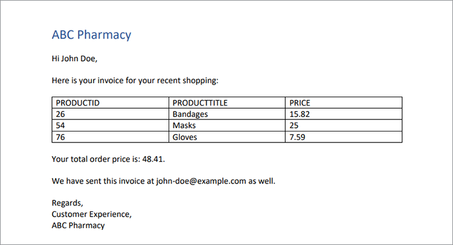

# 處理發票


當業務蓬勃發展，但是在準備所有發票時，生產效率卻下降，這很好。 手動產生髮票非常耗時，而且您還可能會面臨錯誤、可能損失金錢或以錯誤金額憤怒客戶的風險。

例如，Danielle 在一家醫療供應公司的 ](https://www.adobe.io/apis/documentcloud/dcsdk/invoices.html) 會計部門 [ ](https://www.adobe.io/apis/documentcloud/dcsdk/invoices.html) 工作 [ 。這是月底，因此她從多個不同的系統中提取資訊，再次檢查資訊的準確性，並設定發票格式。 在完成所有工作之後，她終於準備好將檔轉換為 PDF （如此一來，任何人都可以檢視檔而不購買特定軟體），並將他們的個人化發票傳送給每位客戶。

即使每月開信已完成，Danielle 也無法逸出這些發票。 有些客戶的帳單週期不是月，所以她總是為某人建立發票。 客戶有時會編輯發票並欠款。 Danielle 接著耗費時間疑難排解此發票不相匹配的問題。 在這個速率下，她需要聘雇助理來跟進所有工作！

Danielle 需要一種快速準確地產生髮票的方法，無論是在月底批次開啟，或是在其他時間臨時取得。 理想情況下，若她能保護這些發票不受編輯影響，就不必擔心疑難排解不相匹配的金額。

## 您可以學習哪些內容

在此實作教學課程中，瞭解如何使用 Adobe 產生檔API自動產生髮票、以密碼保護 PDF，以及向每位客戶傳送發票。 只需要對 Node.js、JavaScript、Express.js、HTML 和 CSS 略知一下。

GitHub ](https://github.com/afzaal-ahmad-zeeshan/adobe-pdf-invoice-generation) 提供此專案的 [ 完整程式碼。您必須使用範本和 Raw 資料檔案夾來設定公開目錄。 在生產中，您必須從外部API擷取資料。 您也可以探索這個應用程式的封存版本，其中包含範本資源。

## 相關 API 和資源

* [PDF 服務API](https://opensource.adobe.com/pdftools-sdk-docs/release/latest/index.html)

* [Adobe檔產生API](https://www.adobe.io/apis/documentcloud/dcsdk/doc-generation.html)

* [Adobe Sign API](https://www.adobe.io/apis/documentcloud/sign.html)

* [專案代碼](https://github.com/afzaal-ahmad-zeeshan/adobe-pdf-invoice-generation)

## 準備資料

本教學課程並未說明資料如何從資料倉儲匯入。 您的客戶訂單可能存在於資料庫、外部API或自訂軟體中。 Adobe產生檔API預期會有包含開票資料的 JSON 檔，例如來自您的 客戶關係管理 （CRM） 或電子商務平臺的資訊。 本教學課程假設資料已採用 JSON 格式。

如需簡化，請使用下列 JSON 結構開啟：

```
{ 
    "customerName": "John Doe", 
    "customerEmail": "john-doe@example.com", 
    "order": [ 
        { 
            "productId": 26, 
            "productTitle": "Bandages", 
            "price": 15.82 
        }, 
        { 
            "productId": 54, 
            "productTitle": "Masks", 
            "price": 25 
        }, 
        { 
            "productId": 76, 
            "productTitle": "Gloves", 
            "price": 7.59 
        } 
    ] 
} 
```

JSON 檔包含客戶詳細資料和訂單資訊。 使用此結構化檔以建立發票並顯示 PDF 格式的元素。

## 建立發票範本

Adobe檔產生API希望 Microsoft Word 架構的範本和 JSON 檔建立動態 PDF 或 Word 檔。 為開啟應用程式建立 Microsoft Word 範本，並使用 [ 免費的 Document Generation Tagger 增益集 ](https://opensource.adobe.com/pdftools-sdk-docs/docgen/latest/wordaddin.html#add-in-demo) 來產生範本標籤。 安裝增益集，然後在 Microsoft Word 中開啟索引標籤。


將 JSON 內容貼到增益集後（如上所示），請按一下「產生標籤」。 現在，此增效模組會顯示物件的格式。 您的基本範本可以使用客戶名稱和電子郵件，但不會顯示訂單資訊。 此教學課程稍後會討論訂單資訊。


在 Microsoft Word 檔中，開始寫入發票範本。 離開您必須插入動態資料的游標，然後從Adobe增益集視窗中選取標籤。 按一下 **「插入文字** 」，這樣Adobe檔產生 Tagger 增益集就可以產生和插入標籤。 若要進行個人化，讓我們插入客戶名稱和電子郵件。

現在，繼續處理每張新發票所變更的資料。 選取 **** 增益集的「進階」索引標籤。 若要查看根據客戶訂購的產品產生動態表格的可用選項，請按一下「 **表格和清單」** 。

從第一個下拉式清單中選 **取「順序** 」。 在第二個下拉式清單中，選取此表格的欄。 在此教學課程中，選取物件演算表格的所有三欄。


檔產生API還可以執行複雜的操作，例如將陣列內的元素彙集在一起。 在「進 **階** 」標籤中，選 **取「數位計算** 」，然後在「匯總 **」索引標籤中** ，選取您要套用計算的欄位。


按一下「 **插入計算」** 按鈕，在檔中需要的地方插入此標籤。 以下文字現在會出現在您的 Microsoft Word 檔案中：


此發票範例包含客戶資訊、訂購產品和到期金額總額。

## 使用 Adobe 產生檔API產生發票

使用 Adobe PDF Services Node.js 軟體發展工具組 （SDK） 來合併 Microsoft Word 和 JSON 檔。 建立 Node.js 應用程式，使用 Document Generation API 建立發票。

PDF Services API包含「檔產生服務」，因此您可以為兩者使用相同的認證。 [享受六個月免費試 ](https://www.adobe.io/apis/documentcloud/dcsdk/pdf-pricing.html) 用，然後每份檔交易只需支付 $0.05 美元。

以下是合併 PDF 的程式碼：

```
async function compileDocFile(json, inputFile, outputPdf) { 
    try { 
        // configurations 
        const credentials =  adobe.Credentials 
            .serviceAccountCredentialsBuilder() 
            .fromFile("./src/pdftools-api-credentials.json") 
            .build(); 

        // Capture the credential from app and show create the context 
        const executionContext = adobe.ExecutionContext.create(credentials); 
  
        // create the operation 
        const documentMerge = adobe.DocumentMerge, 
            documentMergeOptions = documentMerge.options, 
            options = new documentMergeOptions.DocumentMergeOptions(json, documentMergeOptions.OutputFormat.PDF);

        const operation = documentMerge.Operation.createNew(options); 
  
        // Pass the content as input (stream) 
        const input = adobe.FileRef.createFromLocalFile(inputFile); 
        operation.setInput(input); 
  
        // Async create the PDF 
        let result = await operation.execute(executionContext); 
        await result.saveAsFile(outputPdf); 
    } catch (err) { 
        console.log('Exception encountered while executing operation', err); 
    } 
} 
```

此程式碼會從輸入 JSON 檔和輸入範本檔案中取得資訊。 然後，建立檔合併作業，將檔案合併為單一 PDF 報告。 最後，它會使用您的API認證執行操作。 如果您還沒有認證， [ 請建立認證 ](https://opensource.adobe.com/pdftools-sdk-docs/release/latest/index.html#getting-credentials) （檔產生和 PDF 服務API使用相同的認證）。

在 Express 路由器中使用此代碼來處理檔要求：

```
// Create one report and send it back
try {
    console.log(\`[INFO] generating the report...\`);
    const fileContent = fs.readFileSync(\`./public/documents/raw/\${vendor}\`,
    'utf-8');
    const parsedObject = JSON.parse(fileContent);

    await pdf.compileDocFile(parsedObject,
    \`./public/documents/template/Adobe-Invoice-Sample.docx\`,
    \`./public/documents/processed/output.pdf\`);

    await pdf.applyPassword("p@55w0rd", './public/documents/processed/output.pdf',
    './public/documents/processed/output-secured.pdf');

    console.log(\`[INFO] sending the report...\`);
    res.status(200).render("preview", { page: 'invoice', filename: 'output.pdf' });
} catch(error) {
    console.log(\`[ERROR] \${JSON.stringify(error)}\`);
    res.status(500).render("crash", { error: error });
}
```

一旦執行此代碼，它將根據提供的資料提供包含動態產生發票的 PDF 檔。 透過範例 JSON 資料 （如上所述），此程式碼的輸出為：



此發票內含 JSON 檔的動態資料。

## 保護密碼的發票

Danielle 擔心客戶改變發票，請套用密碼來限制編輯。 [PDF 服務API ](https://opensource.adobe.com/pdftools-sdk-docs/release/latest/index.html) 可自動為檔套用密碼。 在這裡，您可以使用 Adobe PDF Services SDK 以密碼保護檔。 程式碼為：

```
async function applyPassword(password, inputFile, outputFile) {
    try {
        // Initial setup, create credentials instance.
        const credentials = adobe.Credentials
        .serviceAccountCredentialsBuilder()
        .fromFile("./src/pdftools-api-credentials.json")
        .build();

        // Create an ExecutionContext using credentials
        const executionContext = adobe.ExecutionContext.create(credentials);
        // Create new permissions instance and add the required permissions
        const protectPDF = adobe.ProtectPDF,
        protectPDFOptions = protectPDF.options;
        // Build ProtectPDF options by setting an Owner/Permissions Password, Permissions,
        // Encryption Algorithm (used for encrypting the PDF file) and specifying the type of content to encrypt.
        const options = new protectPDFOptions.PasswordProtectOptions.Builder()
        .setOwnerPassword(password)
        .setEncryptionAlgorithm(protectPDFOptions.EncryptionAlgorithm.AES_256)
        .build();

        // Create a new operation instance.
        const protectPDFOperation = protectPDF.Operation.createNew(options);

        // Set operation input from a source file.
        const input = adobe.FileRef.createFromLocalFile(inputFile);
        protectPDFOperation.setInput(input);

        // Execute the operation and Save the result to the specified location.
        let result = await protectPDFOperation.execute(executionContext);

        result.saveAsFile(outputFile);
    } catch (err) {
        console.log('Exception encountered while executing operation', err);
    }
}
```

當您使用此代碼時，它會以密碼保護您的檔，並將新發票上傳至系統。 如需如何使用或試用此程式碼的詳細資訊，請參閱 [ 程式碼範例 ](https://github.com/afzaal-ahmad-zeeshan/adobe-pdf-invoice-generation) 。

一旦使用發票完成後，您可能會想要自動將發票寄給用戶端。 有幾種方法可以自動透過電子郵件寄送客戶電子郵件來完成工作。 最快速的方式是使用協力廠商電子郵件API以及 sendgrid-nodejs 等 [ 輔助程式 ](https://github.com/sendgrid/sendgrid-nodejs) 資料庫。 或者，如果您已經可以存取 SMTP 伺服器，則可以使用 [ 節點郵件透過 ](https://www.npmjs.com/package/nodemailer) SMTP 傳送電子郵件。

## 後續步驟

在此實作教學課程中，您建立了一個簡單應用程式，協助 Danielle 進行開信 ](https://www.adobe.io/apis/documentcloud/dcsdk/invoices.html) 處理 [ 。使用 PDF Services API 和 Document Generation SDK，您用 JSON 檔中的客戶訂單資訊填入 Microsoft Word 範本，建立 PDF 發票。 然後，使用 PDF Services 的密碼保護服務 [ API以密碼保護每份 ](https://opensource.adobe.com/pdftools-sdk-docs/release/latest/index.html) 檔。

Danielle 可以自動產生髮票，而且不必擔心客戶會編輯發票，她就不需要雇用助理來協助手動工作。 她可利用自己的額外時間，在帳戶中節省應付檔案的費用。

現在您已經看到它有多簡單，您可以使用其他Adobe工具，在您的網站上內嵌發票，展開這個簡單應用程式。 例如，因此客戶可以隨時檢視其發票或結餘。 [Adobe PDF內嵌API ](https://www.adobe.io/apis/documentcloud/dcsdk/pdf-embed.html) 可供免費使用。 您甚至可以前往人力資源或銷售部門，協助自動化他們的合約並收集電子簽名。

若要探索所有的可能性，並開始建立您專屬的便利應用程式，請建立免費 [[!DNL Adobe Acrobat Services] ](https://www.adobe.io/apis/documentcloud/dcsdk/gettingstarted.html) 帳戶立即開始使用。享受六個月免費試用，然後 [ 按即 ](https://www.adobe.io/apis/documentcloud/dcsdk/pdf-pricing.html) 付費
業務規模化時，每份檔交易只要 $0.05。
