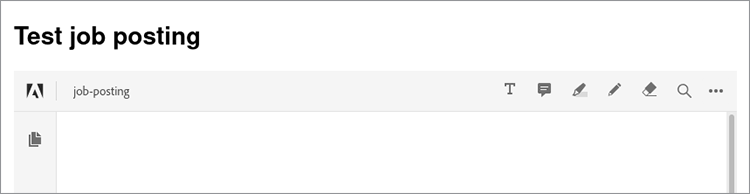

# 職缺公告


經營多用戶網站時，設計一個能讓所有人都能順暢使用體驗至關重要。

想像以下情境：你有一個網站允許雇主 [上傳職缺公告](https://developer.adobe.com/document-services/use-cases/content-publishing/job-posting)。 對求職者來說，能以一致格式輕鬆瀏覽所有與職缺相關的文件，非常方便。 不過，雇主附上他們手邊的檔案格式資訊很方便。 為了方便這兩種使用者，你可以自動將所有上傳的文件轉成 PDF，並嵌入在發佈中。

## 你可以學到什麼

這個實作教學帶你了解一個Node.js範例，利用 [!DNL Adobe Acrobat Services] 其 [Node.js SDK](https://www.npmjs.com/package/@adobe/documentservices-pdftools-node-sdk) 將這些功能加入職缺網站。 這會打造一個更容易使用且對雇主和求職者更具吸引力的網站。 這裡是[完整的](https://github.com/contentlab-io/adobe_job_posting) [專案程式碼](https://github.com/contentlab-io/adobe_job_posting)，如果你想邊閱讀邊跟著看。

首先，建立一個簡單的 Express 網頁應用程式Node.js。 [Express](https://expressjs.com/) 是一個極簡的網頁應用程式框架，提供路由與模板等功能。 應用程式的程式碼可在 GitHub[&#128279;](https://github.com/contentlab-io/adobe_job_posting) 上取得。另外，安裝 [PostgreSQL 資料庫](https://www.postgresql.org/) 並設定它來儲存 PDF。

## 相關 [!DNL Acrobat Services] API

* [PDF 嵌入 API](https://www.adobe.com/devnet-docs/dcsdk_io/viewSDK/index.html)

* [PDF 服務 API](https://opensource.adobe.com/pdftools-sdk-docs/release/latest/index.html)

## 建立 Adobe API 憑證

首先，您必須[&#128279;](https://www.adobe.com/go/dcsdks_credentials)建立 Adobe PDF 嵌入 API（免費使用）和 Adobe PDF 服務 API（免費六個月，之後[按需](https://developer.adobe.com/document-services/pricing/main)付費，每筆文件交易僅需 \$0.05）的憑證。在建立 PDF Services API 的憑證時，請選擇「建立個人化程式碼範例」選項。 儲存 ZIP 檔案，並將 pdftools-api-credentials.json 和 private.key 解壓到 Node.js Express 專案的根目錄。

你還需要一個免費取得的 Embed API 的 API 金鑰。 從 [專案](https://developer.adobe.com/console/projects)，切換到你建立的專案。 然後，點選 **「新增到專案** 」並選擇 **API**。 最後，點選 **PDF 嵌入 API**。

請指定 PDF 嵌入 API 的網域名稱。 API 金鑰必須是公開的（在瀏覽器執行的程式碼中找到）。 透過指定網域，你確保其他網域的人無法使用該 API 金鑰。

你不能把「localhost」當作網域使用。 指定一個網域，例如「testing.local」，並在電腦上編輯主機檔案，將該網域 127.0.0.1重新導向到 ，也就是你的電腦。 然後，你可以在 testing.local:3000 上測試，而不是在 localhost:3000 上測試你的應用程式。完成後，請在專案頁面找到 PDF 嵌入 API 的 API 金鑰。

## 新增上傳表單與處理程式

有了運作中的 Express 應用程式和 API 憑證，你還需要一個表單讓使用者能夠將文件上傳到網站。 請編輯 index.jade 範本以達成此目的。

建立輸入欄位，輸入已上傳的職缺名稱及包含更多資訊的文件。

在範本的內容區塊內，請新增以下表單：

```
extends layout

block content
  h1= title

  form(action="/upload", enctype="multipart/form-data", method="POST")
    label Job posting name:&nbsp;
    input(type="text", name="name", required="required")
    br
    br
    label Describing document:&nbsp;
    input(type="file", name="attachment", required="required")
    br
    br
    input(type="submit", value="Submit job posting")
```

接著，在 /upload 動作中加入 POST 請求的處理程序。 接著，將 /upload 路由加入 routes/index.js 檔案。 你可以為這條路徑建立新檔案，但必須更新app.js檔案以反映新檔案。 在這個路由處理程序中，你可以存取名稱和上傳的檔案。

```
router.post('/upload', async function (req, res, next) {
    const name = req.body.name;
    const fileContents = req.files.attachment.data;

    // code to work with the uploaded document
  });
```

這個函式是非同步的，所以你可以在函式中使用 await 關鍵字，這在呼叫執行 API 呼叫的方法時很方便。


## 使用 PDF 服務 API

在使用 PDF Services API 之前，您必須在路由檔案頂端新增以下匯入項目：

```
const PDFToolsSdk = require('@adobe/documentservices-pdftools-node-sdk');
  const { Readable } = require('stream');
```

在匯入頁面下方，你可以載入 API 憑證並建立 [執行內容](https://www.javascripttutorial.net/javascript-execution-context/)。 因為你可以為不同操作重複使用執行上下文，所以只做一次比較合理。

```
  const credentials = PDFToolsSdk.Credentials
  .serviceAccountCredentialsBuilder()
  .fromFile("pdftools-api-credentials.json")
  .build();

  const executionContext = PDFToolsSdk.ExecutionContext.create(credentials);
```

現在，回到請求處理器裡的區塊註解 `router.post` 處寫程式碼。 首先將文件轉換成 PDF。

```
  const createPdfOperation = PDFToolsSdk.CreatePDF.Operation.createNew();

  const input = PDFToolsSdk.FileRef.createFromStream(Readable.from(fileContents),
  req.files.attachment.mimetype);

  createPdfOperation.setInput(input);

  let result = await createPdfOperation.execute(executionContext);

  result.saveAsFile('output-pdf' + new Date().getTime() + '.pdf');
  return res.send('success!');
```

大多數操作都遵循相同的四個步驟。 首先，使用相應類別的 createNew 方法初始化操作類型。 接著，建立操作的輸入，也就是 FileRef。 後續操作可以跳過此步驟，因為操作結果同時也是 FileRef。 在此初始操作中，從上傳檔案的位元組建立 FileRef。 第三，你必須將輸入指派給操作。 最後，操作執行，執行上下文作為執行方法中的參數。 此方法會回傳 Promise，讓你可以等待結果。

程式碼會將回傳的 PDF 儲存為檔案，並向瀏覽器發送簡單的「成功」回應。 檔名中的「Date」部分保證檔名是唯一的。 如果目標檔案存在，saveAsFile 會回傳錯誤。

## 將圖片轉換成文字並壓縮 PDF

現在，使用光學字元辨識（OCR）將影像轉換成文字，然後再壓縮結果。 你可以用類似 CreatePDF 的 OCR 和 CompressPDF 操作來完成這件事。 在路由檔案中新增以下內容：`router.post`

```
  const name = req.body.name;
  const fileContents = req.files.attachment.data;

  const createPdfOperation = PDFToolsSdk.CreatePDF.Operation.createNew();
  const input = PDFToolsSdk.FileRef.createFromStream(Readable.from(fileContents),
  req.files.attachment.mimetype);
  createPdfOperation.setInput(input);

  let result = await createPdfOperation.execute(executionContext);

  const ocrOperation = PDFToolsSdk.OCR.Operation.createNew();
  ocrOperation.setInput(result);
  result = await ocrOperation.execute(executionContext);

  const compressPdfOperation = PDFToolsSdk.CompressPDF.Operation.createNew();
  compressPdfOperation.setInput(result);
  result = await compressPdfOperation.execute(executionContext);

  result.saveAsFile('output-pdf' + new Date().getTime() + '.pdf');
  return res.send('success!');
```

這個操作只需要做一次，因為結果是一個檔案參考，程式碼可以把它傳給 setInput。

有比將檔案儲存在硬碟並回傳過於簡化的 HTTP 回應更好的替代方案。 相反地，請將 PDF 儲存在資料庫中，並透過 Adobe 免費的 PDF 嵌入 API 顯示一個嵌入 PDF 的網頁。 如此一來，雇主的職缺公告或手冊就能在網站上顯示，讓求職者能找到並瀏覽，並附有公司標誌及其他設計元素。

## 將 PDF 儲存在資料庫中

將 PDF 儲存在 PostgreSQL 資料庫中。 取得 node-postgres 套件以連接 Postgres Node.js。 安裝 stream-buffers 套件，因為你必須在某個時候將 PDF 內容存入緩衝區，而 FileRef 只適用於串流。 所以，使用 stream-buffers 套件將內容寫入緩衝區。

```
npm install pg stream-buffers
```

現在建立一個職缺資料庫表。 它需要一欄來表示唯一識別碼，一欄代表名稱，以及一欄來顯示附帶的 PDF。 你可以從 Postgres 命令列介面（CLI）建立資料庫資料表：

```
CREATE TABLE job_postings (id TEXT PRIMARY KEY, name TEXT NOT NULL, attachment
BYTEA NOT NULL);
```

回去看Node.js檔案。 在檔案頂端新增一些匯入功能：

```
  const { Client } = require('pg');
  const streamBuffers = require('stream-buffers');
```

要將 PDF 儲存在資料庫資料表中，請修改上傳功能。 將最後兩行（saveAsFile 和 send）替換成以下程式碼片段：

```
  const pgClient = new Client();
  pgClient.connect();

  const id = Math.random().toString(36).substr(2, 6); // not securely random at all,
  but serves the purpose for this demo

  const writableStream = new streamBuffers.WritableStreamBuffer();
  writableStream.on("finish", async () => {    
    await pgClient.query("INSERT INTO job_postings VALUES ($1, $2, $3)", [
      id,
      name,
      writableStream.getContents()
    ]);
    res.redirect(`/job/${id}`);
  })
  result.writeToStream(writableStream);
```

要寫入內容，請建立 WritableStreamBuffer。 完成事件後，就該執行 SQL 查詢了。 node-postgres 套件會自動將 Buffer 參數轉換成 BYTEA 格式。 查詢會將使用者導引到 /job/{id}，一個後續建立的端點。

對於 PDF 嵌入 API，你也需要一個端點只回傳 PDF 內容：

```
  router.get('/pdf/:id', async function (req, res, next) {
    const id = req.params.id;
 
    const pgClient = new Client();
    pgClient.connect();

  const pgResult = await pgClient.query("SELECT attachment FROM job_postings WHERE id
  = $1", [id]);
  const buffer = pgResult.rows[0].attachment;
  res.type('pdf');
    return res.send(buffer);
  });
```

## 嵌入 PDF

接著建立 /job/{id} 端點，它會呈現包含請求職缺名稱及嵌入 PDF 的範本。

```
router.get('/job/:id', async function(req, res, next) {
    const id = req.params.id;

    const pgClient = new Client();
    pgClient.connect();

    const pgResult = await pgClient.query("SELECT name FROM job_postings WHERE id =
  $1", [id]);
    const name = pgResult.rows[0].name;

    res.render('job', { pdf_url: `/pdf/${id}`, name });
  });
```

在 views/ 目錄中，建立一個包含以下內容的 job.jade 檔案：

```
  extends layout

  block content
    h1= name
    div(id='adobe-dc-view')
    script(src='https://documentcloud.adobe.com/view-sdk/main.js')
    script.
      window.embedUrl = "!{pdf_url}";
    script(src='/javascripts/embed-pdf.js')
```

第一個腳本是 Adobe 的 View SDK，讓嵌入 PDF 變得很簡單。 第二個腳本是一個內嵌一行腳本，將 window.embedUrl 的值設為 Express 路由處理器提供的 PDF 網址。 你可以自己創建第三個腳本，方法如下：

```
  document.addEventListener("adobe_dc_view_sdk.ready", function () {
    var adobeDCView = new AdobeDC.View({ clientId: "YOUR API KEY HERE", divId:
   "adobe-dc-view" });
    adobeDCView.previewFile({
      content: { location: { url: '//' + window.location.host + window.embedUrl }
         },
      metaData: { fileName: "Job posting" }
    });
  });
```

現在，你可以測試整個上傳文件、被導向 /job/id 頁面，以及查看嵌入的 PDF。 你的用戶也會按照相同的步驟，將職缺公告或其他文件加入你的網站。



想看內嵌的實況，請觀看這個 [現場示範](https://documentcloud.adobe.com/view-sdk-demo/index.html#/view/IN_LINE/Bodea%20Brochure.pdf)。

## 後續步驟

這個實作教學教你如何利用Node.js with [!DNL Acrobat Services] 將上傳 [的各種職缺](https://developer.adobe.com/document-services/use-cases/content-publishing/job-posting) 公告轉換成PDF。 所得的 PDF 隨後被嵌入網頁中。 現在你可以在網站上新增同樣的功能，讓雇主更容易上傳職缺說明、手冊等資訊，讓求職者更容易找到。 這些功能幫助每個人獲得找到夢想工作的必要資訊。

[!DNL Acrobat Services] 幫助你為網站或應用程式新增關鍵的文件處理功能。 如果你想更深入了解這些 API 能做什麼，請參考以下快速入門文件：

* [PDF 嵌入 API](https://www.adobe.com/devnet-docs/dcsdk_io/viewSDK/index.html)

* [PDF 服務 API](https://opensource.adobe.com/pdftools-sdk-docs/release/latest/index.html)

想開始為您的網站新增使用者友善的文件處理功能，請 [註冊免費試用](https://www.adobe.io/apis/documentcloud/dcsdk/gettingstarted.html)。 Adobe PDF 嵌入 API 永遠免費使用，Adobe PDF 服務 API 免費六個月，之後每筆文件交易只需 \$0.05，隨著業務成長，你可以 [隨使用](https://developer.adobe.com/document-services/pricing/main) 付費。
