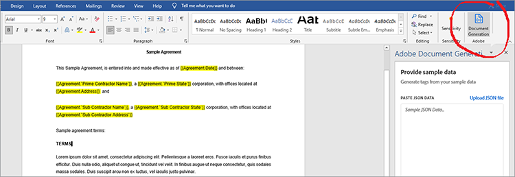

# 管理法律合約


數位化帶來挑戰。 現在，大多陣列織有許多類型的 [ 法律合約 ](https://www.adobe.io/apis/documentcloud/dcsdk/legal-contracts.html) ，他們必須建立、編輯、核准以及由不同方簽署。 這些法律合約通常需要獨一無二的自訂和品牌化。 組織可能也會在完成簽署後，將其儲存為受保護的格式，以確保安全。 要完成所有這些工作，他們需要強大的檔產生和管理解決方案。

許多解決方案提供一些檔產生方式，但無法自訂資料輸入和條件式邏輯，例如僅適用于特定情況的條款。 隨著檔越來越廣泛，手動更新公司的法務範本十分具挑戰性且容易出錯。 自動執行這些程式相當需要。

## 您可以學習哪些內容

在此實作教學課程中，探索在檔中產生自訂輸入欄位中的 API ](https://www.adobe.io/apis/documentcloud/dcsdk/doc-generation.html) 功能 [[!DNL Adobe Acrobat Services]  。同時，探索如何輕鬆將這些產生的檔轉換為受保護的可攜式檔案格式 （PDF），以防止資料處理。

探索將合約轉換為 PDF 時，本教學課程包含一些程式設計。 若要有效跟進操作， [ 您應該在電腦上安裝 Microsoft Word ](https://www.microsoft.com/en-us/download/office.aspx) 和 [ Node.js ](https://nodejs.org/) 。 也建議您基本瞭解 Node.js 和 [ ES6 語法 ](https://www.w3schools.com/js/js_es6.asp) 。

## 相關 API 和資源

* [Adobe檔產生API](https://www.adobe.io/apis/documentcloud/dcsdk/doc-generation.html)

* [PDF 嵌入API](https://www.adobe.com/devnet-docs/dcsdk_io/viewSDK/index.html)

* [Adobe Sign API](https://www.adobe.io/apis/documentcloud/sign.html)

* [專案代碼](https://github.com/agavitalis/adobe_legal_contracts.git)

## 建立範本檔

您可以使用 Microsoft Word 應用程式或下載Adobe的 [ Word 範例範本 ](https://www.adobe.io/apis/documentcloud/dcsdk/doc-generation.html#sample-blade) 來建立法律檔。 不過，不需使用其他輔助工具 （例如 [ Adobe Document Generation Tagger 載入 ](https://www.adobe.io/apis/documentcloud/dcsdk/docs.html?view=docgen-addin) 宏 （Microsoft Word），即可輕鬆自訂輸入內容並以數位方式簽署這些檔。

Document Generation Tagger 是 Microsoft Word 增益集，專為使用標籤進行檔自訂無縫化所打造。 其可在檔範本中建立動態欄位，並以 JSON 資料動態填滿。


若要說明 Document Generation Tagger 的使用方式，請安裝此增益集，然後建立 JSON 資料模型，該模型用於簡單的法律合約檔的標記。

按一下「 **插入** 」索引標籤，在 Word 中安裝 Document Generation Tagger，然後在「增益集」群組中按一下 **「我的增益集」** 。 在「Office 增益集」選單中，搜尋「Adobe檔產生」，然後按一下「 **新增** 」並依照程式進行。 您可以在上方的螢幕擷取中看到這些步驟。

安裝適用于 Word 增益集的 Document Generation Tagger 後，建立簡單的 JSON 資料模型來標記法律檔。

若要繼續進行，請開啟您選擇的任何編輯器，建立一個名為 Agreement.json 的檔案，然後將下方的程式碼片段貼到您建立的 JSON 檔案中。

```
{
"Agreement": {
"Date": "1/24/2021",
"Prime Contractor Name": "Ogbonna Vitalis Corp",
"Prime State": "Lagos",
"Address": "Maryland Ave, Lagos State, Ng",
"Sub Contractor Name": "Vivvaa Soln",
"Sub Contractor State": "California",
"Sub Contractor Address": "Molusi Avenue, Dallas Texas, CA",
"Agreement Date": "1/24/2021",
"Length": 5
}
}
```

儲存此 JSON 檔後，將其匯入至 Document Generation Tagger 增益集。 在 Word 畫面右上方的Adobe群組中按一下 **「檔產生** 」，以讀入檔，如下方螢幕擷取所示。



這會顯示引導您的影片。 您可以觀看或直接前往標記欄位，方法是按一下 **開始使用** 。 按一下開始使用 **** 後，上傳表單會隨即顯示。 按一下 **「上傳 JSON 檔案** 」，然後選取您剛建立的 JSON 檔案。 讀入完成後，按一下 **「產生標籤** 」產生標籤。

在匯入並產生標籤後，您可以將這些標籤新增至檔。 若要新增游標，請將游標放在您希望標籤出現的確切位置。 然後從「檔產生」標籤API，然後按一下「 **插入文字」** 。 下方的螢幕擷取會概述此程式。


除了使用匯入的 JSON 資料模型建立的基本磁碟區標之外，您還可以使用進階功能進行更多選項，例如影像、條件式邏輯、計算、重複元素以及條件式片語。 您可以按一下 **「檔產生記錄器」面板中的「進** 階」，存取這些功能。 您可以在下方的螢幕擷取中看到此內容。


這些進階功能與基本磁碟區標並無不同。 若要包含條件式邏輯，請選取要填寫的檔部分。 然後，設定決定標籤插入的規則。

若要進一步說明，假設合約中有一個您想要包含的區段，只有條件式。 在「選取內容類型」欄位中，選取「 **區段」。** 在「選取記錄」欄位中，選擇決定是否顯示條件式區段的選項。 選取您需要的條件式運算子，然後設定您在「值」欄位中所測試的值。 然後按一下「 **插入條件」。** 下方的螢幕擷取會說明此過程。


在計算中，選取「Arithmetic」或「匯總」，然後包含相關的第一個記錄、運算子和第二個記錄，以根據可用的範本標籤使用。 然後按一下「 **插入計算」** 。

此外，法律合約通常需要參與方的簽名。 您可以使用「數位計算」區段下方的Adobe Sign文字標籤來插入電子簽名。 若要加入電子簽名，您必須據此從下拉式清單中指定收件者數量、選 **取「簽署者** 」和欄位類型。 完成後，按一下 **「插入Adobe Sign文字標籤** 」以完成程式。

為確保資料完整性，請以受保護的格式儲存法律檔。 透過 [!DNL Acrobat Services] API，您可以快速地將檔轉換為 PDF 格式。 您可以建立簡單的 express Node.js 應用程式，將檔產生API整合，並使用此簡單應用程式將標籤檔從 Word 轉換為 PDF 格式。

## 專案設定

首先，為 Node.js 應用程式設定資料夾結構。 在此範例中，請呼叫這個簡單的應用程式 AdobeLegalContractAPI。 您可以在這裡 ](https://github.com/agavitalis/adobe_legal_contracts.git) 擷取源碼 [ 。

### 目錄結構

建立一個名為 AdobeLegalContractAPI 的檔案夾，然後在您選擇的編輯器中開啟。 使用以下資料夾結構，建立具有 ```npm init``` 指令的基本 Node.js 應用程式：

```
###Directory Structure
AdobeLegalContractAPI
-----config
----------default.json
-----controllers
----------createPDFController.js
----------previewController.js
-----models
----------document.js
-----routes
----------web.js
-----services
-----------upload.js
-----uploads
-----views
-----index.js
```

以上為適用于您應用程式的簡易 Node.js 應用程式結構。 現在請繼續安裝必要的 npm 套件。

### 套件安裝

請使用 npm 安裝命令安裝所需的套件，如下方程式碼片段所示：

```
npm install express body-parser morgan multer hbs path config mongoose
```

安裝套件後，請確認 package.json 檔案的內容與下列程式碼片段相同：

```
###package.json
{
"name": "adobelegalcontractapi",
"version": "1.0.0",
"description": "",
"main": "index.js",
"directories": {
"test": "test"
},
"dependencies": {
"body-parser": "^1.19.0",
"config": "^3.3.6",
"express": "^4.17.1",
"hbs": "^4.1.1",
"mongoose": "^5.12.1",
"morgan": "^1.10.0",
"multer": "^1.4.2",
"path": "^0.12.7"
},
"devDependencies": {},
"scripts": {
"start": "node index.js"
},
"repository": {
"type": "git",
"url": "https://github.com/agavitalis/adobe_legal_contracts.git"
},
"author": "Ogbonna Vitalis",
"license": "ISC",
"bugs": {
"url": "https://github.com/agavitalis/adobe_legal_contracts/issues"
},
"homepage": "https://github.com/agavitalis/adobe_legal_contracts#readme"
}
```

在這些程式碼片段中，您安裝了應用程式相依性，包括檢視的「控制欄」範本引擎。

此教學課程的主要重點在於使用 [[!DNL Acrobat Services]  API ](https://www.adobe.io/apis/documentcloud/dcsdk/) 將檔轉換為 PDF。 因此，建立這個 Node.js 應用程式並沒有逐步程式。 不過，您可以在 GitHub ](https://github.com/agavitalis/adobe_legal_contracts.git) 上 [ 擷取完整的 Node.js 應用程式代碼。

## 將 API 整合 [!DNL Adobe Acrobat Services] 至 Node.js 應用程式

[!DNL Adobe Acrobat Services] API 是雲端型的可靠服務，專為無縫處理檔而設計。 它提供三個 API：

* Adobe PDF服務API

* Adobe PDF嵌入API

* Adobe檔產生API

您需要認證才能使用 [!DNL Acrobat Services] API （與 PDF 內嵌API認證不同）。 如果您沒有有效的認證， [ 請依照下方螢幕擷取圖所示，註冊 ](https://www.adobe.com/go/dcsdks_credentials?ref=getStartedWithServicesSDK) 並完成工作流程。 [享受六個月免費試用，然後按即付費 ](https://www.adobe.io/apis/documentcloud/dcsdk/pdf-pricing.html) ，每份檔交易只需 $0.05。


註冊程式完成後，程式碼範例會自動下載到您的 PC，以協助您開始。 您可以擷取此程式碼範例並遵循。 不要忘記將 pdftools-api-credentials.json 和 private.key 檔案從解壓縮的程式碼範例複製到 Node.js 專案的根目錄。 您必須先取得憑證，才能存取 [!DNL Acrobat Services] API端點。 您也可以使用個人化認證下載 SDK 範例，這樣您就不必更新範例程式碼中的金鑰。

現在，使用應用程式根目錄中的終端機執行命令，即可安裝 Adobe PDF Services Node SDK ```npm install \--save @adobe/documentservices-pdftools-node-sdk``` 。 成功安裝後，您可以使用 [!DNL Acrobat Services] API 操作應用程式中的檔。

## 建立 PDF 檔

[!DNL Acrobat Services] API 支援從 Microsoft Office 檔 （Word、Excel 和 PowerPoint） 和其他 [ 支援的檔案格式 ](https://opensource.adobe.com/pdftools-sdk-docs/release/latest/howtos.html#create-a-pdf) （例如 .txt、.rtf、.bmp、.jpeg、gif、.tiff 和 .png） 建立 PDF。 您可以使用 Acrobat Service API，輕鬆將法律合約從任何其他檔案格式轉換為 PDF。

Adobe檔產生API啟用轉換為 Word 檔案或 PDF。 例如，您可以使用 Word 範本產生合約，包括重新標示以標記編輯過的文字。 然後，將其轉換為 PDF，並使用 PDF Services API以密碼保護檔、傳送以索取簽名等。

若要使用可用的支援檔案格式來建立 PDF 檔，您可使用以下格式上傳檔，以便使用 [!DNL Acrobat Services] 。

所設計上傳表格會顯示在下方的螢幕擷取畫面中，您可以在 GitHub ](https://github.com/agavitalis/adobe_legal_contracts.git) 上 [ 存取 HTML 和 CSS 檔案。


現在，將下列程式碼片段新增至控制器 /createPDFController.js 檔案。 此程式碼會擷取上傳的檔，並將其轉換為 PDF。 [!DNL Acrobat Services] 將原始上傳的檔案和已轉換的檔案儲存在不同檔案夾中。

```
###controllers/createPDFController.js
const PDFToolsSdk = require('@adobe/documentservices-pdftools-node-sdk');
const Document = require('../models/document');
/*
* GET / route to show the createPDF form.
*/
function createPDF(req, res) {
//catch any response on the url
let response = req.query.response
res.render('index', { response })
}
/*
* POST /createPDF to create a new PDF File.
*/
function createPDFPost(req, res) {
let filePath = req.file.path;
let fileName = req.file.filename;
try {
// Initial setup, create credentials instance.
const credentials = PDFToolsSdk.Credentials
.serviceAccountCredentialsBuilder()
.fromFile("pdftools-api-credentials.json")
.build();
// Create an ExecutionContext using credentials and create a new operation instance.
const executionContext = PDFToolsSdk.ExecutionContext.create(credentials),
createPdfOperation = PDFToolsSdk.CreatePDF.Operation.createNew();
// Set operation input from a source file.
const input = PDFToolsSdk.FileRef.createFromLocalFile(filePath);
createPdfOperation.setInput(input);
// Execute the operation and Save the result to the specified location.
createPdfOperation.execute(executionContext)
.then(async(result) => {
let newFileName = `createPDFFromDOCX-${Math.random() * 171}.pdf`
let newFilePath = require('path').resolve('./') + `\\output\\${newFileName}`
await result.saveAsFile(`views/output/${newFileName}`)
//Creates a new document
let newDocument = new Document({
documentName: newFileName,
url: newFilePath
});
//Save it into the DB.
newDocument.save((err, docs) => {
if (err) {
res.send(err);
}
else {
res.redirect('/?response=PDF Successfully created')
}
});
})
.catch(err => {
if (err instanceof PDFToolsSdk.Error.ServiceApiError
|| err instanceof PDFToolsSdk.Error.ServiceUsageError) {
console.log('Exception encountered while executing operation', err);
} else {
console.log('Exception encountered while executing operation', err);
}
});
} catch (err) {
console.log('Exception encountered while executing operation', err);
}
}
//export all the functions
module.exports = { createPDF, createPDFPost };
```

上述程式碼片段需要您先前安裝的檔模型和 [!DNL Acrobat Services] Node SDK。 有兩種功能：

* createPDF 顯示上傳檔表格。

* createPDFPost 會將上傳的檔轉換為 PDF。

這些功能會將已轉換的 PDF 檔儲存在檢視/輸出目錄中，您可以將檔下載到電腦。

您也可以使用免費的 PDF 內嵌API來預覽已轉換的 PDF 檔案。 使用 PDF 內嵌API，您可以在這裡 ](https://www.adobe.com/go/dcsdks_credentials) 產生Adobe認證 [ （與您的 [!DNL Acrobat Services] 認證不同），並註冊允許的網域以存取API。請依照程式操作，並為您的應用程式產生 PDF 內嵌API認證。 您也可以在這裡觀看示範 [ ，您可以從中 ](https://documentcloud.adobe.com/view-sdk-demo/index.html#/view/FULL_WINDOW/Bodea%20Brochure.pdf) 輕鬆產生程式碼，快速入門。

返回應用程式，在應用程式的檢視檔案夾中建立 list.hbs 和 preview.hbs 檔案，然後分別將下方的程式碼片段貼到 list.hbs 和 preview.hbs 檔案中。

```
###views/list.hbs
<!DOCTYPE html>
<html lang="en">
<head>
<title>Adobe Legal Contract</title>
<!-- Meta tags -->
<meta charset="UTF-8">
<meta name="viewport" content="width=device-width,
initial-scale=1.0">
<meta http-equiv="X-UA-Compatible" content="ie=edge">
<!-- //Meta tags -->
<link
href=".min.css" rel="stylesheet" integrity="sha384-eOJMYsd53ii+scO/
bJGFsiCZc+5NDVN2yr8+0RDqr0Ql0h+rP48ckxlpbzKgwra6" crossorigin="anonymous">
<link rel="stylesheet" href="css/style.css" type="text/css"
media="all" /><!-- Style-CSS -->
<link href="css/font-awesome.css" rel="stylesheet" /><!--
font-awesome-icons -->
</head>
<body>
<section>
<div class="form-36-mian section-gap">
<div class="wrapper">
<div class="container">
<div class="row">
{{#each documents}}
<div class="col-md-4 mb-2">
<div class="card" style="width:
18rem;">

<div class="card-body">
<h5
class="card-title">{{documentName}}</h5>
<a
href="/downloadPDF/{{_id}}" class="btn btn-primary"><i class="fa
fa-download" aria-hidden="true"></i> Download</a>
<a
href="/previewPDF/{{_id}}" class="btn btn-info"><i class="fa fa-eye"
aria-hidden="true"></i> Preview</a>
</div>
</div>
</div>
{{/each}}
</div>
</div>
<!-- copyright -->
<div class="copy-right">
<p>(c) 2021 Vitalis</p>
</div>
<!-- //copyright -->
</div>
</div>
</section>
</body>
</html>
###views/preview.hbs
<!DOCTYPE html>
<html lang="en">
<head>
<title>[!DNL Adobe Acrobat Services] PDF Embed API</title>
<meta charset="utf-8" />
<meta http-equiv="X-UA-Compatible" content="IE=edge,chrome=1" />
<meta id="viewport" name="viewport" content="width=device-width,
initial-scale=1" />
</head>
<body style="margin: 0px">
<input type="hidden" id="pdfDocumentName"
value={{document.documentName}} />
<input type="hidden" id="pdfDocumentUrl" value={{document.url}} />
<div id="adobe-dc-view"></div>
<script
src="https://documentcloud.adobe.com/view-sdk/main.js"></script>
<script type="text/javascript">
let pdfDocumentName =
document.getElementById("pdfDocumentName").value;
let pdfDocumentUrl =
document.getElementById("pdfDocumentUrl").value;
document.addEventListener("adobe_dc_view_sdk.ready", function
() {
var adobeDCView = new AdobeDC.View({ clientId:
"XXXXXXXXXXXXXXXX", divId: "adobe-dc-view" });
adobeDCView.previewFile({
content: { location: { url:
`http://localhost:5000/output/${pdfDocumentName}` } },
metaData: { fileName: pdfDocumentName }
}, {});
});
</script>
</body>
</html>
```

此外，建立控制器/previewController.js 檔案，並將下方的程式碼片段貼到其中。

```
const Document = require('../models/document');
/*
* GET /listFiles route to show PDF file lists.
*/
async function listFiles(req, res) {
let documents = await Document.find({});
res.render('lists', { documents })
}
/*
* GET /previewPDF route to show PDF file in AdobeEmbedAPI.
*/
async function previewPDF(req, res) {
//catch any response on the url
let documentId = req.params.documentId
let document = await Document.findOne({_id:documentId});
res.render('preview', { document })
}
/*
* GET /downloadPDF To Download PDF Documents.
*/
async function downloadPDF(req, res) {
let documentId = req.params.documentId
let document = await Document.findOne({_id:documentId});
res.download(document.url);
}
//export all the functions
module.exports = {listFiles, previewPDF, downloadPDF };
```

在上方的控制器檔案中，有三種功能：listFiles、previewPDF 和 downloadPDF。 listFiles 功能會列出目前使用 [!DNL Acrobat Services] API 產生的所有 PDF 檔案。 previewPDF 功能可讓您使用 PDF 內嵌API來預覽 PDF 檔案，而 downloadPDF 功能則可讓您將產生的 PDF 檔案下載至電腦。 下方的螢幕擷取會顯示使用 PDF 內嵌API的 PDF 預覽範例。


## 摘要

在此實作教學課程中，您可以使用 Document Generation Tagger Microsoft Word 增益集標記檔。 然後，將 API 整合 [!DNL Acrobat Services] 到 Node.js 應用程式中，
將標籤化檔轉換為可下載的 PDF 格式，不過您也可以直接將合法合約轉換為 PDF。 最後，您使用「內嵌API Adobe PDF預覽產生的 PDF 以進行驗證和簽署。

完成的應用程式可讓您更輕鬆 [ 地標記具有動態欄位的合法合約範本 ](https://www.adobe.io/apis/documentcloud/dcsdk/legal-contracts.html) 、將其轉換為 PDF、預覽及使用 [!DNL Acrobat Services] API 簽署。 您的團隊可以自動將正確的合約傳送給每個客戶，然後有更多時間來發展業務，而不必花時間建立唯一合約。

組織會使用 [!DNL Adobe Acrobat Services] API 來獲得其完整性和易用性。 最棒的，您可以享有 [ 六個月免費試用版，然後隨時隨 ](https://www.adobe.io/apis/documentcloud/dcsdk/pdf-pricing.html) 地付費。 您只需為所用內容付費。 此外，PDF 內嵌API一律免費。

準備好透過改善檔流程來提高生產力了嗎？ [立即開始 ](https://www.adobe.io/apis/documentcloud/dcsdk/gettingstarted.html) 。
