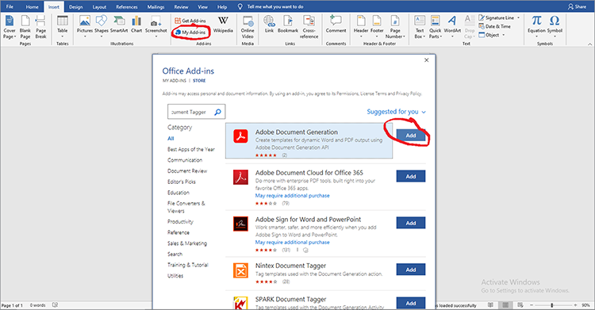
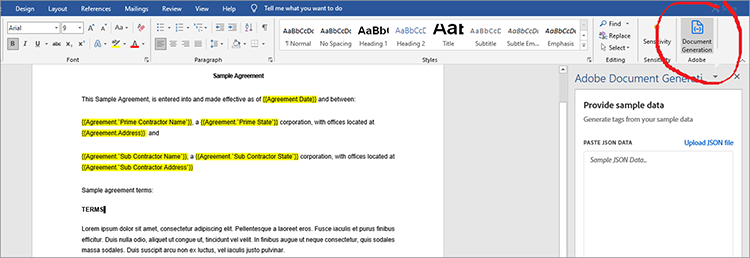
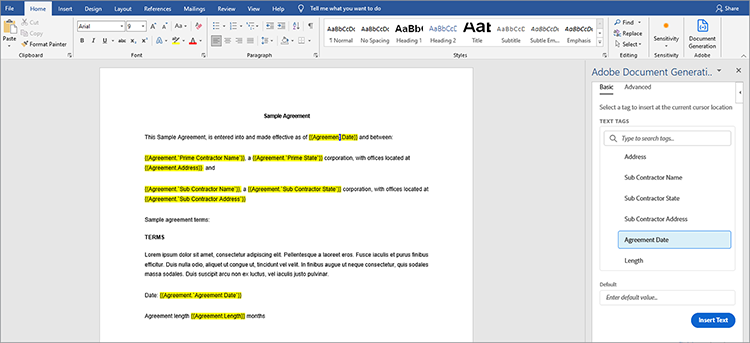
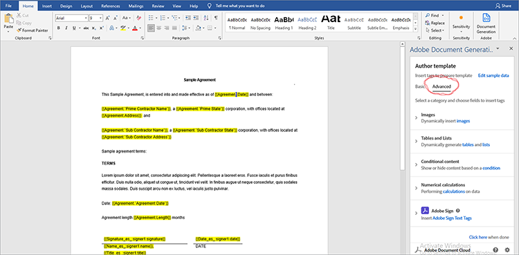
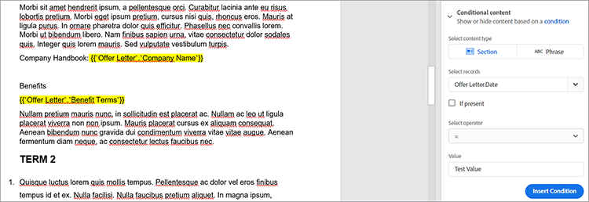
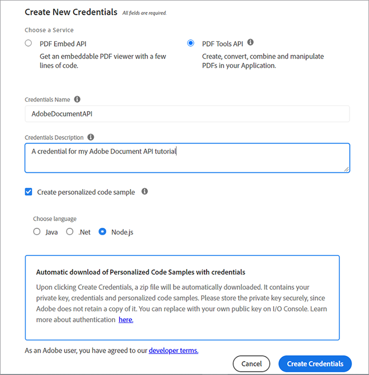
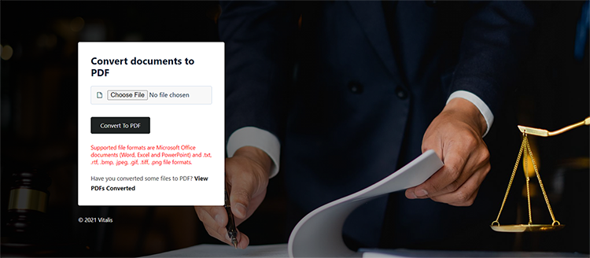
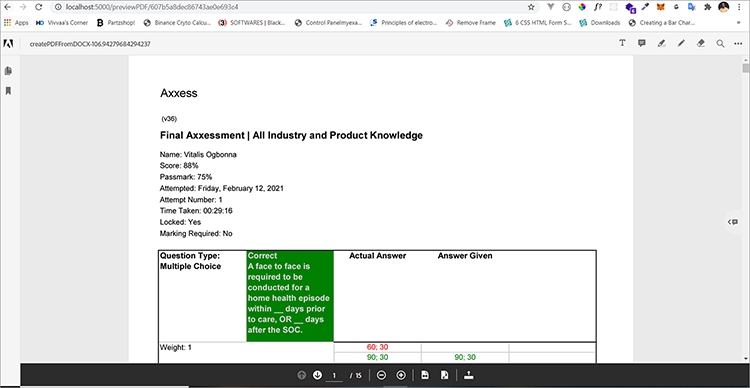

# 法律合約管理


數位化帶來挑戰。 如今，大多數組織都有許多法律 [合約](https://developer.adobe.com/document-services/use-cases/agreements-and-contracts/legal-contracts) ，必須由不同當事人制定、編輯、核准並簽署。 這些法律合約通常需要獨特的客製化與品牌塑造。 組織在簽署後，也可能需要以受保護格式保存，以確保文件安全。 要完成這些工作，他們需要一個強大的文件產生與管理解決方案。

許多解決方案提供部分文件產生功能，但無法自訂資料輸入與條件邏輯，例如僅適用於特定情境的子句。 隨著文件日益龐大，手動更新公司的法律範本既具挑戰性又容易出錯。 自動化這些流程的需求相當大。

## 你可以學到什麼

在這個實作教學中，探索 [[!DNL Adobe Acrobat Services] API](https://developer.adobe.com/document-services/apis/doc-generation) 在文件中產生自訂輸入欄位的功能。 同時，也探討如何輕鬆將這些產生的文件轉換為受保護的可攜式文件格式（PDF），以防止資料被竄改。

這個教學在探索將合約轉換成 PDF 時，會涉及一些程式設計。 為了有效 [跟進，Microsoft Word](https://www.microsoft.com/en-us/download/office.aspx) 和 [Node.js](https://nodejs.org/) 應該安裝在你的電腦上。 同時建議具備基本的 Node.js 與 [ES6 語法](https://www.w3schools.com/js/js_es6.asp) 知識。

## 相關 API 與資源

* [Adobe 文件產生 API](https://developer.adobe.com/document-services/apis/doc-generation)

* [PDF 嵌入 API](https://www.adobe.com/devnet-docs/dcsdk_io/viewSDK/index.html)

* [Adobe Sign API](https://developer.adobe.com/adobesign-api/)

* [專案程式碼](https://github.com/agavitalis/adobe_legal_contracts.git)

## 建立範本文件

您可以使用 Microsoft Word 應用程式或下載 Adobe [的範例 Word 範本](https://developer.adobe.com/document-services/apis/doc-generation#sample-blade)來建立法律文件。 不過，要自訂輸入和數位簽署這些文件，仍不使用像 [是 Microsoft Word 的 Adobe 文件產生標籤外掛](https://developer.adobe.com/document-services/docs/overview/document-generation-api/wordaddin) 這類輔助工具，並不容易。

文件產生標註器是 Microsoft Word 的一款外掛，旨在透過標籤使文件自訂更無縫。 它能在文件範本中建立動態欄位，並利用 JSON 資料動態填充。



為了說明文件產生標註器的使用，安裝此外掛後建立 JSON 資料模型，用於簡單法律合約文件的標籤。

在 Word 中安裝文件產生標籤器，請點擊 **「插入** 」標籤，然後在「附加元件」群組中點選 **「我的附加元件**」。 在 Office 外掛選單中，搜尋「Adobe 文件產生」，然後點選 **新增** ，依照流程操作。 你可以在上方的截圖中看到這些步驟。

安裝 Word 文件產生標註器外掛後，建立一個簡單的 JSON 資料模型來標記法律文件。

接下來，打開你選擇的編輯器，建立一個名為 Agreement.json 的檔案，然後把下面的程式碼片段貼到你建立的 JSON 檔案中。

```
{
"Agreement": {
"Date": "1/24/2021",
"Prime Contractor Name": "Ogbonna Vitalis Corp",
"Prime State": "Lagos",
"Address": "Maryland Ave, Lagos State, Ng",
"Sub Contractor Name": "Vivvaa Soln",
"Sub Contractor State": "California",
"Sub Contractor Address": "Molusi Avenue, Dallas Texas, CA",
"Agreement Date": "1/24/2021",
"Length": 5
}
}
```

儲存此 JSON 文件後，匯入文件產生標註器外掛。 請在 Word 螢幕右上角的 Adobe 群組中點選 **「文件產生** 」，如下方截圖所示，匯入文件。



這裡會顯示一段影片作為指引。 你可以觀看，或直接點擊 **「開始**」進入標籤欄位。 點擊 **「開始」**&#x200B;後，會出現一個上傳表單。 點選 **「上傳 JSON 檔案** 」，然後選擇你剛建立的 JSON 檔案。 匯入完成後，點擊 **產生標籤** 以產生標籤。

匯入並產生標籤後，你可以將這些標籤加入你的文件。 要新增這些標籤，請將游標放在你希望標籤出現的精確位置。 接著從文件生成 API 中選擇標籤，點選 **「插入文字**」。 以下截圖說明了這個流程。



除了用匯入的 JSON 資料模型建立的基本標籤外，你還可以使用進階功能來提供更多選項，例如圖片、條件邏輯、計算、重複元素和條件片語。 你可以在文件產生標籤面板中點擊 **進階** 來使用這些功能。 你可以在下方的截圖中看到這點。



這些進階功能與基本標籤並無不同。 要包含條件邏輯，請選擇要填寫的文件部分。 接著，設定決定標籤插入的規則。

舉例來說，比如在協議中，你想有條件地加入某個條款。 在「選擇內容類型」欄位，選擇 **「區段」。** 在「選擇記錄」欄位中，選擇決定條件區塊是否顯示的選項。 選擇你想要的條件運算子，並在 Value 欄位設定你要測試的值。 然後點選 **「插入條件」。** 下方截圖展示了這個過程。



計算時，選擇算術或彙整，然後根據可用的模板標籤加入相關的第一筆記錄、運算子和第二筆記錄。 然後點擊 **「插入計算**」。

此外，法律合約通常需要相關方簽署。 你可以在「數值計算」區塊下方，使用 Adobe Sign 文字標籤插入電子簽名。 要包含電子簽名，您必須指定收件人數量，選擇簽署者&#x200B;**，並從下拉選單中選擇**&#x200B;欄位類型。完成後，點擊 **「插入 Adobe 簽名文字標籤** 」以完成整個流程。

為確保資料完整性，請將法律文件保存為受保護格式。 透過 [!DNL Acrobat Services] API，你可以快速將文件轉換成 PDF 格式。 你可以建立一個簡單的 Express Node.js 應用程式，整合文件生成 API，並利用這個簡單的應用程式將標籤文件從 Word 格式轉換成 PDF。

## 專案設定

首先，你要為 Node.js 應用程式設定資料夾結構。 在此範例中，將這個簡單的應用程式稱為 AdobeLegalContractAPI。 你可以在這裡](https://github.com/agavitalis/adobe_legal_contracts.git)取得原始碼[。

### 目錄結構

建立一個名為 AdobeLegalContractAPI 的資料夾，並用你喜歡的編輯器打開。 請使用以下資料夾結構，使用 `npm init` 該指令建立一個基本的Node.js應用程式：

```
###Directory Structure
AdobeLegalContractAPI
-----config
----------default.json
-----controllers
----------createPDFController.js
----------previewController.js
-----models
----------document.js
-----routes
----------web.js
-----services
-----------upload.js
-----uploads
-----views
-----index.js
```

以上是一個簡單的Node.js申請架構。 接著安裝必要的 npm 套件。

### 套件安裝

請依下方程式碼片段所示，使用 npm 安裝指令安裝所需的套件：

```
npm install express body-parser morgan multer hbs path config mongoose
```

安裝套件後，請確保你的package.json檔案內容與以下程式碼片段相同：

```
###package.json
{
"name": "adobelegalcontractapi",
"version": "1.0.0",
"description": "",
"main": "index.js",
"directories": {
"test": "test"
},
"dependencies": {
"body-parser": "^1.19.0",
"config": "^3.3.6",
"express": "^4.17.1",
"hbs": "^4.1.1",
"mongoose": "^5.12.1",
"morgan": "^1.10.0",
"multer": "^1.4.2",
"path": "^0.12.7"
},
"devDependencies": {},
"scripts": {
"start": "node index.js"
},
"repository": {
"type": "git",
"url": "https://github.com/agavitalis/adobe_legal_contracts.git"
},
"author": "Ogbonna Vitalis",
"license": "ISC",
"bugs": {
"url": "https://github.com/agavitalis/adobe_legal_contracts/issues"
},
"homepage": "https://github.com/agavitalis/adobe_legal_contracts#readme"
}
```

在這些程式碼片段中，你安裝了應用程式相依性，包括檢視的 Handlebars 模板引擎。

本教學的主要重點是如何使用 [[!DNL Acrobat Services] API](https://developer.adobe.com/document-services/homepage/) 將文件轉換成 PDF。 因此，沒有一步步的流程來說明如何建立這個Node.js應用程式。 不過，你可以在 [GitHub](https://github.com/agavitalis/adobe_legal_contracts.git) 上取得完整的工作 Node.js 應用程式代碼。

## 將 [!DNL Adobe Acrobat Services] API 整合進Node.js應用程式

[!DNL Adobe Acrobat Services] API 是基於雲端且可靠的服務，設計用來無縫操作文件。 它提供三種 API：

* Adobe PDF 服務 API

* Adobe PDF 嵌入 API

* Adobe 文件產生 API

你需要憑證才能使用 [!DNL Acrobat Services] API（這和你的 PDF 嵌入 API 憑證不同）。 如果你沒有有效的憑證，請 [註冊](https://www.adobe.com/go/dcsdks_credentials?ref=getStartedWithServicesSDK) 並完成以下截圖所示的工作流程。 享受 [六個月免費試用，然後按需](https://developer.adobe.com/document-services/pricing/main)付費，每筆文件交易只需 0.05 美元。



註冊流程完成後，程式碼範例會自動下載到你的電腦，幫助你開始。 你可以擷取這個程式碼範例並跟著操作。 別忘了將解壓出來的程式碼範例中的pdftools-api-credentials.json和private.key檔案複製到 Node.js 專案的根目錄。 登入憑證是你才能存取 [!DNL Acrobat Services] API 端點的必要條件。 你也可以下載帶有個人化憑證的 SDK 範例，這樣就不用更新範例程式碼中的金鑰。

現在，透過應用程式根目錄中的終端機執行 `npm install \--save @adobe/documentservices-pdftools-node-sdk` 指令，安裝 Adobe PDF Services Node SDK。 成功安裝後，你可以使用 [!DNL Acrobat Services] API 來操作應用程式中的文件。

## 建立 PDF 文件

[!DNL Acrobat Services] API 支援Microsoft從 Office 文件（Word、Excel 和 PowerPoint）及其他 [支援的檔案格式](https://opensource.adobe.com/pdftools-sdk-docs/release/latest/howtos.html#create-a-pdf) （如 .txt、.rtf、.bmp、.jpeg、gif、.tiff 和 .png）建立 PDF。 你可以用 Acrobat Service API 輕鬆將法律合約從其他檔案格式轉換成 PDF。

Adobe 文件產生 API 支援轉換成 Word 檔案或 PDF。 例如，你可以使用 Word 範本來產生合約，包括用紅線標記已編輯的文字。 接著，將文件轉成 PDF，並使用 PDF Services API 來保護文件，設定密碼，發送簽名等。

為了從可用的支援檔案格式建立 PDF 文件，有一個表單可上傳 [!DNL Acrobat Services]文件進行轉換。

設計上的上傳表單會出現在下方的截圖中，你也可以在 [GitHub](https://github.com/agavitalis/adobe_legal_contracts.git) 上存取 HTML 和 CSS 檔案。



現在，將以下程式碼片段加入控制器的 /createPDFController.js 檔案。 此程式碼會擷取上傳的文件並將其轉換成 PDF。 [!DNL Acrobat Services] 會將原始上傳檔案和轉換後的檔案分別儲存在不同的資料夾中。

```
###controllers/createPDFController.js
const PDFToolsSdk = require('@adobe/documentservices-pdftools-node-sdk');
const Document = require('../models/document');
/*
* GET / route to show the createPDF form.
*/
function createPDF(req, res) {
//catch any response on the url
let response = req.query.response
res.render('index', { response })
}
/*
* POST /createPDF to create a new PDF File.
*/
function createPDFPost(req, res) {
let filePath = req.file.path;
let fileName = req.file.filename;
try {
// Initial setup, create credentials instance.
const credentials = PDFToolsSdk.Credentials
.serviceAccountCredentialsBuilder()
.fromFile("pdftools-api-credentials.json")
.build();
// Create an ExecutionContext using credentials and create a new operation instance.
const executionContext = PDFToolsSdk.ExecutionContext.create(credentials),
createPdfOperation = PDFToolsSdk.CreatePDF.Operation.createNew();
// Set operation input from a source file.
const input = PDFToolsSdk.FileRef.createFromLocalFile(filePath);
createPdfOperation.setInput(input);
// Execute the operation and Save the result to the specified location.
createPdfOperation.execute(executionContext)
.then(async(result) => {
let newFileName = `createPDFFromDOCX-${Math.random() * 171}.pdf`
let newFilePath = require('path').resolve('./') + `\\output\\${newFileName}`
await result.saveAsFile(`views/output/${newFileName}`)
//Creates a new document
let newDocument = new Document({
documentName: newFileName,
url: newFilePath
});
//Save it into the DB.
newDocument.save((err, docs) => {
if (err) {
res.send(err);
}
else {
res.redirect('/?response=PDF Successfully created')
}
});
})
.catch(err => {
if (err instanceof PDFToolsSdk.Error.ServiceApiError
|| err instanceof PDFToolsSdk.Error.ServiceUsageError) {
console.log('Exception encountered while executing operation', err);
} else {
console.log('Exception encountered while executing operation', err);
}
});
} catch (err) {
console.log('Exception encountered while executing operation', err);
}
}
//export all the functions
module.exports = { createPDF, createPDFPost };
```

上述程式碼片段需要你之前安裝的文件模型和 [!DNL Acrobat Services] 節點 SDK。 有兩個功能：

* CreatePDF 會顯示上傳文件表單。

* createPDFPost 會將上傳的文件轉換成 PDF。

這些功能會將轉換後的 PDF 文件儲存在檢視/輸出目錄中，你可以下載到電腦。

您也可以使用免費的 PDF 嵌入 API 預覽轉換後的 PDF 檔案。 使用 PDF 嵌入 API，你可以在這裡](https://www.adobe.com/go/dcsdks_credentials)產生 Adobe 憑證[（與你的[!DNL Acrobat Services]憑證不同），並註冊允許的網域以存取 API。請依照流程產生 PDF 嵌入 API 憑證，為你的應用程式提供憑證。 你也可以在這裡[](https://documentcloud.adobe.com/view-sdk-demo/index.html#/view/FULL_WINDOW/Bodea%20Brochure.pdf)查看示範，輕鬆產生代碼幫助你快速開始。

回到應用程式，在應用程式的檢視資料夾建立 list.hbs 和 preview.hbs 檔案，並將下方的程式碼片段分別貼到 list.hbs 和 preview.hbs 檔案中。

```
###views/list.hbs
<!DOCTYPE html>
<html lang="en">
<head>
<title>Adobe Legal Contract</title>
<!-- Meta tags -->
<meta charset="UTF-8">
<meta name="viewport" content="width=device-width,
initial-scale=1.0">
<meta http-equiv="X-UA-Compatible" content="ie=edge">
<!-- //Meta tags -->
<link
href=".min.css" rel="stylesheet" integrity="sha384-eOJMYsd53ii+scO/
bJGFsiCZc+5NDVN2yr8+0RDqr0Ql0h+rP48ckxlpbzKgwra6" crossorigin="anonymous">
<link rel="stylesheet" href="css/style.css" type="text/css"
media="all" /><!-- Style-CSS -->
<link href="css/font-awesome.css" rel="stylesheet" /><!--
font-awesome-icons -->
</head>
<body>
<section>
<div class="form-36-mian section-gap">
<div class="wrapper">
<div class="container">
<div class="row">
{{#each documents}}
<div class="col-md-4 mb-2">
<div class="card" style="width:
18rem;">

<div class="card-body">
<h5
class="card-title">{{documentName}}</h5>
<a
href="/downloadPDF/{{_id}}" class="btn btn-primary"><i class="fa
fa-download" aria-hidden="true"></i> Download</a>
<a
href="/previewPDF/{{_id}}" class="btn btn-info"><i class="fa fa-eye"
aria-hidden="true"></i> Preview</a>
</div>
</div>
</div>
{{/each}}
</div>
</div>
<!-- copyright -->
<div class="copy-right">
<p>(c) 2021 Vitalis</p>
</div>
<!-- //copyright -->
</div>
</div>
</section>
</body>
</html>
###views/preview.hbs
<!DOCTYPE html>
<html lang="en">
<head>
<title>[!DNL Adobe Acrobat Services] PDF Embed API</title>
<meta charset="utf-8" />
<meta http-equiv="X-UA-Compatible" content="IE=edge,chrome=1" />
<meta id="viewport" name="viewport" content="width=device-width,
initial-scale=1" />
</head>
<body style="margin: 0px">
<input type="hidden" id="pdfDocumentName"
value={{document.documentName}} />
<input type="hidden" id="pdfDocumentUrl" value={{document.url}} />
<div id="adobe-dc-view"></div>
<script
src="https://documentcloud.adobe.com/view-sdk/main.js"></script>
<script type="text/javascript">
let pdfDocumentName =
document.getElementById("pdfDocumentName").value;
let pdfDocumentUrl =
document.getElementById("pdfDocumentUrl").value;
document.addEventListener("adobe_dc_view_sdk.ready", function
() {
var adobeDCView = new AdobeDC.View({ clientId:
"XXXXXXXXXXXXXXXX", divId: "adobe-dc-view" });
adobeDCView.previewFile({
content: { location: { url:
`http://localhost:5000/output/${pdfDocumentName}` } },
metaData: { fileName: pdfDocumentName }
}, {});
});
</script>
</body>
</html>
```

另外，建立一個控制器/previewController.js檔案，然後把下面的程式碼片段貼到裡面。

```
const Document = require('../models/document');
/*
* GET /listFiles route to show PDF file lists.
*/
async function listFiles(req, res) {
let documents = await Document.find({});
res.render('lists', { documents })
}
/*
* GET /previewPDF route to show PDF file in AdobeEmbedAPI.
*/
async function previewPDF(req, res) {
//catch any response on the url
let documentId = req.params.documentId
let document = await Document.findOne({_id:documentId});
res.render('preview', { document })
}
/*
* GET /downloadPDF To Download PDF Documents.
*/
async function downloadPDF(req, res) {
let documentId = req.params.documentId
let document = await Document.findOne({_id:documentId});
res.download(document.url);
}
//export all the functions
module.exports = {listFiles, previewPDF, downloadPDF };
```

在上方的控制器檔案中，有三個功能：listFiles、previewPDF 和 downloadPDF。 listFiles 函式列出目前使用 API 產生 [!DNL Acrobat Services] 的所有 PDF 檔案。 previewPDF 功能允許你使用 PDF 嵌入 API 預覽 PDF 檔案，而 downloadPDF 功能則讓你能將產生的 PDF 檔案下載到電腦。 下方的截圖展示了使用 PDF 嵌入 API 預覽的範例。



## 摘要

在這個實作教學中，你使用文件產生標籤器 Microsoft Word 外掛為文件做標籤。 接著，將 API 整合 [!DNL Acrobat Services] 進Node.js應用程式中，將有標籤的文件轉成可下載的 PDF 格式，雖然你也可以直接將法律合約製作成 PDF。 最後，你使用 Adobe PDF 嵌入 API 預覽產生的 PDF 進行驗證與簽名。

完成的應用程式讓以動態欄位標註 [法律合約範本](https://developer.adobe.com/document-services/use-cases/agreements-and-contracts/legal-contracts) 、轉換成 PDF、預覽及使用 [!DNL Acrobat Services] API 簽署變得更為簡單。 團隊不必花時間製作獨特合約，而是能自動將正確合約寄給每位客戶，然後花更多時間發展你的事業。

組織使用 [!DNL Adobe Acrobat Services] API 是因為其完整性與易用性。 最棒的是，你可以享受 [六個月的免費試用，然後選擇隨用](https://developer.adobe.com/document-services/pricing/main)付費。 你只付你用的東西。 而且 PDF 嵌入 API 永遠免費。

準備好透過改善文件流程來提升生產力了嗎？ [今天就開始吧](https://www.adobe.io/apis/documentcloud/dcsdk/gettingstarted.html) 。
