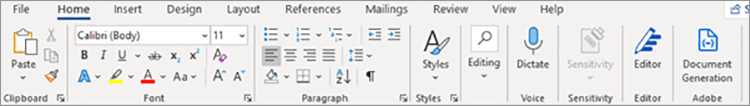
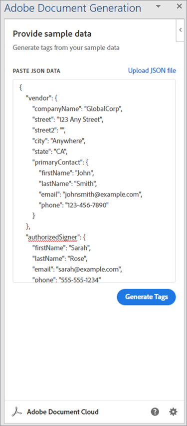
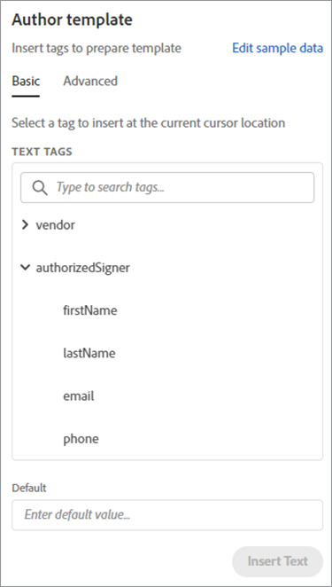
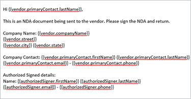
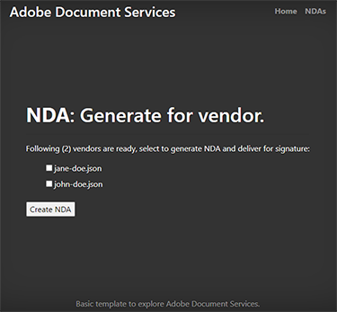
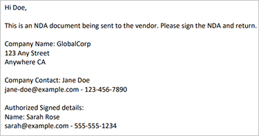

# 制定保密協議


組織與外部貢獻者合作，共同打造其服務與產品。 保密協議（NDA）是這些合作中的重要一項。 它約束所有當事人不得洩露任何可能損害任何一方的機密資訊。

最廣泛使用的保密協議格式是 PDF 文件。 組織會準備保密協議並寄送給所有相關方。 然後，當所有人都簽完字後，他們才開始簽約。 在高速團隊中，手動製作 PDF 會拖慢進度。

## 你可以學到什麼

這個實作教學說明如何為你的公司建立專門的 Microsoft Word 保密協議範本。 Adobe 為 Microsoft Word [提供的免費外掛 Adobe 文件產生標註](https://opensource.adobe.com/pdftools-sdk-docs/docgen/latest/wordaddin.html#add-in-demo)器，會插入「標籤」來輸入動態值。 學習如何將 JSON 資料傳入範本並建立動態 PDF。 根據您的業務需求與目標，最終產生的 PDF 可透過電子郵件發送或在瀏覽器中顯示給合作夥伴。 要跟上進度，你只需要對Node.js、JavaScript、Express.js、HTML 和 CSS 有一點經驗。

## 相關 API 與資源

有了 [!DNL Adobe Acrobat Services]，你可以即時利用動態資料產生 PDF 文件。 [!DNL Acrobat Services] 提供一系列 PDF 工具，包括 Adobe 文件生成 API，以自動化 [NDA 建立](https://developer.adobe.com/document-services/use-cases/agreements-and-contracts/nda-creation)。

* [Adobe 文件產生 API](https://developer.adobe.com/document-services/apis/doc-generation)

* [Adobe Sign API](https://developer.adobe.com/adobesign-api/)

* [Adobe 文件產生標註器](https://opensource.adobe.com/pdftools-sdk-docs/docgen/latest/wordaddin.html#add-in-demo)

* [專案程式碼](https://github.com/afzaal-ahmad-zeeshan/adobe-docugen-sample)

* [[!DNL Acrobat Services] 鑰匙](https://opensource.adobe.com/pdftools-sdk-docs/release/latest/index.html#getcred)

## 建立 JSON 模型

Microsoft Word 範本依賴 JSON 模型，所以你先建立它。 教學中，你會使用一個包含公司資訊（如聯絡資訊）的基本 JSON 結構。

```
{
"vendor": {
"companyName": "GlobalCorp",
"street": "123 Any Street",
"street2": "",
"city":"Anywhere",
"state":"CA",
"primaryContact": {
"firstName":"John",
"lastName":"Doe",
"email":"john-doe@example.com",
"phone":"123-456-7890"
}
},
"authorizedSigner": {
"firstName": "Sarah",
"lastName": "Rose",
"email": "sarah@example.com",
"phone":"555-555-1234"
}
}
```

你可以在 Microsoft Word 裡使用這個結構來產生範本。 這些資料可以來自任何資料來源，只要是 JSON 格式。 為了簡化，你可以在Node.js應用程式內建立多個檔案，但你的使用情境可能需要資料庫連線來拉取廠商資訊。

## 建立 Microsoft Word 範本

在 Microsoft Word 文件中建立 NDA 範本。 Adobe PDF 服務 API 預期 Microsoft Word 文件中包含可從 JSON 文件注入數值的標籤。 雖然所有向 Adobe 請求的範本相同，但 JSON 中的動態資料會改變。 這些標籤在此情況下，使用單一 Microsoft Word 範本，協助為每個廠商建立 PDF 文件，並透過自動化 NDA 文件產生加速流程。

你可以在 Microsoft Word 安裝 [免費的文件產生標籤外掛](https://opensource.adobe.com/pdftools-sdk-docs/docgen/latest/wordaddin.html#add-in-demo) 。 如果你是某個組織的一員，你可以要求你的 Microsoft Office 管理員為所有人安裝這個免費的外掛程式。

安裝好外掛後，你可以在 Adobe 分類的首頁找到它。 要開啟分頁，請選擇 **文件產生**：



在分頁內，你可以上傳範例 JSON 文件。 這份文件可以作為範例，因為你只用它來建立 Microsoft Word 範本。



選擇 **產生標籤** 以查看範本中可用的項目。 以下是從 JSON 結構中擷取的屬性，準備用於範本：



這些是現場的 `authorizedSigner` 特徵。 其他欄位會被包裝，你可以在 Microsoft Word 中展開視圖。 這個外掛還提供進階資料選項，例如表格、清單、計算值等。

## 建立標籤

歡迎自行建立範本或匯入 [現有範本](https://developer.adobe.com/document-services/apis/doc-generation#sample-blade) 到 Microsoft Word。 設定好文件後，點擊外掛中對應的標記，為每個欄位新增標籤。

以下為 Microsoft Word 檔案中的範本：



此檔案包含多個標籤。 當你執行程式時，這些欄位會填滿供應商資訊。

文件產生標註器可整合 Adobe Sign API。 因為這種整合，你可以自動建立 Sign 文字標籤，讓產生的文件能送至 Adobe Sign 進行簽名。

## 為供應商產生保密協議

在範例應用程式裡，你準備了輸入和輸出的資料夾。 如前所述，你會使用 JSON 檔案，因此系統中有兩個檔案來顯示可用廠商。 這些檔案會顯示在一個表單中，並可在瀏覽器上列印：

```
<h1><b>NDA</b>: Generate for vendor.</h1>
<hr />
<p>Following ({{files.length}}) vendors are ready, select to generate NDA and deliver for signature:</p>
<form method="POST">
<ul>
{{#each files }}
<li><input type="checkbox" name="vendor" value="{{this}}" id="file-{{@index}}" /> <label for="file-{{@index}}">{{this}}</label></li>
{{/each}}
</ul>
<input type="submit" value="Create NDA" />
</form>
```

此程式碼會在瀏覽器中產生以下使用者介面（UI）：



當管理員選擇某人時，應用程式會使用 Adobe PDF 服務隨時隨地產生保密協議。

```
async function compileDocFile(json, inputFile, outputPdf) {
try {
// configurations
const credentials = adobe.Credentials
.serviceAccountCredentialsBuilder()
.fromFile("./src/pdftools-api-credentials.json")
.build();
// Capture the credential from app and show create the context
const executionContext = adobe.ExecutionContext.create(credentials);
// create the operation
const documentMerge = adobe.DocumentMerge,
documentMergeOptions = documentMerge.options,
options = new documentMergeOptions.DocumentMergeOptions(json, documentMergeOptions.OutputFormat.PDF);
const operation = documentMerge.Operation.createNew(options);
// Pass the content as input (stream)
const input = adobe.FileRef.createFromLocalFile(inputFile);
operation.setInput(input);
// Async create the PDF
let result = await operation.execute(executionContext);
await result.saveAsFile(outputPdf);
} catch (err) {
console.log('Exception encountered while executing operation', err);
}
}
```

在 Express 路由器內使用這段代碼：

```
// Create one report and send it back
try {
console.log(`[INFO] generating the report...`);
const fileContent = fs.readFileSync(`./public/documents/raw/${vendor}`, 'utf-8');
const parsedObject = JSON.parse(fileContent);
await pdf.compileDocFile(parsedObject, `./public/documents/template/Adobe-NDA-Sample.docx`, `./public/documents/processed/output.pdf`);
console.log(`[INFO] sending the report...`);
res.status(200).render("preview", { page: 'nda', filename: 'output.pdf' });
} catch(error) {
console.log(`[ERROR] ${JSON.stringify(error)}`);
res.status(500).render("crash", { error: error });
}
```

你可以在 GitHub 上查看 [完整的範例程式碼](https://github.com/afzaal-ahmad-zeeshan/adobe-docugen-sample) 。

此程式碼在 API 呼叫 [!DNL Adobe Acrobat Services] SDK 時使用 JSON 文件與 Microsoft Word 範本。 在回應中，你會收到輸出並儲存到應用程式的檔案系統。 您可以透過電子郵件將產生的文件轉寄給客戶，或使用免費 [的 Adobe PDF 嵌入 API](https://developer.adobe.com/document-services/apis/pdf-embed) 在瀏覽器中展示預覽。

此通話產生以下保密協議文件：



[!DNL Adobe Acrobat Services] API 插入內容以建立 PDF 文件。 沒有這些工具，你可能得寫程式碼來處理 Office 文件，並處理原始 PDF 格式。 借助 Adobe PDF 服務，您只需一個 API 呼叫即可完成所有這些步驟。

現在使用 [Adobe Sign API](https://developer.adobe.com/adobesign-api/) 要求 NDA 簽名，並將最終簽署的文件交付給所有相關方。 Adobe Sign 會透過 Webhook[&#128279;](https://opensource.adobe.com/acrobat-sign/developer_guide/index.html#!adobedocs/adobe-sign/master/webhooks.md) 通知你。透過這個網路鉤子，你可以取得保密協議的狀態。

想更深入了解 Adobe Sign 流程，請參閱 [文件](https://opensource.adobe.com/acrobat-sign/developer_guide/index.html) 或閱讀這篇深入的部落格文章。

## 後續步驟

在這個實作教學中，Adobe 文件生成標註器被用來動態產生 PDF 文件，使用 Microsoft Word 範本和 JSON 資料檔。 這個外掛幫助 [自動為雙方建立客製化的保密協議](https://developer.adobe.com/document-services/use-cases/agreements-and-contracts/nda-creation) ，然後使用 Sign API 收集簽名。

你可以利用這些技巧動態建立自己的保密協議或其他文件，讓團隊能專注於有效率的工作。 探索 [[!DNL Adobe Acrobat Services]](https://developer.adobe.com/document-services/apis/pdf-services) 尋找適合你選擇語言和執行環境的 API 和 SDK，讓你能直接將 PDF 函式加入應用程式，快速建立 PDF 文件。 [那就開始](https://www.adobe.io/apis/documentcloud/dcsdk/gettingstarted.html) 六個月的免費試用吧
[隨用](https://developer.adobe.com/document-services/pricing/main) 付費，每筆文件交易僅付0.05美元。
