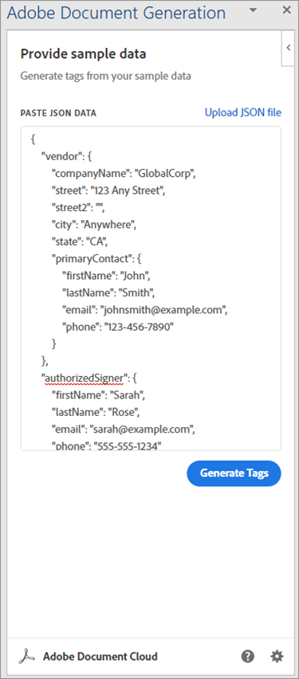

# 建立 NDA


組織與外部投稿人共同打造其服務和產品。 保密合約 （NDA） 是此類共同作業中的重要一項。 這會束縛所有當事人發佈任何可能損害任何實體的機密資訊。

使用最常用的 NDA 格式為 PDF 檔。 組織會準備 NDA 並將其傳送給所有當事人。 然後，在每個人都完成簽署後，他們就會開始簽訂合約。 在高速團隊中，手動建立 PDF 會使進度變慢。

## 您可以學習哪些內容

本實作教學課程說明如何為您的公司建立專門的 Microsoft Word NDA 範本。 Adobe Microsoft Word [ Adobe Document Generation Tagger ](https://opensource.adobe.com/pdftools-sdk-docs/docgen/latest/wordaddin.html#add-in-demo) 的免費增益集會插入「標籤」以輸入動態值。 瞭解如何將 JSON 資料傳遞至範本並建立動態 PDF。 產生的 PDF 可以透過電子郵件傳送給您的共同作業人員，或是根據您的業務需求和目標，在共同作業人員的瀏覽器中顯示。 若要跟進客戶，您只需要體驗 Node.js、JavaScript、Express.js、HTML 和 CSS。

## 相關 API 和資源

藉助 [!DNL Adobe Acrobat Services] 此功能，您可以使用動態資料，隨時隨地產生 PDF 檔。 [!DNL Acrobat Services] 提供一套 PDF 工具，包括可自動 [ 建立 NDA 的Adobe檔產生 ](https://www.adobe.io/apis/documentcloud/dcsdk/nda-creation.html) API。

* [Adobe檔產生API](https://www.adobe.io/apis/documentcloud/dcsdk/doc-generation.html)

* [Adobe Sign API](https://www.adobe.io/apis/documentcloud/sign.html)

* [Adobe檔產生記錄器](https://opensource.adobe.com/pdftools-sdk-docs/docgen/latest/wordaddin.html#add-in-demo)

* [專案代碼](https://github.com/afzaal-ahmad-zeeshan/adobe-docugen-sample)

* [[!DNL Acrobat Services] 鑰匙](https://opensource.adobe.com/pdftools-sdk-docs/release/latest/index.html#getcred)

## 建立 JSON 模型

Microsoft Word 範本會依 JSON 模型而定，因此請先建立該範本。 在教學課程中，您會使用基本的 JSON 結構，其中包含公司詳細資訊，例如聯絡資訊。

```
{
"vendor": {
"companyName": "GlobalCorp",
"street": "123 Any Street",
"street2": "",
"city":"Anywhere",
"state":"CA",
"primaryContact": {
"firstName":"John",
"lastName":"Doe",
"email":"john-doe@example.com",
"phone":"123-456-7890"
}
},
"authorizedSigner": {
"firstName": "Sarah",
"lastName": "Rose",
"email": "sarah@example.com",
"phone":"555-555-1234"
}
}
```

您可以在 Microsoft Word 中使用此結構來產生範本。 只要資料為 JSON 格式，則此類資料可能來自任何資料來源。 簡單來說，您可以在 Node.js 應用程式內建立多個檔案，但是您的使用案例可能需要資料庫連線才能提取廠商資訊。

## 建立 Microsoft Word 範本

在 Microsoft Word 檔中建立 NDA 範本。 Adobe PDF服務」API希望 Microsoft Word 檔包含的標籤可讓服務從 JSON 檔中注入值。 儘管所有Adobe要求的範本都相同，但 JSON 中的動態資料也會變更。 在這種情況下，這些標籤有助於為每家廠商建立 PDF 檔，使用單一 Microsoft Word 範本，並透過將 NDA 檔產生自動化加速流程。

您可以將免費的 [ Document Generation Tagger 載入 ](https://opensource.adobe.com/pdftools-sdk-docs/docgen/latest/wordaddin.html#add-in-demo) 宏安裝至 Microsoft Word。 如果您屬於組織，您可以要求 Microsoft Office 管理員為所有人安裝免費增益集。

安裝增益集後，您可以在「首頁」索引標籤下方的「Adobe」類別中找到增益集。 若要開啟索引標籤，請選取 **** 「產生檔」：


您可以在索引標籤內上傳範例 JSON 檔。 本檔可以是範例，因為您只使用它來建立 Microsoft Word 範本。



選 **取「產生標籤** 」以檢視您可以在範本中使用的專案。 以下是從 JSON 結構擷取的屬性，可隨時在範本中使用：


這些是欄位中的 `authorizedSigner` 功能。 其他欄位已包住，您可以展開 Microsoft Word 中的檢視。 增益集也提供進階資料選項，例如表格、清單、計算值等。

## 建立標籤

隨意建立範本或 [ 將現有範本 ](https://www.adobe.io/apis/documentcloud/dcsdk/doc-generation.html#sample-blade) 匯入 Microsoft Word。 在您設定檔後，按一下增益集中的對應字元，即可將標籤新增至每個欄位。

Microsoft Word 檔案中的下列範本：


此檔案包含數個標籤。 當您執行程式時，這些欄位中會填入供應商資訊。

Document Generation Tagger 與 Adobe Sign API 整合。 由於此整合，您可以自動建立 Sign 文字標籤，以便將產生的檔傳送至Adobe Sign以供簽署。

## 產生供應商的 NDA

在範例應用程式內，您備妥輸入和輸出的資料夾。 如前面所述，您可以使用 JSON 檔案，以便有兩個檔案可在系統中顯示可用的供應商。 檔案會顯示在瀏覽器上列印的表格中：

```
<h1><b>NDA</b>: Generate for vendor.</h1>
<hr />
<p>Following ({{files.length}}) vendors are ready, select to generate NDA and deliver for signature:</p>
<form method="POST">
<ul>
{{#each files }}
<li><input type="checkbox" name="vendor" value="{{this}}" id="file-{{@index}}" /> <label for="file-{{@index}}">{{this}}</label></li>
{{/each}}
</ul>
<input type="submit" value="Create NDA" />
</form>
```

此程式碼會在瀏覽器中產生下列使用者介面 （UI）：


當管理員選取人員時，應用程式會使用「Adobe PDF服務」在外出時產生 NDA。

```
async function compileDocFile(json, inputFile, outputPdf) {
try {
// configurations
const credentials = adobe.Credentials
.serviceAccountCredentialsBuilder()
.fromFile("./src/pdftools-api-credentials.json")
.build();
// Capture the credential from app and show create the context
const executionContext = adobe.ExecutionContext.create(credentials);
// create the operation
const documentMerge = adobe.DocumentMerge,
documentMergeOptions = documentMerge.options,
options = new documentMergeOptions.DocumentMergeOptions(json, documentMergeOptions.OutputFormat.PDF);
const operation = documentMerge.Operation.createNew(options);
// Pass the content as input (stream)
const input = adobe.FileRef.createFromLocalFile(inputFile);
operation.setInput(input);
// Async create the PDF
let result = await operation.execute(executionContext);
await result.saveAsFile(outputPdf);
} catch (err) {
console.log('Exception encountered while executing operation', err);
}
}
```

在 Express 路由器中使用此代碼：

```
// Create one report and send it back
try {
console.log(`[INFO] generating the report...`);
const fileContent = fs.readFileSync(`./public/documents/raw/${vendor}`, 'utf-8');
const parsedObject = JSON.parse(fileContent);
await pdf.compileDocFile(parsedObject, `./public/documents/template/Adobe-NDA-Sample.docx`, `./public/documents/processed/output.pdf`);
console.log(`[INFO] sending the report...`);
res.status(200).render("preview", { page: 'nda', filename: 'output.pdf' });
} catch(error) {
console.log(`[ERROR] ${JSON.stringify(error)}`);
res.status(500).render("crash", { error: error });
}
```

您可以在 GitHub 上檢視 [ 完整的範例程式碼 ](https://github.com/afzaal-ahmad-zeeshan/adobe-docugen-sample) 。

此程式碼在呼叫 SDK 時，會使用 JSON 檔和 Microsoft Word 範本API [!DNL Adobe Acrobat Services] 用。 回應時，您會收到輸出，並儲存至應用程式的檔案系統。 您可以透過電子郵件將產生的檔轉寄給客戶，或使用免費 [ 的Adobe PDF內嵌API ](https://www.adobe.io/apis/documentcloud/dcsdk/pdf-embed.html) 在瀏覽器中向客戶顯示預覽。

此呼叫會建立下列 NDA 檔：


[!DNL Adobe Acrobat Services] API 會插入內容以建立 PDF 檔。 如果沒有這些工具，您可能需要編寫程式碼來處理 Office 檔，並使用原始 PDF 檔案格式。 透過「Adobe PDF服務」的協助，您可以透過單API呼叫來執行所有這些步驟。

現在使用 [ Adobe Sign API ](https://www.adobe.io/apis/documentcloud/sign.html) 在 NDA 上請求籤名，並將最終的已簽署檔傳送給所有當事人。 Adobe Sign使用 Webhook ](https://www.adobe.io/apis/documentcloud/sign/docs.html#!adobedocs/adobe-sign/master/webhooks.md) 通知您 [ 。聽此 Webhook 的話，您可以摻取 NDA 的狀態。

如需對Adobe Sign程式的更深入說明， [ 請參閱檔 ](https://www.adobe.io/apis/documentcloud/sign/docs.html) 或閱讀此深入部落格文章。

## 後續步驟

在此實作教學課程中，使用 Adobe Document Generation Tagger 以使用 Microsoft Word 範本和 JSON 資料檔案動態產生 PDF 檔。 增益集協助 [ 自動建立為每一方自訂的 NDA ](https://www.adobe.io/apis/documentcloud/dcsdk/nda-creation.html) ，然後使用 Sign 收集簽名API。

您可以使用這些技術動態建立您自己的 NDA 或其他檔，讓團隊有時間專注于高效率的工作。 探索 [[!DNL Adobe Acrobat Services] ](https://www.adobe.io/apis/documentcloud/dcsdk/pdf-tools.html) 尋找適合您語言和所選執行時間的 API 和 SDK，以便您可以將 PDF 功能直接新增到應用程式，以快速建立 PDF 檔。[立即開始 ](https://www.adobe.io/apis/documentcloud/dcsdk/gettingstarted.html) 六個月免費試用
[ ](https://www.adobe.io/apis/documentcloud/dcsdk/pdf-pricing.html) 每次檔交易只要 $0.05 即可直接付費。
