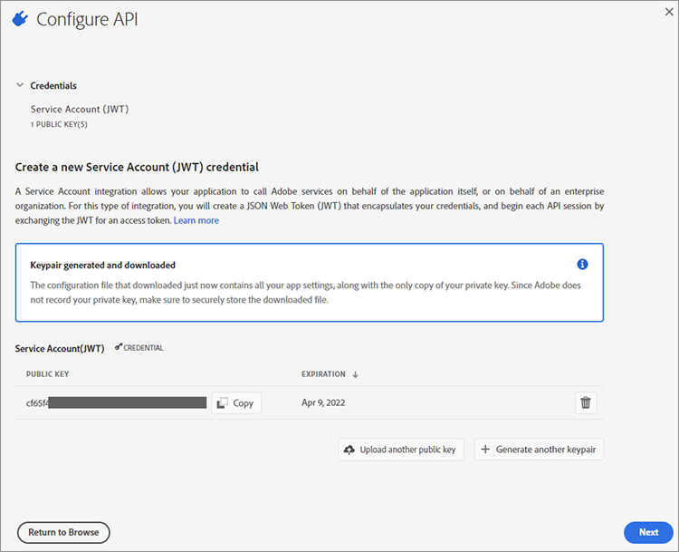

# 管理員工錄用信函


員工錄用信函是員工在您的組織中擁有的第一批體驗之一。 因此，您想要確保錄取通知是品牌化的，但是您不需要每次都從頭開始在文字處理器中建立字母。 [!DNL Adobe Acrobat Services]API 提供快速、簡單且有效的方式處理產生和傳送錄用信函給新員工 ](https://www.adobe.io/apis/documentcloud/dcsdk/employee-offer-letters.html) 的關鍵區段 [ 。

## 您可以學習哪些內容

此實作教學課程逐步設定 Node Express 專案，該專案會顯示網頁表單，供使用者填入員工詳細資訊。 這些詳細資料會在網頁上產生 [!DNL Acrobat Services] 工作信函作為 PDF，以供客戶使用Adobe Sign API簽署。

## 相關 API 和資源

* [PDF 服務API](https://opensource.adobe.com/pdftools-sdk-docs/release/latest/index.html)

* [Adobe檔產生API](https://www.adobe.io/apis/documentcloud/dcsdk/doc-generation.html)

* [Adobe Sign API](https://www.adobe.io/apis/documentcloud/sign.html)

* [檔產生 Tagger Word 增益集](https://www.adobe.io/apis/documentcloud/dcsdk/docs.html?view=docgen-addin)

* [專案範例](https://www.adobe.io/apis/documentcloud/dcsdk/employee-offer-letters.html)

## 快速入門

[Node.js ](https://nodejs.org/) 是程式設計平臺。 隨附一組龐大的資料庫，例如 Express 網頁伺服器。 [下載 Node.js ](https://nodejs.org/en/download/) 並依照步驟安裝這個絕佳的開放原始碼開發環境。

若要在 Node.js 中使用Adobe檔產生API，請前往 [ 「檔產生API ](https://www.adobe.io/apis/documentcloud/dcsdk/doc-generation.html) 」網站存取您的帳戶或註冊新的帳戶。 您的帳戶 [ 可以免費使用 6 個月，每次 ](https://www.adobe.io/apis/documentcloud/dcsdk/pdf-pricing.html) 檔交易只要 $0.05，因此您可以免風險試用，然後只會隨著公司成長支付。

登入 [ Adobe Developer Console ](https://console.adobe.io/tw) 後，按一下「 **[!UICONTROL 建立新專案」]** 。 依預設，該專案命名為「專案 1」。 按一下「 **[!UICONTROL 編輯專案」]** 按鈕，然後將名稱變更為「Offer Letter Generator」。 畫面中央是「 **[!UICONTROL 使用您的新專案]** 」區段開始使用」 若要為您的專案啟用安全性，請採取下列步驟：

按一下 **「新增API** 」。 您會看到一些 API 可供選擇。 在「 **[!UICONTROL 依產品篩選」]** 區段中，選 **[!UICONTROL 取「Document Cloud]** 」，然後按一下「 **[!UICONTROL 下一步」]** 。

現在，請產生認證以存取API。 認證的格式為 JSON Web Token （ [ JWT ](https://jwt.io/) ）：安全通訊的開放標準。 如果您熟悉 JWT 且已產生金鑰，您可以在這裡上傳公開金鑰。 或者，請選取 **Option 1** ，讓Adobe為您產生金鑰。



按一下「 **[!UICONTROL 產生按鍵」]** 按鈕。 您可以下載 config.zip 檔案。 解壓縮封存檔案。 其中包含兩個檔案：certificate_pub.crt 和 private.key。 確保後者安全無虞，因為後者包含您的私人認證，且可能會用於在超出您的控制範圍的情況下產生挑剔的檔。

按一下「**[!UICONTROL 下一步]**」。否，啟用對 PDF 產生API的存取權。 在「 **[!UICONTROL 選取產品描述檔」畫面上]** ，檢查 **[!UICONTROL 「企業 PDF 服務開發人員]** 」，然後按一下「 **[!UICONTROL 儲存已設定的API]** 」按鈕。 現在您已準備好開始使用API。

## 設定專案

設定節點專案以執行您的程式碼。 此範例使用 [ Visual Studio Code ](https://code.visualstudio.com/) （VS Code） 做為編輯器。 建立名為「字母產生器」的檔案夾，然後在 VS Code 中開啟。 從「 **[!UICONTROL 檔案」選]** 單中，選取 **[!UICONTROL 「終端機]** \> **[!UICONTROL 新終端機]** 」，以在此檔案夾中開啟殼層。 輸入下列專案，檢查節點是否安裝在路徑上：

```
node -v
```

您應該會看到您安裝的節點版本。

現在您已安裝開發環境，您可以繼續建立專案。

首先，使用節點封裝管理員 （npm） 初始化專案。 輸入下列內容：

```
npm init
```

系統會詢問您關於節點專案的一些問題。 您可以略過上述大多數問題，但請確定專案名稱為「letter-generator」，且專案專案位於 **index.js** 。 選取 **「是** 」以完成專案初始化。

您現在有一個 package.json 檔案。 節點會使用此檔案來組織您的專案。 在建立 index.js 之前，您必須先新增下列Adobe資料庫
命令：

```
npm install --save @adobe/documentservices-pdftools-node-sdk
```

專案中應該會新增一個名為「node_modules的新資料夾。 此檔案夾是下載所有資料庫 （在節點中稱為相依性） 的地方。 package.json 檔案也會以「Adobe PDF服務」的參考資訊進行更新。

現在，您想要將 Express 安裝為輕量網頁架構。 輸入下列命令：

```
npm install express –save
```

和以前一樣，package.json 的相依性區段也會隨之更新。

## 建立錄取通知範本

現在，在專案根目錄中，建立一個名為「app.js」的檔案。 讓我們將下列入門代碼放入其中：

```
const express = require('express');
const bodyParser = require('body-parser');
const PDFToolsSdk = require('@adobe/documentservices-pdftools-node-sdk')
const path = require('path');
const app = express();
const port = 8000;
app.use(bodyParser.urlencoded({ extended: true }));
app.get('/', (req, res) => {
res.sendFile(path.join(__dirname + '/index.html'));
});
app.post('/', (req, res) => {
console.log('Got body:', req.body);
res.sendStatus(200);
});
app.listen(port, () => {
console.log(`Candidate offer letter app listening on port ${port}!`)
});
```

請注意，取得路由會傳回 index.html **** 檔案。 讓我們建立一個具有該名稱和以下簡單表格的 HTML 檔案。 您可以在稍後看到適合的 CSS 樣式和其他設計項目。 此表單會提供應聘者產生歡迎信的基本詳細資訊：

```
<!DOCTYPE html>
<html lang="en">
<head>
<meta charset="UTF-8">
<meta http-equiv="X-UA-Compatible" content="IE=edge">
<meta name="viewport" content="width=device-width, initial-scale=1.0">
<title>Offer Letter Generator</title>
</head>
<body>
<h1>Enter Candidate Details</h1>
<form action="" method="post">
<div>
<label for="firstname">First name: </label>
<input type="text" name="firstname" id="firstname" required>
</div>
<div>
<label for="lastname">Last name: </label>
<input type="text" name="lastname" id="lastname" required>
</div>
<div>
<label for="salary">Salary ($): </label>
<input type="number" name="salary" id="salary" required>
</div>
<div>
<label for="startdate">Start Date: </label>
<input type="date" name="startdate" id="startdate" required>
</div>
<div>
<input type="submit" value="Generate Letter">
</div>
</form>
</body>
</html>
```

使用下列命令執行網頁伺服器：

```
node app.js
```

您應該會看到「應聘者錄取通知應用程式在埠 8000 上聆聽」訊息。 如果您開啟瀏覽器， <http://localhost:8000/> 表單應如下所示：


請注意，表單貼文會自行顯示。 如果填寫資料並按一下 **「產生字母」，** 您應該會在主控台上看到下列資訊：

```
Got body: { firstname: 'John',
lastname: 'Doe',
salary: '887888',
startdate: '2021-04-01' }
```

您會使用網頁服務呼叫來取代此主控台記錄。 [!DNL Acrobat Services]首先，您必須根據 JSON 建立資訊模型。 此模型的格式如下所示：

```
{
    "offer_letter": {
    "firstname": "John",
    "lastname": "Doe",
    "salary": "887888",
    "startdate": "2021-04-01"
    }
}
```

您可以視需要讓這個模型更加精緻，但是對於這個教學課程，請使用這個簡單範例。 此表單沒有驗證，因為這超出本文的範疇。 若要將表格內文轉換為上述資料模型，請變更 app.post 處理常式方法，以擁有下列程式碼：

```
app.post('/', (req, res) => {
const docModel = {'offer_letter': req.body};
generateLetter(docModel);
res.sendStatus(200);
});
```

第一行可將 JSON 資料轉換為所需的格式。 現在，您將此資料傳遞至 generateLetter 函式。 停止您的伺服器，並在 app.js 結尾貼上下列程式碼。 此程式碼會將 Word 檔作為範本，並以 JSON 檔中的資訊填入預留位置。

```
// Letter generation function
function generateLetter(jsonDataForMerge) {
try {
// Initial setup, create credentials instance.
const credentials = PDFToolsSdk.Credentials
.serviceAccountCredentialsBuilder()
.fromFile("pdftools-api-credentials.json")
.build();
// Create an ExecutionContext using credentials
const executionContext = PDFToolsSdk.ExecutionContext.create(credentials);
// Create a new DocumentMerge options instance
const documentMerge = PDFToolsSdk.DocumentMerge,
documentMergeOptions = documentMerge.options,
options = new documentMergeOptions.DocumentMergeOptions(jsonDataForMerge,
documentMergeOptions.OutputFormat.PDF);
// Create a new operation instance using the options instance
const documentMergeOperation = documentMerge.Operation.createNew(options)
// Set operation input document template from a source file.
const input = PDFToolsSdk.FileRef.createFromLocalFile(
'resources/OfferLetter-Template.docx');
documentMergeOperation.setInput(input);
// Execute the operation and Save the result to the specified location.
documentMergeOperation.execute(executionContext)
.then(result => result.saveAsFile('output/OfferLetter.pdf'))
.catch(err => {
if(err instanceof PDFToolsSdk.Error.ServiceApiError
|| err instanceof PDFToolsSdk.Error.ServiceUsageError) {
console.log(
'Exception encountered while executing operation', err);
} else {
console.log(
'Exception encountered while executing operation', err);
}
});
} catch (err) {
console.log('Exception encountered while executing operation', err);
}
}
```

那裡有許多解封程式碼。 我們先做主控一部分：、 `documentMergeOperation`本區段可讓您擷取 JSON 資料，並將其與 Word 檔範本合併。 您可以在 Adobe 網站上 ](https://www.adobe.io/apis/documentcloud/dcsdk/doc-generation.html#sample-blade) 使用 [ 範例做為參考，但是讓我們建立您自己的簡單範例。開啟 Word 並建立新的空白檔。 您可以根據需要自訂，但至少具有以下功能：

親愛的 X，

我們很樂意為您提供$X一年的位置。 您的起始日期為 X。

歡迎

將檔另存為「OfferLetter-Template.docx」，並儲存在專案根目錄中名為「resources」的檔案夾中。 請注意檔中的三個 X。 這些 X 是 JSON 資訊的臨時預留位置。 雖然您可以使用特殊語法來取代這些預留位置，Adobe提供可簡化此任務的 Word 增益集。 若要安裝增益集，請前往 Adobe [ Document Generation Tagger Word 増增益集 ](https://www.adobe.io/apis/documentcloud/dcsdk/docs.html?view=docgen-addin) 網站。

在 OfferLetter-Template 中，按一下新的 **「檔產生」** 按鈕。 側邊面板隨即開啟。 按一下「**開始使用**」。系統會為您提供要貼上範例 JSON 資料的文字區域。 從上方將 JSON 的「offer-data」片段複製到文字區域。 其看起來應如下所示：


按一下「 **產生標籤」** 按鈕。 您有標籤的下拉式選單，可插入檔中的適當點。 反白標示檔中的第一個 X，然後選取 **[!UICONTROL 第一個名稱]** 。 按一下 **[!UICONTROL 「插入文字]** 」，「親愛的 X」變更為「親愛的 ```{{`offer_letter`.firstname}}``` 」。 此標籤為正確格式，適用于 `documentMergeOperation` 。 請繼續進行，並在適當的 X 上新增其餘三個標籤。 不要忘記儲存 OfferLetter-template.docx。 看起來應該像這樣：

親愛的 ```{{`offer_letter`.firstname}} {{`offer_letter`.lastname}}```

我們很樂意為您提供每年 $ ```{{`offer_letter`.salary}}``` 的優惠方案。 您的開始日期為 ```{{`offer_letter`.startdate}}``` 。

歡迎

現在 Word 範本的標記符合 JSON 格式。 例如， ```{{`offer_letter`.`firstname`}}``` 在 Word 檔的開頭，會被 JSON 資料的「firstname」區段中的值所取代。

回到您的 `generateLetter` 功能。 為了保護您的 REST 呼叫，請在專案根目錄中建立標題為 pdftools-api-credentials.json 的新檔案。 貼上下列 JSON 資料，並從開發 ](https://console.adobe.io/tw) 人員主控台的服務帳戶 （JWT） 區段 [ 進行詳細資料調整。

```
{
"client_credentials": {
"client_id": "<YOUR_CLIENT_ID>",
"client_secret": "<YOUR_CLIENT_SECRET>"
},
"service_account_credentials": {
"organization_id": "<YOUR_ORGANIZATION_ID>",
"account_id": "<YOUR_TECHNICAL_ACCOUNT_ID>",
"private_key_file": "<PRIVATE_KEY_FILE_PATH>"
}
}
```

* 您可直接從主控台的 **[!UICONTROL 「認證詳細資料]** 」區段複製用戶端 ID、用戶端密碼和組織 ID。

* 帳戶 ID 是 **技術帳戶 ID** 。

* 複製先前在專案中產生的 private.key 檔案，並在專案中的「private_key_file」區段中輸入其名稱
pdftools-api-credentials.json 檔案。 如有希望，您可以在這裡放置私密金鑰檔案的路徑。 請記得確保安全，因為一旦超出您的控制範圍，可能會使用錯誤。

若要產生含有已填寫 JSON 資料的 PDF，請返回「 **[!UICONTROL 輸入應聘者詳細資料]** 」網頁表單，然後發佈一些資料。 由於必須從 Adobe 下載檔案，因此需要花一點時間，但您應該將標題為 OfferLetter.pdf 的檔案放入標題為輸出的新資料夾中。

## 後續步驟

就是這樣！ 這只是一個開始。 如果您研究 Word 增益集「檔產生」索引標籤的「進階」區段，您會注意到並非所有預留位置標記都來自相關的 JSON 資料。 您也可以新增簽名標籤。 這些標籤可讓您將產生的檔上傳至 [ Adobe Sign ](https://acrobat.adobe.com/ca/en/sign.html) ，以傳送給新員工並進行簽署。 閱讀 Adobe Sign API 快速入門，瞭解如何進行。 此程式很類似，因為您使用的是以 JWT 字元保護的 REST 呼叫。

當組織必須 [ 跨多個地點雇用 ](https://www.adobe.io/apis/documentcloud/dcsdk/employee-offer-letters.html) 季節性員工時，可以將上述的單一檔範例作為申請的基礎。 如所示，主要流程是透過線上應用程式從求職者獲取資料。 資料用於填入錄用信函的欄位，並傳送以索取電子簽名。

[!DNL Adobe Acrobat Services] 可免費使用 6 個月，每 [ ](https://www.adobe.io/apis/documentcloud/dcsdk/pdf-pricing.html) 份檔交易只需支付 $0.05，因此您可以隨業務成長嘗試並擴充錄取通知工作流程。 開始 [ 使用 ](https://www.adobe.io/apis/documentcloud/dcsdk/gettingstarted.html)
建立您自己的範本， [ 註冊您的開發人員帳戶 ](https://www.adobe.io/) 。
