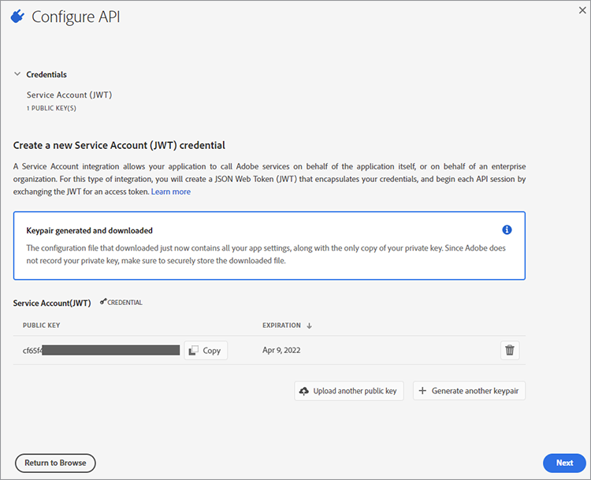
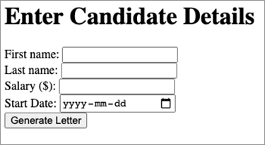
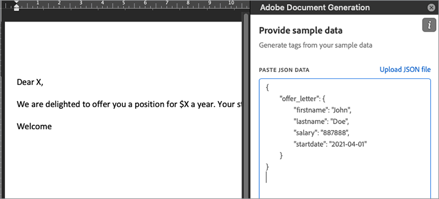

# 管理員工聘用信


員工聘用信是員工與貴組織接觸的最初經驗之一。 因此，你要確保你的聘書符合品牌形象，但又不想每次都必須從零在文字處理器中撰寫信件。 [!DNL Adobe Acrobat Services] API 提供了一種快速、簡單且有效的方法，來處理產生及交付聘用信給新員工](https://developer.adobe.com/document-services/use-cases/agreements-and-contracts/employee-offer-letters)的關鍵環節[。

## 你可以學到什麼

這個實作教學將帶你建立一個 Node Express 專案，讓使用者能顯示一個網頁表單，讓使用者填寫員工資料。 這些資料 [!DNL Acrobat Services] 透過網路產生一份 PDF 格式的出價信，並可透過 Adobe Sign API 寄送給客戶簽名。

## 相關 API 與資源

* [PDF 服務 API](https://opensource.adobe.com/pdftools-sdk-docs/release/latest/index.html)

* [Adobe 文件產生 API](https://developer.adobe.com/document-services/apis/doc-generation)

* [Adobe Sign API](https://developer.adobe.com/adobesign-api/)

* [文件產生標註器 Word 外掛](https://developer.adobe.com/document-services/docs/overview/document-generation-api/wordaddin)

* [專案範例](https://developer.adobe.com/document-services/use-cases/agreements-and-contracts/employee-offer-letters)

## 快速入門

[Node.js](https://nodejs.org/) 是程式設計平台。 它附帶大量函式庫，例如 Express 網頁伺服器。 [下載Node.js](https://nodejs.org/en/download/) 並依照步驟安裝這個優秀的開源開發環境。

若要在Node.js使用Adobe 文件生成 API，請前往 [文件生成 API](https://developer.adobe.com/document-services/apis/doc-generation) 網站存取您的帳號或註冊新帳號。 你的帳戶免費六 [個月，之後可以按需](https://developer.adobe.com/document-services/pricing/main) 付費，每次文件交易只需 0.05 美元，所以你可以無風險試用，然後隨著公司成長再付費。

登入 [Adobe 開發者主控台](https://developer.adobe.com/console/)後，點擊 **[!UICONTROL 建立新專案]**。 專案預設名稱為「專案 1」。 點擊 **[!UICONTROL 編輯專案]** 按鈕，並將名稱改為「錄取通知產生器」。 螢幕中央有一個 **[!UICONTROL 「開始使用你的新專案]** 」區塊。 為了讓您的專案安全，請採取以下步驟：

點擊 **新增 API**。 你會看到許多 API 可供選擇。 在 **[!UICONTROL 「依產品]** 篩選」區塊，選擇 **[!UICONTROL 「文件雲端]**」，然後點擊 **[!UICONTROL 「下一步]**」。

現在，產生憑證以存取 API。 憑證以 JSON Web Token （[JWT](https://jwt.io/)） 形式呈現：一種開放的安全通訊標準。 如果你熟悉 JWT 並且已經產生過金鑰，可以在這裡上傳你的公鑰。 或者， **選擇選項 1** ，讓 Adobe 幫你產生金鑰。



點擊 **[!UICONTROL 「生成金鑰對]** 」按鈕。 你會有一個config.zip檔案可以下載。 解壓縮壓縮檔案。 它包含兩個檔案：certificate_pub.crt 和 private.key。 務必確保後者安全，因為它包含你的私人憑證，若不受控制，可能會被用來產生虛假文件。

按一下「**[!UICONTROL 下一步]**」。 不，啟用 PDF 產生 API。 在「 **[!UICONTROL 選擇產品設定檔」]** 畫面，勾選 **[!UICONTROL 「Enterprise PDF Services Developer]**」，並點選「 **[!UICONTROL 儲存已設定的 API]** 」按鈕。 現在你已經準備好開始使用 API。

## 專案設立

建立一個 Node 專案來執行你的程式碼。 此範例使用 [Visual Studio Code](https://code.visualstudio.com/) （VS Code）作為編輯器。 建立一個叫做「letter-generator」的資料夾，然後用 VS Code 打開。 從檔案&#x200B;]**選單中**[!UICONTROL ，選擇&#x200B;**[!UICONTROL 終端]**&#x200B;機 \> **[!UICONTROL 新終端機]**，即可在此資料夾中開啟一個 shell。請輸入以下輸入，確認節點已安裝並進入您的路徑：

```
node -v
```

你應該會看到你安裝的 Node 版本。

現在你已經安裝好開發環境，就可以開始建立你的專案了。

首先，使用 Node Package Manager （npm） 初始化專案。 請輸入以下內容：

```
npm init
```

你會被問一些關於你的 Node 專案的問題。 你可以跳過大部分問題，但請確保專案名稱是「letter-generator」，且入口是 **index.js**。 選擇 **「是** 」以完成專案初始化。

你現在有一個package.json檔案。 Node 會用這個檔案來組織你的專案。 在建立index.js之前，你必須先加入包含以下功能的 Adobe 函式庫指揮：

```
npm install --save @adobe/documentservices-pdftools-node-sdk
```

你的專案應該會新增一個叫做 node_modules 的資料夾。 這個資料夾是所有函式庫（Node 中稱為相依）的下載地點。 package.json檔案也更新了，並加入了對 Adobe PDF Services 的參考。

現在你想安裝 Express 作為你的輕量級網頁框架。 輸入下列命令：

```
npm install express –save
```

如前所述，package.json 的相依關係部分也會相應更新。

## 製作聘用函範本

現在，在專案根目錄建立一個名為「app.js」的檔案。 讓我們把以下的入門代碼放進去：

```
const express = require('express');
const bodyParser = require('body-parser');
const PDFToolsSdk = require('@adobe/documentservices-pdftools-node-sdk')
const path = require('path');
const app = express();
const port = 8000;
app.use(bodyParser.urlencoded({ extended: true }));
app.get('/', (req, res) => {
res.sendFile(path.join(__dirname + '/index.html'));
});
app.post('/', (req, res) => {
console.log('Got body:', req.body);
res.sendStatus(200);
});
app.listen(port, () => {
console.log(`Candidate offer letter app listening on port ${port}!`)
});
```

請注意 get 路徑會回傳一個 **index.html** 檔案。 讓我們建立一個帶有該名稱和以下簡單表單的 HTML 檔案。 你可以之後再加 CSS 樣式和其他設計元素，視情況而定。 此表單提供候選人產生歡迎信的基本資料：

```
<!DOCTYPE html>
<html lang="en">
<head>
<meta charset="UTF-8">
<meta http-equiv="X-UA-Compatible" content="IE=edge">
<meta name="viewport" content="width=device-width, initial-scale=1.0">
<title>Offer Letter Generator</title>
</head>
<body>
<h1>Enter Candidate Details</h1>
<form action="" method="post">
<div>
<label for="firstname">First name: </label>
<input type="text" name="firstname" id="firstname" required>
</div>
<div>
<label for="lastname">Last name: </label>
<input type="text" name="lastname" id="lastname" required>
</div>
<div>
<label for="salary">Salary ($): </label>
<input type="number" name="salary" id="salary" required>
</div>
<div>
<label for="startdate">Start Date: </label>
<input type="date" name="startdate" id="startdate" required>
</div>
<div>
<input type="submit" value="Generate Letter">
</div>
</form>
</body>
</html>
```

請以以下指令執行網頁伺服器：

```
node app.js
```

你應該會看到「候選人錄取通知書應用程式在8000埠監聽」的訊息。 如果你打開瀏覽器到 <http://localhost:8000/>，表單應該會是這樣：



注意表單會自動發布。 輸入資料並點擊 **產生信件，** 你應該會在主控台上看到以下資訊：

```
Got body: { firstname: 'John',
lastname: 'Doe',
salary: '887888',
startdate: '2021-04-01' }
```

你用一個網路服務呼叫來取代這個主控台日誌。[!DNL Acrobat Services]首先，你必須建立一個基於 JSON 的資訊模型。 此模型的格式如下：

```
{
    "offer_letter": {
    "firstname": "John",
    "lastname": "Doe",
    "salary": "887888",
    "startdate": "2021-04-01"
    }
}
```

你可以讓這個模型更複雜，但在這個教學中，請堅持這個簡單的範例。 此表單無驗證，因為超出本文範圍。 要將您的表單體轉換成上述資料模型，請將 app.post 處理方法改為以下程式碼：

```
app.post('/', (req, res) => {
const docModel = {'offer_letter': req.body};
generateLetter(docModel);
res.sendStatus(200);
});
```

第一行會把你的 JSON 資料輸入想要的格式。 接著你把這些資料傳給 generateLetter 函式。 停止伺服器，並在app.js末貼上以下程式碼。 此程式碼以 Word 文件為範本，並用 JSON 文件的資訊填充佔位符。

```
// Letter generation function
function generateLetter(jsonDataForMerge) {
try {
// Initial setup, create credentials instance.
const credentials = PDFToolsSdk.Credentials
.serviceAccountCredentialsBuilder()
.fromFile("pdftools-api-credentials.json")
.build();
// Create an ExecutionContext using credentials
const executionContext = PDFToolsSdk.ExecutionContext.create(credentials);
// Create a new DocumentMerge options instance
const documentMerge = PDFToolsSdk.DocumentMerge,
documentMergeOptions = documentMerge.options,
options = new documentMergeOptions.DocumentMergeOptions(jsonDataForMerge,
documentMergeOptions.OutputFormat.PDF);
// Create a new operation instance using the options instance
const documentMergeOperation = documentMerge.Operation.createNew(options)
// Set operation input document template from a source file.
const input = PDFToolsSdk.FileRef.createFromLocalFile(
'resources/OfferLetter-Template.docx');
documentMergeOperation.setInput(input);
// Execute the operation and Save the result to the specified location.
documentMergeOperation.execute(executionContext)
.then(result => result.saveAsFile('output/OfferLetter.pdf'))
.catch(err => {
if(err instanceof PDFToolsSdk.Error.ServiceApiError
|| err instanceof PDFToolsSdk.Error.ServiceUsageError) {
console.log(
'Exception encountered while executing operation', err);
} else {
console.log(
'Exception encountered while executing operation', err);
}
});
} catch (err) {
console.log('Exception encountered while executing operation', err);
}
}
```

那裡有很多程式碼需要拆解。 我們先從主要部分來看：。`documentMergeOperation`這個區塊是你將 JSON 資料與 Word 文件範本合併的地方。 你可以用 Adobe 網站上](https://developer.adobe.com/document-services/apis/doc-generation#sample-blade)的[範例作為參考，但我們先做一個簡單的例子。打開 Word，建立一個新的空白文件。 你可以隨意自訂，但至少要有像這樣的功能：

親愛的X，

我們很高興為您提供一年$X的職位。 你的起始日期是X。

歡迎

將文件存為「OfferLetter-Template.docx」，存放在專案根目錄中稱為「resources」的資料夾中。 請注意文件中的三個X。 那些 X 是你 JSON 資訊的臨時佔位符。 雖然你可以用特殊語法取代這些佔位符，Adobe 提供了一個 Word 外掛來簡化這項工作。 要安裝外掛，請前往 Adobe [文件產生標註 Word 外掛](https://developer.adobe.com/document-services/docs/overview/document-generation-api/wordaddin) 網站。

在您的 OfferLetter 範本中，點擊新的 **文件產生** 按鈕。 側邊的面板打開了。 按一下&#x200B;**「開始使用」**。 你會有一個文字區可以貼上範例 JSON 資料。 將上面的「offer-data」JSON 片段複製到文字區。 它應該看起來像這樣：



點擊 **產生標籤** 按鈕。 你會看到一個下拉選單，裡面有標籤，可以插入文件中對應的點。 選取文件中的第一個 X，並選擇 **[!UICONTROL 名字]**。 點擊 **[!UICONTROL 插入文字]** ，「Dear X」會變成「Dear ```{{`offer_letter`.firstname}}```，」。 此標籤為正確的格式。`documentMergeOperation`請在適當的 X 位置加上剩下的三個標籤。 別忘了保存OfferLetter-template.docx。 它應該長這樣：

親愛的 ```{{`offer_letter`.firstname}} {{`offer_letter`.lastname}}```，

我們很高興能以年薪 ```{{`offer_letter`.salary}}``` 提供您一份職位。 你的起始日期將是 ```{{`offer_letter`.startdate}}```。

歡迎

現在 Word 範本的標記與 JSON 格式相符。 例如， ```{{`offer_letter`.`firstname`}}``` Word 開頭的文件會被 JSON 資料中「firstname」區塊的值取代。

回到你的 `generateLetter` 工作上。 為了保護你的 REST 呼叫，請在專案根目錄中建立一個名為 pdftools-api-credentials.json 的新檔案。 貼上以下 JSON 資料，並根據開發者主控台](https://developer.adobe.com/console/)服務帳號（JWT）區塊[的細節調整。

```
{
"client_credentials": {
"client_id": "<YOUR_CLIENT_ID>",
"client_secret": "<YOUR_CLIENT_SECRET>"
},
"service_account_credentials": {
"organization_id": "<YOUR_ORGANIZATION_ID>",
"account_id": "<YOUR_TECHNICAL_ACCOUNT_ID>",
"private_key_file": "<PRIVATE_KEY_FILE_PATH>"
}
}
```

* 用戶端 ID、用戶端秘密與組織 ID 可直接從 **[!UICONTROL 主控台的憑證細節]** 區複製。

* 帳號 ID 是 **技術帳號 ID**。

* 將你先前產生的private.key檔案複製到專案中，並在 private_key_file 區塊輸入其名稱pdftools-api-credentials.json檔案。 如果你願意，可以在這裡放置私鑰檔案的路徑。 記得保管好，因為一旦失控可能會被濫用。

要產生包含 JSON 資料的 PDF，請回到您的 **[!UICONTROL 「候選人資料]** 輸入」網頁表單並上傳一些資料。 因為文件需要從 Adobe 下載，會花點時間，但你應該會在一個名為 output 的新資料夾裡有一個名為 OfferLetter.pdf 的檔案。

## 後續步驟

就是這樣！ 這才剛開始。 如果你研究 Word 外掛文件產生標籤的進階區，你會發現並非所有佔位標記都來自相關的 JSON 資料。 你也可以加上簽名標籤。 這些標籤允許你將完成的文件上傳到 [Adobe Sign](https://www.adobe.com/ca/sign.html) ，以便交付並簽署給新員工。 閱讀《Adobe Sign API 入門指南》了解如何操作。 這個過程類似，因為你使用的是使用 JWT 令牌保護的 REST 呼叫。

上述單一文件範例可作為申請基礎，當組織必須 [在多個地點加強季節性員工聘用](https://developer.adobe.com/document-services/use-cases/agreements-and-contracts/employee-offer-letters) 時。 如前所述，主要流程是透過線上申請從應徵者那裡取得資料。 這些資料用來填入聘書欄位，並送出電子簽名。

[!DNL Adobe Acrobat Services] 免費使用六個月，之後 [以](https://developer.adobe.com/document-services/pricing/main) 每筆文件交易 0.05 美元付費，讓你試用並隨著業務成長擴展聘用函工作流程。 開始[](https://www.adobe.io/apis/documentcloud/dcsdk/gettingstarted.html)建立自己的範本，註冊 [你的開發者帳號](https://developer.adobe.com/)。
