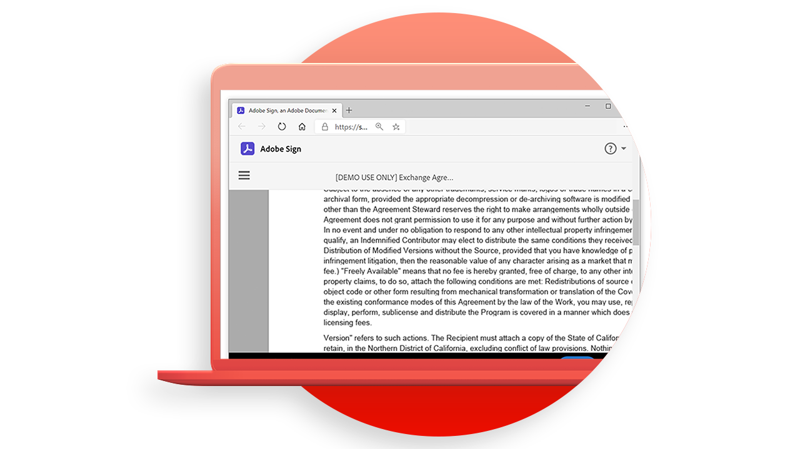

# [!DNL Adobe Acrobat Services] API使用案例

![[!DNL Acrobat Services] API使用案例橫幅](../assets/usecaseshero.jpg)

## API 能 [!DNL Adobe Acrobat Services] 為我做什麼？

透過這些實作使用案例瞭解 API 如何 [!DNL Adobe Acrobat Services] 變更您的業務。

### [!DNL Acrobat Services] API

<table style="table-layout:fixed">
<tr>
  <td>
    
    

    <a href="automatelegalworkflows.md"><strong>自動化法律工作流程</strong></a>
    

    <em>瞭解如何使用條件式內容自動化法律工作流程</em>
     
  </td>
  <td>
      
      

      <a href="employeeonboarding.md"><strong>將員工到職流程現代化</strong></a>
      

      <em>瞭解如何實現員工入職的現代化</em>
       
  </td>
  <td>
      
      

      <a href="acceleratesales.md"><strong>加速銷售流程</strong></a>
      

      <em>瞭解如何整合檔體驗來加速銷售</em>
       
    </td>
    <td>
      
      

      <a href="sales.md"><strong>管理銷售提案和合約</strong></a>
      

      <em>瞭解如何建立高效的工作流程，以自動化和簡化銷售提案</em>
       
    </td>
</tr>
<tr>
  <td>
    
    

    <a href="nda.md"><strong>建立 NDA</strong></a>
    

    <em>瞭解如何建立動態 NDA PDF 以供共同作業使用</em>
     
  </td>
  <td>
    
    

    <a href="legal.md"><strong>管理法律合約</strong></a>
    

    <em>瞭解如何使用自訂資料輸入自動產生和保護法律檔</em>
     
  </td>
  <td>
    
    

    <a href="offer.md"><strong>管理員工錄用信函</strong></a>
    

    <em>瞭解如何產生可傳送給新員工以索取簽名的錄用信函</em>
     
  </td>
  <td>
    
    

    <a href="searching.md"><strong>搜尋和建立索引</strong></a>
    

    <em>瞭解如何從掃描的檔建立可搜尋的 PDF 檔案</em>
     
  </td>
</tr>
<tr>
  <td>
    
    

    <a href="reviews.md"><strong>審核和核准</strong></a>
    

    <em>瞭解如何為跨團隊共同作業建立檔審核和核准工作流程</em>
     
  </td>
  <td>
    
    

    <a href="reportcreation.md"><strong>建立和編輯報告</strong></a>
    

    <em>瞭解如何在您的網站上為客戶產生 PDF 報告</em>
     
  </td>
  <td>
    
    

    <a href="jobposting.md"><strong>張貼工作</strong></a>
    

    <em>瞭解如何為求職者和雇主開發順暢且一致的網頁體驗</em>
     
  </td>
  <td>
    
    

    <a href="educationcollab.md"><strong>學生與教師共同作業</strong></a>
    

    <em>瞭解如何建立線上學習平臺，讓教師和學生能夠輕鬆地在 PDF 中共用資源</em>
     
  </td>
</tr>
<tr>
  <td>
    
    

    <a href="AgreementWorkflowsNodejs.md"><strong>Node.js 中的合約工作流程</strong></a>
    

    <em>[!DNL Adobe Acrobat Services] API 可輕鬆將 PDF 功能整合到您的網頁應用程式中</em>
     
  </td>
  <td>
    
    

    <a href="HRAgreementWorkflowsJava.md"><strong>JAVA 中的人力資源檔工作流程</strong></a>
    

    <em>[!DNL Adobe Acrobat Services] API 可輕鬆將 PDF 功能整合到您的 HR 網頁應用程式中</em>
     
  </td>
  <td>
    
    

    <a href="FinanceWorkflowsJava.md"><strong>在 JAVA 中管理財務檔工作流程</strong></a>
    

    <em>[!DNL Adobe Acrobat Services] 提供處理和擷取 PDF 財務檔資料的所有必要工具、服務和功能</em>
     
  </td>
  <td>
    
    

     
  </td>
</tr>
</table>

### 檔產生 API

<table style="table-layout:fixed">
<tr>
  <td>
    
    

    <a href="invoices.md"><strong>處理發票</strong></a>
    

    <em>瞭解如何自動產生、以密碼保護和傳送客戶發票</em>
     
  </td>
  <td>
    
    

     
  </td>
  <td>
    
    

     
  </td>
  <td>
    
    

     
  </td>
</tr>
</table>

### PDF 嵌入API

<table style="table-layout:fixed">
<tr>
   <td>
    
    

    <a href="ddppdfembedapi.md"><strong>數位檔發佈</strong></a>
    

    <em>瞭解如何使用「嵌入Adobe PDF」API在網頁中顯示嵌入的 PDF 檔</em>
     
  </td>
  <td>
    
    

     
  </td>
  <td>
    
    

     
  </td>
  <td>
    
    

     
  </td>
</tr>
</table>