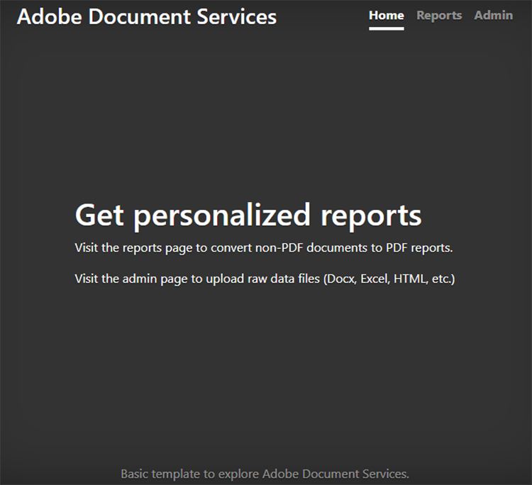
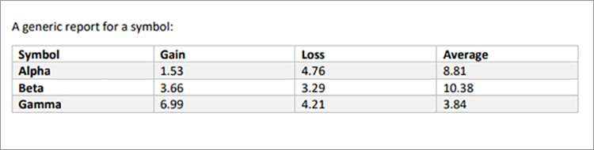

# 建立和編輯報告


金融、教育、行銷和其他產業都使用 PDF 與客戶和利益相關者共用資料。 PDF 讓您輕鬆共用豐富的檔，並提供表格、圖形和互動式內容，這種格式每個人都能檢視。 [!DNL Adobe Acrobat Services] API 可協助這些公司從 Microsoft Word、Microsoft Excel、圖形和其他多樣化的檔案格式產生可共用的 PDF 報告。

假設您 [ 經營著一家社交媒體追蹤公司 ](https://www.adobe.io/apis/documentcloud/dcsdk/on-demand-report-creation.html) 。 您的客戶會登入受密碼保護的網站，以檢視他們的行銷活動分析。 通常，他們想將這些統計資料與其高階主管、臨時組織、捐助者或其他利益相關者分享。 可下載的 PDF 檔是客戶共用數位、圖表等的絕佳方式。

透過將 [ PDF Services API ](https://www.adobe.io/apis/documentcloud/dcsdk/pdf-tools.html) 整合到您的網站，您就可以隨時隨地為每位客戶產生 PDF 報告。 您可以建立 PDF，然後將它們合併為一份便利的單一報告，供客戶下載並傳遞給相關人員。

## 您可以學習哪些內容

在此實作教學課程中，瞭解如何在 Node.js 和 Express.js 環境中使用 PDF Services SDK （僅包含一些JavaScript、HTML 和 CSS），以快速且輕鬆地將 PDF 型功能新增至現有網站。 此網站提供管理員上傳報告的頁面，客戶檢視可用報告清單並選取要轉換為 PDF 的檔的區域，以及下載系統所產生 PDF 的實用端點。

## 相關 API 和資源

* [PDF 服務API](https://opensource.adobe.com/pdftools-sdk-docs/release/latest/index.html)

* [PDF 嵌入API](https://www.adobe.com/devnet-docs/dcsdk_io/viewSDK/index.html)

## Campaign報告客戶的儀表板

>[!NOTE]
>
>本教學課程不論是 Node.js 的最佳實務，或如何保護您的網頁應用程式。 網站的某些區域公開供公開使用，檔命名可能不易製作。 若要討論設計這樣的系統的最佳方法，請諮詢您的架構者和工程師。

這裡，您有基本的 Express.js 網頁應用程式，其中包含客戶報告區域和管理員區段。 此應用程式可展示社交媒體行銷活動的報告。 例如，它可以證明廣告的點按次數。



您可以從 [ GitHub 儲存庫 ](https://github.com/afzaal-ahmad-zeeshan/express-adobe-pdf-tools) 下載此專案。

現在，讓我們來探索如何發佈報告。

## 上傳報告

若要保持簡單，請僅使用此處的檔案系統式上傳和處理。 在 Express.js 中，您可以使用 fs 模組，列出目錄下所有可用的檔案。

在同一頁面上，讓管理員將報告檔案上傳至伺服器，以供客戶查看。 這些檔案可以採用許多不同格式，例如 Microsoft Word、Microsoft Excel、HTML [ 和其他資料格式 ] HTTPs://opensource.adobe.com/pdftools-sdk-docs/release/latest/howtos.html#create-a-pdf），包括圖形檔案。 管理員頁面如下所示：


>[!NOTE]
>
>使用密碼保護您的 URL，或從下午 npm 開始使用護照套件，在驗證和授權層後面保護您的應用程式。

當管理員選取並上傳檔案時，該檔案會移至其他人可存取的公用儲存庫。 您使用相同的儲存庫從管理頁面發佈檔，並列出可供客戶使用的行銷報告。 此程式碼為：

```
router.get('/', (req, res) => {
try {
let files = fs.readdirSync('./public/documents/raw') // read the files
res.status(200).render("reports", { page: 'reports', files: files });
} catch (error) {
res.status(500).render("crash", { error: error });
}
});
```

此程式碼會列出所有檔案，並演算檔案清單的檢視。

## 選取報告

在使用者方面，您有一份表單供客戶在社交媒體行銷活動報告中選取要包含的檔。 簡單來說，在範例頁面上，僅顯示檔案名稱和選取檔的核取方塊。 客戶可以選取單一報告或多個報告，以合併到單一 PDF 檔中。

若要獲得更進階的使用者介面，您也可以在這裡顯示報告的預覽。


## 產生 PDF 報告

使用 PDF Services SDK 從資料輸入建立 PDF 報告。 如上述螢幕擷圖所示）資料可能來自各種資料格式，例如 Microsoft Word、Microsoft Excel、HTML、圖形等。 先安裝 PDF Services SDK 的 npm 套件。

```
$ npm install --save @adobe/documentservices-pdftools-node-sdk
```

在開始之前，您必須先擁有API憑證， [ Adobe免費試用 ](https://opensource.adobe.com/pdftools-sdk-docs/release/latest/index.html#getcred) 。 免費使用您的 [!DNL Acrobat Services] 帳戶 [ 6 個月，每次 ](https://www.adobe.io/apis/documentcloud/dcsdk/pdf-pricing.html) 檔交易只要 \$0.05，直接付款。

下載封存檔案，並擷取 JSON 檔案以取得認證和私密金鑰。 在範例專案中，您將檔案放置在 src 目錄中。


現在您已設定認證，就可以寫入 PDF 轉換工作。 對於此示範，您有兩個必須在應用程式中執行的操作：

* 將原始檔案轉換為 PDF 檔案

* 在單一報告中合併多個 PDF 檔案

整體程式與執行任何操作的程式相似。 唯一的差異是您使用的服務。 在下列程式碼中，將原始檔案轉換為 PDF 檔案：

```
async function createPdf(rawFile, outputPdf) {
try {
// configurations
const credentials = adobe.Credentials
.serviceAccountCredentialsBuilder()
.fromFile("./src/pdftools-api-credentials.json")
.build();
// Capture the credential from app and show create the context
const executionContext = adobe.ExecutionContext.create(credentials),
operation = adobe.CreatePDF.Operation.createNew();
// Pass the content as input (stream)
const input = adobe.FileRef.createFromLocalFile(rawFile);
operation.setInput(input);
// Async create the PDF
let result = await operation.execute(executionContext);
await result.saveAsFile(outputPdf);
} catch (err) {
console.log('Exception encountered while executing operation', err);
}
}
```

在上面的程式碼中，您讀取認證並建立執行內容。 PDF Services SDK 需要執行內容才能驗證您的要求。

然後，執行「建立 PDF」作業，將原始檔案轉換為 PDF 格式。 最後，您可以使用 `outputPdf` 參數來複製 PDF 報告。 在程式碼範例中，您可以在 src/helpers/pdf.js 檔案下找到此代碼。 稍後在此教學課程中，您會讀入 PDF 模組並呼叫此方法。

如上一節所示，您的客戶可以前往下列頁面，選取要轉換為 PDF 的報告：


當客戶選取其中一或多個報告時，您就會建立 PDF 檔案。

首先，讓我們看看單一 PDF 檔案的實際運作。 當使用者選取單一報告時，您只需要將其轉換為 PDF 並提供下載連結。

```
try {
console.log(`[INFO] generating the report...`);
await pdf.createPdf(`./public/documents/raw/${reports}`, `./public/documents/processed/output.pdf`);
console.log(`[INFO] sending the report...`);
res.status(200).render("download", { page: 'reports', filename: 'output.pdf' });
} catch(error) {
console.log(`[ERROR] ${JSON.stringify(error)}`);
res.status(500).render("crash", { error: error });
}
```

此程式碼會建立報告，並與客戶共用下載URL。 輸出網頁如下：


輸出 PDF 如下：



客戶可以選取多個檔案來產生合併報告。 當客戶選取多個檔時，您會執行兩項作業：第一個作業會為每份檔建立部分 PDF，第二個則會將其合併為單一 PDF 報告。

```
async function combinePdf(pdfs, outputPdf) {
try {
// configurations
const credentials = adobe.Credentials
.serviceAccountCredentialsBuilder()
.fromFile("./src/pdftools-api-credentials.json")
.build();
// Capture the credential from app and show create the context
const executionContext = adobe.ExecutionContext.create(credentials),
operation = adobe.CombineFiles.Operation.createNew();
// Pass the PDF content as input (stream)
for (let pdf of pdfs) {
const source = adobe.FileRef.createFromLocalFile(pdf);
operation.addInput(source);
}
// Async create the PDF
let result = await operation.execute(executionContext);
await result.saveAsFile(outputPdf);
} catch (err) {
console.log('Exception encountered while executing operation', err);
}
}
```

此方法可在 src/helpers/pdf.js 檔案下方使用，並在模組轉存中顯示。

```
try {
console.log(`[INFO] creating a batch report...`);
// Create a batch report and send it back
let partials = [];
for (let index in reports) {
const name = `partial-${index}-${reports[index]}`;
await pdf.createPdf(`./public/documents/raw/${reports[index]}`, `./public/documents/processed/${name}`);
partials.push(`./public/documents/processed/${name.replace('docx', 'pdf').replace('xlsx', 'pdf')}`);
}
await pdf.combinePdf(partials, `./public/documents/processed/output.pdf`);
console.log(`[INFO] sending the combined report...`);
res.status(200).render("download", { page: 'reports', filename: 'output.pdf' });
} catch(error) {
console.log(`[ERROR] ${JSON.stringify(error)}`);
res.status(500).render("crash", { error: error });
}
```

此程式碼會為多個輸入檔產生編譯報告。 唯一新增的 `combinePdf` 功能是使用 PDF 檔案路徑名稱清單並傳回單一輸出 PDF 的方法。

現在，您的社交媒體儀表板客戶可以從其帳戶中選取相關報告，並將其下載為一份便利的 PDF。 此儀表板可讓他們以普遍容易開啟的格式顯示管理活動及其他利害關係人、其行銷活動的成功與資料、表格和圖表。

## 後續步驟

本實作教學課程介紹如何使用 PDF Services API，協助客戶輕鬆分享 PDF 以下載相關報告。 您建立了 Node.js 應用程式，展示 PDF Services API PDF 報告和閱讀服務的功能。 應用程式示範了您的客戶如何下載單一報告檔，或將多個檔合併併合並為單一 PDF 報告。

此Adobe提供的應用程式可協助社交媒體 [ 儀表板客戶 ](https://www.adobe.io/apis/documentcloud/dcsdk/on-demand-report-creation.html) 取得及分享所需的報告，而不必擔心收件者是否都已在其裝置上安裝 Microsoft Office 或其他軟體。 您可以在自己的應用程式中使用相同的技術，協助使用者檢視、合併和下載檔案。 或者，查看Adobe許多其他 API 來新增和追蹤簽名等。

若要開始使用，請申請免費 [[!DNL Adobe Acrobat Services] ](https://www.adobe.io/apis/documentcloud/dcsdk/gettingstarted.html) 帳戶，然後為您的員工和客戶建立引人入勝的報告體驗。免費使用帳戶 6 個月，然後 [ 隨著行銷工作擴展，可隨即付費 ](https://www.adobe.io/apis/documentcloud/dcsdk/pdf-pricing.html) ，每份檔交易只需 \$0.05。
