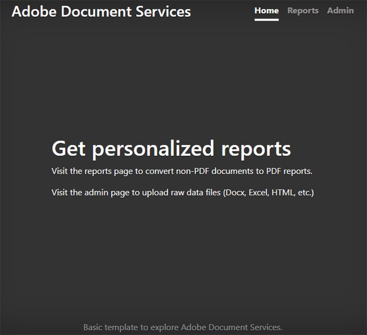
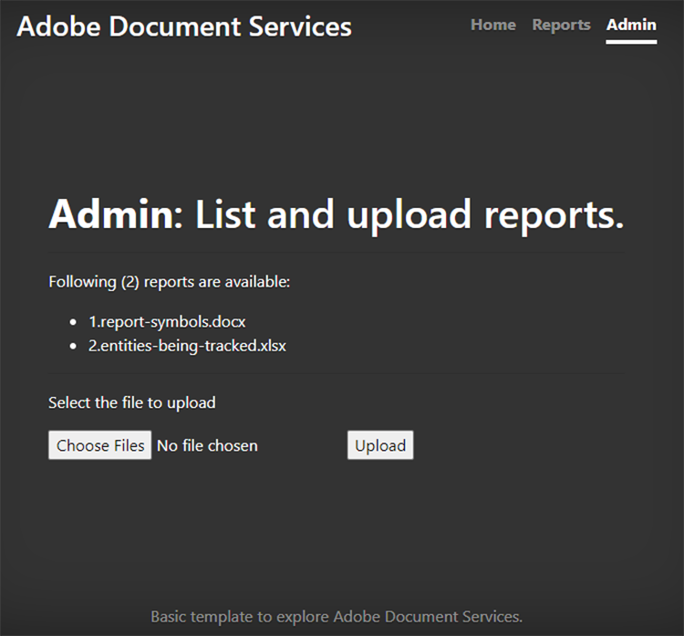
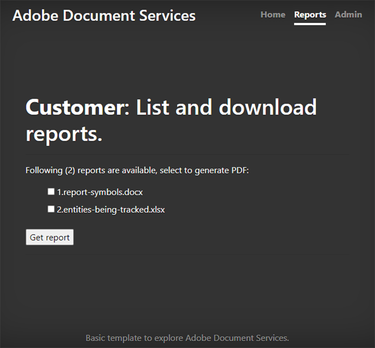
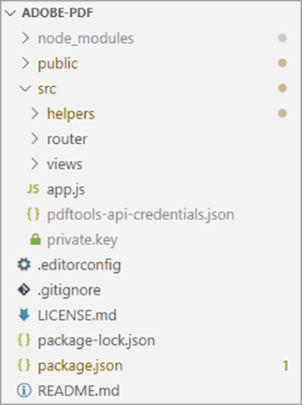
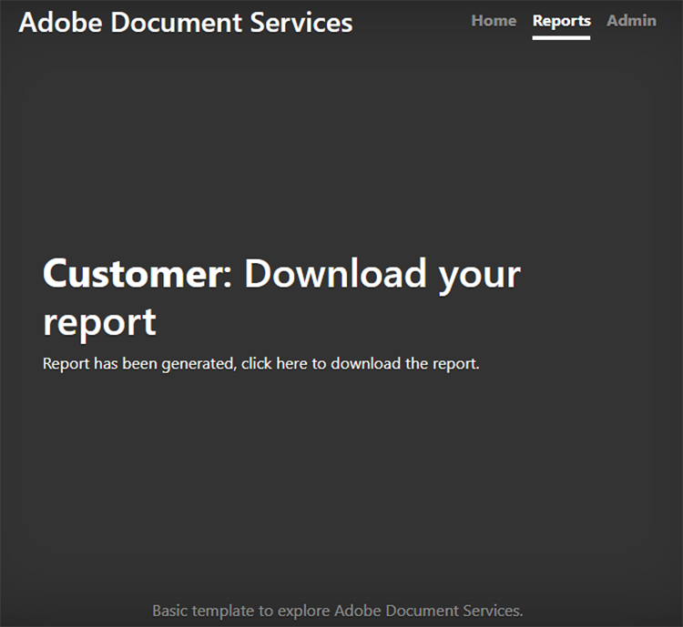
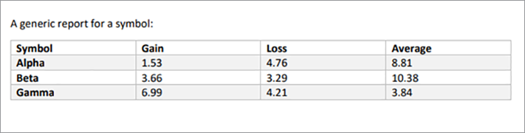

# 報表建立和編輯


金融、教育、市場營銷和其他行業使用PDF與客戶和利益相關方共用資料。 PDF使用表格、圖形和互動式內容以每個人都可以查看的格式輕鬆共用富文檔。 [!DNL Adobe Acrobat Services]個API可幫助這些公司生成來自MicrosoftWord、MicrosoftExcel、圖形和其他不同文檔格式的可共用PDF報告。

假設您[運行社交媒體跟蹤公司](https://developer.adobe.com/document-services/use-cases/content-publishing/on-demand-report-creation)。 您的客戶登錄到站點中受密碼保護的部分，以查看其市場活動分析。 通常，他們希望與高管、股東、捐贈者或其他利益相關方分享這些統計資料。 可下載的PDF文檔是您的客戶共用數字、圖表等的絕佳方式。

通過將[PDF服務API](https://developer.adobe.com/document-services/apis/pdf-services)合併到您的網站中，您可以為每個客戶在旅途中生成PDF報告。 您可以建立PDF，然後將它們合併為一份單一、方便的報告，供客戶下載並傳遞給其利益相關方。

## 你能學到的

在本實踐教程中，瞭解如何在Node.js和Express.js環境(只帶一些JavaScript、HTML和CSS)中使用PDF服務SDK，以快速、輕鬆地將面向PDF的功能添加到現有網站。 此網站有一個頁面，管理員可在其中上載報告；一個區域，客戶可以查看可用報告清單並選擇要轉換為PDF的文檔；以及有用的終結點，可下載由系統生成的PDF。

## 相關API和資源

* [PDF服務API](https://opensource.adobe.com/pdftools-sdk-docs/release/latest/index.html)

* [PDF嵌入API](https://www.adobe.com/devnet-docs/dcsdk_io/viewSDK/index.html)

## 客戶的市場活動報告儀表板

>[!NOTE]
>
>本教程不涉及Node.js最佳實踐，也不涉及如何保護Web應用程式的安全。 網站的某些區域公開供公眾使用，文檔命名可能不利於生產。 要討論設計此類系統的最佳方法，請咨詢您的架構師和工程師。

這裡，您有一個基本的Express.js Web應用程式，該應用程式具有客戶報告區和管理員區。 此應用程式可顯示社交媒體活動的報告。 例如，它可以顯示廣告的按一下次數。



可以從[GitHub儲存庫](https://github.com/afzaal-ahmad-zeeshan/express-adobe-pdf-tools)下載此項目。

現在，讓我們來探討如何發佈這些報告。

## 正在上載報告

要保持其簡單性，請僅在此使用基於檔案系統的上傳和處理。 在Express.js中，可以使用fs模組列出目錄下的所有可用檔案。

在同一頁上，允許管理員將報告檔案上載到伺服器，供客戶查看。 這些檔案可以採用多種不同格式，如MicrosoftWord、MicrosoftExcel、HTML和[其他資料格式](https://opensource.adobe.com/pdftools-sdk-docs/release/latest/howtos.html#create-a-pdf)（包括圖形檔案）。 管理頁如下所示：



>[!NOTE]
>
>密碼保護您的URL或使用npm的護照包來保護您的應用程式在身份驗證和授權層之後的安全。

當管理員選擇並上載檔案時，該檔案會被移動到其他人可以訪問的公共儲存庫。 您可以使用同一儲存庫從管理頁發佈文檔，並列出可供客戶使用的市場營銷報告。 此代碼為：

```
router.get('/', (req, res) => {
try {
let files = fs.readdirSync('./public/documents/raw') // read the files
res.status(200).render("reports", { page: 'reports', files: files });
} catch (error) {
res.status(500).render("crash", { error: error });
}
});
```

此代碼列出所有檔案並呈現檔案清單的視圖。

## 選擇報告

在用戶端，您有一個表單，供客戶選擇要包括在其社交媒體市場活動報告中的文檔。 為簡單起見，在示例頁面上，僅顯示文檔名稱和複選框以選擇文檔。 客戶可以選擇單個報表或多個報表以組合到單個PDF文檔中。

對於更高級的用戶介面，您也可以在此處顯示報告的預覽。



## 生成PDF報告

使用PDF服務SDK從資料輸入建立PDF報告。 資料（如上面的螢幕截圖所示）可以來自各種資料格式，如MicrosoftWord、MicrosoftExcel、HTML、圖形等。 首先安裝用於PDF服務SDK的npm包。

```
$ npm install --save @adobe/documentservices-pdftools-node-sdk
```

在啟動之前，您必須具有API憑據[可以從Adobe中釋放](https://opensource.adobe.com/pdftools-sdk-docs/release/latest/index.html#getcred)。 使用[!DNL Acrobat Services]帳戶[免費6個月，然後按時付費](https://developer.adobe.com/document-services/pricing/main)，每個文檔交易僅為\$0.05。

下載存檔檔案並提取JSON檔案以獲取憑據和私鑰。 在示例項目中，將檔案放在src目錄中。



現在您已設定了憑據，可以編寫PDF轉換任務。 對於此演示，您必須在應用程式中執行以下兩個操作：

* 將原始文檔轉換為PDF檔案

* 將多個PDF檔案合併到單個報告中

運行任何操作的整個過程都類似。 唯一的區別是你使用的服務。 在以下代碼中，將原始文檔轉換為PDF檔案：

```
async function createPdf(rawFile, outputPdf) {
try {
// configurations
const credentials = adobe.Credentials
.serviceAccountCredentialsBuilder()
.fromFile("./src/pdftools-api-credentials.json")
.build();
// Capture the credential from app and show create the context
const executionContext = adobe.ExecutionContext.create(credentials),
operation = adobe.CreatePDF.Operation.createNew();
// Pass the content as input (stream)
const input = adobe.FileRef.createFromLocalFile(rawFile);
operation.setInput(input);
// Async create the PDF
let result = await operation.execute(executionContext);
await result.saveAsFile(outputPdf);
} catch (err) {
console.log('Exception encountered while executing operation', err);
}
}
```

在上面的代碼中，您讀取憑據並建立執行上下文。 PDF服務SDK需要執行上下文來驗證您的請求。

然後，運行「建立PDF」操作，將原始文檔轉換為PDF格式。 最後，使用`outputPdf`參數複製PDF報告。 在代碼示例中，在src/helpers/pdf.js檔案下找到此代碼。 在本教程的後面，您將導入PDF模組並調用此方法。

如上節所示，您的客戶可以轉到以下頁面，以選擇要轉換為PDF的報表：


當客戶選擇一個或多個這些報表時，您將建立PDF檔案。

首先，讓我們看一個PDF檔案正在執行中。 當用戶選擇單個報表時，您只需將其轉換為PDF並提供下載連結。

```
try {
console.log(`[INFO] generating the report...`);
await pdf.createPdf(`./public/documents/raw/${reports}`, `./public/documents/processed/output.pdf`);
console.log(`[INFO] sending the report...`);
res.status(200).render("download", { page: 'reports', filename: 'output.pdf' });
} catch(error) {
console.log(`[ERROR] ${JSON.stringify(error)}`);
res.status(500).render("crash", { error: error });
}
```

此代碼建立報告並與客戶共用下載URL。 以下是輸出網頁：



下面是輸出PDF:



客戶可以選擇多個檔案以生成組合報表。 當客戶選擇多個文檔時，您可以執行兩個操作：第一個為每個文檔建立部分PDF，第二個將它們合併為單個PDF報表。

```
async function combinePdf(pdfs, outputPdf) {
try {
// configurations
const credentials = adobe.Credentials
.serviceAccountCredentialsBuilder()
.fromFile("./src/pdftools-api-credentials.json")
.build();
// Capture the credential from app and show create the context
const executionContext = adobe.ExecutionContext.create(credentials),
operation = adobe.CombineFiles.Operation.createNew();
// Pass the PDF content as input (stream)
for (let pdf of pdfs) {
const source = adobe.FileRef.createFromLocalFile(pdf);
operation.addInput(source);
}
// Async create the PDF
let result = await operation.execute(executionContext);
await result.saveAsFile(outputPdf);
} catch (err) {
console.log('Exception encountered while executing operation', err);
}
}
```

此方法可在src/helpers/pdf.js檔案下找到，並作為模組導出的一部分公開。

```
try {
console.log(`[INFO] creating a batch report...`);
// Create a batch report and send it back
let partials = [];
for (let index in reports) {
const name = `partial-${index}-${reports[index]}`;
await pdf.createPdf(`./public/documents/raw/${reports[index]}`, `./public/documents/processed/${name}`);
partials.push(`./public/documents/processed/${name.replace('docx', 'pdf').replace('xlsx', 'pdf')}`);
}
await pdf.combinePdf(partials, `./public/documents/processed/output.pdf`);
console.log(`[INFO] sending the combined report...`);
res.status(200).render("download", { page: 'reports', filename: 'output.pdf' });
} catch(error) {
console.log(`[ERROR] ${JSON.stringify(error)}`);
res.status(500).render("crash", { error: error });
}
```

此代碼為多個輸入文檔生成已編譯報告。 唯一添加的函式是`combinePdf`方法，它獲取PDF檔案路徑名清單並返回單個輸出PDF。

現在，您的社交媒體控制板客戶可以從其帳戶中選擇相關報告，並將其下載為一個方便的PDF。 此控制板允許他們以易於開啟的通用格式通過資料、表和圖表來顯示管理層和其他利益相關方的市場活動成功。

## 後續步驟

本操作教程介紹了如何使用PDF服務API來幫助客戶將相關報告下載為易於共用的PDF。 您建立了Node.js應用程式，以展示PDF服務API的功能，用於PDF報告和讀取服務。 該應用程式演示了客戶如何下載單個報告文檔或將多個文檔合併並合併到單個PDF報告中。

此Adobe驅動的應用程式可幫助您的[社交媒體儀表板客戶](https://developer.adobe.com/document-services/use-cases/content-publishing/on-demand-report-creation)獲取和共用他們需要的報告，而無需擔心收件人的設備上是否都安裝了Microsoft辦公室或其他軟體。 您可以在自己的應用程式中使用相同的技術來幫助用戶查看、合併和下載文檔。 或者，查看Adobe的許多其他API以添加和跟蹤簽名等。

若要開始，請申請您的免費[[!DNL Adobe Acrobat Services]](https://www.adobe.io/apis/documentcloud/dcsdk/gettingstarted.html)帳戶，然後為您的員工和客戶建立具有吸引力的報告體驗。 隨著營銷工作的擴大，您可以免費享受6個月的帳戶，然後[按使用付費](https://developer.adobe.com/document-services/pricing/main)，每個文檔交易僅為0.05美元。
