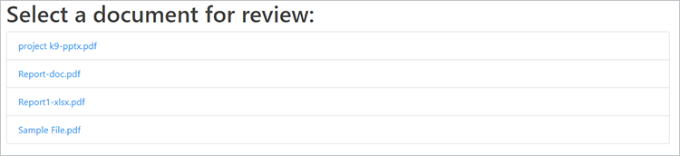

# 審查與批准


在 COVID-19 疫情期間，許多公司必須遠端跨團隊協作， [數位文件](https://developer.adobe.com/document-services/use-cases/collaboration/review-and-approval) 的分享與審查對團隊與跨部門資源構成一連串挑戰。

這些挑戰包括以不同檔案格式分享文件、有效審查與評論內容，以及與最新編輯同步。 [!DNL Adobe Acrobat Services] API 的設計目的是讓應用程式開發者能為使用者解決這些挑戰。

## 你可以學到什麼

這份實作教學示範如何在 Node.js 和 Express 網頁應用程式中建立文件審查與核准工作流程。 要跟著這個教學走，你需要有一些Node.js經驗。

該應用程式具備以下功能：

* 將不同檔案格式轉換成 PDF

* 啟用檔案上傳

* 讓使用者能夠新增評論和註解

* 請將PDF與這些評論一同展示

* 啟用用戶檔案以識別留言作者

* 將檔案合併成最終的 PDF，供使用者下載

## 相關 API 與資源

* [PDF 服務 API](https://opensource.adobe.com/pdftools-sdk-docs/release/latest/index.html)

* [PDF 嵌入 API](https://www.adobe.com/devnet-docs/dcsdk_io/viewSDK/index.html)

* [專案代碼](https://github.com/contentlab-io/adobe_reviews_and_approvals)

## 建立 Adobe API 憑證

在開始程式碼之前，您必須 [建立 Adobe PDF 嵌入 API 和 Adobe PDF 服務 API 的憑證](https://www.adobe.com/go/dcsdks_credentials) 。 PDF 嵌入 API 是免費使用的。 PDF 服務 API 免費使用六個月，之後你可以轉為 [按需](https://developer.adobe.com/document-services/pricing/main) 付費方案，每筆文件交易只需 \$0.05。

在建立 PDF 服務 API 憑證時，請選擇「 **建立個人化程式碼範例** 」選項，並選擇語言的Node.js。 儲存 ZIP 檔案，並將 pdftools-api-credentials.json 和 private.key 解壓到 Node.js Express 專案的根目錄。

## 建立專案與相依關係

設定你的 Node.js 和 Express 專案，讓它從名為「public」的資料夾中提供靜態檔案。 你可以根據自己的喜好設定專案方式。 要快速啟動，可以使用 [Express 應用程式產生器](https://expressjs.com/en/starter/generator.html)。 或者如果你想簡化，也可以 [從零](https://expressjs.com/en/starter/hello-world.html) 開始，把程式碼放在一個 JavaScript 檔案裡。 在上面連結的範例專案中，你採用了單一檔案的方式，並且所有程式碼都保留在index.js。

將個人化程式碼範例中的 and `private.key` 檔案複製`pdftools-api-credentials.json`到專案的根目錄。另外，如果你有 .gitignore 檔案，記得把它們加到裡面，這樣你的憑證檔案就不會不小心被送到倉庫。

接著執行 `npm install @adobe/documentservices-pdftools-node-sdk` 安裝 PDF 服務的 Node.js SDK。 匯入這個模組，並在你的程式碼中建立 API 憑證物件（index.js在你的範例專案中），之後你的相依性會像這樣匯入：

```
  const PDFToolsSdk = require( "@adobe/documentservices-pdftools-node-sdk" );

  // Create Credentials
  const credentials =  PDFToolsSdk.Credentials
      .serviceAccountCredentialsBuilder()
      .fromFile( "pdftools-api-credentials.json" )
      .build();
```

你的起始程式碼應該是這樣的：

```
  
  const express = require( "express" );
  const PDFToolsSdk = require( "@adobe/documentservices-pdftools-node-sdk" );

  // Create Credentials
  const credentials =  PDFToolsSdk.Credentials
      .serviceAccountCredentialsBuilder()
      .fromFile( "pdftools-api-credentials.json" )
      .build();

  const app = express();

  app.use( express.static( "public" ) );

  app.listen( 8889, function() {
      console.log( "Server started on port", 8889 );
  } );
```

現在你已經準備好使用 [!DNL Acrobat Services] API 了。

## 將檔案轉換成 PDF

在文件工作流程的第一階段，最終使用者必須上傳文件以進行分享。 為了實現此功能，你加入上傳功能，並將不同文件格式整合成 PDF，以便準備審查流程。

首先建立一個函 [式，將文件轉換為 PDF 的範例片段 PDF 服務 API](https://developer.adobe.com/document-services/apis/pdf-services)。 此範例同時展示了許多其他重要功能的片段，包括光學字元辨識（OCR）、密碼保護與移除，以及壓縮。

```
function fileToPDF( filename, outputFilename, callback ) {
      // Create an ExecutionContext using credentials and create a new operation
  instance.
      const executionContext = PDFToolsSdk.ExecutionContext.create( credentials ),
          createPdfOperation = PDFToolsSdk.CreatePDF.Operation.createNew();

      // Set operation input from a source file.
      const input = PDFToolsSdk.FileRef.createFromLocalFile( filename );
      createPdfOperation.setInput( input );

      // Execute the operation and Save the result to the specified location.
      createPdfOperation.execute( executionContext )
          .then( result => {
              result.saveAsFile( outputFilename );
              callback( outputFilename );
          } );
  }
```

你現在可以用這個功能從上傳的文件製作 PDF。

## 處理檔案上傳

接著，伺服器需要在網頁伺服器上設置檔案上傳端點來接收並處理文件。

首先，在上傳資料夾中建立一個資料夾，並命名為「drafts」。 你把上傳的檔案和轉換後的 PDF 檔案都存放在這裡。 接著，執行 `npm install express-fileupload` 安裝 Express-FileUpload 模組，並在程式碼中加入 Express 中介軟體：

```
const fileUpload = require( "express-fileupload" );
app.use( fileUpload() );
```

接著，新增端 `/upload` 點，並用相同檔名將上傳的檔案存入草稿資料夾。 然後，呼叫你之前寫的函式，如果文件還不是 PDF 格式，就建立一個 PDF 檔案。 你可以根據原始上傳文件名稱為新 PDF 檔案產生檔案名稱：

```
// Create a PDF file from an uploaded file
app.post( "/upload", ( req, res ) => {
    if( !req.files || Object.keys( req.files ).length === 0 ) {
        return res.status( 400 ).send( "No files were uploaded." );
    }
    
    // Create PDF from the uploaded file
    let file = req.files.myFile;
    file.mv( __dirname + "/uploads/drafts/" + file.name, ( err ) => {
        if( err ) {
            return res.status( 500 ).send( err );
        }
        if( file.name.endsWith( ".pdf" ) ) {
            res.redirect( "/" );
        }
        else {
            // Convert to PDF
            fileToPDF( __dirname + "/uploads/drafts/" + file.name, __dirname + "/uploads/drafts/" + file.name.replace( /\./g, "-" ) + ".pdf", ( file ) => {
                res.redirect( "/" );
            } );
        }
    });
} );
```

## 建立上傳頁面

現在，要從網頁應用程式上傳檔案，請在上傳資料夾中建立 `index.html` 一個網頁。 在頁面上，新增一個檔案上傳表單，將檔案傳送到 /upload 端點：

```
<form ref="uploadForm" 
      action="/upload"
      method="post" 
      encType="multipart/form-data">
      <input type="file" name="myFile" accept=".doc,.docx,.ppt,.pptx,.xls,.xlsx,.txt,.rtf,.bmp,.jpg,.gif,.tiff,.png">
      <input type="submit" value="Upload File" />
  </form>
```


你現在可以將文件上傳到Node.js伺服器。 伺服器會將檔案儲存在上傳/草稿資料夾中，並同時建立 PDF 格式版本。

您現在可以嵌入已上傳的文件，請使用 PDF 嵌入 API，讓使用者能輕鬆為文件添加註解與註解。

## 列舉 PDF 檔案

由於典型的文件工作流程可能涉及多個文件，您必須展示一份文件清單，並將每份文件連結到應用程式中的新文件審查頁面。

首先，在伺服器程式碼中新增一個 /files 端點，讓它取得並回傳存放在 uploads/drafts 資料夾中的所有 PDF 檔案清單：

```
const fs = require( "fs" );

app.get( "/files", ( req, res ) =\> {

fs.readdir( \_\_dirname + "/uploads/drafts/", ( err, files ) =\> {

if( err ) {

return res.status( 500 ).send( err );using

}

return res.json( files.filter( f =\> f.endsWith( ".pdf" ) ) );

} );

} );
```

新增 `/download/:file` 一條路徑，讓檔案能存取上傳的 PDF 檔案，以便嵌入網頁。

>[!NOTE]
>
>在生產應用程式中，必須加入認證與授權，以確保請求來自有效使用者，且該使用者被允許存取文件。

```
app.get( "/download/:file", function( req, res ){
    // Note: In production code, this should check authentication and user access permissions
    res.download( __dirname + "/uploads/drafts/" + req.params[ "file" ] );
});
```

更新index.html頁面，加入一個在載入時會被填滿的檔案清單元素。 每個項目都可以連結到draft.html網頁，並透過查詢字串參數將檔案名稱傳給該頁面。

>[!NOTE]
>
>你使用 jQuery 來附加每個項目，因此必須載入網頁上的 jQuery 函式庫，或用其他方法附加元素。

```
  <ul id="filelist">
      <li>Loading documents...</li>
  </ul>

  ...

  <script>
      // Load current files
      fetch( "/files" )
      .then( r => r.json() )
      .then( files => {
          if( files && files.length > 0 ) {
              $( "#filelist" ).empty();
              files.forEach( file => {
                  $( "#filelist" ).append( `<li><a
  href="/draft.html?file=${file}">${file}</a></li>` );
              })
          } else {
                  $("#filelist").append("<div>No documents found.</div>");
                }
      });
  </script>
```



## 嵌入 PDF

你已經準備好在網頁應用程式中嵌入並展示 PDF 檔案了。

建立一個名為「draft.html」的網頁，並在頁面上加入嵌入 PDF 的 div 元素：

```
  <div id="adobe-dc-view"></div>
```

包含 [!DNL Acrobat Services] 圖書館：

```
  <script src="https://documentcloud.adobe.com/view-sdk/main.js"></script>
```

在自訂腳本標籤中，從查詢字串參數解析檔名，這樣你就知道要嵌入哪個檔案到頁面上：

```
  <script type="text/javascript">
          let params = new URLSearchParams( window.location.search );
          let filename = params.get( "file" );
  </script>
```

為 adobe_dc_view_sdk.ready 事件新增一個文件事件監聽器，將指定的 PDF 檔案載入嵌入 div 元素內的檢視中。 使用你 PDF 嵌入 API 憑證中的客戶 ID。 你想啟用註解和註解，所以將視圖嵌入FULL_WINDOW模式，並將 showAnnotationsTools 選項設為 true。

```
  document.addEventListener( "adobe_dc_view_sdk.ready", () => { 
      var adobeDCView = new AdobeDC.View( { 
          clientId: "YOUR CLIENT ID HERE",
          divId: "adobe-dc-view",
          locale: "en-US",
      } );
      adobeDCView.previewFile( {
          content: { location: { url: "download/" + filename } },
          metaData: { fileName: "Draft Version.pdf" }
      }, {
          embedMode: "FULL_WINDOW",
          showAnnotationTools: true,
          showPageControls: true
      } );
  });
```

## 建立使用者個人檔案

預設情況下，留言和註解在此檢視中顯示為「訪客」。 你可以在頁面代碼中註冊用戶檔案回撥至PDF檢視，設定當前審閱者的名字作為評論和註解。 以下是一個範例資料。 在包含使用者驗證的完整應用程式中，登入的使用者會話個人檔案資訊可透過此方式設定，以識別審查工作流程中每位留言者。

```
  adobeDCView.registerCallback(
      AdobeDC.View.Enum.CallbackType.GET_USER_PROFILE_API,
      () => {
          return new Promise( ( resolve, reject ) => {
              resolve({
                  code: AdobeDC.View.Enum.ApiResponseCode.SUCCESS,
                  data: {
                      userProfile: {
                          name: "YOUR NAME",
                          firstName: "FIRST",
                          lastName: "LAST",
                          email: "document.editor@adobe.com"
                      }
                  }
              });
          });
      }
  );
```

當您看到並註解使用本網頁上傳的任何文件時，您的個人檔案會識別您為特定使用者。

## 儲存文件回饋

使用者在文件留言後，會點擊 **儲存。** 預設情況下，點擊 **儲存** 會下載更新後的 PDF 檔案。 更改此動作以更新伺服器上目前的 PDF 檔案。

在伺服器程式碼中新增 `/save` 一個端點，覆蓋 uploads/drafts 資料夾中的 PDF 檔案：

```
  // Overwrite the PDF file with latest PDF changes and annotations
  app.post( "/save", ( req, res ) => {
      if( !req.files || Object.keys( req.files ).length === 0 ) {
          return res.status( 400 ).send( "No files were uploaded." );
      }

      let file = req.files.pdf;
      file.mv( __dirname + "/uploads/drafts/" + file.name, ( err ) => {
          if( err ) {
              return res.status( 500 ).send( err );
          }
          res.send( "File uploaded" );
      });
  } );
```

註冊一個 PDF 檢視回撥，為上傳內容到 /save 端點的SAVE_API。 你可以更改 autoSaveFrequency 值，讓應用程式自動儲存在計時器上，並在完成時為目前已嵌入的檔案加入額外的元資料。

```
  adobeDCView.registerCallback(
      AdobeDC.View.Enum.CallbackType.SAVE_API,
      ( metaData, content, options ) => {
          return new Promise( ( resolve, reject ) => {
              let formData = new FormData();
              formData.append( "pdf", new Blob( [ content ] ), "drafts/" + filename
  );
              fetch( "/save", {
                  method: "POST",
                  body: formData
              }).then( resp => {
                  resolve({
                      code: AdobeDC.View.Enum.ApiResponseCode.SUCCESS,
                      data: {
                          /* Updated file metadata after successful save operation */
                          metaData: Object.assign( metaData, {} )
                      }
                  });
              });
          });
      },
      {
          autoSaveFrequency: 0,
          enableFocusPolling: false,
          showSaveButton: true
      }
  );
```

草稿文件上的註解與註解現在會儲存在伺服器上。 你可以 [閱讀更多關於回撥](https://www.adobe.com/devnet-docs/dcsdk_io/viewSDK/howtos_ui.html#callbacks-workflows) 如何融入你的工作流程。 例如， [狀態回](https://www.adobe.com/devnet-docs/dcsdk_io/viewSDK/howtos_ui.html#status-callback) 撥有助於處理多個人同時檢視和評論同一文件時的檔案衝突。

最後一步，你會使用 PDF Services API 將所有編輯過的文件合併成一個 PDF 檔案。

## 合併 PDF 檔案

PDF 組合碼類似 PDF 建立程式碼，但使用 CombineFiles 操作，並將每個檔案作為輸入加入。

```
  function combineFilesToPDF( files, outputFilename, callback ) {
      // Create an ExecutionContext using credentials and create a new operation
  instance.
      const executionContext = PDFToolsSdk.ExecutionContext.create( credentials ),
          combineFilesOperation = PDFToolsSdk.CombineFiles.Operation.createNew();

      // Set operation inputs from source files.
      files.forEach( file => {
          const input = PDFToolsSdk.FileRef.createFromLocalFile( file );
          combineFilesOperation.addInput( input );
      } );

      // Execute the operation and Save the result to the specified location.
      combineFilesOperation.execute( executionContext )
          .then( result => {
              result.saveAsFile( outputFilename );
              callback( outputFilename );
          } );
 }
```

## 下載最終 PDF

新增一個叫 /finalize 的端點，呼叫函式將資料夾內 `uploads/drafts` 所有 PDF 檔案合併成一個 `Final.pdf` 檔案，然後下載。

```
  app.get( "/finalize", ( req, res ) => {
      fs.readdir( __dirname + "/uploads/drafts/", ( err, files ) => {
          if( err ) {
              return res.status( 500 ).send( err );
          }
          combineFilesToPDF(
              files.filter( f => f.endsWith( ".pdf" ) ).map( f => __dirname + 
  "/uploads/drafts/" + f ),
              __dirname + "/uploads/Final.pdf", ( file ) => {
              res.download( file );
          } );
      } );
  } );
```

最後，在主index.html網頁新增連結至這個 /finalize 端點。 此連結讓使用者能下載文件工作流程的結果。

```
<a href="/finalize">Download final PDF</a>
```


## 後續步驟

這個實作教學展示了 API 如何[!DNL Acrobat Services]將文件分享與審查工作流程[&#128279;](https://developer.adobe.com/document-services/use-cases/collaboration/review-and-approval)整合進網頁應用程式。該應用程式允許遠端工作者分享檔案並與團隊成員協作，對於在家工作的員工和承包商尤其有幫助。

你可以利用這些技巧在應用程式中促進協作，或在 GitHub 上探索 [PDF Services Node SDK 範例](https://github.com/adobe/pdftools-node-sdk-samples) 和 [PDF 嵌入 API 範例](https://github.com/adobe/pdf-embed-api-samples) ，獲取如何運用 Adobe API 的靈感。

準備好在自己的應用程式中啟用文件共享與審查了嗎？ 註冊你的 [[!DNL Adobe Acrobat Services]](https://www.adobe.io/apis/documentcloud/dcsdk/gettingstarted.html) 開發者帳號。 免費存取 Adobe PDF 嵌入，並享受其他 API 六個月免費試用。 試用結束後，隨著業務成長，您可以 [以每筆文件交易 \$0.05 的即用](https://developer.adobe.com/document-services/pricing/main) 付費方式付款。
