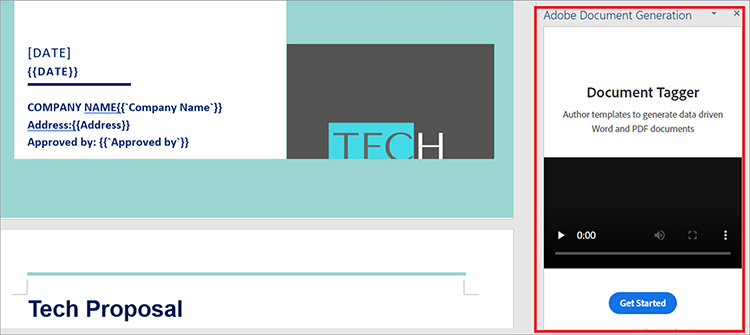
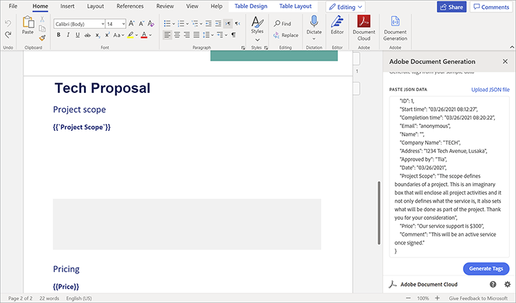
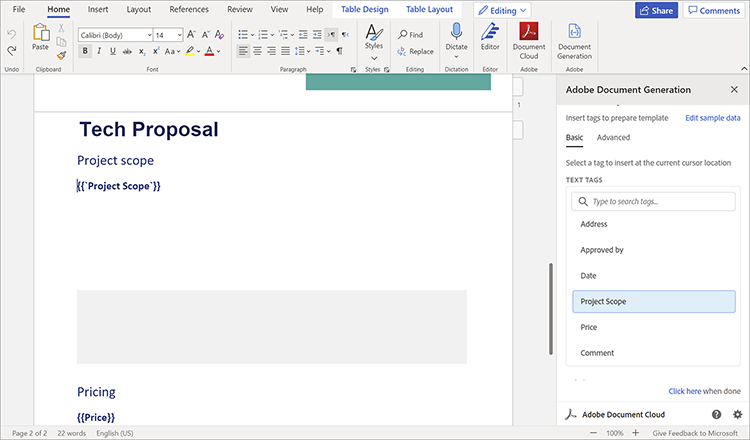
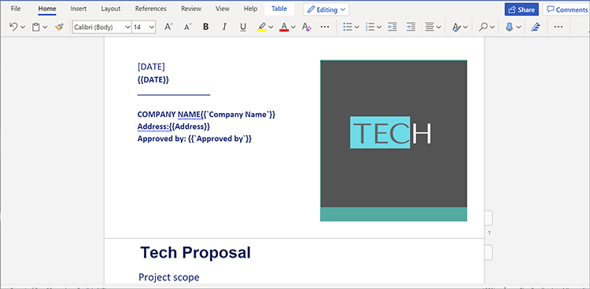
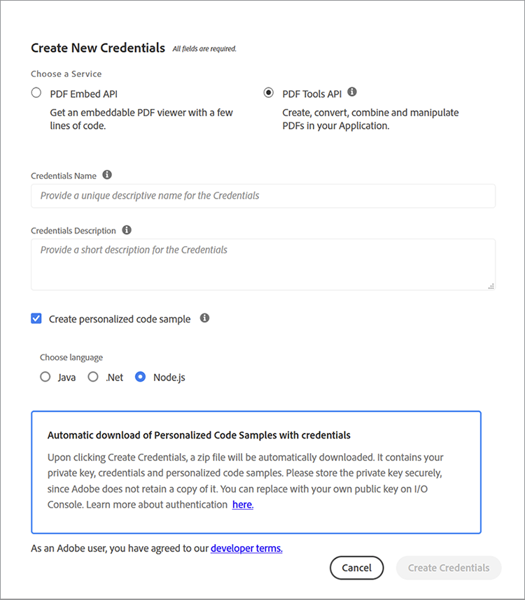

# 管理銷售計畫書和合同


銷售計畫書是企業走向客戶收購的第一步。 和一切一樣，第一印象是最後的。 因此，您與客戶的首次互動為您的業務設定了他們的期望。 您的建議必須簡潔、準確、方便。

合同和提案在其檔案結構中包含不同類型的資料。 它們既包含動態資料（客戶端名稱、報價金額等），也包含靜態資料（模板文本，如固定功能、團隊配置檔案和標準SOW術語）。 建立模板文檔（如銷售建議書）通常涉及單調的任務，例如手動替換模板模板中的項目詳細資訊。 在本教程中，您使用動態資料和工作流為[建立銷售建議](https://developer.adobe.com/document-services/use-cases/agreements-and-contracts/sales-proposals-and-contracts)構建一個有效的流程。

## 你能學到的

在本實踐教程中，瞭解如何使用多種工具實現動態資料和工作流，其中最重要的是[!DNL Adobe Acrobat Services]個API。 這些API用於使銷售計畫書和合同更方便您和您的業務。 本教程演示了如何自動建立、合併和顯示PDF文檔的操作技巧。 手動執行這些任務既耗時又繁瑣。 通過利用[!DNL Acrobat Services]個API，您可以縮短在這些任務上花費的時間。

## 相關API和資源

* [Microsoft詞](https://www.office.com/)

* [Node.js](https://nodejs.org/en/)

* [npm](https://www.npmjs.com/get-npm)

* [[!DNL Acrobat Services] API](https://developer.adobe.com/document-services/homepage/)

* [Adobe文檔生成API](https://developer.adobe.com/document-services/apis/doc-generation)

* [Adobe SignAPI](https://developer.adobe.com/adobesign-api/)

* [Adobe文檔生成標誌](https://opensource.adobe.com/pdftools-sdk-docs/docgen/latest/wordaddin.html#add-in-demo)

## 解決問題

現在您已安裝了工具，可以開始解決問題。 這些建議既具有每個客戶機特有的靜態內容，又具有動態內容。 出現瓶頸是因為每次您提出建議時都需要這兩種類型的資料。 輸入靜態文本非常耗時，因此您將自動執行該操作，並僅手動處理來自每個客戶端的動態資料。

首先，在[MicrosoftForms](https://www.office.com/launch/forms?auth=1)（或首選表單生成器）中建立資料捕獲表單。 此表單用於添加到銷售建議書的客戶端的動態資料。 填寫此表格並提出問題，以從客戶處獲取您需要的詳細資訊，例如公司名稱、日期、地址、項目範圍、定價和附加註釋。 要構建您自己的[窗體]&#x200B;(https://forms.office.com/Pages/ShareFormPage.aspx id=DQSIkWdsW0yxEjajBLZtrQAAAAAAAAAN__rtiGj5UNElTR0pCQ09ZNkJRUlowSjVQWDNYUEg2RC4u&amp;sharetoken=1AJeMavzxuISRKmUy)。 目標是讓潛在客戶端填入表單，然後將其響應導出為JSON檔案，這些檔案將傳遞到工作流的下一部分。

某些表單生成器僅允許您將資料導出為CSV檔案。 因此，您可能會發現，將[生成的CSV檔案轉換為JSON檔案對](http://csvjson.com/csv2json)非常有用。

靜態資料在每個銷售建議書中被重新使用。 因此，您可以使用MicrosoftWord中的銷售建議模板來提供靜態文本。 您可以使用此[模板](https://1drv.ms/w/s!AiqaN2pp7giKkmhVu2_2pId9MiPa?e=oeqoQ2)，但可以建立自己的模板或使用[Adobe模板](https://developer.adobe.com/document-services/apis/doc-generation)。

現在，您需要同時使用JSON格式客戶端的動態資料和MicrosoftWord模板中的靜態文本，為客戶端制定唯一的銷售建議書。 [!DNL Acrobat Services]個API用於合併兩個API並生成可簽名的PDF。

要使此功能正常，請使用標籤。 標籤是易於使用的字串，可以表示數字、字、陣列，甚至複雜對象。 標籤用作動態資料的佔位符，在本例中，它是在表單中輸入的客戶端資料。 在模板中插入標籤後，可將表單域從JSON檔案映射到Word模板。

## 使用標籤

開啟銷售建議模板，然後選擇&#x200B;**插入**&#x200B;頁籤。 在&#x200B;**載入項**&#x200B;組中，選擇&#x200B;**獲取載入項**。 然後，選擇&#x200B;**Adobe文檔生成載入項**&#x200B;以添加它。 添加後，您將在&#x200B;**Adobe**&#x200B;組的&#x200B;**首頁**&#x200B;頁籤上看到文檔生成標籤。

在&#x200B;**Adobe**&#x200B;組中的&#x200B;**首頁**&#x200B;頁籤上，選擇&#x200B;**文檔生成**&#x200B;以開始標籤文檔。 窗口右側的面板中出現一個有用的演示視頻。



選擇&#x200B;**開始**。 然後要求您提供示例資料。 貼上或上載表單響應JSON檔案，如下所示。



選擇&#x200B;**生成標籤**，從您貼上或上載的JSON檔案獲取欄位清單。 標籤顯示在右側欄的下面。



生成標籤後，可以將標籤插入文檔。 標籤將添加到游標位置的文檔中。 如上所示，您應在&#x200B;**項目範圍**&#x200B;副標題的正下方添加&#x200B;**項目範圍**&#x200B;標籤。 這樣，當客戶端以窗體形式進入項目範圍時，其響應將低於&#x200B;**項目範圍**&#x200B;的子標題，替換您剛添加的標籤。 添加完標籤後，文檔的一部分應該看起來像下面的螢幕捕獲。



## 使用API

轉到[!DNL Acrobat Services]個API [首頁](https://developer.adobe.com/document-services/apis/doc-generation)。 若要開始使用[!DNL Acrobat Services]個API，您需要應用程式的憑據。 向下滾動，然後選擇&#x200B;**開始免費試用**&#x200B;以建立憑據。 您可以[免費使用這些服務6個月，然後按單價支付](https://developer.adobe.com/document-services/pricing/main)，每單據交易僅需0.05美元，因此您只需支付所需費用。

選擇&#x200B;**PDF服務API**&#x200B;作為您選擇的服務，並填寫下面所示的其他詳細資訊。



建立憑據後，將獲得一些代碼示例。 選擇首選語言（本教程使用Node.js）。 您的API憑據位於zip檔案中。 將檔案解壓到PDFToolsSDK-Node.jsSamples。

要啟動，請建立一個名為auto-doc\*\*的空資料夾。\*\*在資料夾中，運行以下命令以初始化Node.js項目： `npm init`。 將項目命名為「auto-doc」*。*

在資料夾中。/PDFToolsSDK-Node.jsSamples/adobe-dc-pdf-tools-sdk-node-samples，有一個名為pdftools-api-credentials.json的檔案。 將其和private.key移到自動文檔資料夾。 它包含您的API憑據。 此外，在auto-doc資料夾中，建立名為「resources」的子資料夾。 它保存在您生成銷售建議時從客戶端接收的JSON格式資料。 在同一資料夾中，保存來自MicrosoftWord的銷售建議模板。

你準備好施魔法了！ 由於您在本教程中使用Node.js，因此必須安裝Node.js [!DNL Acrobat Services] SDK。 為此，在auto-doc資料夾中，運行yarn add @adobe/documentservices-pdftools-node-sdk。

現在建立名為merge.js的檔案，並將以下代碼貼上到該檔案中。

```
javascript
const PDFToolsSdk = require('@adobe/documentservices-pdftools-node-sdk'),
fs = require('fs');
try {
// Initial setup, create credentials instance.
const credentials = PDFToolsSdk.Credentials
.serviceAccountCredentialsBuilder()
.fromFile("pdftools-api-credentials.json")
.build();
// Setup input data for the document merge process
const jsonString = fs.readFileSync('resources/Proposal.json'),
jsonDataForMerge = JSON.parse(jsonString);
// Create an ExecutionContext using credentials
const executionContext = PDFToolsSdk.ExecutionContext.create(credentials);
// Create a new DocumentMerge options instance
const documentMerge = PDFToolsSdk.DocumentMerge,
documentMergeOptions = documentMerge.options,
options = new documentMergeOptions.DocumentMergeOptions(jsonDataForMerge, documentMergeOptions.OutputFormat.PDF);
// Create a new operation instance using the options instance
const documentMergeOperation = documentMerge.Operation.createNew(options)
// Set operation input document template from a source file.
const input = PDFToolsSdk.FileRef.createFromLocalFile('resources/Proposal.docx');
documentMergeOperation.setInput(input);
// Execute the operation and Save the result to the specified location.
documentMergeOperation.execute(executionContext)
.then(result => result.saveAsFile('output/Proposal.pdf'))
.catch(err => {
if (err instanceof PDFToolsSdk.Error.ServiceApiError
|| err instanceof PDFToolsSdk.Error.ServiceUsageError) {
console.log('Exception encountered while executing operation', err);
} else {
console.log('Exception encountered while executing operation', err);
}
});
} catch (err) {
console.log('Exception encountered while executing operation', err);
}
```

此代碼在使用[!DNL Acrobat Services]建立的標籤的幫助下從Microsoft表單獲取您的JSON檔案。 然後，它將資料與您在MicrosoftWord中建立的銷售計畫書模板合併，以生成全新的PDF。 PDF將保存在新建立的中。/output資料夾。

此外，代碼使用[Adobe SignAPI](https://developer.adobe.com/adobesign-api/)讓兩家公司簽署生成的銷售計畫書。 請查看此部落格，瞭解此API的詳細說明。

## 後續步驟

您最初的流程效率低下，繁瑣，需要自動化。 您從為每個客戶端手動建立文檔，到建立簡化的工作流，以自動化和簡化[銷售計畫書流程](https://developer.adobe.com/document-services/use-cases/agreements-and-contracts/sales-proposals-and-contracts)。

使用Microsoft·Forms，您從客戶那裡獲得了關鍵資料，這些資料將包含在他們獨特的建議中。 您在MicrosoftWord中建立了銷售計畫書模板，以提供您不希望每次重新建立的靜態文本。 然後，您使用[!DNL Acrobat Services]個API來合併表單和模板中的資料，以更高效的方式為客戶端建立銷售建議PDF。

本實踐教程僅概括介紹了這些API的可能性。 若要發現更多解決方案，請訪問[[!DNL Adobe Acrobat Services]](https://www.adobe.io/apis/documentcloud/dcsdk/gettingstarted.html) API頁。 所有這些工具都免費使用6個月。 然後，在[即付即付](https://developer.adobe.com/document-services/pricing/main)計畫中，每筆文檔交易只需支付0.05美元，因此只有在您的團隊向您的銷售渠道中添加更多潛在客戶時，您才支付。
