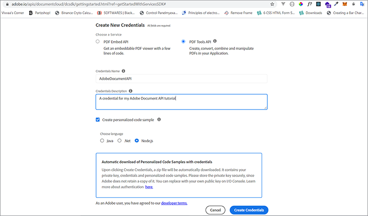
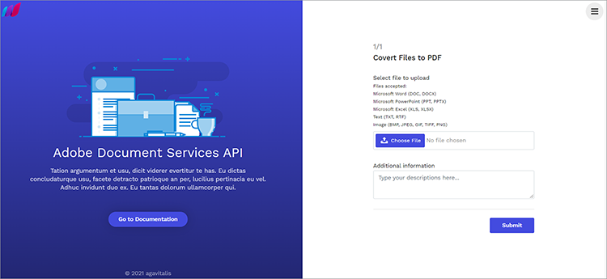
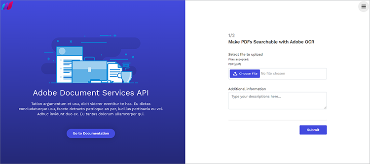
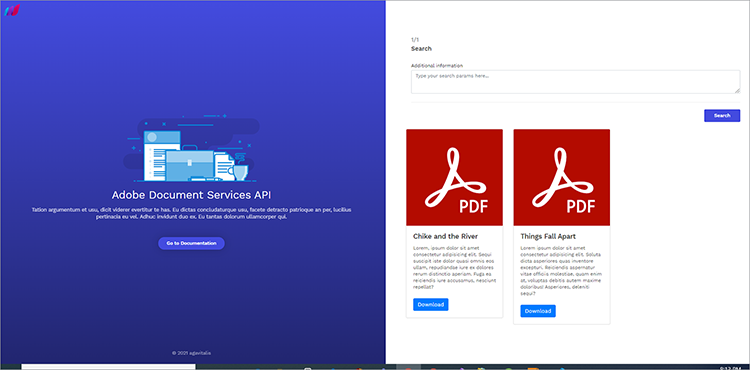

# 搜索和索引


組織必須經常將其硬拷貝文檔和掃描檔案數字化。 請考慮此[方案](https://docs.google.com/document/d/11jZdVQAw-3fyE3Y-sIqFFTlZ4m02LsCC/edit)。 一家律師事務所擁有數千份法律合同，他們掃描這些合同以建立數字檔案。 他們想確定這些法律合同中是否有一項特定條款或補充條款必須修訂。 為了符合要求，必須準確。 解決方案是清點數字文檔，使文本可搜索，並建立索引以查找此資訊。

建立數字歸檔以檢索用於編輯或下游操作的資訊是大多陣列織面臨的難題。

## 你能學到的

本實踐教程探討了[!DNL Adobe Acrobat Services]個API的功能，並可以輕鬆用於存檔和數字化文檔。 您可以通過構建Express NodeJS應用程式，然後整合[!DNL Acrobat Services]個API以進行存檔、數字化和文檔轉換來探索這些功能。

要遵循此操作，您需要安裝[Node.js](https://nodejs.org/)，並基本瞭解Node.js和[ES6語法](https://www.w3schools.com/js/js_es6.asp)。

## 相關API和資源

* [PDF服務API](https://opensource.adobe.com/pdftools-sdk-docs/release/latest/index.html)

* [項目代碼](https://github.com/agavitalis/AdobeDocumentServicesAPIs.git)

## 項目設定

首先，為應用程式設定資料夾結構。 您可以在此處檢索原始碼[](https://github.com/agavitalis/AdobeDocumentAPI.git)。

## 目錄結構

建立名為AdobeDocumentServicesAPI的資料夾，然後在您選擇的編輯器中將其開啟。 使用`npm init`命令使用此資料夾結構建立基本NodeJS應用程式：

```
AdobeDocumentServicesAPIs
config
default.json
controllers
createPDFController.js
makeOCRController.js
searchController.js
models
document.js
output
.gitkeep
routes
web.js
services
upload.js
views
index.hbs
ocr.hbs
search.hbs
index.js
```

您正在將MongoDB用作此應用程式的資料庫。 因此，要配置，請將預設資料庫配置置於config/資料夾中，將下面的代碼段貼上到此資料夾的default.json檔案中，然後添加資料庫的URL。

```
### config/default.json and config/dev.json
{ "DBHost": "YOUR_DB_URI" }
```

## 軟體包安裝

現在，使用npm install命令安裝一些軟體包，如下面的代碼段所示：

```
{
    "name": "adobedocumentservicesapis",
    "version": "1.0.0",
    "description": "",
    "main": "index.js",
    "directories": {
    "test": "test"
    },
    "dependencies": {
    "body-parser": "^1.19.0",
    "config": "^3.3.6",
    "express": "^4.17.1",
    "hbs": "^4.1.1",
    "mongoose": "^5.12.1",
    "morgan": "^1.10.0",
    "multer": "^1.4.2",
    "path": "^0.12.7"
    },
    "devDependencies": {},
    "scripts": {
    "start": "set NODE_ENV=dev && node index.js"
    },
    "repository": {
    "type": "git",
    "url": "git+https://github.com/agavitalis/AdobeDocumentServicesAPIs.git"
    },
    "author": "Ogbonna Vitalis",
    "license": "ISC",
    "bugs": {
    "url": "https://github.com/agavitalis/AdobeDocumentServicesAPIs/issues"
    },
    "homepage": "https://github.com/agavitalis/AdobeDocumentServicesAPIs#readme"
}
```

```
###bash
npm install express mongoose config body-parser morgan multer hbs path pdf-parse
Ensure that the content of your package.json file is similar to this code snippet:
###package.json
{
```

這些代碼片段安裝應用程式依賴項，包括視圖的Handlebar模板引擎。 在指令碼標籤中，配置應用程式的運行時參數。

## 整合[!DNL Acrobat Services]個API

[!DNL Acrobat Services]包括三個API:

* Adobe PDF服務API

* Adobe PDF嵌入式API

* Adobe文檔生成API

這些API通過一組基於雲的Web服務自動生成、操作和轉換PDF內容。

若要獲取憑據，您需要[註冊](https://www.adobe.com/go/dcsdks_credentials?ref=getStartedWithServicesSDK)並完成工作流。 PDF嵌入API可免費使用。 PDF服務API和文檔生成API可免費使用6個月。 試用結束時，您可以以每個文檔交易0.05 USD的價格[按使用付費](https://developer.adobe.com/document-services/pricing/main)。 只有在公司增長和處理更多合同時，您才需要支付費用。



完成註冊後，將將代碼示例下載到包含API憑據的PC中。 提取此代碼示例，並將private.key和pdftools-api-credentials.json檔案放在應用程式的根目錄下。

現在，使用應用程式根目錄中的終端運行[命令，安裝](https://www.npmjs.com/package/@adobe/documentservices-pdftools-node-sdk)PDF服務Node.js SDK` npm install --save @adobe/documentservices-pdftools-node-sdk `。

## 建立PDF

[!DNL Acrobat Services]支援從MicrosoftOffice文檔（Word、Excel和PowerPoint）和其他[支援的檔案格式](https://opensource.adobe.com/pdftools-sdk-docs/release/latest/howtos.html#create-a-pdf)&#x200B;(如.txt、.rtf、.bmp、.jpg、.gif、.tiff和.png)建立PDF。

要從支援的檔案格式建立PDF文檔，請使用此表單上載文檔。 您可以訪問[GitHub](https://github.com/agavitalis/AdobeDocumentServicesAPIs.git)上表單的HTML和CSS檔案。



現在，將以下代碼片段添加到controllers/createPDFController.js檔案中。 此代碼將檢索文檔並將其轉換為PDF。

原始檔案和轉換後的檔案將保存在應用程式內的資料夾中。

```
const PDFToolsSdk = require('@adobe/documentservices-pdftools-node-sdk');
/*
* GET / route to show the createPDF form.
*/
function createPDF(req, res) {
//catch any response on the url
let response = req.query.response
res.render('index', { response })
}
/*
* POST /createPDF to create a new PDF File.
*/
function createPDFPost(req, res) {
let filePath = req.file.path;
let fileName = req.file.filename;
try {
// Initial setup, create credentials instance.
const credentials = PDFToolsSdk.Credentials
.serviceAccountCredentialsBuilder()
.fromFile("pdftools-api-credentials.json")
.build();
// Create an ExecutionContext using credentials and create a new operation
instance.
const executionContext = PDFToolsSdk.ExecutionContext.create(credentials),
createPdfOperation = PDFToolsSdk.CreatePDF.Operation.createNew();
// Set operation input from a source file.
const input = PDFToolsSdk.FileRef.createFromLocalFile(filePath);
createPdfOperation.setInput(input);
// Execute the operation and Save the result to the specified location.
createPdfOperation.execute(executionContext)
.then((result) => {
result.saveAsFile('output/createPDFFromDOCX.pdf')
//download the file
res.redirect('/?response=PDF Successfully created')
})
.catch(err => {
if (err instanceof PDFToolsSdk.Error.ServiceApiError
|| err instanceof PDFToolsSdk.Error.ServiceUsageError) {
console.log('Exception encountered while executing operation',
err);
} else {
console.log('Exception encountered while executing operation',
err);
}
});
} catch (err) {
console.log('Exception encountered while executing operation', err);
}
}
//export all the functions
module.exports = { createPDF, createPDFPost };
```

此代碼段需要[PDF服務Node.js SDK](https://www.npmjs.com/package/@adobe/documentservices-pdftools-node-sdk)。 使用以下函式：

* createPDF，顯示上載文檔窗體

* createPDFPost，將上載的文檔轉換為PDF

轉換後的PDF文檔將保存在輸出目錄中，而原始檔案則保存在上載目錄中。

## 使用文本識別

光學字元識別(OCR)將影像和掃描的文檔轉換為可搜索檔案。 您可以將[!DNL Acrobat Services]個API、影像和掃描的文檔轉換為可搜索的PDF。 執行OCR操作後，檔案將變為可編輯和可搜索的。 您可以將檔案的內容儲存在資料儲存中，以便進行索引和其他用途。

請記住，對於檔案管理和資訊處理至關重要的許多公司來說，搜索和索引掃描的文檔至關重要。 OCR功能消除了這些難題。

要實現此功能，必須設計與上麵類似的上載表單。 此時，您將表單限制為PDF檔案，因為您只能對PDF文檔使用OCR功能。

下面是此示例的上載表單：



現在，要操作上載的PDF並執行某些OCR操作，請將下面的代碼段添加到controllers/makeOCRController.js檔案中。 此代碼在上載的檔案上實現OCR進程，然後將該檔案保存在應用程式的檔案系統中。

```
const fs = require('fs')
const pdf = require('pdf-parse');
const mongoose = require('mongoose');
const Document = require('../models/document');
const PDFToolsSdk = require('@adobe/documentservices-pdftools-node-sdk');
/*
* GET /makeOCR route to show the makeOCR form.
*/
function makeOCR(req, res) {
//catch any response on the url
let response = req.query.response
res.render('ocr', { response })
}
/*
* POST /makeOCRPost to create a new PDF File.
*/
function makeOCRPost(req, res) {
let filePath = req.file.path;
let fileName = req.file.filename;
try {
// Initial setup, create credentials instance.
const credentials = PDFToolsSdk.Credentials
.serviceAccountCredentialsBuilder()
.fromFile("pdftools-api-credentials.json")
.build();
// Create an ExecutionContext using credentials and create a new operation
instance.
const executionContext = PDFToolsSdk.ExecutionContext.create(credentials),
ocrOperation = PDFToolsSdk.OCR.Operation.createNew();
// Set operation input from a source file.
const input = PDFToolsSdk.FileRef.createFromLocalFile(filePath);
ocrOperation.setInput(input);
// Execute the operation and Save the result to the specified location.
ocrOperation.execute(executionContext)
.then(async (result) => {
let newFileName = `createPDFFromDOCX-${Math.random() * 171}.pdf`;
await result.saveAsFile(`output/${newFileName}`);
let documentContent = fs.readFileSync(
require("path").resolve("./") + `\\output\\${newFileName}`
);
pdf(documentContent)
.then(function (data) {
//Creates a new document
var newDocument = new Document({
documentName: fileName,
documentDescription: description,
documentContent: data.text,
url: require("path").resolve("./") + `\\output\\${newFileName}`
});
//Save it into the DB.
newDocument.save((err, docs) => {
if (err) {
res.send(err);
} else {
//If no errors, send it back to the client
res.redirect(
"/makeOCR?response=OCR Operation Successfully performed on
the PDF File"
);
}
});
})
.catch(function (error) {
// handle exceptions
console.log(error);
});
})
.catch(err => {
if (err instanceof PDFToolsSdk.Error.ServiceApiError
|| err instanceof PDFToolsSdk.Error.ServiceUsageError) {
console.log('Exception encountered while executing operation',
err);
} else {
console.log('Exception encountered while executing operation',
err);
}
});
} catch (err) {
console.log('Exception encountered while executing operation', err);
}
}
//export all the functions
module.exports = { makeOCR, makeOCRPost };
```

您需要[!DNL Acrobat Services]節點SDK和mongoose、pdf-parse和fs模組以及您的文檔模型架構。 這些模組是將轉換後檔案的內容保存到MongoDB資料庫所必需的。

現在建立兩個功能：makeOCR顯示上載的表單，然後makeOCRPost處理上載的文檔。 將原始表單保存到資料庫，然後將轉換後的表單保存到應用程式的輸出資料夾中。

在轉換檔案之前，將在每種情況下載入pdftools-api-credentials.json檔案中的Adobe提供的憑據。

>[!NOTE]
>
>OCR功能僅支援PDF文檔。

另外，將下面的代碼段添加到應用程式的Modes/Document.js檔案中。

在代碼段中，定義一個mongoose模型，然後描述要保存在資料庫中的文檔的屬性。 另外，為documentContent欄位編製索引，使文本搜索變得簡單和高效。

```
const mongoose = require("mongoose");
const Schema = mongoose.Schema;
//Document schema definition
var DocumentSchema = new Schema(
{
documentName: { type: String, required: false },
documentDescription: { type: String, required: false },
documentContent: { type: String, required: false },
url: { type: String, required: false },
status: {
type: String,
enum : ["active","inactive"],
default: "active"
}
},
{ timestamps: true }
);
//for text search
DocumentSchema.index({
documentContent: "text",
});
//Exports the DocumentSchema for use elsewhere.
module.exports = mongoose.model("document", DocumentSchema);
```

## 搜索文本

現在，您實現了簡單搜索功能，使用戶能夠執行一些簡單的文本搜索。 您還可以添加下載功能以啟用PDF檔案的下載。

此功能需要一個簡單的表單和卡來顯示搜索結果。 您可以在[GitHub](https://github.com/agavitalis/AdobeDocumentServicesAPIs.git)上找到表單和卡的設計。

下面的螢幕抓圖說明了搜索功能和搜索結果。 您可以下載任何搜索結果。



要實現搜索功能，請在應用程式的controller資料夾中建立一個searchController.js檔案，然後貼上以下代碼段：

```
const fs = require('fs')
const mongoose = require('mongoose');
const Document = require('../models/document');
/*
* GET / route to show the search form.
*/
function search(req, res) {
//catch any response on the url
let response = req.query.response
res.render('search', { response })
}
/*
* POST /searchPost to search the contents of your saved file.
*/
function searchPost(req, res) {
let searchString = req.body.searchString;
Document.aggregate([
{ $match: { $text: { $search: searchString } } },
{ $sort: { score: { $meta: "textScore" } } },
])
.then(function (documents) {
res.render('search', { documents })
})
.catch(function (error) {
let response = error
res.render('search', { response })
});
}
//export all the functions
module.exports = { search, searchPost, downloadPDF };
```

現在實施下載功能，以便能夠下載從用戶搜索返回的文檔。

## 正在下載文檔

實施下載功能與您已經完成的操作類似。 在controllers/earchController.js檔案中的searchPost函式後添加以下代碼段：

```
/*
* POST /downloadPDF To Download PDF Documents.
*/
async function downloadPDF(req, res) {
console.log("here")
let documentId = req.params.documentId
let document = await Document.findOne({_id:documentId});
res.download(download.link);
}
```

## 後續步驟

在本操作教程中，您將[!DNL Acrobat Services]個API整合到Node.js應用程式中，還使用API實現將檔案轉換為PDF的文檔轉換。 您添加了OCR功能，使圖片和掃描檔案可搜索。 然後，將檔案保存到資料夾，以便下載。

接下來，您添加了搜索功能，以搜索通過OCR轉換為文本的文檔。 最後，您實現了下載功能，以便輕鬆下載這些檔案。 您完成的應用程式使法律公司能夠更輕鬆地查找和處理特定文本。

強烈建議將[!DNL Acrobat Services]用於文檔轉換，因為與其他服務相比，它具有強大的功能和易用性。 您可以快速建立帳戶，以開始享受[!DNL Acrobat Services]個API的功能，用於文檔轉換和管理。

現在您對如何使用[!DNL Acrobat Services]個API有了很深的瞭解，因此您可以通過練習來提高您的技能。 您可以克隆本教程中使用的儲存庫，並對您剛學到的一些技能進行實驗。 更妙的是，您可以嘗試重建此應用程式，同時探索[!DNL Acrobat Services]個API的無限可能性。

是否準備好在您自己的應用中啟用文檔共用和審閱？ 註冊[[!DNL Adobe Acrobat Services]](https://www.adobe.io/apis/documentcloud/dcsdk/gettingstarted.html)
開發者帳戶。 享受6個月的免費試用，隨著您的業務增長，[按單價支付](https://developer.adobe.com/document-services/pricing/main)，每個文檔交易費用僅為0.05美元。
