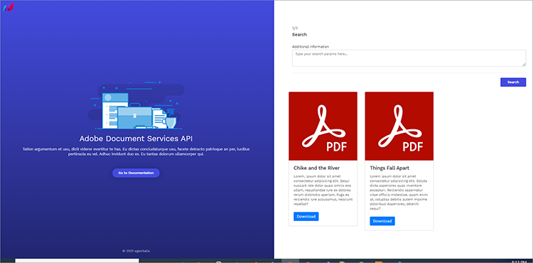

# 搜尋和建立索引


組織通常必須將其硬本文件和掃描的檔案數位化。 請考慮此 [情況](https://docs.google.com/document/d/11jZdVQAw-3fyE3Y-sIqFFTlZ4m02LsCC/edit)。 一家法務公司已掃描數千份法律合約，用來建立數字檔案。 他們想要判斷其中任何一份法律合約是否有特定條款或是必須修改補充。 出於合規性目的，需要精確性。 解決方案是盤點數字檔，使文字可搜尋，並建立尋找此類資訊的索引。

對於大多數組織而言，建立數位檔案以擷取編輯資訊或下游作業的挑戰是一場噩夢。

## 您可以學習哪些內容

此實作教學課程探索 API 的功能，以及如何 [!DNL Adobe Acrobat Services] 輕鬆地用來封存和數字化檔。 您可以建立 Express NodeJS 應用程式，然後整合 [!DNL Acrobat Services] API 進行封存、數位化和文件轉換，藉此探索這些功能。

若要遵循，您需要 [安裝Node.js](https://nodejs.org/) 並基本瞭解Node.js和 [ES6語法](https://www.w3schools.com/js/js_es6.asp)。

## 相關 API 和資源

* [PDF 服務API](https://opensource.adobe.com/pdftools-sdk-docs/release/latest/index.html)

* [項目代碼](https://github.com/agavitalis/AdobeDocumentServicesAPIs.git)

## 項目設定

首先，為應用程式設定資料夾結構。 您可以在這裡[&#128279;](https://github.com/agavitalis/AdobeDocumentAPI.git)擷取源碼。

## 目錄結構

建立一個名為 AdobeDocumentServicesAPI 的檔案夾，然後在您選擇的編輯器中開啟這個檔案夾。 使用此資料夾結構，使用此指令建立基本 NodeJS 應用程式 `npm init` ：

```
AdobeDocumentServicesAPIs
config
default.json
controllers
createPDFController.js
makeOCRController.js
searchController.js
models
document.js
output
.gitkeep
routes
web.js
services
upload.js
views
index.hbs
ocr.hbs
search.hbs
index.js
```

您使用 MongoDB 做為此應用程式的資料庫。 因此，若要進行設定，請將預設資料庫設定置入 config/資料夾中，方法是將下方的代碼段貼入此資料夾的default.json檔案中，然後新增資料庫的URL。

```
### config/default.json and config/dev.json
{ "DBHost": "YOUR_DB_URI" }
```

## 套件安裝

現在，請使用 npm 安裝命令安裝部分套件，如下方代碼段所示：

```
{
    "name": "adobedocumentservicesapis",
    "version": "1.0.0",
    "description": "",
    "main": "index.js",
    "directories": {
    "test": "test"
    },
    "dependencies": {
    "body-parser": "^1.19.0",
    "config": "^3.3.6",
    "express": "^4.17.1",
    "hbs": "^4.1.1",
    "mongoose": "^5.12.1",
    "morgan": "^1.10.0",
    "multer": "^1.4.2",
    "path": "^0.12.7"
    },
    "devDependencies": {},
    "scripts": {
    "start": "set NODE_ENV=dev && node index.js"
    },
    "repository": {
    "type": "git",
    "url": "git+https://github.com/agavitalis/AdobeDocumentServicesAPIs.git"
    },
    "author": "Ogbonna Vitalis",
    "license": "ISC",
    "bugs": {
    "url": "https://github.com/agavitalis/AdobeDocumentServicesAPIs/issues"
    },
    "homepage": "https://github.com/agavitalis/AdobeDocumentServicesAPIs#readme"
}
```

```
###bash
npm install express mongoose config body-parser morgan multer hbs path pdf-parse
Ensure that the content of your package.json file is similar to this code snippet:
###package.json
{
```

這些代碼段會安裝應用程式相依性，包括檢視的「控制欄」範本引擎。 在文稿標籤中，您可以設定應用程式的執行時間參數。

## 整合 [!DNL Acrobat Services] API

[!DNL Acrobat Services] 包含三個 API：

* Adobe PDF服務API

* Adobe PDF嵌入API

* Adobe檔產生API

這些 API 透過一套雲端網路服務自動產生、控制和轉換 PDF 內容。

若要取得註冊及完成工作流程所需的[&#128279;](https://www.adobe.com/go/dcsdks_credentials?ref=getStartedWithServicesSDK)認證。PDF 內嵌API可供免費使用。 PDF 服務API和文件產生API六個月免費。 試用結束時，您只需[&#128279;](https://developer.adobe.com/document-services/pricing/main)支付 $0.05 美元，每份檔交易只要 0.05 美元。您只需隨著公司成長而付費，並且處理更多合約。


完成註冊后，程式代碼範例會下載到您的計算機，其中包含您的API認證。 擷取此程式代碼範例，並將private.key和pdftools-api-credentials.json檔案放置在應用程式的根目錄。

現在，使用應用程式根目錄中的終端機執行命令，即可Node.js SDK[&#128279;](https://www.npmjs.com/package/@adobe/documentservices-pdftools-node-sdk) ` npm install --save @adobe/documentservices-pdftools-node-sdk ` 安裝 PDF Services。

## 建立 PDF

[!DNL Acrobat Services] 支援從 Microsoft Office 檔 （Word、Excel 和 PowerPoint） 建立 PDF，以及其他 [支援的檔格式](https://opensource.adobe.com/pdftools-sdk-docs/release/latest/howtos.html#create-a-pdf) ，例如 .txt、.rtf、.bmp、.jpg、.gif、.tiff 和 .png。

若要從支援的檔案格式建立 PDF 檔，請使用此表單來上傳檔。 您可以在 GitHub[&#128279;](https://github.com/agavitalis/AdobeDocumentServicesAPIs.git) 上存取表格的 HTML 和 CSS 檔案。


現在，將下列代碼段新增至控制器/createPDFController.js檔案。 此程式代碼會擷取檔並轉換為 PDF。

源檔和轉換後的檔案會儲存在應用程式內的檔案夾中。

```
const PDFToolsSdk = require('@adobe/documentservices-pdftools-node-sdk');
/*
* GET / route to show the createPDF form.
*/
function createPDF(req, res) {
//catch any response on the url
let response = req.query.response
res.render('index', { response })
}
/*
* POST /createPDF to create a new PDF File.
*/
function createPDFPost(req, res) {
let filePath = req.file.path;
let fileName = req.file.filename;
try {
// Initial setup, create credentials instance.
const credentials = PDFToolsSdk.Credentials
.serviceAccountCredentialsBuilder()
.fromFile("pdftools-api-credentials.json")
.build();
// Create an ExecutionContext using credentials and create a new operation
instance.
const executionContext = PDFToolsSdk.ExecutionContext.create(credentials),
createPdfOperation = PDFToolsSdk.CreatePDF.Operation.createNew();
// Set operation input from a source file.
const input = PDFToolsSdk.FileRef.createFromLocalFile(filePath);
createPdfOperation.setInput(input);
// Execute the operation and Save the result to the specified location.
createPdfOperation.execute(executionContext)
.then((result) => {
result.saveAsFile('output/createPDFFromDOCX.pdf')
//download the file
res.redirect('/?response=PDF Successfully created')
})
.catch(err => {
if (err instanceof PDFToolsSdk.Error.ServiceApiError
|| err instanceof PDFToolsSdk.Error.ServiceUsageError) {
console.log('Exception encountered while executing operation',
err);
} else {
console.log('Exception encountered while executing operation',
err);
}
});
} catch (err) {
console.log('Exception encountered while executing operation', err);
}
}
//export all the functions
module.exports = { createPDF, createPDFPost };
```

此代碼段需要 [PDF Services Node.js SDK](https://www.npmjs.com/package/@adobe/documentservices-pdftools-node-sdk)。 使用功能：

* createPDF，其中顯示上傳文件表單

* createPDFPost，將上傳的文件轉換為 PDF

轉換后的 PDF 檔案會儲存在輸出目錄中，而源檔則儲存在上傳目錄中。

## 使用文字辨識

光學字元識別 （OCR） 可將影像和掃描的文件轉換為可搜尋的檔案。 您可以將 API、影像和掃描的檔案轉換為 [!DNL Acrobat Services] 可搜尋的 PDF。 執行 OCR作後，檔案便會變成可編輯和搜尋。 您可以將檔案內容儲存在數據存放區，以便進行索引和其他用途。

請記得，搜尋掃描檔並建立索引對許多組織來說至關重要，因為對於檔案管理和資訊處理至關重要。 OCR 功能消除了這些挑戰。

若要實作此功能，您必須設計類似上述的上傳窗體。 這一次，您會將表格限制為 PDF 檔案，因為只能在 PDF 檔上使用 OCR 功能。

以下為上傳表單，例如：


現在，若要控上傳的 PDF 並執行一些 OCR作，請將下方的代碼段新增至控制器/makeOCRController.js檔案。 此程式代碼會在已上傳的檔案上實作 OCR 程式，然後將檔案儲存在應用程式的檔案系統中。

```
const fs = require('fs')
const pdf = require('pdf-parse');
const mongoose = require('mongoose');
const Document = require('../models/document');
const PDFToolsSdk = require('@adobe/documentservices-pdftools-node-sdk');
/*
* GET /makeOCR route to show the makeOCR form.
*/
function makeOCR(req, res) {
//catch any response on the url
let response = req.query.response
res.render('ocr', { response })
}
/*
* POST /makeOCRPost to create a new PDF File.
*/
function makeOCRPost(req, res) {
let filePath = req.file.path;
let fileName = req.file.filename;
try {
// Initial setup, create credentials instance.
const credentials = PDFToolsSdk.Credentials
.serviceAccountCredentialsBuilder()
.fromFile("pdftools-api-credentials.json")
.build();
// Create an ExecutionContext using credentials and create a new operation
instance.
const executionContext = PDFToolsSdk.ExecutionContext.create(credentials),
ocrOperation = PDFToolsSdk.OCR.Operation.createNew();
// Set operation input from a source file.
const input = PDFToolsSdk.FileRef.createFromLocalFile(filePath);
ocrOperation.setInput(input);
// Execute the operation and Save the result to the specified location.
ocrOperation.execute(executionContext)
.then(async (result) => {
let newFileName = `createPDFFromDOCX-${Math.random() * 171}.pdf`;
await result.saveAsFile(`output/${newFileName}`);
let documentContent = fs.readFileSync(
require("path").resolve("./") + `\\output\\${newFileName}`
);
pdf(documentContent)
.then(function (data) {
//Creates a new document
var newDocument = new Document({
documentName: fileName,
documentDescription: description,
documentContent: data.text,
url: require("path").resolve("./") + `\\output\\${newFileName}`
});
//Save it into the DB.
newDocument.save((err, docs) => {
if (err) {
res.send(err);
} else {
//If no errors, send it back to the client
res.redirect(
"/makeOCR?response=OCR Operation Successfully performed on
the PDF File"
);
}
});
})
.catch(function (error) {
// handle exceptions
console.log(error);
});
})
.catch(err => {
if (err instanceof PDFToolsSdk.Error.ServiceApiError
|| err instanceof PDFToolsSdk.Error.ServiceUsageError) {
console.log('Exception encountered while executing operation',
err);
} else {
console.log('Exception encountered while executing operation',
err);
}
});
} catch (err) {
console.log('Exception encountered while executing operation', err);
}
}
//export all the functions
module.exports = { makeOCR, makeOCRPost };
```

您需要 [!DNL Acrobat Services] Node SDK 和 mongoose、pdf-parse 和 fs 模組以及檔模型結構。 您必須使用這些模組，才能將已轉換檔案的內容儲存至 MongoDB 資料庫。

現在建立兩個功能：讓OCR 顯示上傳的窗體，然後製作用於處理上傳檔的OCRPost。 將原始表格儲存到資料庫，然後將變形的表格儲存到應用程式的輸出資料夾。

在轉換檔案之前，每個情況下都會載入來自 pdftools-api-credentials.json 檔案的Adobe認證。

>[!NOTE]
>
>OCR 功能僅支援 PDF 檔。

此外，請將下方的代碼段新增至應用程式的「模式」/「Document.js」檔案。

在程式代碼段中，定義mongoose模型，然後描述要儲存在資料庫中的文件屬性。 此外，為 documentContent 字段建立索引，讓搜尋文字變得輕鬆有效率。

```
const mongoose = require("mongoose");
const Schema = mongoose.Schema;
//Document schema definition
var DocumentSchema = new Schema(
{
documentName: { type: String, required: false },
documentDescription: { type: String, required: false },
documentContent: { type: String, required: false },
url: { type: String, required: false },
status: {
type: String,
enum : ["active","inactive"],
default: "active"
}
},
{ timestamps: true }
);
//for text search
DocumentSchema.index({
documentContent: "text",
});
//Exports the DocumentSchema for use elsewhere.
module.exports = mongoose.model("document", DocumentSchema);
```

## 搜尋文字

現在您可以實作簡單的搜尋功能，讓使用者執行一些簡單的文字搜尋。 您也可以新增下載功能來啟用 PDF 檔案的下載。

此功能需要簡單的表單和卡片才能顯示搜尋結果。 您可以在 GitHub[&#128279;](https://github.com/agavitalis/AdobeDocumentServicesAPIs.git) 上找到表格和卡片的設計。

下方的螢幕擷圖會說明搜尋功能和搜尋結果。 您可以下載任何搜尋結果。



若要實作搜尋功能，請在應用程式的控制器檔案夾內建立searchController.js檔案，然後將代碼段貼到下方：

```
const fs = require('fs')
const mongoose = require('mongoose');
const Document = require('../models/document');
/*
* GET / route to show the search form.
*/
function search(req, res) {
//catch any response on the url
let response = req.query.response
res.render('search', { response })
}
/*
* POST /searchPost to search the contents of your saved file.
*/
function searchPost(req, res) {
let searchString = req.body.searchString;
Document.aggregate([
{ $match: { $text: { $search: searchString } } },
{ $sort: { score: { $meta: "textScore" } } },
])
.then(function (documents) {
res.render('search', { documents })
})
.catch(function (error) {
let response = error
res.render('search', { response })
});
}
//export all the functions
module.exports = { search, searchPost, downloadPDF };
```

現在可實作下載功能，以啟用下載從用戶搜尋傳回的檔。

## 下載檔

實作下載功能類似於您已完成的工作。 在控制器/earchController.js檔案中使用搜尋貼文功能后，新增下列代碼段：

```
/*
* POST /downloadPDF To Download PDF Documents.
*/
async function downloadPDF(req, res) {
console.log("here")
let documentId = req.params.documentId
let document = await Document.findOne({_id:documentId});
res.download(download.link);
}
```

## 後續步驟

在此實作教學課程中，您將 API 整合 [!DNL Acrobat Services] 至Node.js應用程式，並使用API來進行將檔案轉換為 PDF 的檔案轉換。 您新增了 OCR 功能，可搜尋圖片和掃描的檔案。 然後，您將檔案儲存至資料夾，以便下載。

接著，您新增了搜尋功能，以搜尋以 OCR 轉換為文字的檔。 最後，您實作了下載功能，以便輕鬆下載這些檔案。 您完成的應用程式讓法務公司更容易找到及處理特定文字。

[!DNL Acrobat Services]與其他服務相比，強烈建議在文件轉換中使用，因為其健全性和易用性。您可以快速建立帳戶，開始享有 API 的 [!DNL Acrobat Services] 功能，進行文件轉換和管理。

既然您已十分瞭解如何使用 [!DNL Acrobat Services] API，便可進一步發揮實務技能。 您可以仿製此教學課程所使用的儲存庫，並嘗試一些您剛學到的技能。 更進一步，您可以嘗試重建此應用程式，同時探索 API 的 [!DNL Acrobat Services] 無限可能。

準備好在自己的應用程式中啟用檔共享和審核了嗎？ 註冊您的 [[!DNL Adobe Acrobat Services]](https://www.adobe.io/apis/documentcloud/dcsdk/gettingstarted.html)
開發人員帳戶。 享受六個月免費試用，然後[&#128279;](https://developer.adobe.com/document-services/pricing/main)隨著業務成長，以每份檔交易只要 \$0.05 付費。
